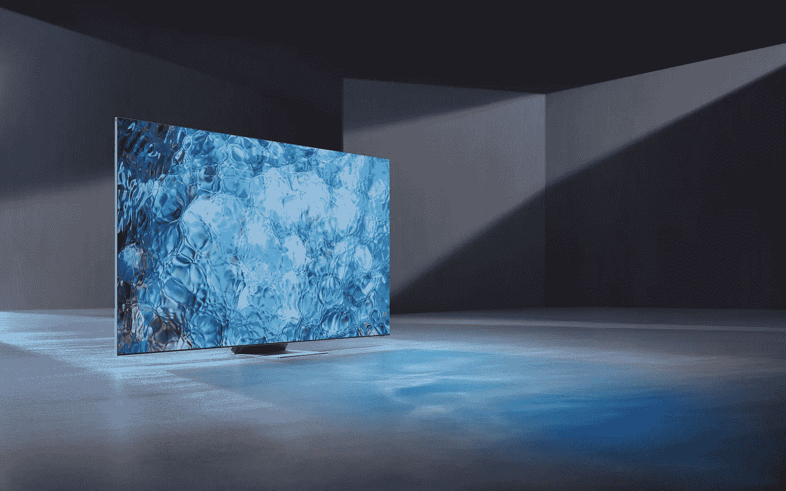

# 8K 电视陷入恶性循环，短期内不会成为主流

> 原文：<https://medium.com/geekculture/8k-tvs-caught-in-a-vicious-circle-not-going-mainstream-anytime-soon-8fe68d926bb?source=collection_archive---------3----------------------->

## 分析师和消费者肯定不以为然，电视制造商可能会陷入困境

8K TVs — once considered the natural successor to the current TV market standard of 4K TVs — have yet to gain momentum and it looks like they won’t for a few years at the very least. (Image: Samsung)

嗯，这就是新技术的问题，不是吗？制造商有义务稳步开发、投资并尽可能有效地营销……但绝对没有……