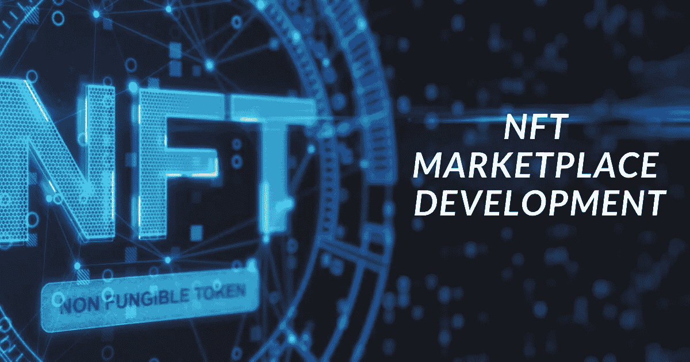
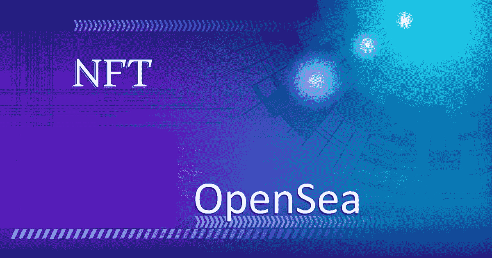
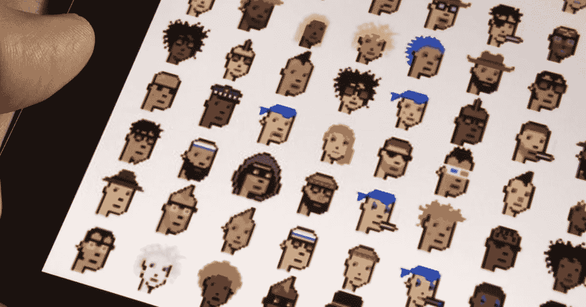
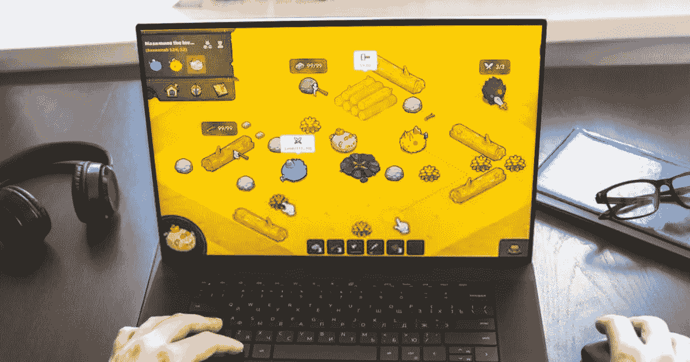

# 区块链技术领域排名第八的 NFT 市场

> 原文：<https://medium.com/geekculture/8top-notch-nft-marketplaces-in-the-blockchain-technology-1feda325d61?source=collection_archive---------30----------------------->

NFT Marketplace Development

随着 NFT 市场的不断扩大，企业家们希望投资这些平台。世界上不同的 NFT 市场都有增加用户互动的趋势，这可以带来高收入。从而给你业务带来新的空间。

今天的热门话题是 NFT 市场。什么不是？现在，一切可能都被列为市场上的数字资产，随着需求的增加，它们的价值被夸大。

看看 NFT 市场，首字母缩写词被缩写为不可替换的令牌，它被称为具有唯一和相同的代码和元数据的数字资产。它们可以被交易为实物和资产等价物。氹欞侊艺术品、绘画、雕塑、各种音乐、视频、游戏等。，可以兑换成 NFT，在不同的平台上交易。

下面列出的是全球活跃的顶级 NFT 市场，交易商可以从中投资和获益。

**#8Top Notch NFT 市场**

所有这些市场都是独一无二的，它们在不同的领域运作。我们将关注已经引起全球市场关注的 NFT 市场趋势。

**稀有**

一个民主、开放的市场，为所有艺术家、设计师、雕塑家等提供一个平台。将他们的作品数字化成数字资产是很难得的。艺术家和创作者作为一个整体被允许买卖 NFT。在这个平台上发行名为 RARI 的令牌，以衡量收费和社区规则。

**Opensea**

Opensea 是一个类似于市场上的 Rarible 执行 P2P 交换的平台。这个平台的名称是展示所有稀有的收藏品。

OpenSea

**密码朋克**

以太坊区块链上的先驱 NFT 平台之一是 Crypto punk，随着它的推出，它获得了最高的人气和知名度。在这里不同的化身像僵尸，外星人，男性和女性角色被创造和交易。这个平台创造了不同的里程碑，并打破它们以开发新的标准。每个角色都是独一无二的，有不同的价值，然而他们的所有权也是独一无二的。由于这个平台中的所有以太坊都被认领，它的所有权现在只限于它们。

Crypto Punks

**加密小猫**

Crypto Kitties 是一种著名的基于以太坊的 NFTs，它使用户能够通过收集来收集数字小猫。这里的每一件收藏品都是独一无二的，在外观和特征上各不相同。另一方面，Crypto Kitties 就是这样一个提供安全性的著名区块链游戏。玩家可以繁殖稀有的毛茸茸的动物，增加它们的功能和能力，做更多的事情。密码猫是 100%独一无二的，可以被玩家拥有，复制它们是不可能的。

**泽德伦**

ZedRun 是一个基于 NFT 的在线赛马游戏平台，在赛马迷和市场上的其他玩家中广受欢迎。这里的马是独一无二的，平台会向用户更新比赛的细节、位置、皮肤等等。在这里，玩家可以繁殖他们的马，并在市场上展示交易。泰国代码和元数据是独一无二的，因为它们不能被复制或伪造。

ZedRun

**中央公园**

这是一个虚拟的房地产 NFT 市场，依赖于以太坊区块链网络。这里有 90，000 块土地被分成 16 X 16 或 52X 52 英尺的小块，这里的每一块土地都是区块链网络中唯一的代币，可以进行交易。

**轴协无穷大**

受口袋妖怪的启发，Axie Infinity 是一个游戏 NFT 市场，允许任何人用他们的游戏能力赚取或收集代币。玩家用他们的宠物来战斗。他们照料和培育它们，从而创造了它们独一无二的王国。该平台很容易提供基因数据的细节和学科，社区开发者等。，开发工具并让其他人在市场上使用它们。

Axie Infinity

**超稀有**

就像 NFT 的繁荣来自艺术一样，SuperRare 是另一种艺术数字收藏品。这里列出了大量的艺术品、设计、绘画、照片、视频等。用户可以在拍卖中交易，他们的出价才能更有发言权。

**最终判决**

随着 2021 年市值从去年的两倍增长到 338.04 美元，NFT 市场正在发挥杠杆作用。这个过程做起来并不太俗气，但是需要一点时间来扩展。

一旦它触及全球观众，那么是的！！！通过启动从合法来源发展起来的 NFT 市场，你已经到达了你希望你的业务到达的地方。

尽管所有这些都是 NFT 市场，但世界各地都有开发商提供 NFT 市场开发服务。对于那些期待在任何利基市场推出您的 NFT 市场以成为全球趋势之一的人来说，这里是您从合法的 [***NFT 市场发展公司开始的机会。***](https://www.inoru.com/nft-marketplace-development)