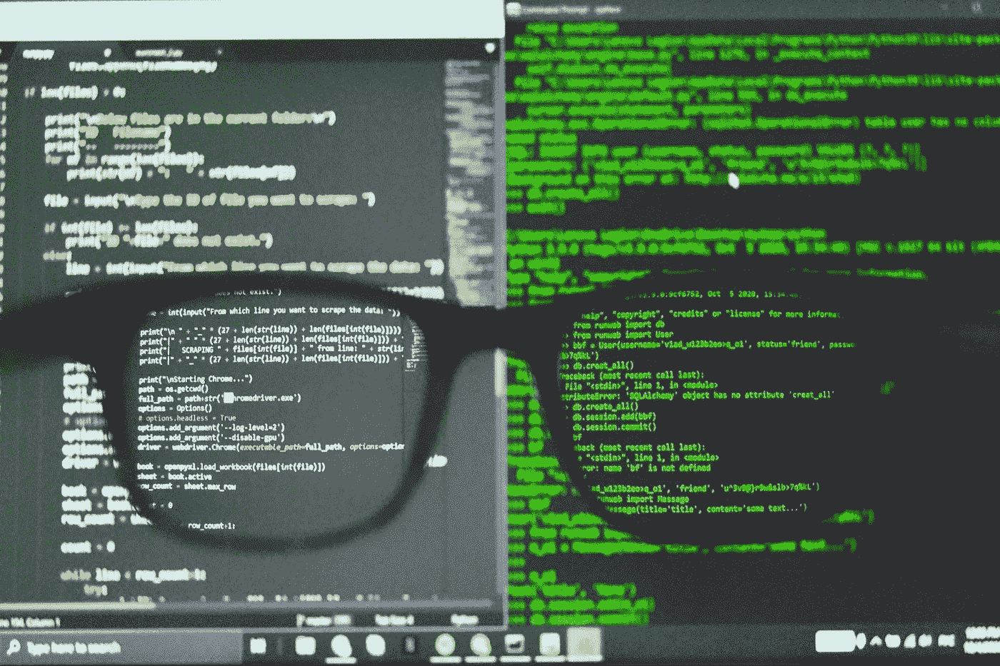

# 你应该知道的 9 个高级 Python 概念

> 原文：<https://medium.com/geekculture/9-advanced-python-concepts-you-should-know-about-945621e49550?source=collection_archive---------0----------------------->

注意:我写这篇文章没有得到任何报酬。请考虑用此链接 *通过* [*成为中等会员来支持我和其他人的写作。*](/@c-nemri/membership)

Python 是一种通用编程语言，因其可读性、面向对象的特性和强大的社区支持而广受欢迎。除了用于 web 应用程序，Python 还用于各种领域…