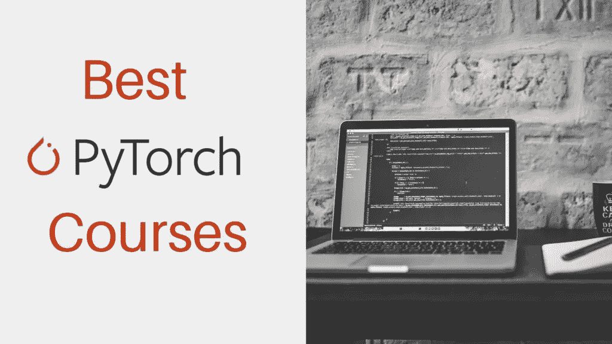
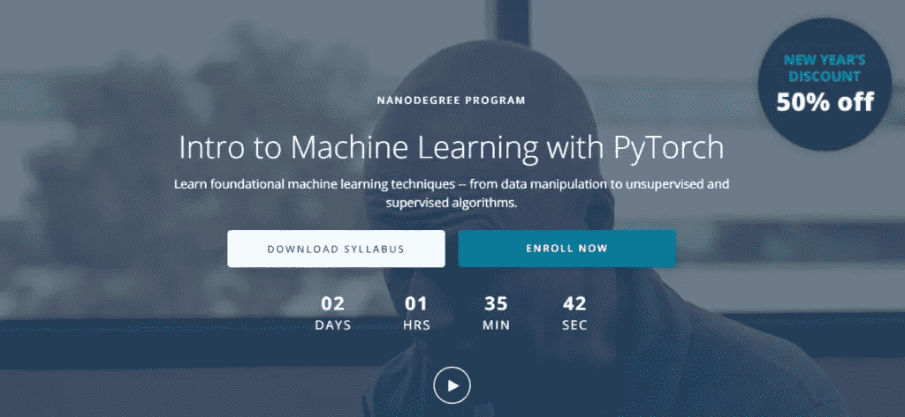
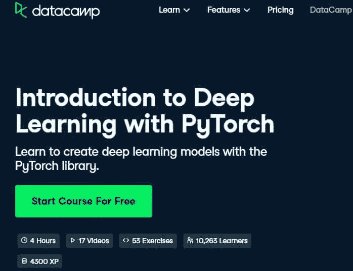
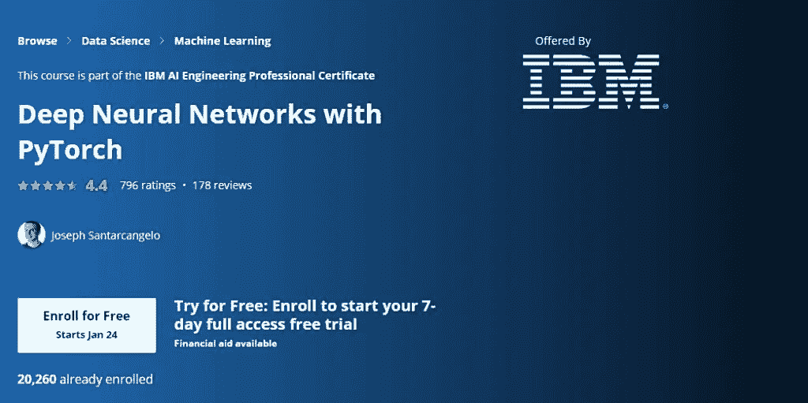
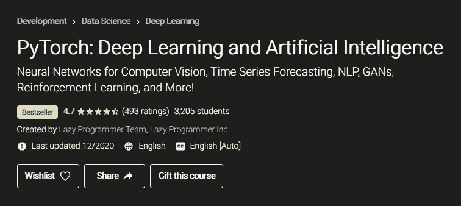
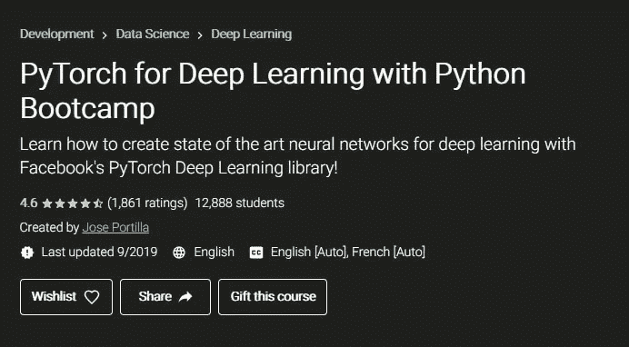
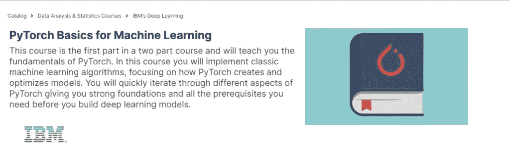
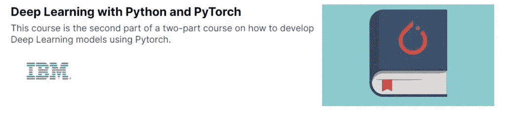
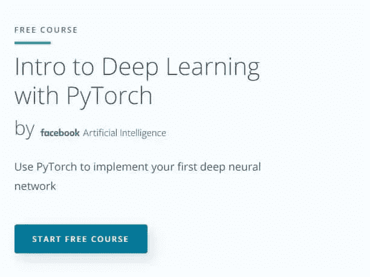
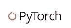

# PyTorch 深度学习的 9 门 Best+免费在线课程

> 原文：<https://medium.com/geekculture/9-best-free-online-courses-for-pytorch-for-deep-learning-4984201c29a1?source=collection_archive---------24----------------------->

你在寻找 PyTorch 深度学习最好的**在线课程吗？如果是，请查看下面列出的 PyTorch 在线课程。在这篇文章中，你会发现**9**免费和付费的 Pytorch 课程。**那么，事不宜迟，让我们开始吧。

PyTorch 是受 **Torch** 启发，由**脸书**人工智能研究小组开发的**开源机器学习库**。PyTorch 本质上更像 Pythonic，它相信动态图。PyTorch 最好的部分是它的 Pythonic 性质。它易于使用，易于调试，并且有一组简单的 API。

由于 PyTorch 越来越受欢迎，我为您挑选了 9 个最好的免费和付费在线课程。所以，让我们转到课程上-

# PyTorch 深度学习最佳在线课程

# 1.【PyTorch 机器学习简介–uda city

**评级-** 4.7/5

完成时间- 3 个月(如果你每周花 10 个小时)

这是一个由 Udacity 提供的纳米学位项目。在这个项目中，你将学习**基础机器学习技术**以获得更多机器学习的信心。这个纳米学位课程将为您提供关于**监督学习、深度学习和非监督学习的深入知识。**

在这个纳米学位项目中，你将与现实世界的项目一起工作。这些项目与行业专家和顶级公司有着内在的联系。

## 额外福利-

*   你将有机会与行业专家一起参与**现实世界的项目。**
*   您将从经验丰富的评审人员那里获得项目反馈，您还将获得技术导师的支持。
*   与此同时，你将获得**简历服务、Github 评论、LinkedIn 个人资料评论。**

## 谁应该报名？

*   具有 Python 和**概率统计基础知识**中级经验者。****

## 有兴趣报名吗？

如果是，那么在这里查看所有细节-[**py torch 机器学习简介**](http://imp.i115008.net/YJMdP)

# 2.【PyTorch 深度学习简介–data camp

**完成时间-** 4 小时

本课程将教您如何使用 PyTorch 来学习深层学习基础知识，然后您将构建第一个神经网络来从 MNIST 数据集预测数字。在这之后，你将学习关于回旋神经网络。本课程还将教您如何利用有线电视新闻网建立更强大的模型，给出更准确的结果。

本课程第一章**免费**以便您查看课程质量和内容。本课程共 **4 章**

1.  [**py torch(FREE)简介**](https://datacamp.pxf.io/15Wv4a)
2.  [**人工神经网络**](https://datacamp.pxf.io/15Wv4a)
3.  [**卷积神经网络**](https://datacamp.pxf.io/15Wv4a)
4.  [**采用卷积神经网络**](https://datacamp.pxf.io/15Wv4a)

## 谁应该投保？

*   那些知道 **Python 编程**并且熟悉监督学习的人。

## 有兴趣投保吗？

如果是，则在此处查看课程详情-[**py torch 深度学习入门**](https://datacamp.pxf.io/15Wv4a)

# 3.[带 PyTorch 的深层神经网络](https://coursera.pxf.io/b3gEAm)–Coursera

**额定值-** 4.4/5

**提供方-** IBM

**完成时间-** 31 小时

这是一门由 IBM 提供的非常翔实的课程。在本课程中，您将学习如何使用 PyTorch 构建深度学习模型。本课程包含大量**简单易懂的内容**。

在课程开始时，您将学习 **Pytorch 张量**和**自动微分包。**随着课程的进行，您将学习到 PyTorch 深度学习的基础知识，如**线性回归、逻辑回归、前馈深度神经网络、不同激活函数角色、归一化、脱落层、卷积神经网络、迁移学习等。**

简而言之，对于那些想深入学习 PyTorch 的人来说，这是最好的课程。现在让我们看看课程大纲-

## 课程大纲-

*   张量和数据集
*   线性回归
*   线性回归 PyTorch 方法
*   多输入多输出线性回归
*   分类的逻辑回归
*   Softmax 回归
*   浅层神经网络
*   深层网络
*   卷积神经网络
*   同行审查

## 额外福利-

1.  完成后您将获得一张**可共享证书**。
2.  除此之外，你还会得到**课程视频&阅读材料、练习测验、有同伴反馈的评分作业、有反馈的评分测验、评分编程作业。**

## 谁应该报名？

*   那些有**以前的 Python 和机器学习知识的人。**

## 有兴趣报名吗？

如果是，那么在这里查看所有细节- [**深度神经网络与 PyTorch**](https://coursera.pxf.io/b3gEAm)

# 4. [PyTorch:深度学习和人工智能](https://click.linksynergy.com/deeplink?id=Vrr1tRSwXGM&mid=39197&murl=https%3A%2F%2Fwww.udemy.com%2Fcourse%2Fpytorch-deep-learning%2F)–Udemy

**评级-** 4.7/5

**提供商-** 懒惰程序员公司

**完成时间-** 23 小时

这是最好的初级课程，从**机器学习基础知识**开始，然后转向深度学习概念，如**深度神经网络、卷积神经网络(图像处理)和递归神经网络。**

本课程包括各种项目，如**深度强化学习股票交易机器人**、**推荐系统**、**生成式对抗网络(GANs)** 、**计算机视觉迁移学习**和 **NLP。**

因此，如果你想尝试一些深度学习项目，这是最适合你的课程。

## 额外福利-

*   你将获得一份**结业证书。**
*   除此之外，您还将获得**终身访问**课程材料的权利。

## 谁应该报名？

*   会用 **Python 和 Numpy** 编码，对**导数和概率有优先理解的人。**

## 有兴趣报名吗？

如果是的话，那么在这里查看所有细节- [**PyTorch:深度学习与人工智能**](https://click.linksynergy.com/deeplink?id=Vrr1tRSwXGM&mid=39197&murl=https%3A%2F%2Fwww.udemy.com%2Fcourse%2Fpytorch-deep-learning%2F)

# 5. [PyTorch 用 Python 进行深度学习](https://click.linksynergy.com/deeplink?id=Vrr1tRSwXGM&mid=39197&murl=https%3A%2F%2Fwww.udemy.com%2Fcourse%2Fpytorch-for-deep-learning-with-python-bootcamp%2F)–Udemy

**评级-** 4.6/5

**教官-** 何塞·波尔蒂利亚

**完成时间-** 17 小时

这门课程是 PyTorch 对深度学习的**理论和实践**理解之间的完美平衡。在整个课程中，你将参与**各种项目**。在本课程中，您将学习**神经网络理论、人工神经网络、卷积神经网络、递归神经网络、带 PyTorch 的张量等**。

完成本课程后，你将能够构建**深度学习模型**。课程讲师**何塞·波尔蒂利亚**拥有多年数据科学和编程专业讲师和培训师的经验。

在本课程中，**何塞·波尔蒂利亚**将为您提供笔记本，帮助您简单轻松地理解代码和解释。

## 额外福利-

*   你将获得一份**结业证书。**
*   除此之外，您还将获得**终身访问**课程材料的权利。

## 谁应该报名？

*   有**Python**前期知识，想学习 PyTorch 进行深度学习的。

## 有兴趣报名吗？

如果是的话，那就在这里查看全部详情——[**py torch 用 Python 进行深度学习**](https://click.linksynergy.com/deeplink?id=Vrr1tRSwXGM&mid=39197&murl=https%3A%2F%2Fwww.udemy.com%2Fcourse%2Fpytorch-for-deep-learning-with-python-bootcamp%2F)

# 6. [PyTorch 机器学习基础知识](https://tidd.ly/39gAv8k) -edX

**供应商-** IBM

**完成时间-** 5 周

本课程将教授您 Pytorch 的**基础知识，如 **PyTorch 的张量、张量类型、运算、Pytorch 自动微分包以及与 Pandas 和 Numpy 的集成等。****

在本课程中，您还将学习如何训练一个**线性回归模型**，如何使用 **PyTorch 的线性** **类和自定义模块进行**预测**。**

简而言之，对于那些想要深入了解 PyTorch 基础知识的人来说，这是一门完美的课程。本课程有 5 个模块。

## 额外福利-

*   你将获得一份**结业证书。**

## 谁应该报名？

*   有**以前 Python 编程知识的。**

## 有兴趣报名吗？

如果是的话，那么在这里查看程序详情- [**PyTorch 机器学习基础知识**](https://tidd.ly/39gAv8k)

# 7.[用 Python 和 PyTorch 进行深度学习-](https://www.awin1.com/cread.php?awinmid=6798&awinaffid=790615&ued=https%3A%2F%2Fwww.edx.org%2Fcourse%2Fdeep-learning-with-python-and-pytorch) edX

**供应商-** IBM

**完成时间-** 6 周

从 [**PyTorch 机器学习基础**](https://tidd.ly/39gAv8k) 课程中获得 PyTorch 基础知识后，本课程将教你如何在 PyTorch 中构建**深度神经网络。**以及如何应用 **dropout、初始化、不同类型的优化器、批处理规范化等方法。**

然后，您将学习**卷积神经网络、如何在 GPU 上训练模型、迁移学习、降维技术和自动编码器。在整个课程中，你将向 IBM** 的专家导师学习。

## 额外福利-

*   你将获得一份结业证书。

## 谁应该报名？

*   那些有**Python 编程**和熟悉**机器学习概念的人。**

## 有兴趣报名吗？

如果有，那么在这里查看一下程序详情——[**深度学习用 Python 和 PyTorch**](https://www.awin1.com/cread.php?awinmid=6798&awinaffid=790615&ued=https%3A%2F%2Fwww.edx.org%2Fcourse%2Fdeep-learning-with-python-and-pytorch)

# 8.【PyTorch 深度学习简介–uda city

**完成时间-** 2 个月

如果你正在寻找**最好的免费 PyTorch 课程**，那么这是最适合你的课程。在本课程中，你将学习深度学习的**基础知识，并学习如何使用 PyTorch 构建**深度神经网络。****

在本课程中，你还将通过使用最先进的人工智能应用程序(如**样式转换和文本生成)获得**实践经验**。**

## 谁应该报名？

*   那些熟悉 Python 和数据处理库如 **NumPy 和 Matplotlib** 的人。并具备**线性代数和微积分**的基础知识。

## 有兴趣报名吗？

如果是，那么在这里查看所有细节-[**py torch 深度学习简介**](https://imp.i115008.net/DjAKq)

# 9.pytorch.org[py torch 教程](https://pytorch.org/tutorials/)

我们无法避免**官方 PyTorch 网站**提供各种 PyTorch 教程来清除 PyTorch 基础知识如**编写自定义数据集、计算机视觉迁移学习教程、深度学习**等。

这些教程最棒的部分是它们不时地更新内容，这样你就能获得这个领域最好的知识。每个教程都有一个**下载链接**，这样你就可以下载 **Jupyter 笔记本和 Python 源代码。**

## 谁应该报名？

*   任何想学习 PyTorch 基础的人。

## 有兴趣报名吗？

如果是，请点击这里查看所有详细信息- [**PyTorch 教程**](https://pytorch.org/tutorials/)

名单到此结束。我希望这些**py torch**的最佳在线课程能够帮助你按照自己的进度学习 **PyTorch** 。我建议你将这篇文章加入书签，以备将来参考。现在是总结的时候了。

## 结论

在本文中，我试图涵盖 PyTorch 的所有**最佳在线课程。如果你有任何疑问或问题，欢迎在评论区问我。**

**课程总结-**

1.  [**PyTorch:深度学习与人工智能**](https://click.linksynergy.com/deeplink?id=Vrr1tRSwXGM&mid=39197&murl=https%3A%2F%2Fwww.udemy.com%2Fcourse%2Fpytorch-deep-learning%2F)–**Udemy**
2.  [**py torch 机器学习简介**](http://imp.i115008.net/YJMdP)–**uda city**
3.  [**py torch 深度学习简介**](https://www.datacamp.com/courses/introduction-to-deep-learning-with-pytorch?tap_a=5644-dce66f&tap_s=950491-315da1&utm_medium=affiliate&utm_source=aqsazafar)–**data camp**
4.  [**深度神经网络与 py torch**](https://coursera.pxf.io/b3gEAm)–**Coursera**
5.  [**PyTorch 用 Python 进行深度学习**](https://click.linksynergy.com/deeplink?id=Vrr1tRSwXGM&mid=39197&murl=https%3A%2F%2Fwww.udemy.com%2Fcourse%2Fpytorch-for-deep-learning-with-python-bootcamp%2F)**–Udemy**
6.  [**PyTorch 机器学习基础知识**](https://tidd.ly/39gAv8k) **-edX**
7.  [**深度学习与 Python 和 PyTorch-**](https://www.awin1.com/cread.php?awinmid=6798&awinaffid=790615&ued=https%3A%2F%2Fwww.edx.org%2Fcourse%2Fdeep-learning-with-python-and-pytorch) **edX**
8.  [**py torch 深度学习简介**](https://imp.i115008.net/DjAKq)–**uda city**
9.  [**PyTorch 教程**](https://pytorch.org/tutorials/)–**pytorch.org**

万事如意！

享受学习！

如果你觉得这些资源有帮助，请👏