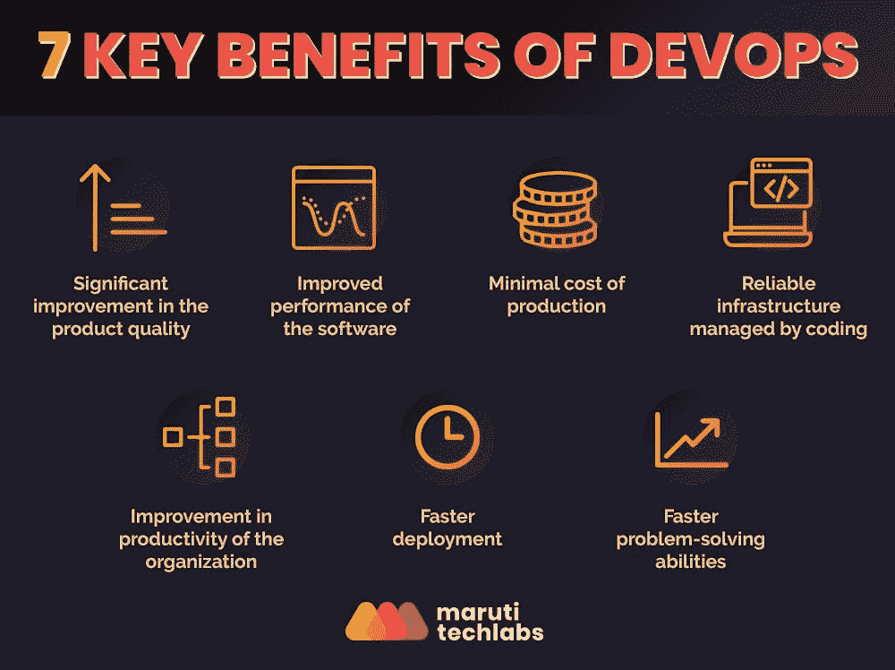
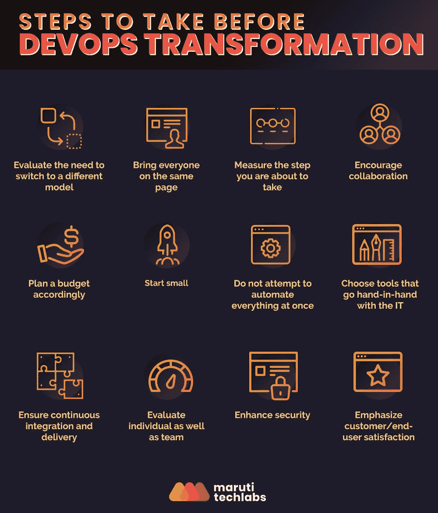

# 开发运维的 9 大优势——如何开始开发运维转型之旅

> 原文：<https://medium.com/geekculture/9-key-benefits-of-devops-54666b8f5c6a?source=collection_archive---------8----------------------->

## DevOps 迅速获得了 IT 行业的关注，这是有原因的。

随着工作环境的不断变化和快节奏，软件开发领域中更快的交付和更短的周转时间已经成为一个组织发展的必要条件。因此，制作高质量的产品和有限的后期制作错误导致了 DevOps 的出现。让我们更深入地了解 DevOps，DevOps 的好处，传统软件开发生命周期的缺点，以及转变 DevOps 文化的步骤。

# DevOps 是什么？

术语“DevOps”是通过结合软件“开发”(Dev)和“操作”(Ops)而引入的。)上述术语是 Patrick Debois 在 2009 年创造的，目的是为了快速有效地交付软件更新、错误修复和功能。

不同的人对 DevOps 的定义有不同的版本。对某些人来说，它是一种标准或方法。对许多人来说，它是 it 世界中的一种完整的“文化”。无论您选择如何定义 DevOps，都必须了解如何开始 DevOps 之旅以获得其好处。

# 为什么是 DevOps？DevOps 是如何工作的？

DevOps，本质上作为一种方法或工作文化，通过协作、自动化、集成、持续交付、测试和监督的正确融合来实现。

在我们进一步深入本质之前，让我们先了解引入 DevOps 背后的原因。

在引入 DevOps 之前，软件交付遵循传统或经典的瀑布模型。这个流程模型包括一组定义的阶段的顺序流，其中一个阶段的输出成为下一个阶段的输入。因此，所有阶段都是相互依赖的，一个阶段的完成标志着另一个阶段的开始。

尽管软件交付生命周期(SDLC)模型很简单，但是已经发现它有几个缺陷。据观察，在不断变化的当代世界中，企业会遇到需要快速解决的多方面问题。产品的变化，如添加新功能、修复错误等，要求 it 部门在传统 SDLC 中经历至少 4 到 5 个不同的阶段，从而导致延迟并增加成本。

根据 Gene Kim(一位获奖的 CTO)和研究员(一位)的说法，不同团队之间为提供一个稳定的软件解决方案而产生的冲突和摩擦会导致“一个可怕的恶性循环，最终导致可怕的结果”他进一步解释说，传统模式中生产的延迟会导致组织中的“无望和绝望”。

本质上，DevOps 是一种更具包容性的软件开发过程，开发和运营团队在项目中协同工作。结果，在更快的反馈循环的帮助下，软件开发生命周期被缩短，从而更频繁地交付更新和特性。

# DevOps 的优势

一个商业组织如何在竞争激烈的市场中前进，并在规定的时间内更有效地向最终用户提供最佳功能？以下是公司采用 DevOps 工作方式后可以享受的一些主要好处:

## 1.确保更快的部署

更快、更频繁地交付更新和功能不仅会让客户满意，还会帮助您的公司在竞争激烈的市场中站稳脚跟。

## 2.稳定工作环境

您知道发布新功能、修复或更新所带来的压力会破坏您工作空间的稳定性并降低整体工作效率吗？通过 DevOps 实践，以稳定、平衡的方式改善您的工作环境。

## 3.产品质量显著提高

开发和运营团队之间的协作以及对用户反馈的频繁获取导致了产品质量的显著提高。

## 4.重复性任务的自动化为创新留下了更多空间

与传统模式相比，DevOps 具有更大的优势，因为它有助于快速有效地检测和纠正问题。随着缺陷通过自动化被反复测试，团队获得了更多的时间来构思新的想法。

## 5.提升您业务的敏捷性

众所周知，让您的业务变得敏捷有助于您在市场中保持领先。多亏了 DevOps，现在可以获得业务转型所需的可扩展性。

## 6.软件的持续交付

在 DevOps 方法中，所有部门都负责维护稳定性和提供新功能。因此，软件交付的速度很快，不受干扰，不像传统的方法。

## 7.快速可靠的问题解决技术

确保快速稳定地解决软件管理中的技术错误是 DevOps 的主要优势之一。

## 8.透明度带来高生产率

随着筒仓(ing)的消除和协作的促进，这一过程允许团队成员之间容易的交流，使他们更专注于他们的专业领域。因此，合并 DevOps 实践也导致了公司员工生产力和效率的激增。

## 9.最低生产成本

通过适当的协作，DevOps 有助于降低您的部门的管理和生产成本，因为维护和新的更新都在一个更广泛的范围内。

# DevOps 对不同利益相关方的不同好处

然而，从全局来看，不同的利益相关者有不同的业务目标。不同的业务目标要求他们以不同的方式看待开发运维的优势。首席信息官的观点不同于首席执行官的观点，首席执行官的视角也不同于 IT 经理或任何其他利益相关方——著名 IT 主管 David Linwood 研究了看待 DevOps 优势的不同之处，他将不同的视角称为“透镜”。

对于 IT 经理来说，改进过程和技术指标是很重要的。因此，从 IT 经理的角度来看，输出性能指标决定了开发运维的优势。好处是:

*   更低的缺陷量
*   降低发布的成本
*   提高软件性能
*   降低投资成本
*   新功能、修复和更新的频繁发布
*   改进的 MTTR(平均恢复时间)

组织的 CTO / CIO 更加关注战略目标，包括以人为中心的指标，以成功实施 DevOps。从首席信息官的角度来看，DevOps 具有以下优势:

*   个人提高和交叉技能
*   更大的灵活性和适应性
*   集思广益和实验的自由
*   团队成员的参与度提高
*   合作和快乐的团队
*   来自高级管理团队的赞赏
*   更好的流程管理
*   可靠、快速的修复，以及增强的操作支持。

对于首席执行官来说，开发运维的好处取决于降低生产成本和增加收入的业务成果。根据首席执行官的企业愿景，下面列出了 DevOps 的优势:

*   提高产品质量
*   满意的顾客
*   降低生产成本
*   收入增加
*   可靠稳定的 IT 基础设施
*   减少停机时间
*   提高本组织的生产率

# 转型前要采取的步骤

越来越多的公司正在转向 DevOps，以克服传统 SDLC 模式面临的挑战。随着 DevOps 已经成为 IT 世界中一个常见的变革之旅，许多软件公司仍在努力迈出 DevOps 起飞的第一步。在开始向开发运维转型之前，制定一个路线图非常重要。下面阐述了开始升级 DevOps 之前要采取的步骤:

## 1.评估切换到不同模型的需求

从经典模式转向现代模式并不容易。在将 DevOps 整合到您的业务中之前，对转换到不同流程的必要性进行评估。仅仅因为在市场上受欢迎而改变一种不同的做法不可能产生预期的结果。对于一些组织来说，采用 DevOps 已经产生了良好的结果，而对于一些组织来说，转换到新的策略也同样成功。在选择合适的组织运营模式时，你的业务目标应该是主导因素。

## 2.确认是否每个人都在同一页上

在你决定改变你的工作环境之前，确保每个人都愿意接受新的模式，告别以前的技术和文化环境。从教育团队什么是 DevOps 以及为什么组织选择实施 DevOps 文化开始。由于 DevOps 本质上是关于打破孤岛和协同工作，在具有不同优先级和观点的团队中开发统一的视角是旅程中最关键的一步。

## 3.衡量每一步

为了衡量开发运维的成功，必须测量软件开发生命周期不同阶段的当前指标(例如，开发、测试等所花费的时间)。)在实施 DevOps 实践之后，应该再次测量指标。比较和分析之前和之后的场景有助于在旅程的每个点进行有效的评估。

## 4.鼓励协作

所有部门之间的协作是 DevOps 模式成功的关键。打破组织孤岛，为沟通和轻松访问信息铺平道路。同等关注不同团队之间的差异以及团队的重叠想法。健康的环境和团队成员之间的合作对确保 DevOps 的成功大有帮助。

## 5.相应地计划预算

在过渡之前需要考虑的另一个重要因素是预算规划。对组织在过渡和整合过程中将要承担的费用进行粗略的估计是很重要的，因为没有计划的方法会导致金钱的浪费和生产力的降低。

## 6.从小处着手

在您的组织中进行小的改变，并随着时间的推移逐步扩大规模，而不是一下子将所有部门都转变为 DevOps 模式。从将协作文化融入小团队开始，观察他们的成就或改进，并在另一个团队中实施该模型做出后续决策，从而在更大范围内采用 DevOps 最佳实践，这总是安全的。

## 7.不要试图一次自动化所有的事情

理解从传统方法到 DevOps 的过渡不会在一夜之间发生，因此匆忙做出改变不是可行的选择。不要被自动化这个术语所迷惑，不要期望基础设施马上被代码管理。在将自动化的责任完全交给 IT 团队之前，雇佣一个在自动化领域经验丰富的专业人员并能引导团队走向完美总是安全的。

## 8.选择与 IT 环境密切相关的工具

如果您正在考虑实现 DevOps，请确保所选择的自动化工具相互兼容，并增强工作环境。建议所有工具都从同一个卖家那里购买，因为与来自不同供应商的不同工具相比，它们之间的集成程度更高。应该广泛购买工具，以确保配置的顺利操作和管理。

## 9.确保持续集成和交付

在实施 DevOps 之前，在集成和交付中建立连续性应该是组织的主要目标之一，没有 devo PS，平稳运行的想法将是徒劳的。持续集成是敏捷过程的一部分，在敏捷过程中，软件是在小而有规律的阶段中开发的，并且可以立即检测和纠正缺陷。

## 10.评估个人和团队的表现

协作的艺术是一个新概念，跟踪新团队的表现对于检查进展是必要的。观察并评估个人的指定角色和任务的实际执行情况。

## 11.请注意增强安全性

加强安全性是另一个基本步骤，这方面的疏忽会使 DevOps 转换无效。由于传统模式更多地关注软件开发和单元测试，公司未能投入资源和时间来加强安全性。

借助 [DevOps](https://marutitech.com/devops-consulting-services/) ，许多商业组织已经实施了集成的安全系统。与开发人员和操作人员一起，建议雇佣熟练的安全团队来严格监控配置、基础设施和完整性。

## 12.强调客户/最终用户的满意度

传统模型的一个主要缺点是，它需要几天甚至几个月的时间来接收反馈，并对软件进行新的更改和更新。此外，在传统的 SDLC 中，软件没有经过开发的每个小阶段的测试，导致最终产品不令人满意。

部门和顾客之间沟通的延迟使顾客对产品失去信心。在 DevOps 实践中，最终用户满意度是一个优先事项。关注客户的需求，并根据他们的反馈对软件做出更快的改变或改进。

在整合系统的范围内，不同部门之间的透明度和团结合作的意愿使客户对结果感到满意，并帮助业务蓬勃发展。

# DevOps 成功的原因是什么？

DevOps 作为一项服务，通过快速交付功能和更新，优先满足客户需求。这使得 DevOps 成为比传统模型更受欢迎的方法。

确保公司 DevOps 成功实施和运行的关键因素包括:

## 1.连续集成操作

它是一个主导因素，包括收集代码的变更，并共同使它们通过系统化和自动化的测试阶段。与传统方法不同，这一过程有助于在发布产品/功能之前检测缺陷，尽早纠正它们，并确保质量。

## 2.持续交付

代码中的所有新变化都被交付到生产阶段，在那里进行一般测试。之后，部署的输出将进一步经过标准的测试过程。

## 3.不同团队之间持续一致的沟通

这一过程包括打破单一和隔离的服务，并将它们连接起来，作为多个独立的服务统一工作。

## 4.减少基础架构的手动管理

告别有缺陷的传统基础设施管理方法。新流程通过代码确保基础设施的正确管理和使用。有几个 DevOps 工具可以帮助有效地管理更新。

## 5.策略管理代码

随着代码化取代了重要配置和基础设施的手动管理，跟踪缺陷和重新配置变得更加容易和自动化。所以节省了时间，提高了效率。

## 6.结构管理

DevOps 的实施消除了主机配置的手动和繁重的管理工作。操作工作和配置都将通过代码得到系统化的管理。

[向 DevOps 转型](https://marutitech.com/devops-consulting-services/)绝非易事。将你的团队的心态从“我已经完成了我的工作”转变为“产品/特性现在可以部署了”是 DevOps 的全部内容。在实施之前，适当地规划到 DevOps 的转换至关重要。在马鲁蒂技术实验室，我们帮助公司成功地从孤立的传统 SDLC 迁移到跨职能团队的环境中，致力于满足客户的需求。

从更频繁地将每个人带到同一页面到成功部署代码，保持系统直立，维护动态基础设施，以及实现 apt 自动化，我们的 [DevOps 专家](https://marutitech.com/devops-consulting-services/)会走得更远，帮助您完成转型之旅的每一步，以确保您的企业在长期内达到新的高度。只需在此给我们留言[，满足您的端到端开发运维需求。](https://marutitech.com/contact-us/)

原创作品— [什么是 DevOps？](https://marutitech.com/what-is-devops-transition-to-devops/)