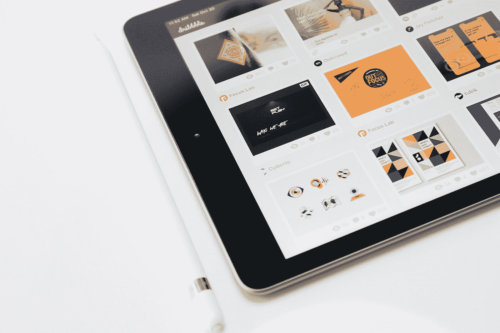

# 改进 UX 设计的 9 个关键点

> 原文：<https://medium.com/geekculture/9-key-points-to-improve-ux-design-1bcf368f5b5a?source=collection_archive---------19----------------------->

## 遵循这些提示，创造完美的用户体验！

Photo by [Kerde Severin](https://unsplash.com/@kseverin?utm_source=medium&utm_medium=referral) on [Unsplash](https://unsplash.com?utm_source=medium&utm_medium=referral)

用户体验(UX)是产品或服务的设计，使人们使用起来容易和愉快。它包括理解用户如何与你的产品互动，并创造出满足他们需求的设计。改善 UX 设计有很多关键点。这里有九个: