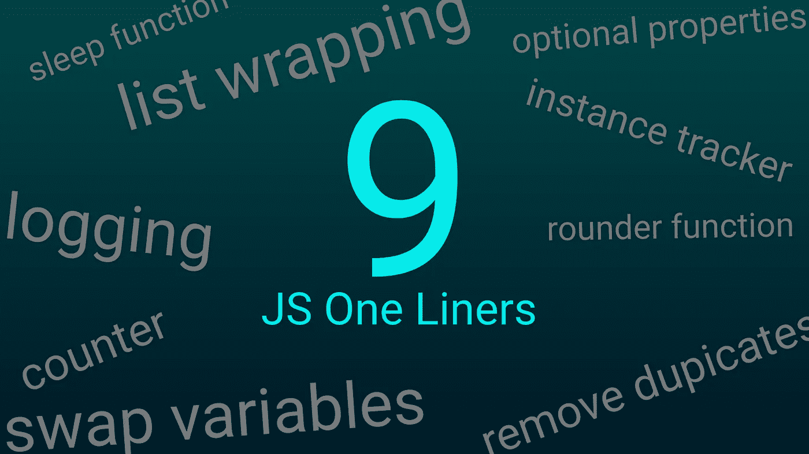

# 9 个简洁的 JavaScript 代码片段，用于算法等

> 原文：<https://medium.com/geekculture/9-neat-javascript-one-liners-for-algorithms-and-more-8dd3b0a0fb6d?source=collection_archive---------12----------------------->

## 给你的下一位面试官留下深刻印象

了解某些 JavaScript one liners 可以在开发或面试时节省您宝贵的时间。这里有一些我最喜欢的“一旦你知道了，你就知道了”的片段，我实际上在编码时使用过。其中只有一个有点[代号高尔夫-y](https://analyticsindiamag.com/what-is-code-golfing-and-biggest-such-tournaments/#:~:text=Code%20Golf%20is%20a%20game,the%20least%20number%20of%20characters.&text=Similar%20to%20the%20golf%20game,specifications%20in%20the%20fewest%20keystrokes.) ，而*不出所料*它用的是 reduce。

# 环绕一个列表