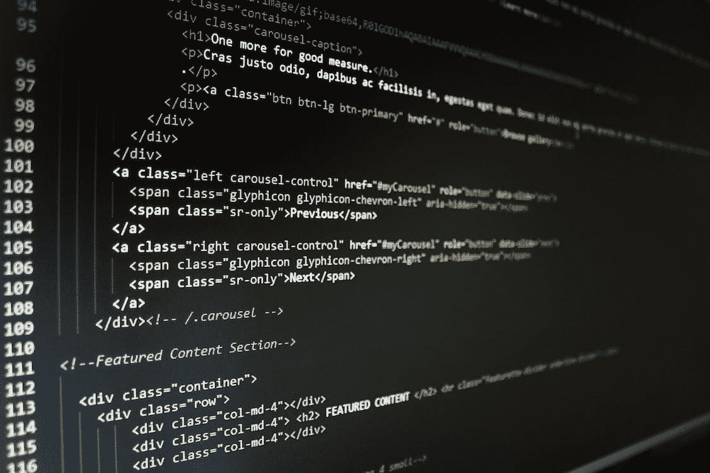

# 下一次编程面试的 9 个 Python 列表和字典技巧

> 原文：<https://medium.com/geekculture/9-python-list-and-dictionary-hacks-for-your-next-coding-interview-6e0501049e01?source=collection_archive---------14----------------------->

## 列表和字典是 Python 编程中最常用的数据结构

Source: Free for Use Photo from [Pixels](https://www.pexels.com/ko-kr/photo/270360/)

在这篇文章中，我分享了 Python 列表和字典的 9 个窍门。由于列表和字典是 Python 中最常用的数据结构，理解并能够利用…