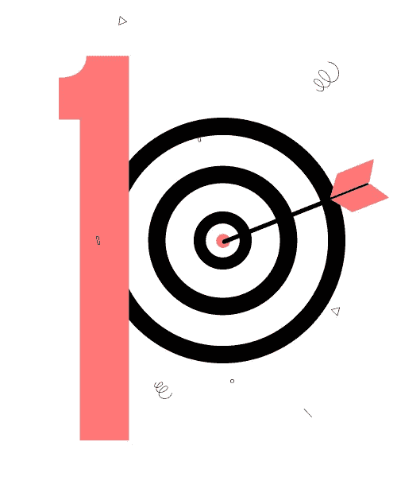
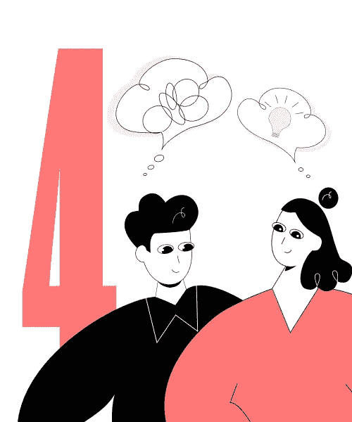
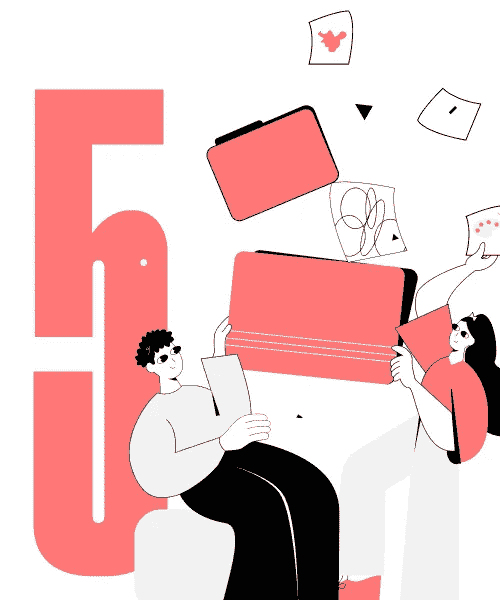
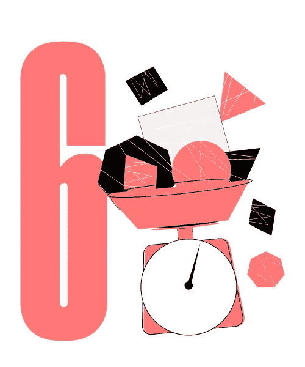
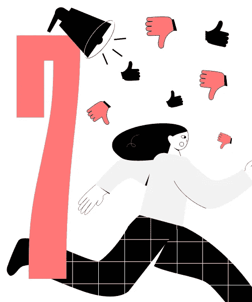
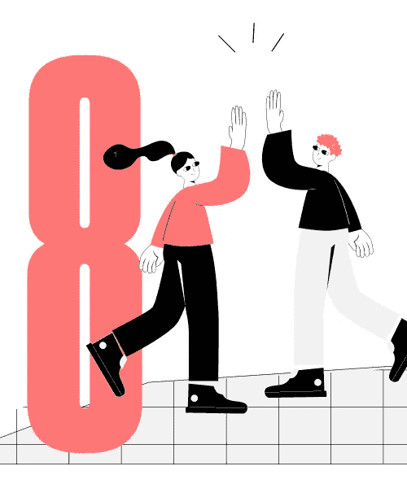
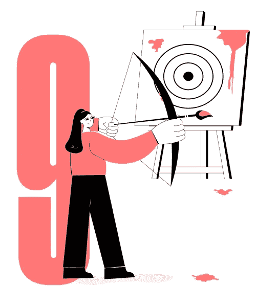

# 与 UI UX 设计服务提供商有效合作的 9 个秘密

> 原文：<https://medium.com/geekculture/9-secrets-of-effective-collaboration-with-a-ui-ux-design-service-provider-59b3c03fb393?source=collection_archive---------10----------------------->

事情就是这样开始的。

UI UX 设计服务提供商收到来自客户的请求，内容如下:*“我想创建一个服务，帮助用户快速、私密地分享他们的照片。你可以自由地发挥你的创造力和想象力。”*

这个过程开始滚动。该团队首先举行一系列头脑风暴会议，试图将他们的创造性思维引入正轨。他们将视觉、文本和样本编辑成情绪板；设计用户旅程地图；并将他们的设计理念体现在纸上。这个概念已经准备好了——兴奋的火花点燃了。

该团队准备向客户展示设计概念，他们已经做好了一切准备——收集屏幕草图、UI UX 设计参考和书面陈述。客户会怎么说？

*“真是岂有此理！为什么要为这些涂鸦付钱呢？没有独特的品牌元素，艺术品，或任何有形的东西。我要退款！”*

**这种情况下哪里出了问题？**通常，客户被围绕创意的刻板印象和对产品设计过程的误解所驱使。UI UX 设计师不是艺术家。更启示的是，设计师根本不需要擅长画画。如果一个设计师向客户展示手写的纸上草图和来自互联网的参考图片，这并不意味着最终的设计会是一样的。构思是过程的前期，要把握好方向，明确工作范围。

一个好的产品总是双方——[UX UI 设计公司](https://cxdojo.com/ui-ux-design)和客户合作和参与的结果。

# 为什么要这么麻烦？

用户界面 UX 的设计缺陷会让你损失惨重——比如说，高达 5 亿美元。你准备好拿出那笔钱了吗？不太可能。花旗银行也没有准备好，但他们不得不这样做。

作为一家大型国际财富管理公司，花旗银行迎合了许多企业客户的需求。其中一个客户是化妆品品牌露华浓，它将贷款管理委托给花旗银行。在与客户的债权人进行交易时，银行员工意外支付了全部贷款金额 9 亿美元，而不是定期利息 780 万美元。尽管花旗银行要求贷款人退款，但他们只能拿回一部分钱——4 亿美元。剩下的 5 亿美元几乎没有了。

难道不是员工的错吗？是的，但是在一定程度上。如果他们运行的贷款操作软件是用户友好的，他们就可以避免麻烦。他们所需要的只是指导用户通过界面的上下文相关的指令或提示。即使是一个弹出的确认请求，说明支付的总金额也可以挽救局面。

那么一个 UI UX 设计师是做什么的呢？他们究竟能帮上什么忙？

设计主要是围绕产品的结构或骨架，而不是艺术品。用户界面 UX 设计师构建了用户在每个接触点与产品交互时获得的体验——从注册一直到预期的动作。为了实现这一点，设计师们设计出尽可能多的用例。然后，它们在产品的界面上反映出来，这样最终用户就可以直观地与产品进行交互，并且很容易理解每一个动作的结果。这是花旗银行的软件所缺乏的。

从这里我们可以学到什么？你必须与设计过程保持联系，并始终在那里指导团队了解你的业务细节和需求。

# 如何有效地与 UI UX 设计服务提供商合作？

有一件重要的事情你应该记住。你的数字产品首先是为了对你的客户有意义而设计的，但它仍然是你的品牌、你的身份的一部分。为了让产品传达你的定制信息，作为企业主，你应该从第一天就参与设计。设计师认为你是让你的数字产品独一无二的知识来源。

因此，要对合作持开放态度；对你、你的顾客和设计师来说，这是一个双赢的局面。

## 提示 1。明确你的产品愿景

“一劳永逸”的方法在 UI UX 设计过程中是行不通的。这与你去找专家维修的汽车服务或类似服务不同。设计机构努力提供既实用又符合您业务需求的产品。

产品愿景反映了你对产品本质的理解，以及你希望最终达到的目标。你是最了解这一点的人。目标是指导用户界面 UX 设计服务的供应商到同一个页面，所以他们可以概念化的想法。

当然，明确你的视觉和审美偏好是很重要的，比如颜色、插图风格或排版。但是产品目标还有很多要说的。它们阐明了哪些资源是必需的，哪些特性是必须的，以及为什么要开发这个产品。

## 技巧二。提问

很自然，UI UX 设计师和你来自完全不同的背景。在某一点上，你可能会发现自己认为你们两个说的不是同一种语言。你不理解设计师的术语，也不能理解他们对你产品设计的看法。

但是不要沮丧。你不需要知道 UI UX 的设计原则——更重要的是，没人指望你会这么做。有问题就问。毕竟，你们将不得不一起工作，因此，清楚地了解事情应该如何做。

设计师喜欢讨论。这是他们在为您的项目决定最佳设计概念时参考的灵感和指导来源。

请记住，您卓有成效的沟通的结果是更好的产品和更满意的客户。

## 技巧三。提供参考

“一张照片胜过千言万语。”

这确实是真的，但只有当你清楚地了解你最终想要什么的时候。如果是这种情况，为什么不显示一个设计师的参考。这可能包括您喜欢的任何视觉材料，例如徽标、网站、版式、图标，甚至是您最喜欢的艺术家的画作。您可以创建一个情绪板，并与 UX UI 设计服务公司共享。

有人会说这只是随机图像的集合。但它也讲述了你的故事。通常，这个故事比一墙文字更有意义，因为它提供了一个创作方向。

视觉效果让设计师抓住美学上的细微差别，并将它们融入到你的产品设计中。这样，团队可以更好地理解你的愿景，更快地创造出高质量的产品。

然而，这根本不是必须的。还有其他方法可以帮助设计师走上正确的道路。

## 技巧四。准备好闲聊

你的品牌反映了你，即你的信息、价值观、专业知识。UI UX 设计服务提供商掌握的信息越多，产品与您独特的业务目标相关的机会就越大。

简单来说，如果你去找设计师要求添加一个特定的界面元素，准备好解释你为什么需要它。最有可能的是，设计师可以为你提供更多的选择来满足你的需求。

当然，准确地知道你的产品应该是什么样子是一件好事。但在这种情况下，你会把设计师当成工具，而不是创造者。这真的是你所期望的专业 UX 设计服务吗？

如果没有，传达团队需要知道的一切。全面的回答使设计过程更加简单。所以，准备好接受调查和深度采访。

## 技巧五。不要限制创造力

通常，客户专注于他们的设计理念，并拒绝任何改变。他们只是将需求交给团队来实现，并对每个小细节进行微观管理。当然，这是可行的，但是可行吗？掌握一些工具并自己创造设计会便宜得多。

那为什么要雇佣 UI UX 设计服务提供商呢？—为了找到一位经验丰富的专家，他对普通事物有着全新的视角，有着工程思维，并拥有坚实的 UX UI 设计组合。工具在这里是次要的。你为创造性思维和真实的设计方案买单。

所以让设计师充分利用他们的创造力——这会对你有利。要灵活，思想开放。你的想法可能没有你想的那么健全，因为你有偏见。设计师有可能发现你的品牌和产品的一些你看不到的地方。相信他们就好了。

## 提示 6。对时间和预算有现实的估计

UI UX 设计项目是多步骤的。一般来说，有 5 个步骤——研究和概念化、信息架构、视觉设计、交互设计和可用性测试。每一步都可以根据时间和预算来计算。此外，建议为每一步设定具体的目标，这样你就可以评估结果并决定是否继续与设计团队合作。

在 CXDojo，我们既有基本的服务包，也有定制服务。我们也可以帮你估算项目。我们的目标不是延长流程并为此收取高额费用。我们愿意相互理解，快速提供优质的 UI UX 服务。

在评估您的项目时，我们会特别注意优先排序。假设你的预算有限。我们可以跳过[用户研究](https://cxdojo.com/what-is-user-research)这一步，立即着手创建实体模型，并与真实用户进行进一步测试。显然，修改后的流程会带来一定的风险。但这里的重点是我们正试图站在你的立场上，决定如何最好地着手你的项目。

## 技巧 7。建设性地批评

一些客户从不在第一次迭代时批准设计概念。而这并不一定意味着设计很差。他们认为，准备一个早期版本，UI UX 设计服务提供商没有努力。

事实是这是你的第一个版本，而不是设计师的。我们敢打赌，他们在选择一个设计概念并把它推销给你之前，已经准备了几十个设计概念。所以如果你确实喜欢第一种变体，那就继续吧。

为修改而修改是一种不好的做法。这不利于友好的气氛。

但是也有设计师第一次尝试就没有做好的时候。经历几轮反馈是正常的。然而，在阐述你的批评时，要尽量具体。解释清楚你不喜欢什么，为什么。但是不要做硬性规定——让设计师自己找到出路。

## 技巧八。记住你们是一个团队的

把 UX UI 设计工作室当成你的伙伴。它促进合作，并确实产生积极的结果。毕竟，设计师不仅仅是任务执行者；他们是问题解决者。设计师和你一样对你产品的成功感兴趣，因为这是他们高质量工作的证明。

为了一帆风顺，确保设计团队了解你的商业价值、抱负和风险。这培养了一种独特的合作氛围。召开会议讨论进度，并在里程碑实现后进行验证。

虽然各方可能有不同程度的参与和可用性，但保持定期沟通仍然很重要，因为这有助于及时调整你的创作方向。

## 技巧九。不要期望马上就有完美的结果

不会马上有打磨好的设计。为此做好准备。

为了检验假设，最好推出一个粗糙的产品。这让设计师有机会在早期发现缺陷，并在必要时快速调整。这就是敏捷设计过程的美妙之处，它是逐步执行的，一次又一次的迭代。

UX 设计的核心是研究。不管有多深，结果还是要用真实用户来检验。当项目还是小规模的时候，就比较容易做了。所以不要立刻要求一个完美的产品，无论是来自设计师还是开发者。完美的产品是不断更新和改进的产品。

有一句谚语说得好:“少即是多。”一个功能最少的产品仍然可以使用，并带来有意义的见解。如果你的目标是更复杂，你可能会浪费你和设计公司很多时间、预算和精力。你可能会感到惊讶，但设计者看不到任何好处。设计师在与客户的合作中寻求的能量在于他们从完成的工作中获得的满足感。不是钱的问题，是灵感的问题。

我和我的团队渴望从你的产品创意中获得灵感，并实现它。