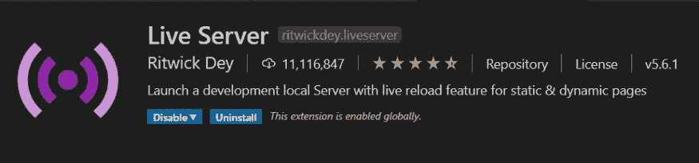
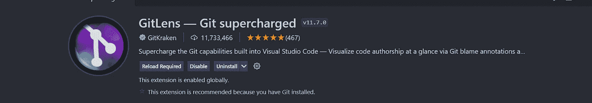

# 9 Visual Studio 代码扩展使编程变得更加容易。

> 原文：<https://medium.com/geekculture/9-visual-studio-code-extensions-that-make-programming-easier-6bbdacc15b6?source=collection_archive---------2----------------------->

您在编写代码时一定遇到过问题。就像它需要很多时间来完成，你得到错误，最终认为编程不是你的那杯茶。

那么这个博客是专门为你写的

9 Visual Studio Code Extensions That Make Programming Easier

Visual Studio code 是微软为 Windows、Linux 和 macOS 开发的最好的免费源代码编辑器之一。它给用户友好的环境，有惊人的功能。

> *“让它工作，让它正确，让它快。”—肯特·贝克*

# 如何安装可视化代码扩展？

如果你不知道如何安装扩展，不要担心，这很容易。点击屏幕左侧的 e **伸展**图标。这是第五个图标，紧挨着调试图标的下面。

在搜索栏中搜索扩展，然后点击安装。

现在，您知道如何安装扩展了。所以，不浪费任何时间，让我们了解一下这个扩展，它将使你的编程更容易。

> 提醒:-这些扩展来自我个人经验。可以多探索。

# 1.实时服务器

[***Live Server***](https://marketplace.visualstudio.com/items?itemName=ritwickdey.LiveServer)扩展对于 web 开发极其有用。这个扩展为静态和动态页面都提供了一个*动态重载* 特性。保存代码时，更改会立即反映在浏览器中。

live server

每次保存代码时，它都会重新加载浏览器，您可以看到浏览器中反映的更改。因此，这个扩展可以更快地发现错误，这样您就可以轻松地对代码进行一些实验。

# 2.代码拼写检查器

[***代码拼写检查器***](https://marketplace.visualstudio.com/items?itemName=streetsidesoftware.code-spell-checker) 是 ***街边软件*** 的一个基本拼写检查器，可以很好地配合 *camelCase 代码*。这个拼写检查器有助于发现常见的拼写错误，同时保持较低的误报率。

Code Spell Checker

安装完成后，文件和编程语言中的拼写检查将自动启用。它支持多种语言

# 3 .吉特朗斯

[***GitLens***](https://marketplace.visualstudio.com/items?itemName=eamodio.gitlens) 是由[***git kraken***](https://www.gitkraken.com/)扩展而来的*开源，帮助你更好的理解代码。它可以快速地发现一行或代码块被修改的人、原因和时间。*

GitLens

它提供了许多令人敬畏的**功能**，如*改版导航*、*当前行怪*、*作者代码镜头*、*状态栏怪*、 *Git 命令面板*、*终端链接*等等

# 4.风筝

[***风筝***](https://www.kite.com/integrations/vs-code/) 是一个 **AI 驱动的**编程助手。这是一个由 *Kite* 开发的*自动完成扩展*，它通过保存你的关键代码并在正确的时间向你显示正确的信息来帮助你更快地编写代码。

kite

**Kite 适用于所有主流编程语言:** Python、Java、Go、PHP、C/C#/C++、JavaScript、HTML/CSS、Typescript、React、Ruby、Scala、Kotlin、Bash、Vue 和 React。

# 5.实时分享

[***Live Share***](https://visualstudio.microsoft.com/services/live-share/)是微软推出的实时协同开发扩展。它使您能够与其他人实时协作编辑和调试，无论您使用的是什么编程语言或您正在构建的应用程序。

Live Share

与传统的结对编程不同，它允许开发人员一起工作，同时保留他们个人的编辑器偏好，以及他们自己的光标。

# 6.路径智能感知

[***路径智能感知***](https://marketplace.visualstudio.com/items?itemName=christian-kohler.path-intellisense) 自动完成文件名，由 Christian kohler 开发。这个分支支持 JSON5 配置文件。

Path Intellisense

# 7.较美丽

[***更漂亮***](https://prettier.io/) 是一个自以为是的代码格式化程序。它通过解析您的代码并根据自己的规则(考虑到最大行长度，必要时换行)重新打印代码来强制执行一致的风格。

Prettier

它确保这个扩展在你已经安装的其他扩展之上被使用，确保在你的 VS 代码设置中把它设置为默认的格式化程序。可以为所有语言或特定语言设置该设置。

# 8.一个黑暗职业

[***One Dark Pro***](https://marketplace.visualstudio.com/items?itemName=zhuangtongfa.Material-theme)基于 Atom 默认的 One Dark 主题，是 VS 代码下载量最大的主题之一。

One Dark Pro

要应用这个扩展，按下`ctrl(⌘) + k`，然后按下`ctrl(⌘) + t`，你会看到一个主题选择界面。选择‘一个黑暗职业’。

# 9.不和谐存在

[***不和谐状态***](https://marketplace.visualstudio.com/items?itemName=icrawl.discord-vscode) 用丰富的状态更新你的不和谐状态。它支持自定义字符串，稳定或内部人员建立检测，调试模式检测，并很容易手动重新连接到不和谐。

Discord Presence

它支持超过 140 种最流行的语言，并有许多令人敬畏的功能。

> 感谢你阅读这篇博客。如果你喜欢这个博客，别忘了关注我更多这样的博客。

> 很高兴与您联系:-

推特:-[https://twitter.com/aaquib_dev_](https://twitter.com/ali_aaquib_)

LinkedIn:-[https://www.linkedin.com/in/aaquib-ali-39494b210/](https://www.linkedin.com/in/aaquib-ali-39494b210/)