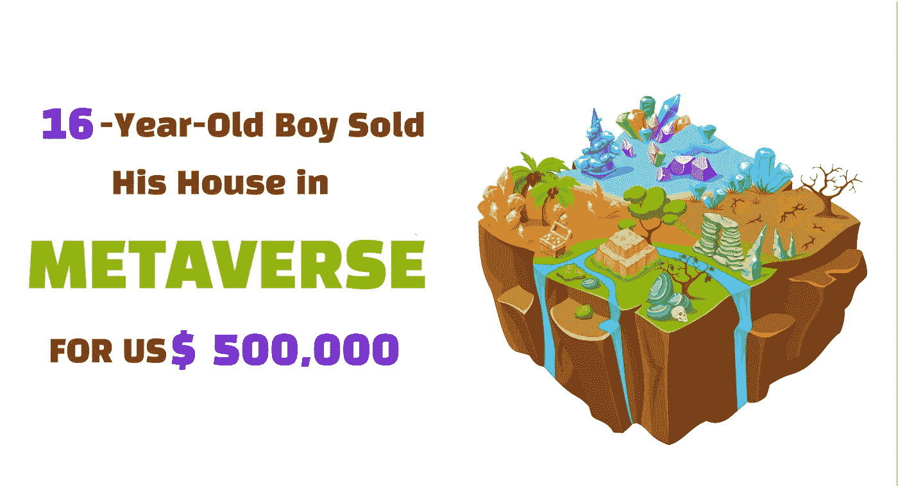

# 一名 16 岁的男孩以 50 万美元的价格卖掉了他在元宇宙的房子

> 原文：<https://medium.com/geekculture/a-16-year-old-boy-sold-his-house-in-metaverse-for-us-500-000-d09cf7652654?source=collection_archive---------4----------------------->

A 16-year-old boy sold his house in Metaverse for US$ 500,000

现在是 2022 年，如果你以前从未听说过 NFTs(不可替代的令牌)或加密货币，这可能会令人惊讶。不仅仅是很久以前，这些所谓的 Web3 世界的基本元素被设计来帮助人们过未来的生活。但是，正如我们将在下面看到的，情况并非如此。

 [## 16 岁的孩子卖了 50 万美元的虚拟房子

youtube.com](https://youtube.com/shorts/SbvOPqJMu3k?feature=share) 

这种预测可能已经实现了，因为最近网上人物丹尼尔·麦克(他谈论异国情调的汽车)的脸书病毒式卷轴，他从一辆车到另一辆车，问人们一个著名的问题，“你以什么为生？."

> [**创建自己的元宇宙**](https://bit.ly/3dChzFZ)

在上面的视频中，丹尼尔走向一辆迈凯轮 P1 1/20 Carbon 系列(估计价值 200 万到 300 万美元)的司机，问了一个著名的问题。一个坐在车里的 16 岁男孩(是的，他拥有这辆车)说，他在元宇宙 上出售“ [**虚拟房地产。”**](https://bit.ly/3dChzFZ)

当被问及他是否用从元宇宙交易中赚来的钱买了这辆车时，他简单地说了一句“是”，让观众大吃一惊。他还补充说，他最近以 50 万美元的价格出售了元宇宙一所虚拟房屋的 NFT，之后视频以丹尼尔·麦克感谢迈凯轮的主人结束。

虽然有些人仍然说任何与区块链有关的东西都是对人类的诅咒，但有这样的人可以改变公众对加密货币的看法。

元宇宙世界可以帮助这一事业，因为那些是人类未来将繁荣的地方，尽管是作为虚拟化身。我们永远不知道我们是否会成为电子人(半人半机器人)，然而，可以预测的是，在全球创新的帮助下，metaverses 上的 NFT 掌握着未来[**web 3 world ' s growth**](https://bit.ly/3dGmndy)的关键。