# 2021 年 CNN 网络架构改进指南:网络架构搜索

> 原文：<https://medium.com/geekculture/a-2021-guide-to-improving-cnns-network-architectures-network-architecture-search-815f01289aba?source=collection_archive---------17----------------------->

这将是我在上的第二篇文章，我的系列文章*是 2021 年改进 CNN 的指南。*

Photo by [Timothy Eberly](https://unsplash.com/@timothyeberly?utm_source=medium&utm_medium=referral) on [Unsplash](https://unsplash.com?utm_source=medium&utm_medium=referral)

手工制作的网络架构设计单调。这些都是次优的体系结构，并且经常停留在传统的设计范例中。更不用说手动设计特定于任务的架构需要付出巨大的努力。

网络体系结构搜索(NAS)使用各种技术使网络设计过程自动化。现代 NAS 的一个重要方法是强化学习(RL)。控制器通常学习优化模型(例如，FLOPS、推理时间)的验证精度和规模之间的平衡。平衡性能和规模的模型可以使用扩展技术进行扩展以提高性能。NAS 通常设计适用于各种模型缩放技术的可缩放候选模型和搜索空间。

尽管 NAS 通常非常笨重，训练起来也很昂贵，但是理解自动化的体系结构搜索方法对于 DL 的实际应用可能是一个重要的工具。

我们将回顾基于 RL 的 NAS 的搜索技术和一些重要作品的搜索空间。我们还将回顾一些模型缩放的标准指南。

*本帖介绍的论文选择部分受以下调查影响:*[*【1】*](https://arxiv.org/pdf/2006.02903.pdf)*[*【2】*](https://lilianweng.github.io/lil-log/2020/08/06/neural-architecture-search.html)*

# *搜索技术综述*

*   *随机搜索:随机搜索在一定程度上对于超参数搜索是有效的。它对 NAS 也是有效的，一些复杂的方法几乎无法击败精心设计的随机搜索技术。*
*   *强化学习:使用各种强化学习技术，如最近策略优化(PPO)来训练控制器网络。*
*   *进化搜索:基于遗传算法的搜索算法。*
*   *可微搜索:提出基于连续可微搜索空间的搜索。*

# *基于强化学习的 NAS*

## *具有强化学习的神经架构搜索[【链接】](https://arxiv.org/pdf/1611.01578.pdf)*

*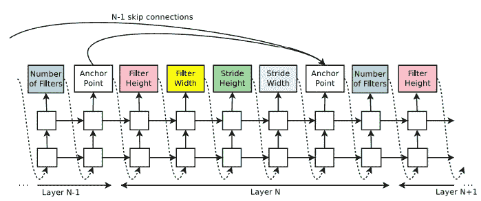*

*该模型由控制器网络配置，实现为两层 LSTM。控制器通过循环过程为每个卷积层逐一预测上述超参数。网络的层数由时间表严格控制。这意味着生成的网络的层数不是由控制器网络设置的。*

*通过强化优化了控制器网络的参数。网络超参数的每一次选择都被视为一个动作，奖励是网络在收敛时在验证数据集上的准确度。基于加强规则更新和近似策略梯度。通过分布式训练和异步参数更新来加速训练。*

*为了扩大搜索空间，控制器可以使用定位点来产生跳跃连接，如论文的 3.3 节中所提出的。然而，与新提出的方法相比，可用的搜索空间仍然非常小并且受到限制，因为搜索空间由非常普通的卷积配置组成。搜索空间的详细解释如下所述。*

*   *过滤高度从[1，3，5，7]*
*   *过滤器宽度从[1，3，5，7]*
*   *#来自[24，36，48，64]的过滤器*
*   *从[1，2，3]开始大步前进*

*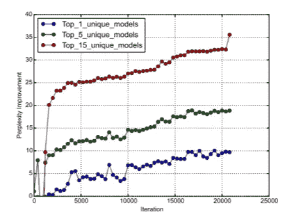*

*Improvement of Neural Architecture Search over random search over time(difference vs. random search)*

*尽管 NAS 的性能在培训期间有所提高，但与 ResNets 相比，这项工作中发现的网络并没有表现出明显的改进，并且落后于 DenseNets 的体系结构。*

## *学习可扩展图像识别的可转移架构(NASNet) [【链接】](https://arxiv.org/pdf/1707.07012.pdf)*

*本文将网络结构搜索作为进一步提高 CNN 性能的重要工具，并引起了对 NAS 进一步研究的关注。*

*   *建议在一个小数据集上搜索一个架构构建块，然后将该块转移到一个更大的数据集。*
*   *提出了一种新的、更好的搜索空间，命名为“NASNet 搜索空间”,用来搜索小区而不是整个网络。*
*   *建议调度路径正则化。*
*   *CIFAR-10 和 ImageNet 中的 SOTA“NASNet ”,采用转移架构。*
*   *考虑计算成本并提出可扩展的网络。*

> *然而，将 NAS 或任何其他搜索方法直接应用于大型数据集(如 ImageNet 数据集)在计算上是昂贵的。因此，我们建议在代理数据集上搜索一个好的架构，然后将学习到的架构转移到 ImageNet。*

*所提出的流水线搜索一个卷积块(或单元),并通过相同地重复所搜索的单元来组成网络。搜索最佳卷积架构的问题被简化为搜索最佳小区结构。这样，搜索过程更快，并且搜索到的网络可以推广到其他任务。由于像元搜索机制，NASNet 的复杂性与网络的深度和输入大小无关，因此这些值可以按比例放大用于更大的数据集。*

*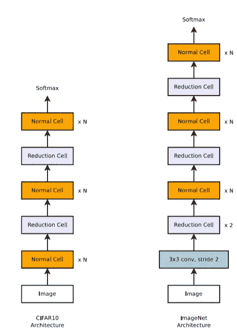*

*关于基于信元的搜索机制的更多细节，控制器搜索两种类型的卷积信元:正常信元和归约信元。当要素的大小一致且缩减采样因子为 2 时，使用每种方法。正常单元在缩减单元之前重复 N 次，其中 N 用于在计算成本和精度之间进行缩放。*

*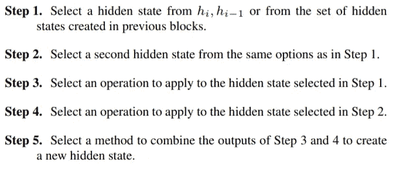**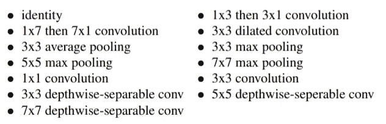*

*通过重复复杂的 5 步块 B 次来搜索该单元。一个模块将输入来自先前模块的 2 个状态，并用第二个图中描述的操作之一处理每个输入。这两个结果将通过元素相加或连接来组合。下图对此进行了描述。正如我们所看到的，搜索空间是非常广泛和多样的*

*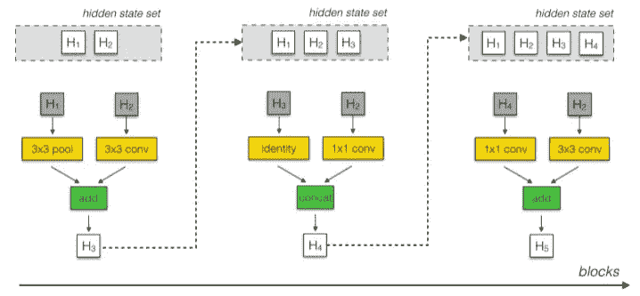*

*控制器预测块和单元的每种配置。因此，控制器 RNN 具有 2x5B 离散输出，其中第一个 5B 预测用于正常电池，第二个 5B 预测用于还原电池。*

*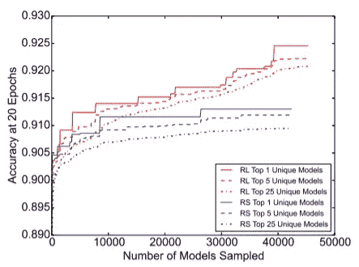*

*作者发现随机搜索比使用最近策略优化(PPO)的强化学习稍差。我们可以看到，性能的提高主要是由于手工制作的搜索空间，而不是 NAS 过程。NAS 需要一个更自由的搜索空间来实现 NAS 的进一步改进。*

> *虽然使用强化学习是有价值的，但差距比在[71]的原始工作中发现的要小。这个结果表明 NASNet 搜索空间是构造良好的，使得随机搜索可以相当好地执行，以及 2)随机搜索是难以超越的基线。*

## *MnasNet [【链接】](https://arxiv.org/abs/1807.11626)*

*点击[此处](/analytics-vidhya/an-overview-on-mnasnet-platform-aware-neural-architecture-search-for-mobile-8a681d17a80c)可获得这篇论文的更深入概述。简言之，报纸*

*   *将延迟作为培训目标*
*   *提出了“分解的层次搜索空间”,允许不同层之间的差异。*

*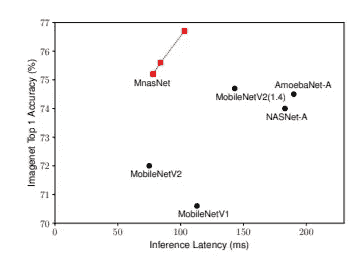*

*这项工作提出了一个混合训练目标的准确性和潜伏期。这是因为稍后可以通过缩放模型来权衡小延迟与准确性，并产生更好的帕累托曲线。奖励设计将使控制者对两个目标都有利。为了进一步改进，当在移动设备上执行时，延迟被直接测量为真实世界延迟，而不是替代测量(例如，FLOPS)。*

*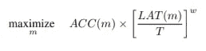*

*这项工作还提出了一个分解的层次搜索空间，它可以被视为 NAS-RL(第一篇论文)和 NASNet 之间的平衡。nasNet 共享由层中所有单元的各种块组成的相同单元结构，块中的所有层共享参数，而不同的块具有不同的层设计在 MNas net*(MNas 的块是 Nas 的单元，MNas 的层是 Nas 的块)*。*

*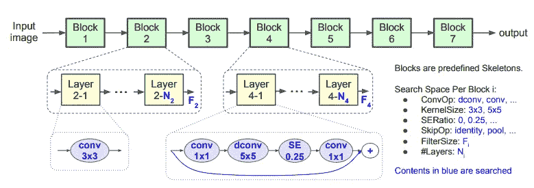*

*与基线 NNs 和以前的 NAS 网络相比，所提出的 MnasNet 实现了更好的准确性和显著更低的推理延迟。*

# *更多 NAS(非 RL)*

## *差异化架构搜索(DARTS) [【链接】](https://arxiv.org/pdf/1806.09055.pdf)*

*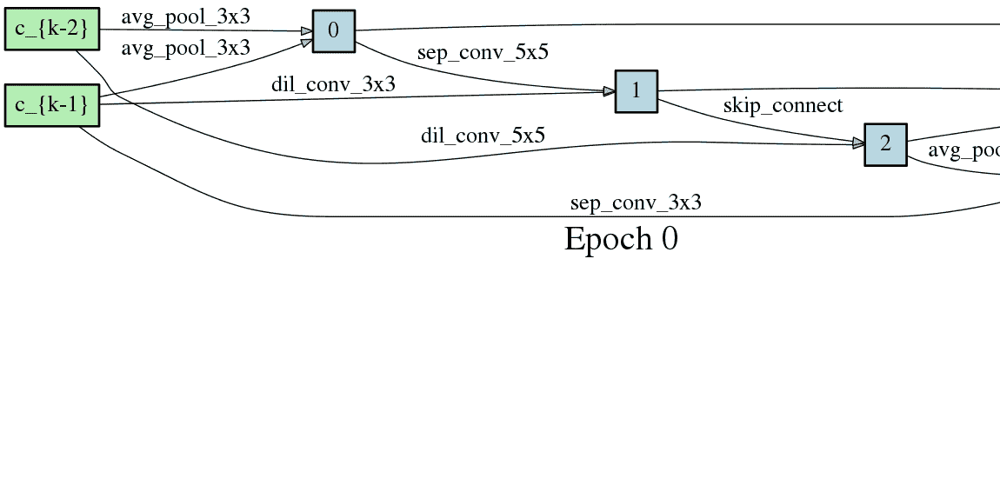*****

*Image from Official Github [Repository](https://github.com/quark0/darts)*

*与在离散且不可微的搜索空间上应用进化或强化学习的传统方法不同，DARTS 提出了允许应用梯度下降的连续架构搜索空间。与 RL 相比，基于梯度的方法的最大好处是基于 RL 的方法需要大量的计算成本，即使最近提出了一些建议(例如，NASNet-CIFAR10 需要 2000 GPU 天)。*

*与其他在连续空间中搜索架构的工作相比，DARTS 能够学习复杂的图形，而不是架构的特定方面。DARTS 实现了与先前基于进化/基于 RL 的 NAS 方法相当的测试误差，同时消耗少得多的计算资源。*

*与 NASNet 类似，作者搜索一个计算单元，并通过堆叠该单元来构建最终架构。一个单元被视为一个由 N 个节点组成的图。每个节点 x^(i)是一个特征映射，每个边是一些操作 o^(i，j)变换 x^(i)节点(例如卷积)并将其馈送给 x^(j).通常包含一个零操作来表示两个节点没有连接。每个节点预计有两个输入节点和一个输出节点，单元的输入是前两层的单元输出。每个中间节点都被计算为其所有前置节点的总和，如下式所示。*

*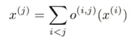**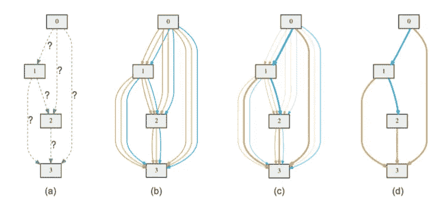*

*每个操作是从操作 O 的候选中选择的，并且为了使搜索空间连续，我们在所有可能的操作上将操作平滑到 softmax。这在图(c)和下面的等式中描述。架构搜索的任务是学习集合α，增加更好操作的概率。这是在用网络的规则权重进行训练期间与梯度下降一起学习的，但是基于验证损失。最后，通过用α上的 argmax 运算替换混合运算并选择一个最可能的运算，获得离散架构，如图(d)所示。*

***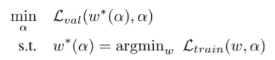*

*这种双层优化问题也出现在基于梯度的超参数优化中。作者暗示，飞镖中α的公式可以被视为一种具有更高维度的超参数。*

*o(或候选运算)的搜索空间被列为*

*   *3 × 3/5 × 5 可分离卷积*
*   *3 × 3/5 × 5 扩张卷积*
*   *3 × 3 最大池，3 × 3 平均池(步幅=1，因此形状不变)*
*   *身份*
*   *零*

*除了 DARTS 搜索空间，作者还提出了梯度的一阶近似，以减轻α的昂贵的优化过程，这将在本文的第 2.3 节中进一步描述。由于复杂性和数学背景，我们不会深入研究这种技术，尽管这种方法本身是直观的。*

*我觉得飞镖中对离散建筑的投射与 VQ-VAE 的背景有关。我把训练α解释为学习操作重要性的注意值的模型。*

## *更多阅读内容*

*   *渐进式神经架构搜索(PNAS) [【链接】](https://openaccess.thecvf.com/content_ECCV_2018/papers/Chenxi_Liu_Progressive_Neural_Architecture_ECCV_2018_paper.pdf)*
*   *通过参数共享进行有效的神经结构搜索[【链接】](http://proceedings.mlr.press/v80/pham18a/pham18a.pdf)*
*   *图像分类器结构搜索的正则化进化(进化算法)[【链接】](https://ojs.aaai.org/index.php/AAAI/article/download/4405/4283)*

# *扩展策略*

*人们发现，小型或大型网络可以通过增加或减少网络的深度、宽度和输入大小来权衡准确性和计算成本。CNN 经常使用小型原型进行开发和实验，然后扩大规模。特别是，通过 NAS 在小型数据集(例如 CIFAR10)中找到的体系结构可以扩展到更大的数据集。这样，就可以通过较少的繁琐 NAS 培训来发现高效的体系结构。有许多关于更好的权衡的缩放策略的著作。*

## *效率网[【链接】](https://arxiv.org/abs/1802.03268)*

*通过升级使用 MnasNet 策略建立的网络，可以获得高效的网络架构。作者建议同时缩放深度、宽度和分辨率。为了详细说明，*

> *例如，如果我们希望使用 2^N 倍的计算资源，那么我们可以简单地通过α^N 增加网络深度，通过β^N 增加宽度，通过γ^N 增加图像大小，其中α，β，γ是在原始小模型上通过小网格搜索确定的常系数。*

*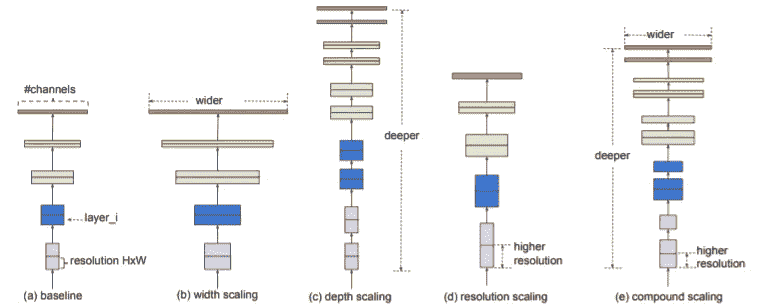**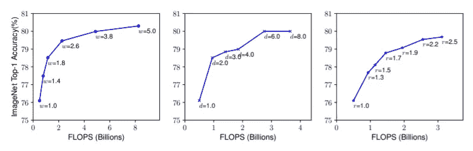*

*作者发现，增加所有三个因素一起比只增加其中一个更有效，并寻求这些因素之间的最佳比例。如上图所示，在网络中增加一个因素的好处是有限的。但是，当所有元素一起缩放时，效果会合成，如下图所示。不管网络的深度如何，将分辨率从 1.0 提高到 1.3 的好处仍然是相似的。*

*直观上，具有较大感受野的网络与高分辨率图像一起将是有效的，并且宽度也应该增加以在高分辨率空间中捕获更多的模式。网络深度、宽度和图像分辨率的增长将相互补充。将所有三个组件一起缩放称为复合缩放规则。*

*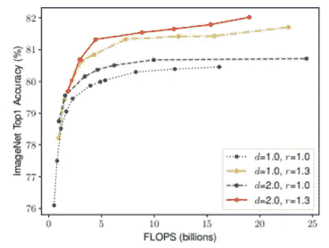*

*除了基于 MnasNet 的 SOTA 网络架构之外，所提出的缩放技术在缩放原始架构(MobileNet、ResNet)方面更好，而不仅仅是增加深度。这篇论文中有很多有趣的实验，我强烈推荐你读一读。*

## *重访 ResNets [【链接】](https://arxiv.org/abs/2103.07579)*

*这篇全新的论文对高效网络提出了许多见解，认为网络的训练策略可能比花哨的神经网络架构更重要，尽管这一点经常被低估。这个系列实际上是受这篇论文的启发。但是，我们将只关注本文的第 6 部分:改进的扩展策略。*

*简而言之，该文件认为*

*   ***FLOPs 与性能并不完全相关**:尽管之前的缩放工作观察到 FLOPs 与误差之间的一些关系，但精确的缩放配置(如深度、宽度、分辨率)会对相同数量的 FLOPs 的性能产生影响。下图证实了这一点。*

*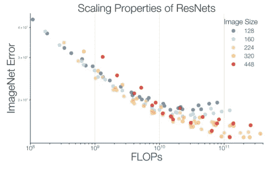*

*   ***最佳缩放策略取决于训练阶段**:根据实验，宽度缩放更容易过拟合。如下图所示，宽度缩放可能是一种更好的缩放策略，但在训练的后期，与深度缩放策略相比，宽度缩放策略明显过拟合。寻找更好的缩放策略必须在不从小规模阶段外推缩放策略的情况下进行(当训练少量时期时必须小心)。*

*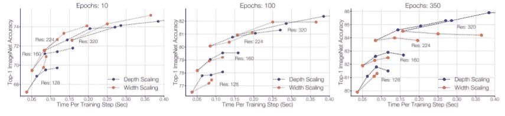*

*   ***必须降低图像分辨率比例**:作者观察到，图像分辨率越大，收益越小。因此，图像分辨率比以前的作品增加得更加缓慢。这与 EfficientNet 的复合缩放规则形成对比，但是在速度-精度的基础上提高了性能。*
*   ***以前的策略可能是从单个潜在的次优初始架构外推扩展策略:**次优初始架构可能会扭曲扩展结果。例如，复合比例规则源自围绕 EfficientNet-B0 的小网格搜索，可能不适用于其他模型/问题/解决方案。*

# *结论*

*我们概述了搜索神经网络结构的自动化方法。尽管在 NAS 上的一些工作确实显示了有竞争力的结果，但是这种方法消耗了大量的计算成本，并且对设计良好的搜索空间的需求使得搜索变得毫无意义。在 NAS 领域以及对有效扩展策略的理解方面，仍有很大的提升空间。*

*我将以这篇文章结束我们对网络架构的回顾。下一个系列的帖子将会是关于现代技术(除了架构)的，比如正则化技术和半监督学习。*