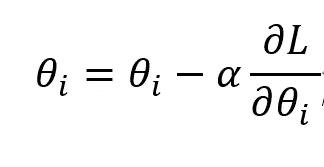
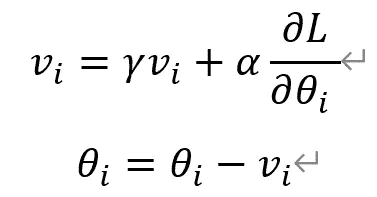
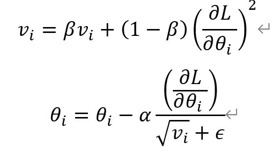
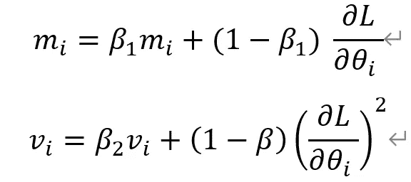
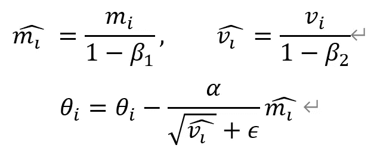
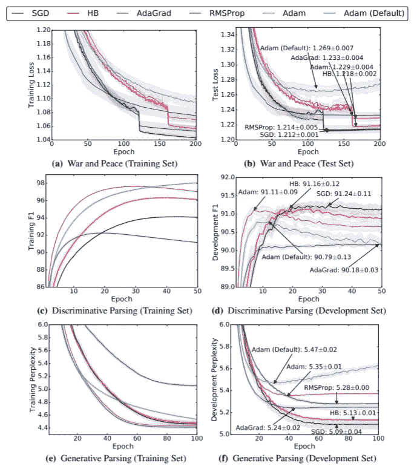
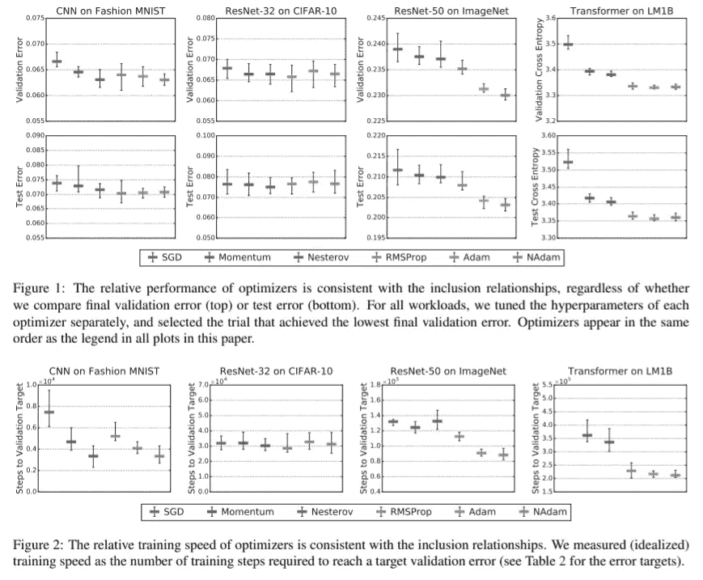

# 2021 年 CNN 优化指南:Adam vs SGD

> 原文：<https://medium.com/geekculture/a-2021-guide-to-improving-cnns-optimizers-adam-vs-sgd-495848ac6008?source=collection_archive---------0----------------------->

这将是我在上的第三篇文章，我的系列文章*是 2021 年改进 CNN 的指南。*

Photo by [Aaron Huber](https://unsplash.com/@aahubs?utm_source=medium&utm_medium=referral) on [Unsplash](https://unsplash.com?utm_source=medium&utm_medium=referral)

## 优化者

根据优化器的公式，优化器可以被解释为在给定梯度和附加信息的情况下修改网络权重的数学函数。优化器建立在梯度下降的思想上，这是一种贪婪的方法，通过跟随梯度来迭代地降低损失函数。

这种函数可以简单到从权重中减去梯度，也可以非常复杂。

更好的优化器主要集中在更快和更有效，但也经常比其他优化器概括得更好(更少过拟合)。**是的，优化器的选择可能会极大地影响模型的性能。**

我们将回顾常用的 Adam 优化器的组件。我们还将讨论关于 SGD 是否比基于 Adam 的优化器更通用的争论。最后，我们将回顾一些比较此类优化器性能的论文，并对优化器的选择做出结论。需要注意的一点是，设计能够提高实际收敛速度并能在各种设置下很好地推广的优化器是非常具有挑战性的。

# ~亚当

## 香草冰淇淋(新加坡元)

准确地说，随机梯度下降(SGD)是指批量为 1 时香草 GD 的特定情况。然而，为了方便起见，在本文中我们将所有的小批量 GD、SGD 和批量 GD 视为 SGD。

SGD 是 GD 的最基本形式。SGD 从权重中减去乘以学习率的梯度。尽管简单，SGD 有很强的理论基础，并且仍然被用于训练边缘神经网络。

## 动力

动量通常被称为滚下一个球，因为它在概念上等于增加速度。权重通过动量项进行修改，动量项计算为梯度的移动平均值。动量项γ可以看作是空气阻力或摩擦力，它成比例地衰减动量。动量加速了训练过程，但是增加了额外的超参数。

本质上，这个方程等于减去梯度的指数衰减平均值:θ-=α(di+d(I-1)γ+d(I-2)γ+d(I-3)γ+…)

## RMSProp

RMSProp 是未发表的作品，本质上类似于 momentum。如果梯度始终很大，v_i 的值将增加，学习速率将降低。这自适应地调整每个参数的学习率，并允许使用更大的学习率。

## 亚当[10]

Adam 本质上通过存储 RMSProp 的个体学习率和动量的加权平均值来组合 RMSProp 和动量。动量和 RMSProp 参数的计算公式如下。

在应用于梯度下降步骤中的权重之前，参数除以(1-衰减因子)。

如上式所示，Adam 基于 RMSProp，但将梯度作为动量参数进行估计，以提高训练速度。根据[10]中的实验，Adam 在本文中的各种训练设置和实验中优于所有其他方法。Adam 已经成为一种默认的优化算法，不管是什么领域。然而，Adam 引入了两个新的超参数，并使超参数调整问题变得复杂。

# SGD 更好？

关于优化器的一个有趣且占主导地位的论点是 SGD 比 Adam 更好地概括。这些论文认为，虽然 Adam 收敛得更快，但 SGD 比 Adam 概括得更好，从而导致最终性能的提高。

## SGD 的“稳定性”更好[12]

[12]认为，对于凸连续优化，SGD 在概念上是稳定的。首先，它认为最小化训练时间有利于减少泛化误差。这是因为该模型不会多次看到相同的数据，并且该模型在没有概括能力的情况下不能简单地记住数据。这似乎是一个合理的论点。

该论文提出将通过 SGD 学习的模型的训练误差和验证误差之间的差异作为泛化误差。如果训练误差对于单个训练数据点上的任何变化仅轻微变化，则算法是*一致稳定的*。模型的稳定性与泛化误差有关。本文给出了数学证明，证明了 SGD 对于强凸损失函数是一致稳定的，因而可能具有最优的推广误差。文章还表明，在迭代次数不太大的情况下，这些结果可以推广到非凸损失函数。

## 这种情况的例子(理论+经验)[9]

[9]提出了自适应优化方法(例如 RMSProp、Adam)在简单的过参数化实验中的问题，并提出了此类自适应优化策略的较差泛化性能的更多经验证据。它还表明，自适应和非自适应优化方法在理论上确实找到了具有非常不同的推广性质的非常不同的解决方案。

首先，讨论了观察到的*当一个问题有多个全局最小值时，不同的算法在从同一点*初始化时可以找到完全不同的解，并构建了一个理论示例，其中自适应梯度方法找到了比 SGD 更差的解。简而言之，在二元最小二乘分类损失任务中，包括 SGD 和动量的非自适应方法将收敛于最小范数解，而自适应方法可能发散。

论文还建议了四个使用深度学习的实证实验。论文提出，他们的实验显示了以下发现:

1.  自适应方法找到的解比非自适应方法找到的解概括得更差。
2.  即使当自适应方法比非自适应方法获得相同或更低的训练损失时，测试性能也更差。
3.  自适应方法通常在训练集上显示更快的初始进展，但是它们的性能在验证集上很快达到平稳。
4.  尽管传统观点认为 Adam 不需要调整，但我们发现调整 Adam 的初始学习速率和衰减方案在所有情况下都比默认设置有显著的改进。

Development Set is equal to the validation set.

这些论文证明了自适应优化在训练的初始阶段是快速的，但是通常不能推广到验证数据。这是非常有趣的，因为相对顺序在不同的情况下是不同的，而 SGD 在大多数情况下优于所有其他方法。

## 也许不是？[8]

最近的一篇论文表明，超参数可能是自适应优化算法无法推广的原因。当改变超参数搜索空间时,[8]中的实验显示了与上述论文不同的结果。

这实际上很有意义，因为更通用的优化器(例如 Adam)可以通过不同的超参数选择来逼近更简单的组件优化器(例如 Momentum、SGD、RMSProp ),因此不应该比其组件差。本文认为，用于提出 SGD 更好的经验证据的超参数搜索空间对于自适应方法来说过于浅薄和不公平。因此，实验是在相对较大的搜索空间上进行的(见[8]的附录 D)。

因此，微调的自适应优化器比标准 SGD 更快，并且在泛化性能方面并不落后。最优超参数的每个值都远离所有优化器的搜索空间边界，从而表明搜索空间是适当的。有趣的是，**优化器的最佳超参数在数据集之间变化很大。**

作者自信地说

> 特别是，我们发现流行的自适应梯度方法从来没有表现不佳的势头或梯度下降。

这篇论文的主要发现是，通过在深度学习的规模上调整所有可用的超参数，更一般的优化器永远不会低于它们的特例。特别是，他们观察到 RMSProp，Adam 和 NAdam 的表现从来没有低于 SGD，NESTEROV 或 Momentum。虽然存在一些限制，即实验是在一些潜在的混淆设置下进行的(例如，未调整批次大小，特定的调整方案)，但所述信息是令人警觉和感兴趣的。

目前，我们可以说微调的 Adam 总是比 SGD 好，但是在使用默认的超参数时，Adam 和 SGD 之间存在性能差距。

## 参考

[1] Loshchilov，I .，& Hutter，F. (2017)。去耦权重衰减正则化。 *arXiv 预印本 arXiv:1711.05101* 。

[2]杜奇、哈赞和辛格(2011 年)。在线学习和随机优化的自适应次梯度方法。*机器学习研究杂志*， *12* (7)。

[3]张，M. R .，卢卡斯，j .，辛顿，g .，&巴，J. (2019)。前瞻优化器:向前 k 步，向后 1 步。 *arXiv 预印本 arXiv:1907.08610* 。

[4]罗，李，熊，杨，刘，杨，孙，谢(2019).学习速率动态限制的自适应梯度方法。 *arXiv 预印本 arXiv:1902.09843* 。

[5]庄，j .，唐，t .，丁，y .，塔蒂孔达，s .，德沃内克，n .，帕帕德米特里斯，x .，&邓肯，J. S. (2020)。Adabelief 优化器:通过对观测梯度的信任来调整步长。 *arXiv 预印本 arXiv:2010.07468* 。

[6] Loshchilov，I .，& Hutter，F. (2016 年)。Sgdr:带有热重启的随机梯度下降。 *arXiv 预印本 arXiv:1608.03983* 。

[7]凯斯卡尔，N. S .，&索彻，R. (2017 年)。通过从 adam 切换到 sgd 来提高泛化性能。 *arXiv 预印本 arXiv:1712.07628* 。

[8]Choi d .、Shallue、C. J .、Nado z .、Lee j .、马迪森、C. J .、& Dahl、G. E. (2019 年)。深度学习优化器的实证比较。 *arXiv 预印本 arXiv:1910.05446* 。

[9]威尔逊、罗洛夫斯、斯特恩、斯雷布罗和雷希特(2017 年)。机器学习中自适应梯度方法的边际价值。 *arXiv 预印本 arXiv:1705.08292* 。

[10]金马博士和巴律师(2014 年)。亚当:一种随机优化方法。 *arXiv 预印本 arXiv:1412.6980* 。

[11]你，y，李，j .，Reddi，s .，Hseu，j .，Kumar，s .，Bhojanapalli，s，... & Hsieh，C. J. (2019)。深度学习大批量优化:76 分钟训练 bert。arXiv 预印本:1904.00962 。

[12]哈特，m .，雷希特，b .，辛格，Y. (2016 年 6 月)。训练更快，推广更好:随机梯度下降的稳定性。在*机器学习国际会议*(第 1225–1234 页)。PMLR。