# 2021 年 CNN 优化指南

> 原文：<https://medium.com/geekculture/a-2021-guide-to-improving-cnns-recent-optimizers-a340456f6b2d?source=collection_archive---------29----------------------->

这将是我在上的第四篇文章，我的系列文章*是 2021 年改进 CNN 的指南。*

Photo by [Erik Witsoe](https://unsplash.com/@ewitsoe?utm_source=medium&utm_medium=referral) on [Unsplash](https://unsplash.com?utm_source=medium&utm_medium=referral)

# 高级优化器(最新优化器)

在前一篇比较 Adam 和 SGD 的泛化能力的文章中，我们得出的结论是，由于 Adam 包含 SGD，在足够多的超参数搜索下，Adam 的表现肯定优于 SGD。

自 Adam 在 2014 年提出以来，一阶优化器有了许多突破，这可能有利于训练最佳实践 DL 模型。每个优化器都建立在独特的直觉上，可能会加快 DL 模型的训练时间。

优化器研究的范例得出结论，SGD 比 Adam 更通用，但 Adam 比 SGD 更快。许多优化器都建立在这种直觉的基础上，并结合了 Adam 和 SGD 的优点。然而，这样的论点受到了实验[8]的挑战。这个结果可能会挑战这些优化器的基本背景。

与其他方法相比，更好的优化器可能速度更快，并且对最终验证的准确性有很大的影响。我们将回顾这篇文章中提出的一些最重要的优化器。

## SWATS[7]

SWitches from Adam To Sgd 是一个优化器，当条件满足时，它会在训练期间从 Adam 切换到 Sgd。这是基于这样一个发现，即 SGD 在训练的后期概括得更好，但在训练的早期阶段比 Adam 更慢。

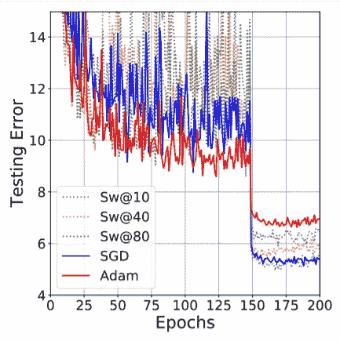

上图显示了在特定时期切换时训练 DenseNet 的结果。有趣的是，最后的误差被列为切换点。当下面的等式成立时，SWATS 建议从 Adam 转换到 SGD。该条件不会引入新的超参数，这是 SWATS 转换的一个优点。

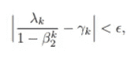

虽然 SWATS 在测试误差方面并不落后于 SGD，因此可以被视为一个合适的转换位置，但训练速度似乎并没有从亚当阶段中受益匪浅。也许混合这两种优化器的想法是没有用的。最重要的是，在训练的“中间阶段”, SWATS 的误差不会比两个主要优化器都好。

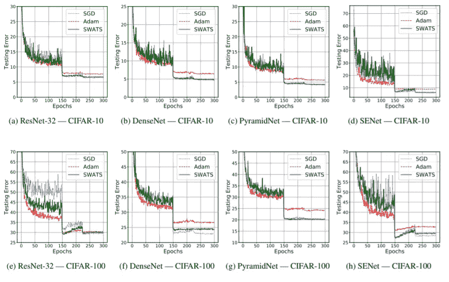

## Adabound[4]

Adabound 对学习速率采用动态限制，以实现从自适应方法到 SGD 的逐步过渡。这篇论文认为自适应方法的极端学习率(大的和小的)是有问题的。训练后获得的自适应学习率非常极端(例如，小于 10^-4，大于 10⁴)，如下图所示，该图显示了自适应学习率的对数。鉴于这种极端的适应性学习率，亚当可以表现出怪异的行为。

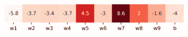

为了解决这个问题，Adabound 提出将自适应学习速率限制在某个阈值。当剪裁到 0 和 inf 时，Adam 可以被视为 Adabound 的特例。限幅参数被自适应地控制为 t 的函数，t 是被训练的时期的数量。准确地说，学习率被裁剪为下面的等式。论文还提出了亚当不收敛的证据。

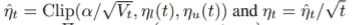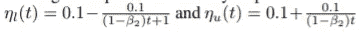

最终的优化器显示出比 Adam 更快的优化器，同时通过限制极端的学习速率而像 SGD 一样准确。训练的早期阶段类似于 Adam，而最终精度过渡到 SGD。实验结果如下图所示。Adabound 引入了许多新的超参数。

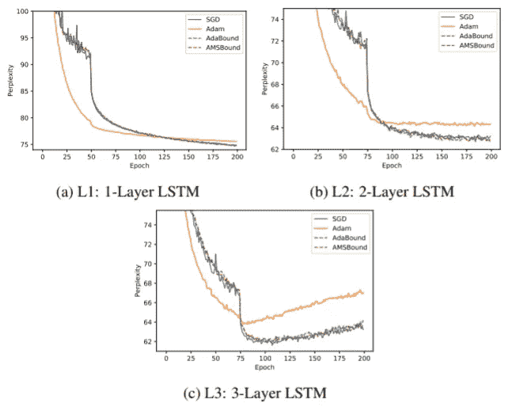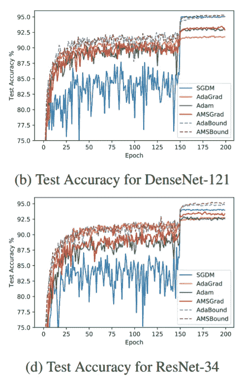

## 前瞻[3]

与以前的建议不同，以前的建议主要是改进 Adam 族方法，LookAhead 提出了一种完全不同的方法来加速优化。在朝着最终快速权重的方向更新“慢速权重”一次之前，前瞻使用两个优化器来首先更新“快速权重”k 次。这一过程将以可忽略的计算成本减少慢权重的方差。

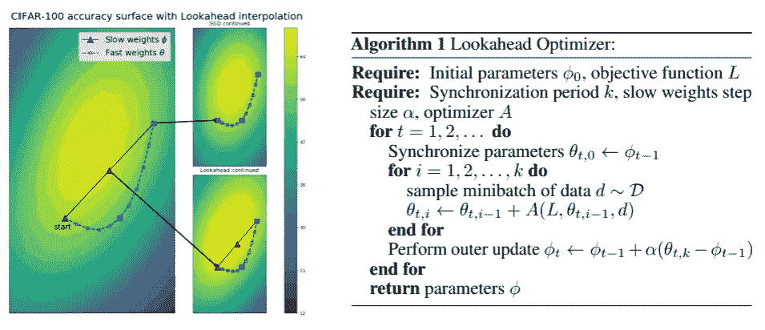

为了澄清，权重仅前进了前一状态与快速权重的最终权重之间的差的一部分α(θt，kφt 1)。根据该论文，我们可以受益于该方法的稳定性并使用更大的学习速率。

## 坚定的信念

AdaBelief 被提出来同时实现三个目标:如自适应方法中的快速收敛、如 SGD 中的良好泛化以及训练稳定性。AdaBelief 根据当前梯度方向上的“信念”来调整步长。将梯度的指数移动平均值(EMA)视为下一时间步的梯度预测值，如果观察到的梯度与预测值相差很大，优化程序会采取较小的步骤。

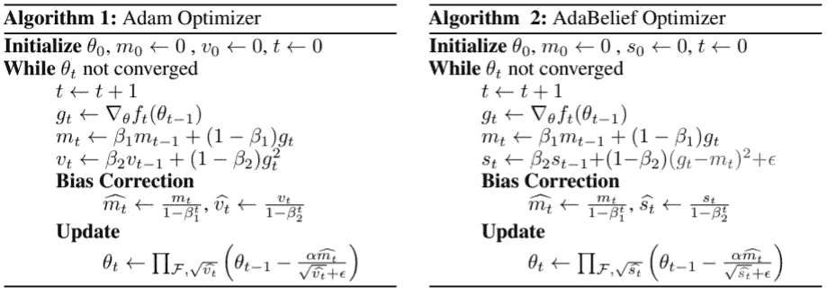

梯度的 EMA 实际上是 Adam 优化器中的动量项，直观地将动量值 m_t 视为梯度 g_t 的预测值，当预测值与真实值相似时((g_t-m_t)较小)，AdaBelief 迈出较大的一步，否则迈出较小的一步。

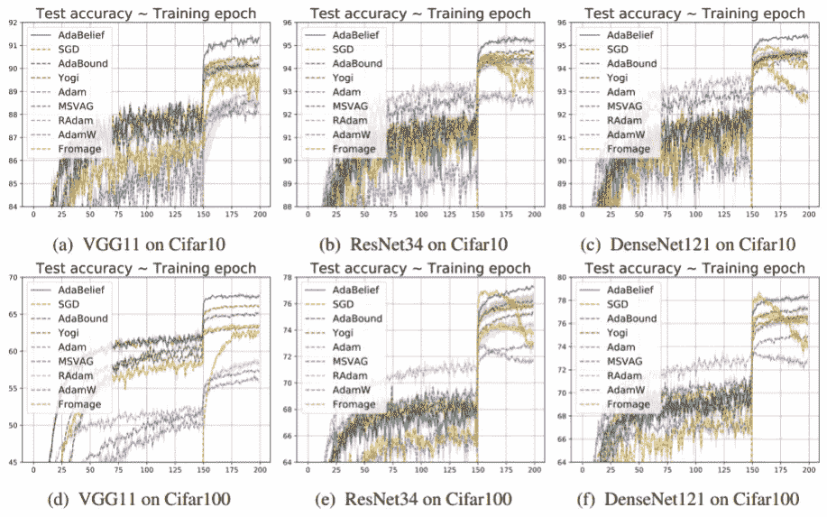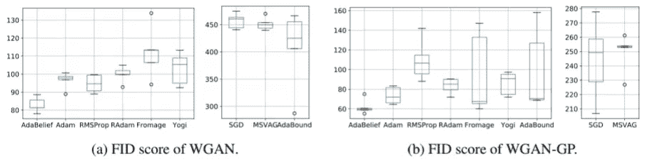

据观察，AdaBelief 具有以下效果:

*   自适应方法中的快速收敛。
*   良好或更好的概括，如在 SGD 家族中。
*   在 GANs 等复杂环境中训练稳定性。
*   没有从 Adam 引入新的超参数。

## 更多优化器

优化器的有效性可能高度依赖于训练配置和超参数，因此可能使用冗长的搜索过程找到现实任务中最佳的工作优化器。这种努力可能值得，也可能不值得，因为优化器的好处没有得到普遍认可，而且非常不清楚。然而，根据上述论文中的实验，优化器的选择似乎对泛化性能有很大的影响。

下面的库提供了本文中介绍的所有优化器的 PyTorch 实现，以及更多。

 [## jettify/py torch-优化器

### torch-optimizer —与 optim 模块兼容的 PyTorch 优化器集合。安装过程很简单…

github.com](https://github.com/jettify/pytorch-optimizer) 

# 学习率计划

学习率计划是指在训练过程中修改学习率以提高成绩的方法。我们通常在一定次数的迭代之后以一定的比率衰减学习率(步长衰减)，或者采用输出学习率的当前迭代的一些数值函数。

令人惊讶的是，高级学习率计划，尤其是我们即将讨论的余弦 LR 衰减对神经网络的性能有很大的影响。

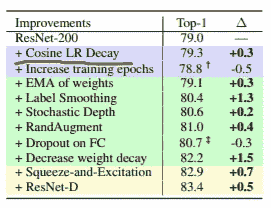

Image from [10]

## SGDR[6]

简而言之，SGDR 使用余弦退火来衰减学习速率，如下式所述。

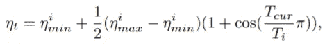

除了余弦退火之外，本文还在每个 T_i 周期使用模拟热重启，并在训练过程中逐渐增加。这是为了*对输入信息*进行去噪，因为梯度和损失值在不同批次的数据之间变化很大。

[这篇文章](https://towardsdatascience.com/https-medium-com-reina-wang-tw-stochastic-gradient-descent-with-restarts-5f511975163)描述了这种学习率重启背后的直觉。简而言之，学习率的激增理论上可以将模型推出糟糕的局部极小值。学习率时间表可以绘制如下图。

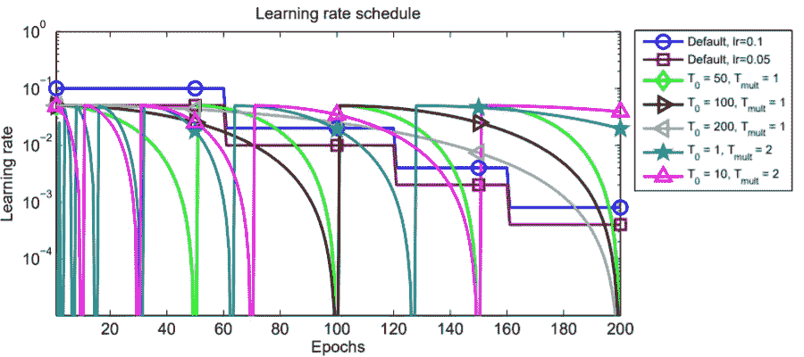

实验结果如下图所示。与 SGDR 学习率计划相比，阶梯学习率衰减(蓝色、红色)不稳定、缓慢，甚至最终表现更差。我们可以看到，热重启实际上显示了显著的速度提升，因为经常重启的深绿色和紫色调度显示了非常快的初始性能。

最重要的是，提出的 SGDR 能够将训练速度提高几个数量级。

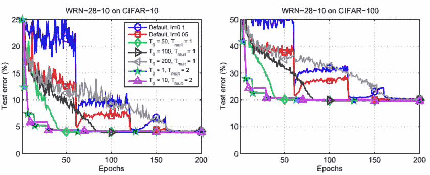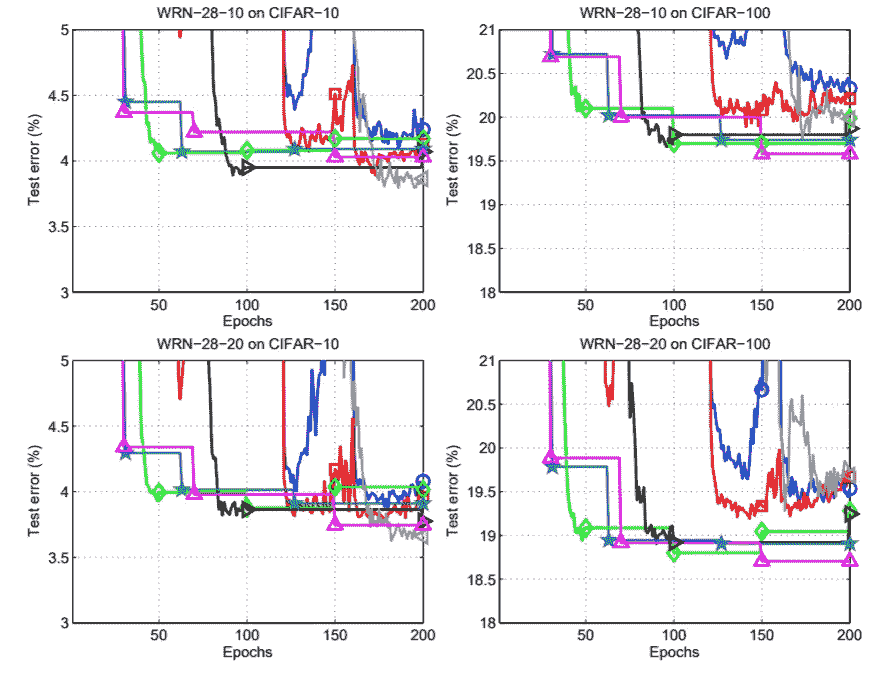

# 结论

在这篇文章中，我们回顾了一些现代优化的方法和背景。我们观察到，优化器的选择对训练速度和最终性能有重大影响。我们看到，新的 AdaBelief 在它所呈现的实验中胜过其他优化器。

然而，我不确定在没有进一步调整超参数的情况下，这种优越的性能是否可以推广到任何训练设置。因为尽管现代优化器具有潜在的准确性和速度增益，但是诸如 Adam 和 SGD 之类的经典优化器仍然很流行，所以这种优化器的一般应用仍然存在不确定性。

需要注意的一点是，大多数优化器都是建立在 SGD 比 Adam 等自适应方法更好的基础上的。然而，还不清楚这种说法是否正确，因为存在相反的结果[8]。SGD 和 Adam 之间的泛化性能这个话题在我的[上一篇文章中探讨过。](/geekculture/a-2021-guide-to-improving-cnns-optimizers-adam-vs-sgd-495848ac6008)

## 参考

[1] Loshchilov，I .，& Hutter，F. (2017)。去耦权重衰减正则化。 *arXiv 预印本 arXiv:1711.05101* 。

[2]杜奇、哈赞和辛格(2011 年)。在线学习和随机优化的自适应次梯度方法。*机器学习研究杂志*， *12* (7)。

[3]张，M. R .，卢卡斯，j .，辛顿，g .，&巴，J. (2019)。前瞻优化器:向前 k 步，向后 1 步。 *arXiv 预印本 arXiv:1907.08610* 。

[4]罗，李，熊，杨，刘，杨，孙，谢(2019).学习速率动态限制的自适应梯度方法。 *arXiv 预印本 arXiv:1902.09843* 。

[5]庄，j .，唐，t .，丁，y .，塔蒂孔达，s .，德沃内克，n .，帕帕德米特里斯，x .，&邓肯，J. S. (2020)。Adabelief 优化器:通过对观测梯度的信任来调整步长。 *arXiv 预印本 arXiv:2010.07468* 。

[6] Loshchilov，I .，& Hutter，F. (2016 年)。Sgdr:带有热重启的随机梯度下降。 *arXiv 预印本 arXiv:1608.03983* 。

[7]凯斯卡尔，N. S .，&索彻，R. (2017 年)。通过从 adam 切换到 sgd 来提高泛化性能。 *arXiv 预印本 arXiv:1712.07628* 。

[8]Choi d .、Shallue、C. J .、Nado z .、Lee j .、马迪森、C. J .、& Dahl、G. E. (2019 年)。深度学习优化器的实证比较。 *arXiv 预印本 arXiv:1910.05446* 。

[9]威尔逊、罗洛夫斯、斯特恩、斯雷布罗和雷希特(2017 年)。机器学习中自适应梯度方法的边际价值。arXiv 预印本 arXiv:1705.08292 。

[10] Bello，I .、Fedus，w .、Du，x .、Cubuk，E. D .、Srinivas，a .、Lin，T. Y .、… & Zoph，B. (2021 年)。改进的训练和扩展策略。 *arXiv 预印本 arXiv:2103.07579* 。

[11]你，y，李，j .，Reddi，s .，Hseu，j .，Kumar，s .，Bhojanapalli，s，... & Hsieh，C. J. (2019)。深度学习大批量优化:76 分钟训练 bert。 *arXiv 预印本 arXiv:1904.00962* 。

[12]哈特，m .，雷希特，b .，辛格，Y. (2016 年 6 月)。训练更快，推广更好:随机梯度下降的稳定性。在*机器学习国际会议*(第 1225–1234 页)。PMLR。

[13] Reddi，s .，Zaheer，m .，Sachan，d .，Kale，s .，和 Kumar，S. (2018 年)。非凸优化的自适应方法。在*第 32 届神经信息处理系统会议录(NIPS 2018)* 中。