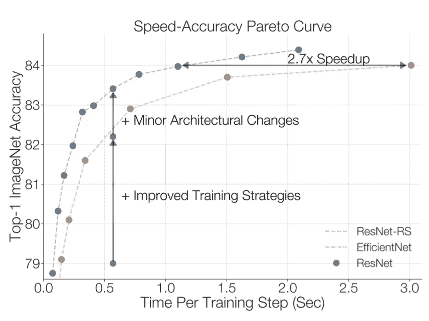
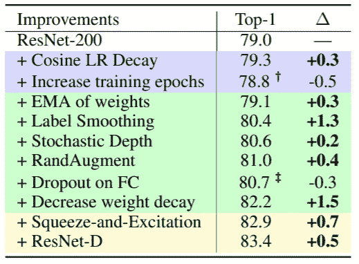
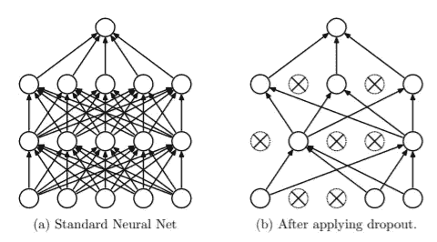
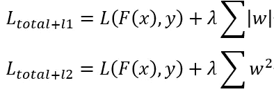
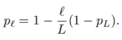
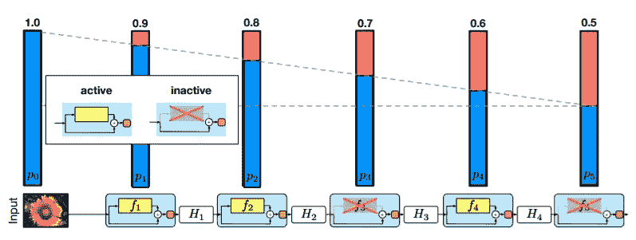
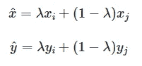
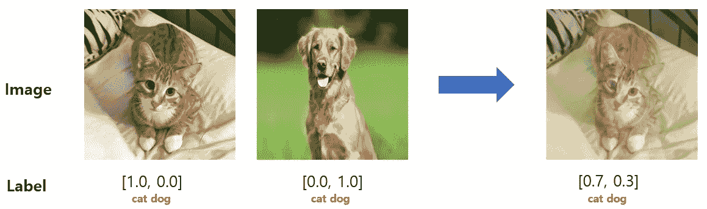

# 2021 年 CNN 培训策略改进指南:培训方法与规范化

> 原文：<https://medium.com/geekculture/a-2021-guide-to-improving-cnns-training-strategies-training-methodology-regularization-b4af696f854d?source=collection_archive---------13----------------------->

这将是我在上的第五篇文章，我的系列文章*是 2021 年改进 CNN 的指南。*

Photo by [Aaron Huber](https://unsplash.com/@aahubs?utm_source=medium&utm_medium=referral) on [Unsplash](https://unsplash.com?utm_source=medium&utm_medium=referral)

## 培训战略的影响

正则化等训练技术是打破深度学习网络极限的关键。尽管与网络体系结构相比，它们在研究论文中通常不太受重视，但现代网络中的很大一部分改进是由于改进了训练技术，包括正则化技术。

例如，一篇全新的论文[1]表明，通过现代培训策略，传统的 ResNets 可以改进为优于 EfficientNet。结果表明，这样的训练策略对于成功的深度学习系统至关重要。通过新架构获得的性能收益通常与改进的培训策略相混淆。

我们将回顾一些流行的深度学习现代训练策略的细节，并看看它们如何提高性能或执行正则化。本帖介绍的方法多在[1]和[2]中提出。下图显示了训练技术对 ResNet 模型影响的消融研究。

Table 1

## 优化者

优化器可以被定义为在给定梯度的情况下修改参数以最佳地最小化损失函数的函数。一些经典的优化器包括 SGD、Momentum、RMSProp 和 Adam。也有很多相对较新的优化，如阿达格拉德，阿达信仰。在之前的文章中，我们回顾并比较了优化器的速度和泛化性能。

更好的优化器可以显著提高速度和性能。

## 学习率衰减

包括 SGDR 在内的学习率计划会对训练速度和最终准确性产生显著影响。SGDR 通常被称为*余弦学习率衰减*。

优化器和 SGDR 在我之前关于现代优化器的文章中解释过。

# 正规化

深度学习中的正则化是通过对训练数据进行训练，使深度学习模型能够推广到每个数据的过程或技术。它被测量为在训练数据中测量的损失和在验证数据中测量的损失之间的差异。

## 辍学[2]

在训练中，辍学者会随机丢弃 NN 中的单位。该过程旨在通过防止单元过度共同适应来解决过度适应问题。

如上图所述，辍学指的是在神经网络中放弃单元。当删除一个单元时，输出连接被设置为 0。使用为每层定义的固定概率 p 来丢弃每个单元。我们不会在测试时间上减少任何权重，因为这将接近所有可能模型的平均值。

在实践中，Dropout 表现出很好的性能，通常比表 1 所示的权重衰减正则化要好。可以以各种方式将分出应用于网络的任何层(例如，conv 层中的信道式分出)，但是对于实际的 CNN，大多数情况下只在最终的全连接层中使用。

## 重量衰减/重量尺寸损失(L1/L2 标准化)

重量衰减和重量尺寸惩罚都具有防止 NNs 中的大重量的相同目标。当权重变大时，权重将使训练数据过拟合，验证数据的微小变化可能会使模型的预测产生很大差异。这种对输入的微小变化的强烈依赖是过度适应的。

权重衰减将每个权重乘以模型的衰减因子λ(0

[https://towardsdatascience.com/weight-decay-l2-regularization-90a9e17713cd](https://towardsdatascience.com/weight-decay-l2-regularization-90a9e17713cd)

Whereas, weight size penalty methods such as L1 or L2 normalization appends an additional term to the loss to make the model favor smaller weights. L1 normalization is when we add the weights and L2 normalization's absolute values when we add the square of the weights to the loss.

L2 normalization does the same effect to the weights as weight decay when using an SGD optimizer. The weight penalty method is known as a classical tool to reduce overfitting in machine learning.

## Label smoothing[3, 4]

Label smoothing is applied to classification problems using the cross-entropy loss. By using label smoothing, the training objective of predicting either 0 or 1 changes to predicting either α/(c-1) or (1-α) where c denotes the number of classes.

The calibration of a model is when the prediction represents the probability of the class accurately, instead of just becoming larger to minimize the error. Label smoothing prevents overconfidence(e.g. predicting confidence of 0.9999999) which can harm the *校准*。[3]表明标注平滑有助于更好地聚类和概括中间层的表示。

这个简单的技巧可以给模型性能带来意想不到的好处。

## 随机深度〔5〕

随机深度训练短网络，并在测试时使用深度网络进行正则化。在从初始网络开始之后，随机丢弃层的子集，并用身份函数替换。我经常将随机深度称为 ResNets 中的逐层丢弃。

使用生存概率来丢弃每一层，生存概率被定义为该层的指数 l 的线性函数。早期的层(小 l)将可靠地存在，而后面的层(大 l)更频繁地被替换为相同操作。

随机深度减少了训练时间和过拟合，类似于辍学。

## 提前停止

早期停止是当模型开始过度拟合时(当验证损失增加时)停止训练的技术。当模型的正则化较弱时，早期停止特别有用，因为过度拟合会彻底发生。我们可以在表 1 中观察到，当正则化不充分时，较长的训练过拟合。

在实践中，建议不要使用早期停止，而是加强正则化，因为早期停止不会带来性能提升。

## 数据扩充

> 数据分析中的数据扩充是用于增加数据量的技术，通过添加已有数据的稍微修改的副本或从现有数据新创建的合成数据。它充当正则化器，有助于在训练机器学习模型时减少过拟合。——[维基百科](https://en.wikipedia.org/wiki/Data_augmentation)

不同类型的数据(例如图像、信号/语音、文本)有不同的数据扩充技术。图像增强技术包括随机操作，例如

*   种植
*   变焦
*   轻弹
*   旋转
*   翻译
*   调整大小
*   对比/配色方案

数据扩充技术通常用于间接增加数据的数量，这增加了神经网络的泛化能力。数据扩充对提高模型正则化的影响是相当直观的。

## 随机增强/自动增强

这种方法提出随机搜索和强化学习来搜索最佳工作数据扩充算法。有些方法实际上是不可行的(自动增强需要 15，000 个 GPU 小时)，但预先训练的增强功能可以普遍应用于您的工作以提高性能，或者可以进行相对可行的搜索(例如 RandAugment)。

## 混合正则化[6]

Mixup 是一种数据扩充技术，它从训练数据中生成随机图像对的加权组合。给定两个图像及其标签，通过线性插值将两个图像和标签混合来生成合成图像。比例因子是从贝塔分布中取样的。

[https://paperswithcode.com/method/mixup](https://paperswithcode.com/method/mixup)

[https://crazyoscarchang.github.io/2020/09/27/revisiting-mixup/](https://crazyoscarchang.github.io/2020/09/27/revisiting-mixup/)

Mixup 旨在减少过度拟合并增加对对立样本的鲁棒性。研究还表明，混合可以减少对抗训练中的不稳定性。混合正则化也直接改进了模型的校准。

然而，Mixup 仅限于涉及类别分类的特定任务范围，或者至少在应用于不太明显的任务时需要改进，如对象检测、回归，甚至无监督/半监督设置。我也很好奇在 Mixup 中混合 3+图片是否可用，是否有用。

# 结论

在这篇文章中，我们回顾了通过防止过度拟合来提高深度神经网络性能的各种技术。正如[1]中所讨论的，训练技术对深度学习的最终性能有非常大的影响。通过利用本文和本系列中讨论的许多技术，我们将能够将深度学习的性能提升到一个新的水平。

# 参考

[1]贝洛，I .、费杜斯，w .、杜，x .、库布克，E. D .、斯里尼瓦斯，a .、林，T. Y .、… &佐夫，B. (2021)。改进的训练和扩展策略。 *arXiv 预印本 arXiv:2103.07579* 。

[2]n . Srivastava，h . hint on，g . Krizhevsky，a .，Sutskever，I .，& Salakhutdinov，R. (2014 年)。辍学:防止神经网络过度拟合的简单方法。*《机器学习研究杂志》*， *15* (1)，1929–1958。

[3]米勒、科恩布利思和辛顿(2019 年)。标注平滑何时有帮助？。 *arXiv 预印本 arXiv:1906.02629* 。

[4]佩雷拉，g .塔克，g .乔洛夫斯基，j .凯泽，，& Hinton，G. (2017)。通过惩罚置信输出分布来调整神经网络。 *arXiv 预印本 arXiv:1701.06548* 。

[5]黄，g，孙，y，刘，z，Sedra，d .，，温伯格，K. Q. (2016 年 10 月)。具有随机深度的深度网络。在*欧洲计算机视觉会议*(第 646–661 页)。斯普林格，查姆。

[6]张，h .，西塞，m .，多芬，Y. N .，&洛佩斯-帕兹，D. (2017)。混淆:超越经验风险最小化。 *arXiv 预印本 arXiv:1710.09412* 。