# 改进 CNN 的 2021 指南——弱监督:半监督学习

> 原文：<https://medium.com/geekculture/a-2021-guide-to-improving-cnns-weak-supervision-semi-supervised-learning-6191816dcb5d?source=collection_archive---------23----------------------->

这将是我在《T2 2021 年 CNN 改进指南》上的第六篇也是最后一篇文章。

Photo by [Chris Lawton](https://unsplash.com/@chrislawton?utm_source=medium&utm_medium=referral) on [Unsplash](https://unsplash.com?utm_source=medium&utm_medium=referral)

## 半监督学习

半监督学习(SSL)处理这样的情况，其中很少标记的训练样本与大量*未标记的*样本一起可用。尽管有违直觉，但 SSL 不仅在小数据集上，而且在 ImageNet 上也显示出显著的性能提升。

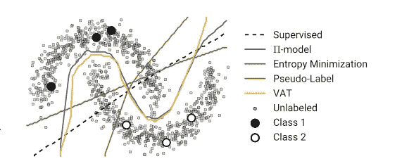

上面关于流行的双月数据集的图表提供了半监督学习的概述。给定 6 个数据点和未标记数据的分布，算法必须尽最大努力推广到可能是真实的数据分布。

[1]将 SSL 方法分为以下几类:

*   一致性正则化
*   代理标记方法
*   生成模型
*   基于图形的方法

在本帖中，我们将回顾 SSL 的一些最基本和最强大的概念和方法，以及这些方法的直觉。这个帖子的顺序和内容是基于调查论文[1]的。由于 SSL 是一个非常受欢迎的话题，有许多不同的变体，所以我们将只对每种方法进行简短的探讨。我们必须注意到，对于提高深度学习的性能来说，它可能是一个有用的*欺骗*。

## SSL 的假设

SSL 算法仅基于对数据的某些假设而工作，并基于对数据的以下假设而开发。如果没有这样的假设，就不可能从一个有限的训练集推广到一组可能无限多的看不见的测试用例。这些假设是:

*   **聚类假设:**如果点在同一个聚类中，那么它们*可能*属于同一个类。
*   **平滑度假设**:如果两个输入属于同一类，属于同一簇，那么它们对应的输出*需要*接近。相反，如果这两个点是分开的，则输出必定彼此远离。
*   **流形假设:**(高维)数据(大致)位于低维流形上。高维空间中的距离(例如图像中的像素差异)与类别类型无关。但是，我们可以使用这个假设找到一个低维表示，并使用未标记的数据。

# 一致性正则化

基于*聚类假设，*如果对未标记的数据点进行小的修改，预测应该不会发生显著变化。使用一致性正则化技术，我们训练一个模型，为相似的数据点提供一致的预测。具体地，给定一个未标记的数据点 x，以及它的修改版本 x̂，并且模型是 f，目标是最小化 d( f( x)，f( x ̂)).一些流行的距离度量是 MSE，KL 散度，JS 散度。

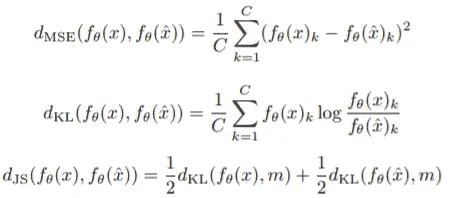

## 梯形网络[2]

该网络由 3 个网络组成:编码器、噪声编码器和解码器。在每次迭代中，输入被提供给两个编码器。高斯噪声被注入到噪声编码器的每一层。这将给出两个预测，干净的预测 y 和损坏的预测ỹ.ỹ被馈送到解码器中以重构 y 和来自ỹ.的干净编码器的激活

无监督损失被测量为每层的干净编码器和解码器的激活之间的 MSE。这种一致性正则化方法在编码器中使用高斯噪声来生成修改版本的 x̂。当测量无监督损失时，数据 x 不需要标签。

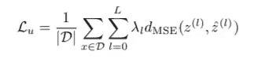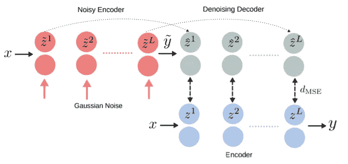

梯形网络的一个问题是计算量大，因为需要三次转发。在以下主题中，我们将解释梯形模型的许多变体。一种变型是，γ模型简单地比较 y 和ỹ，以降低解码器的计算成本。

## π模型，时间集合[3]

梯形网络的另一种变体，π模型[3]通过移除损坏的编码器并对损坏的和普通的输入使用相同的网络，进一步简化了框架。这样，π模型可以利用数据增加或减少作为*噪声源*，而不是在网络中插入高斯噪声。

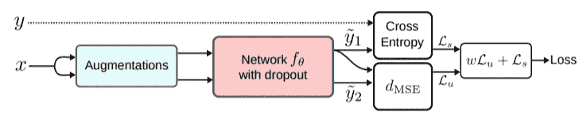

然而，目标 *y* 值在训练期间快速变化，这降低了训练的效率和稳定性。因此，作者建议稳定目标 y 值。通过将 y 计算为先前预测的集合，提出了时间集合来实现这一点。准确地说，目标 y 将通过指数移动平均线(EMA)累积，如下式所示。

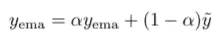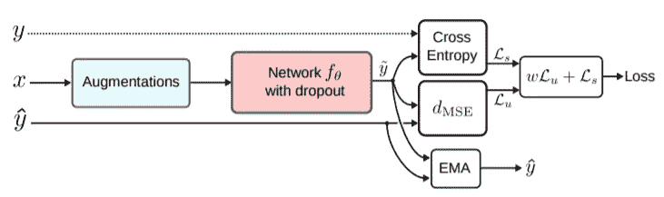

这样，每次迭代只需要一次向前传递，并且变得更加稳定。但是这需要保持所有训练样本的均线值。

对于大型数据集，新学习的信息应用缓慢，因为每个目标每个时期更新一次，并且一个时期的跨度非常长。重要的是，目标的均线经常会对数据进行错误分类。如果无监督的损失大于有监督的损失，模型将在受到轻微惩罚的同时不断做出错误的预测，这导致了*确认偏差*。

## 刻薄的老师[4]

Mean Teacher[4]是为了更快地整合学习到的信号，并避免确认偏差而提出的。教师模型的权重计算为先前状态的加权平均值，如下式所示。平均教师方法可以解释为π模型，它使用教师模型进行目标预测。

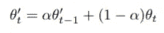

## 双学生[5]

使用 Mean Teacher 的一个问题是，随着大量的训练迭代，教师模型会收敛到学生模型，它打算解决的初始问题会继续。在双学生中，将同时训练两个*不同*重量的学生模型，其中一个将为另一个提供目标。每个模型都在以下条件下进行稳定性测试。

*   清洁和修改的预测是相似的:f(x) ~ f(x̃)
*   两个预测都很有把握:f(x)，f(x̃)>ε

除了监督和非监督的损失，我们强迫其中一个学生根据他们的稳定性做出与对手相似的预测。只有当两个模型都是*稳定的*时，相对不太稳定的模型才使用额外的双学生损失进行训练。

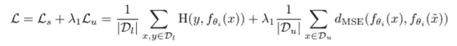

Supervised+Unsupervised loss

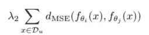

Additional dual student loss

使用这个简单的技巧，DualStudents (DS)可以从 Mean Teacher(MT)方法中获得很大的性能提升，如下表所示。

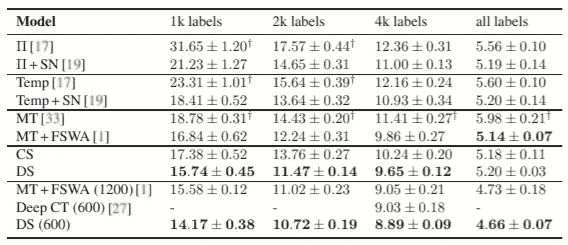

## 插值一致性训练(ICT)〔7〕

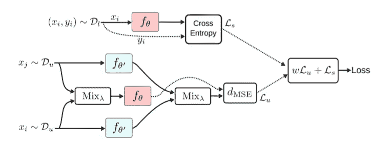

ICP 建议将混合作为随机修改，并将无监督损失作为混合图像的预测和两个独立图像的预测的混合输出之间的差异来测量。

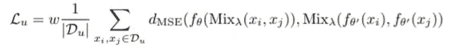

## 虚拟对抗训练(VAT) [6]

源自梯形网络的方法将随机变换应用于输入，并鼓励模型具有与未标记数据及其修改版本相似的输出。

然而，随机扰动在高维中可能是低效的，因为只有一小部分修改会有效地将模型推出决策边界，并提供有意义的反馈。为了加强修改的鲁棒性，一些方法提出在*对抗方向*上进行修改，这将最大化模型预测的变化*。*

VAT 希望每个数据点周围的输出分布同样平滑。增值税的*对抗方向*的测量方式将*最大程度地改变模型的预测*。

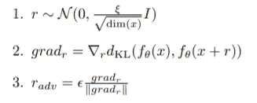

首先，采样与输入 x 维数相同的高斯噪声 r。接下来，测量关于损失的梯度，该梯度测量对 x 和(x+r)的预测之间的差异。最终的对抗性修改 r_adv 通过归一化和缩放梯度来实现。

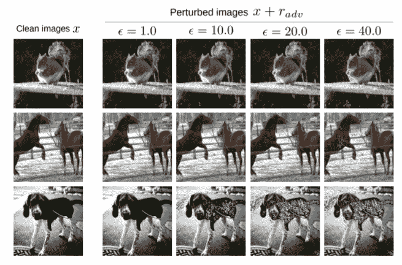

最后，我们将获得的对抗性修改应用于图像，并测量无监督损失。一个缺点是寻找敌对方向需要其自身的向前传递，并且所需的计算增加，使得这种方法不那么吸引人。

提出了更多使用不同类型的数据扩充和随机化推断的一致性正则化方法。

# 代理标记方法

代理标记方法使用一些特定的方法在未标记的数据上生成合成的代理标记，通常涉及预测本身或其他监督。这些带有代理标签的数据与原始标签数据一起用作目标。这些方法主要基于两个分支:自我训练和多视角学习。

## 自我训练

首先根据标记的数据训练初始模型。在自训练中，训练的模型本身被用于将标签分配给未标记的数据点。不同方法之间的细节有所不同，但是通常，当置信度足够大时，将(x，argmax f(x))的未标记数据对添加到标记集。重复这个用标记集训练模型，然后向标记集添加可信伪标记的过程。

模型通常在最后阶段根据正确标记的数据进行精细训练[8]。学生-教师模型也用于生成代理标签。

这种方法的一个显而易见的问题是，该模型通常不能纠正有偏见的和错误的分类，并且可以自信地做出错误的代理标签。

## 伪标记

类似于自训练，基于伪标记的方法为未标记的数据生成代理标记。最初，伪标注天真地将数据标注为概率最高的类。

## 转导 SSL[9]

直推式 SSL[9]提出将未标记示例的标签视为变量，并尝试利用它们的损失函数来学习最优标签以及模型参数。

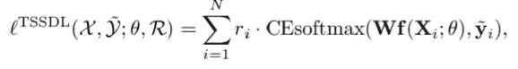

这里，r_i 是样本 X_i 的置信水平，并且是基于人口密集区域中的样本更可能被分配正确标签的假设自洽地计算的。

众所周知，朴素伪标记具有确认偏差，会产生不正确的标记。根据[10]，混合正则化在减轻这种偏差方面是有效的。

## 元伪标签(MPL)〔11〕

MPL 使用学生-教师设置。教师模型负责生成代理标签，并受学生模型反馈的指导。准确的说，老师先生成目标标签，学生在生成的标签上训练。然后，教师用策略梯度(PPO)训练学生的确认损失。

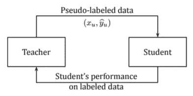

## 整体方法[12]

SSL 中的整体方法结合了主流方法，并设计了一个可以实现更好性能的框架。诸如 MixMatch、ReMixMatch 和 FixMatch 之类的整体方法基于一致性正则化和代理标记的直觉，并设计了一种改进的方法来组合这些方法。

FixMatch[12]管道是最近的一个重要方法，它结合了一致性正则化和伪标记，如下图所示。对于带标签的示例，使用提供的目标。对于未标记的示例，模型对弱增强图像的预测被用作代理标签，而强增强图像用代理标签来训练。

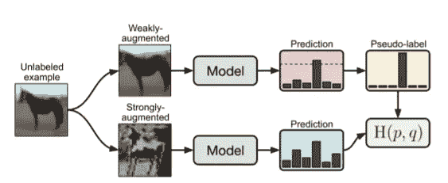

# 生成模型

诸如 GANs、自动编码器之类的生成模型可以用来增强分类器的鲁棒性。因为大多数生成模型可以用未标记的数据来训练，所以我们可以将 SSL 用于生成模型。这种生成模型以各种方式结合到训练过程中。

## 自动编码器/可变自动编码器(VAE)

M1 模型直接在模型中使用 VAEs，首先使用标记和未标记的图像预训练自动编码器，并对潜在变换 z 而不是输入图像 x 执行分类

M2 模型在 M1 模型的训练中使用标签。如果类别标签不可用，y 将被视为潜在变量 z 之外的潜在变量。然而，我并不真正理解 M2 模型的概念。

## 生成对抗网络

GAN 框架可以通过多种方式集成到 SSL 中。例如，分类器可以通过在鉴别器之后添加完全连接的层来利用鉴别器特征，作为迁移学习方法。这种从鉴别器到分类器的迁移学习是主要的方法。

然而，这种将鉴别器集成到分类器的通用方法具有局限性，因为与例如 VAEs 相比，特征表示不够丰富。这使得 GAN 对于 SSL 来说不是一个有吸引力的选择。然而，我们可以使用特定的 GAN 框架，如甘比，它具有将数据映射到潜在表示的编码器网络。

# 基于图形的方法

在基于图的 SSL 方法中，每个数据点 x，包括标记的和未标记的，都被表示为图中的一个节点。连接每对节点的边反映了它们的相似性。但是，图表的具体特征可能会有所不同。对于在 SSL 设置中对数据之间的关系进行建模，图是一种强大的结构。

## 标签传播

标签传播中的主要假设是同一流形中的数据点很可能共享同一标签。总之，标签传播根据数据流形结构和图的边相似性将已标记数据点的标签传播到未标记数据点。

传播指的是标签被分配给图中的节点并沿着图的边传播到连接的节点的迭代性质。从标有已知标签的节点 1、2、…、l 和标有 0 的节点 l + 1、…、n 开始，每个节点开始*向其邻居传播*其标签，并且重复该过程直到收敛。

使用图形来测量数据接近度以应用 SSL 的其他方法

*   图形嵌入
*   图形神经网络

我不得不诚实地说，基于图形的 SSL 方法并不直观(至少对我来说是这样)，我也不太了解这些方法。有关基于图形的 SLL 的更多信息，您可以查看调查[1]和调查参考资料。

# 结论

总结半监督学习，一致性正则化是基于这样的假设，即模型应该为相似的数据输出相似的预测。因此，基于*梯形模型*的方法对未标记的数据进行随机修改，并期望预测是一致的。确认偏差是指模型不断地做出错误的预测，同时受到无监督损失的轻微惩罚。为了解决这个问题，提出了“平均教师法”。还提出了对抗而不是随机修改的方法来加速学习有用的信息。

代理标记方法使用诸如伪学习的自我训练方法，为未标记的数据提供合成标记。还提出了改进的方法，如使用师生设置的元伪学习。

SSL 还可以利用用标记和未标记数据训练的生成模型的丰富功能来训练用于迁移学习的鉴别器，或者使用在自动编码器中训练的模型。基于图的 SSL 方法将数据空间建模为图，并应用图搜索技术和距离度量来执行 SSL。

# 参考

[1]纽约州奥阿利市、加利福尼亚州赫德洛特市和塔米市(2020 年)。深度半监督学习综述。 *arXiv 预印本 arXiv:2006.05278* 。

[2]拉斯穆斯、瓦尔波拉、洪卡拉、贝里隆德和莱科(2015 年)。梯形网络的半监督学习。 *arXiv 预印本 arXiv:1507.02672* 。

[3]萨穆利·莱恩和蒂莫·艾拉。半监督学习的时态集成。arXiv 预印本 arXiv:1610.02242，2016。

[4] Antti Tarvainen 和 Harri Valpola。平均教师是更好的榜样:加权平均一致性目标提高半监督深度学习结果。《神经信息处理系统进展》，第 1195-1204 页，2017 年。

[5]柯志忠，王，丁，严，秦，任，刘瑞伟(2019)。双重学生:在半监督学习中打破老师的限制。在*IEEE/CVF 计算机视觉国际会议论文集*(第 6728–6736 页)。

[6]t . miya to，Maeda，S. I .，Koyama，m .，& Ishii，S. (2018 年)。虚拟对抗训练:监督和半监督学习的正则化方法。 *IEEE 模式分析与机器智能汇刊*， *41* (8)，1979–1993。

[7]维尔马，v .，川口，k .，兰姆，a .，坎纳拉，j .，本吉奥，y .，洛佩斯-帕斯，D. (2019)。半监督学习的插值一致性训练。 *arXiv 预印本 arXiv:1903.03825* 。

[8] Yalniz，I. Z .，Jégou，h .，Chen，k .，Paluri，m .，和 Mahajan，D. (2019 年)。用于图像分类的亿级半监督学习。 *arXiv 预印本 arXiv:1905.00546* 。

[9]石文伟，龚玉英，丁春春，陶正明，郑，倪(2018)。使用最小-最大特征的直推式半监督深度学习。在*欧洲计算机视觉会议(ECCV)* (第 299–315 页)的会议记录中。

10 埃里克·阿拉索、迭戈·奥尔特戈、保罗·艾伯特、诺埃尔·奥康纳和凯文·麦克吉尼斯。深度半监督学习中的伪标记和确认偏差。arXiv 预印本 arXiv:1908.02983，2019。

[11] Hieu Pham，Qizhe Xie，Zihang Dai 和 Quoc V Le .元伪标签。arXiv 预印本:2003.10580，2020

[12] Kihyuk Sohn，David，，Zhang，Nicholas Carlini，Ekin D Cubuk，Alex Kurakin，和 Colin Raffel。Fixmatch:简化具有一致性和置信度的半监督学习。arXiv 预印本 arXiv:2001.07685，2020。

[13]Durk P . Kingma、Shakir Mohamed、Danilo Jimenez Rezende 和 Max Welling。具有深度生成模型的半监督学习。《神经信息处理系统进展》,第 3581–3589 页，2014 年。

[14]x .zhuѓ和 z .ghahramaniѓн(2002 年)。利用标签传播从有标签和无标签数据中学习。GTX 560 Ti