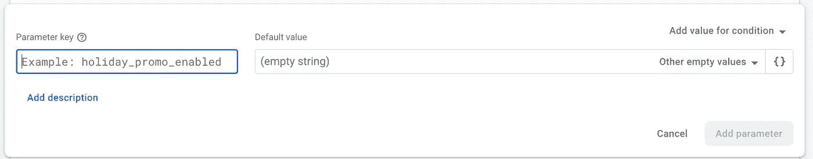
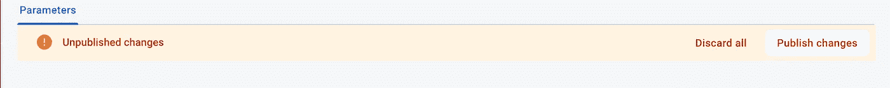
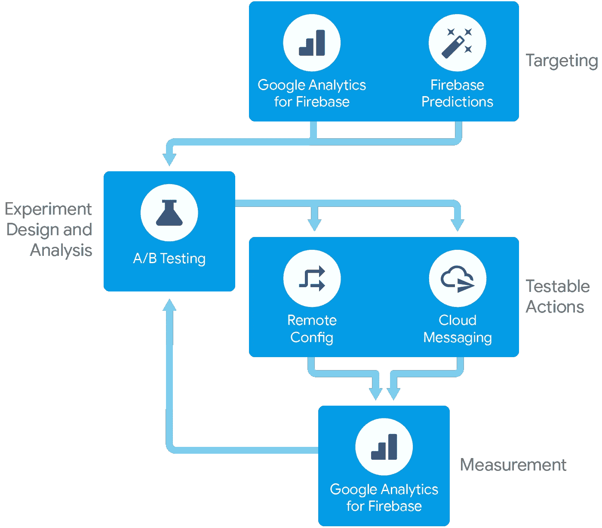
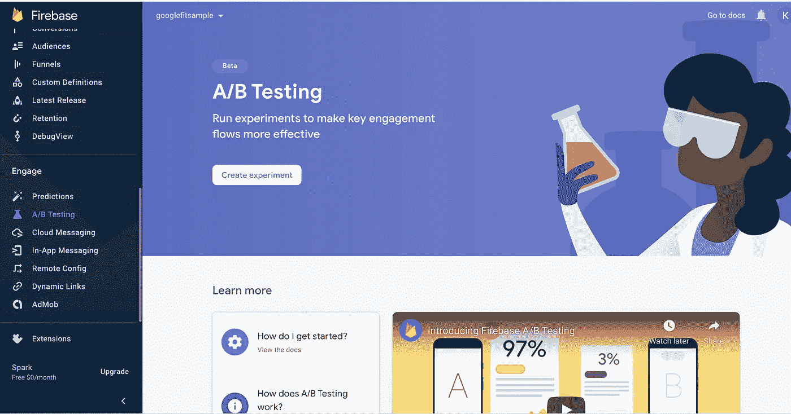
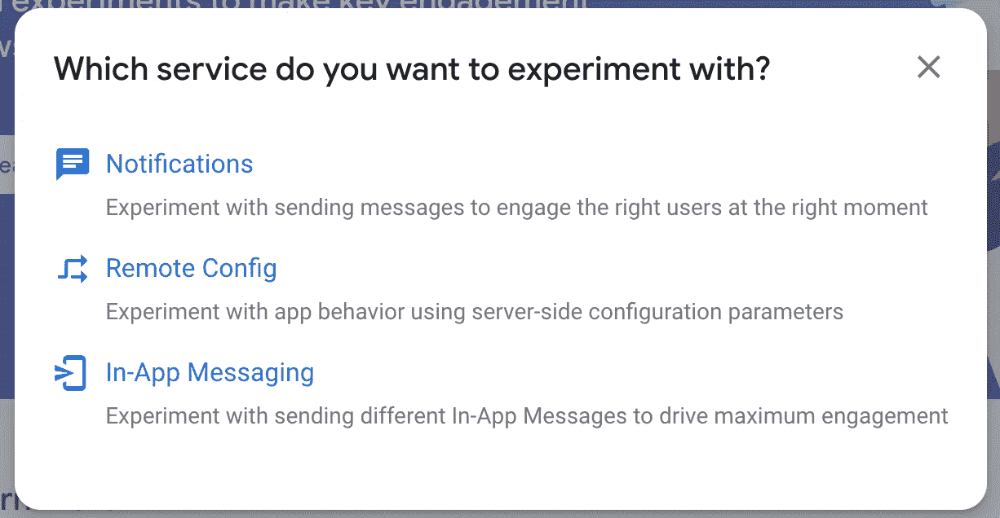
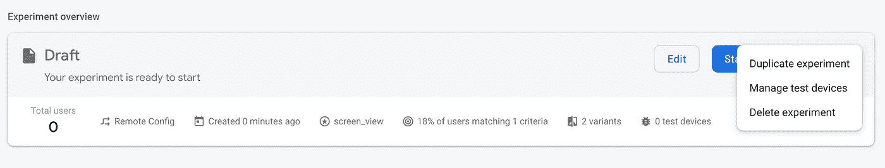
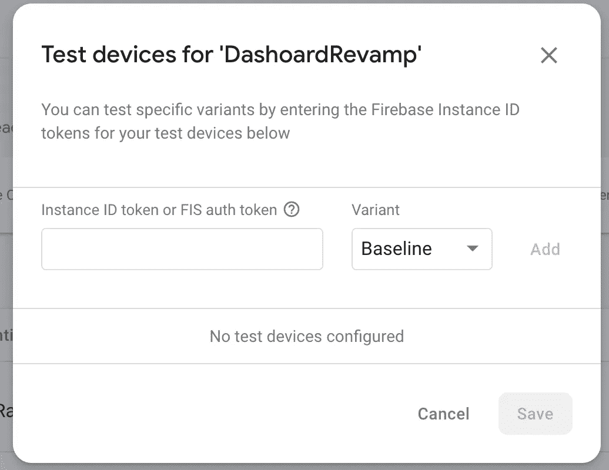
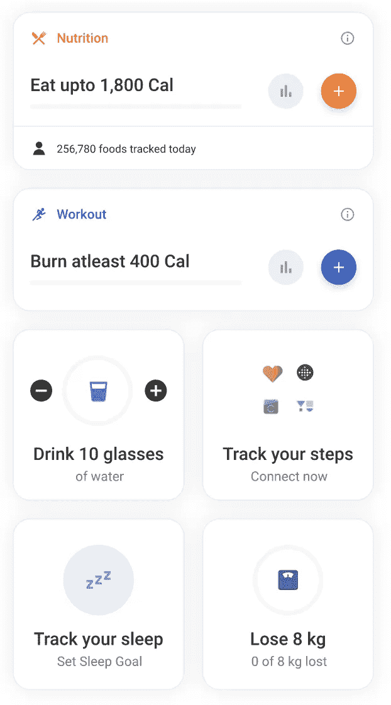
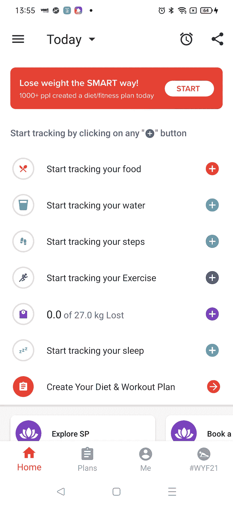
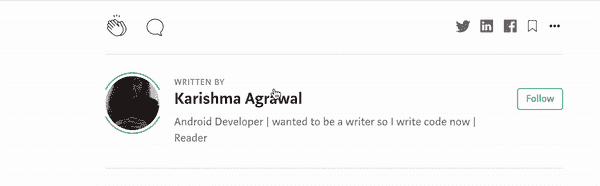

# Android 中的 A/B 测试

> 原文：<https://medium.com/geekculture/a-b-testing-in-android-66bef033d809?source=collection_archive---------5----------------------->

顾名思义，A 或 B 都可以。A/B 测试是一种通过在用户子集上测试功能来改进应用的方法。


Photo by [Luke Chesser](https://unsplash.com/@lukechesser?utm_source=unsplash&utm_medium=referral&utm_content=creditCopyText) on [Unsplash](https://unsplash.com/s/photos/users?utm_source=unsplash&utm_medium=referral&utm_content=creditCopyText)

# 这是什么？

我们用一个例子来理解一下。假设您正在开发一个应用程序，需要在仪表板上进行一些更改。你的旧仪表板有一个非常旧的用户界面，你想用一些材料设计和一些非常酷的动画来改变它。现在，在不知道用户对新仪表板的反馈的情况下，你不想冒险改变一切。为此，我们可以向一部分用户展示我们的新仪表板，而向其余用户展示旧仪表板。一旦你在新的仪表板上得到一些好的反馈，你就可以把你所有的用户切换到新的仪表板上。如果你的新仪表板对用户的影响不是很大，你可以在不影响很多用户的情况下改进它。

# 关键能力

*   测试并改善您的产品体验
*   通过使用通知编辑器，找到重新吸引用户的方法
*   安全推出新功能
*   目标“预测”用户群

# 怎么做？

选择合适的 A/B 测试平台，这里我们将使用 **Firebase 远程配置。**

# Firebase 远程配置

Firebase Remote config 是一个云服务，可以让你改变应用程序的行为，而无需重新安装构建。使用远程配置时，您可以在应用程序中创建一个具有默认值的变量，该变量保持应用程序的行为和外观。现在，当你想改变这种行为时，你可以用远程配置覆盖应用程序中的默认值，你的应用程序将按照你想要的方式运行。这样你就可以随时更新你的应用，而对性能的影响可以忽略不计。

**关键能力**

*   快速推出
*   您可以使用远程配置，根据应用版本为不同的用户群提供不同的应用用户体验
*   A/B 测试

# **如何集成远程配置？**

**步骤 1:** 在 firebase 控制台上创建一个项目。

**第二步:**下载`google-services.json`文件到你的`app`文件夹。

**第三步:**在`app/build.gradle`文件中添加一些依赖关系

```
implementation platform('com.google.firebase:firebase-bom:28.2.1')
implementation 'com.google.firebase:firebase-config-ktx'
implementation 'com.google.firebase:firebase-analytics-ktx'
```

**步骤 4:** 在项目级 build.gradle 文件中添加 google 服务依赖

```
classpath 'com.google.gms:google-services:4.3.8'
```

**步骤 5:** 获取远程配置单例对象

```
remoteConfig = Firebase.*remoteConfig* val configSettings = *remoteConfigSettings* **{** *minimumFetchIntervalInSeconds* = 3600
**}** remoteConfig.setConfigSettingsAsync(configSettings)
```

**步骤 6:** 在应用程序中远程配置对象的默认值您可以在远程配置对象中设置应用程序内的默认参数值，以便您的应用程序在连接到远程配置后端之前按照预期运行，并且如果后端没有设置默认值，则默认值可用。

```
remoteConfig.setDefaultsAsync(R.xml.*remote_config_defaults*)
```

**步骤 7 :** 在远程配置后端设置参数值


要在 firebase 服务器中添加远程配置对象，打开 firebase 控制台，在左边你会看到 engage 下的远程配置，点击它，你会看到一个类似上面的页面。点击此处的添加参数按钮。您将看到如下屏幕。



添加与默认配置 XML 文件中相同的参数键。点击添加参数按钮并发布更改。



**第八步:**取值并激活值

完成了，干得好，伙计们，你们成功了。但是还没有完成。现在来说说我们是怎么做 A/B 测试的。

# **创建带有 A/B 测试的 Firebase 远程配置实验**



[https://firebase.google.com/docs/ab-testing](https://firebase.google.com/docs/ab-testing)

**第一步:**创建一个实验



在 firebase 控制台上从左侧选择 A/B 测试选项卡。现在点击创建实验按钮。你会看到一个如下的弹出窗口，点击远程配置。



你会看到一个如下的窗口，有 4 个部分-基本，目标，目标，变量。


*   在基础中，添加您的实验名称和描述。
*   在 Target 中，你可以为这个实验选择你的观众，比如你想为哪个国家的用户展示，然后为新版本或旧版本，为哪种语言等等。然后你可以选择你想展示你的实验的用户的百分比。


*   从下拉列表中选择一个内置目标(参与度、购买量、收入、保留率等)。)、分析转换事件和其他分析事件。完成后，点击下一个的**。**
*   在**变量**部分，您将选择一个对照组和至少一个实验变量。使用**选择或创建新的**列表添加一个或多个试验参数。您可以创建一个以前没有在 Firebase 控制台中使用过的参数，但它必须存在于您的应用程序中才能生效。您可以重复此步骤，向您的实验添加多个参数。
    要向您的实验添加多个变量，点击**添加另一个变量**。

点击**查看**保存您的实验。

**步骤 2:** 在测试设备上验证您的实验
对于每个 Firebase 安装，您可以检索与之相关的安装授权令牌。您可以使用这个令牌在安装了应用程序的测试设备上测试特定的实验变量。

*   获取安装授权令牌，如下所示:

```
FirebaseInstallations.getInstance().getToken(/* forceRefresh */ true)
    .addOnCompleteListener { task ->
        if (task.isSuccessful) {
            Log.d("Installations", "Installation auth token: " + task.result?.token)
        } else {
            Log.e("Installations", "Unable to get Installation auth token")
        }
    }
```

*   从控制台进入 A/B 测试选项卡，进入草稿，单击 3 点菜单，然后单击管理测试设备。



*   输入您在上面收到的身份验证 id。



*   运行应用程序，确认测试设备正在接收所选变体。

你可以从这里了解更多:

[](https://firebase.google.com/docs/ab-testing/abtest-config) [## 使用 A/B 测试创建 Firebase 远程配置实验

### 当您正在更新您的应用程序并使用 Firebase Remote Config 将它推送到一个拥有活跃用户群的应用程序时…

firebase.google.com](https://firebase.google.com/docs/ab-testing/abtest-config) 

在 Healthifyme，我们几乎对每个功能都使用 A/B 测试。最近我们更换了仪表板。



New Dashboard , Old dashboard

现在，因为我们正在做一个大的改变，我们应该能够恢复它，如果它不去好，我们想知道我们的用户反馈。所以我们为将近 25，000 名用户推出了它。结果如下:

**可发现性**

*   第一个食物轨迹——试验组为 46%,对照组为 41%
*   入职后的水迹——测试组为 39%,对照组为 34%
*   入职后连接步骤跟踪器— 9.5%对 6%

**滞留**

*   应用发布 D3 留存率: **31.60%对 26%**
*   追踪器上的 D3 保留率:32%对 27.7%；D7 保留率:24%对对照组的 18%

**订婚**

*   每个用户的平均跟踪事件:测试组为 14.5，而对照组为 12.5

这对我们的实验来说是一个很好的胜利，我们可以向更多的用户推广它。

我们没有必要将这些用于收入等会产生重大影响的变化。我们也可以对任何像文本改变一样小的事情这样做，并且独立地知道它们的影响。

有时候，当你看不到一项实验对你的应用和用户的巨大影响时，它就会发生，但这是你学习的一条途径。有些东西并不总是一无所有。

# 资源

[](https://firebase.google.com/) [## 重火力点

### 在 Google IO 2021 大会上，从初创公司到全球企业，我们得到了 Google 的支持和应用开发团队的喜爱…

firebase.google.com](https://firebase.google.com/) 

希望这对你接下来的发展有所帮助。

如果您有任何反馈，请给我回信，地址是*karishma.agr1996@gmail.com。非常感谢你的鼓掌帮助其他人找到这篇文章😃。*

