# Linux 命令的基本指南

> 原文：<https://medium.com/geekculture/a-basic-guide-to-linux-commands-1e493055b634?source=collection_archive---------26----------------------->


## 本教程我们需要的是

*   最新的 Windows(如果你安装了 ubuntu，跳到命令部分)
*   WSL 或 WSL2
*   从 Windows 商店安装的 Ubuntu 子系统。

## 在 Windows 上安装 WSL

要在 Windows 上安装 WSL(Windows Subsystem for Linux ),您需要确保您运行的是最新版本的 Windows。

通过使用管理员权限打开`powershell`并键入以下命令来安装 WSL。

```
dism.exe /online /enable-feature /featurename:Microsoft-Windows-Subsystem-Linux /all /norestart
```

此命令将在 Windows 上启用 WSL 功能。您现在可以重新启动系统并跳过下一步。

## 升级到 WSL2

在本教程中，我们将安装 WSL2，因此需要额外的步骤。

要启用 WSL2，您需要通过在具有管理员权限的`powershell`窗口中键入该命令来启用另一个功能。

```
dism.exe /online /enable-feature /featurename:VirtualMachinePlatform /all /norestart
```

**启用该功能后，重启系统。**


现在从这个链接下载 wsl2 包，[从这里下载](https://wslstorestorage.blob.core.windows.net/wslblob/wsl_update_x64.msi)并安装。

现在，让我们使用管理员权限在`powershell`中输入这个命令，将 wsl 默认版本设置为 2。

```
wsl --set-default-version 2
```

现在 WSL2 已经安装在我们的系统上了。

## 安装 Linux 发行版

在本教程中，我将安装 **Ubuntu** (你也可以安装其他 linux)。去微软商店下载 **Ubuntu** 。

我还准备安装**Windows terminal**。您也可以从 Windows 应用商店下载。


下载后，启动它。它将要求创建一个新用户。

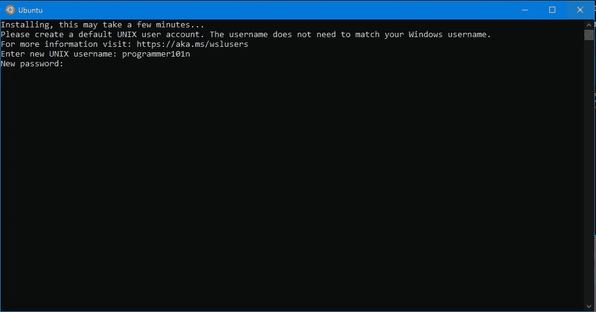

现在你已经成功地在 Windows 上安装了 Ubuntu。

# **Linux 命令基础**

首先我们需要讨论一些将在下文中用来解释的东西。

*   ***<var _ name>***:表示变量名是必需的或者绝对需要给出的。
*   ***【参数】*** :这表示参数是可选的，或者可以留空

现在让我们深入了解命令。

## **1。用户命令**

*   ***whoami*** :返回你的用户名

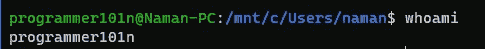

*   ***【用户名】*** :打印用户名或当前登录用户的上次登录。

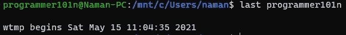

*   ***passwd*** :修改当前登录用户的密码。

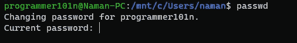

## **2。日期和时间**

*   ***【日期[+格式 _ 字符串】*** :返回当前日期和时间。

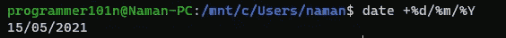

*   ***【cal【month】【year】***:显示当前或指定日历的月份和年份。

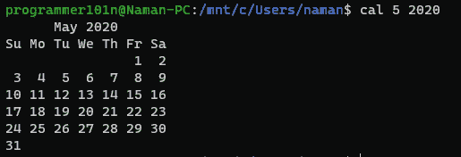

## **3。文件和目录**

*   ***cd <目录>*** :改变当前工作目录。
*   ***ls [-l] [-a]*** 显示你目录中的所有文件，-l 参数显示长格式的文件，-a 参数也显示隐藏的文件。

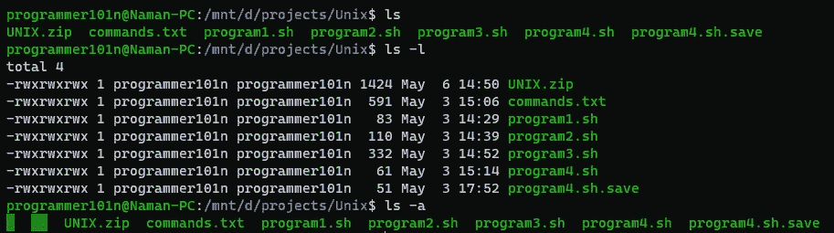

*   *:打印当前工作目录。*
*   ****mv <文件名 1 > <文件名 2 >*** :将文件从一个目录移动到另一个目录。*
*   ****cp <文件名 1 > <文件名 2 >*** :将文件从一个目录复制到另一个目录。*
*   ****rm <文件名>*** :从目录中删除文件。*

*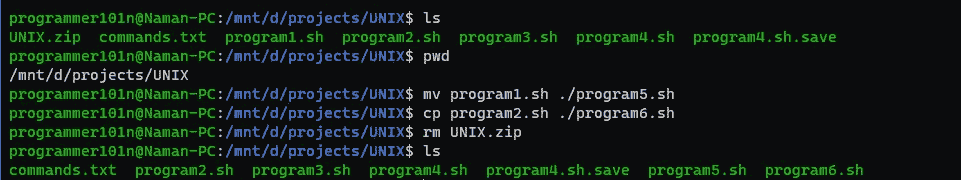*

*   ****mkdir<directoryname>***:用 Directory name 创建新目录*
*   ****rmdir<directoryname>[-r]***:删除带有 Directory name，-r 参数的目录，进行递归删除*
*   ****chmod <选项> <文件名>*** :允许您更改文件的读、写和执行权限。*

*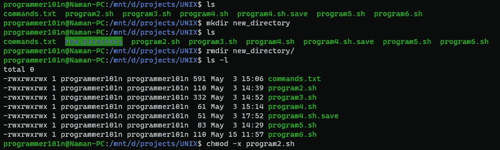*

*   ****wc <文件名>*** :打印文件中的行数、字数、字符数。*

*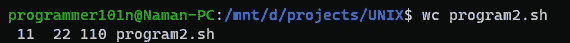*

## *4.创建和读取文件*

*   ****猫<文件名>*** :打印文件的内容。*
*   ****cat>filename***:用输入的内容创建一个文件。*
*   ****cat<filename1><filename 2>…><filename>***:filename 将 filename 1、filename2 …中的内容复制到 filename。*
*   ****tac <文件名>*** :反向打印文件内容。*
*   ****echo <消息>*** :在终端上打印或广播消息。*
*   ****清零*** :清零端子。*

*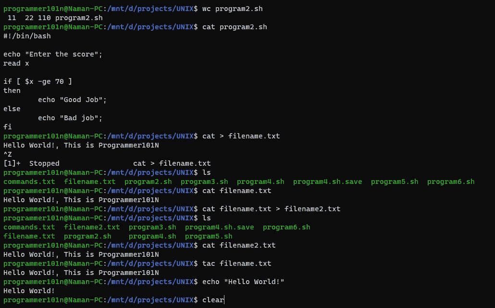*

*这是 Linux 系统的所有基本命令。敬请关注更多更新。*

## *看看我的博客，我在上面贴了很多东西。[链接到我的博客](https://programmer101n.com)*