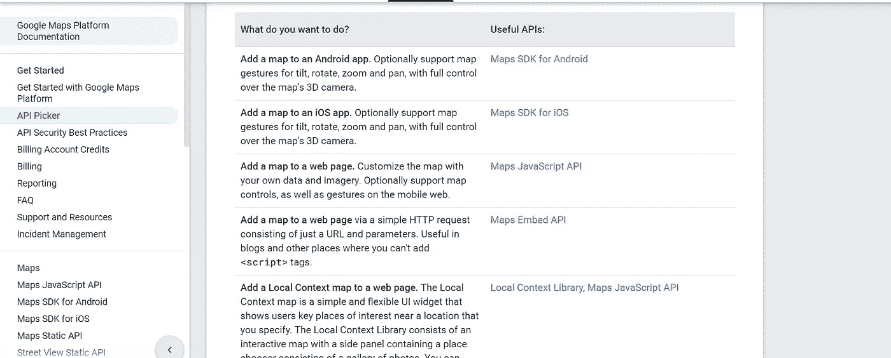

# 新手指南，通过“Google _ Maps _ service”Gem 使用 Google Maps API

> 原文：<https://medium.com/geekculture/a-beginner-rubyists-guide-to-use-the-google-maps-api-with-ruby-on-rails-through-the-68189b48a89e?source=collection_archive---------11----------------------->

Google 提供了几个 API，其中一个就是它的地图。这篇博客文章为初学 ruby 的人提供了使用“Google _ Maps _ service”gem 来使用 Google Maps 平台的分步指南。

# 什么是 API？


[https://www.danielleskosky.com/what-is-an-api/](https://www.danielleskosky.com/what-is-an-api/)

应用程序编程接口(API)是指预先组织好的数据、协议、函数和子程序的集合，各种程序和 web 应用程序可以使用这些数据、协议、函数和子程序相互连接。API 帮助两个或更多的应用程序相互通信，以便它们可以相互发送请求以及依赖于请求的结果。这反过来使得应用程序和网站的开发更加简单和高效。此外，应用程序还可以通过其 API 利用预先存在的服务，并提供更新的功能以使用户受益。

# **谷歌地图 API**


[https://shivama205.medium.com/google-drive-api-playing-around-dbffe544c574](https://shivama205.medium.com/google-drive-api-playing-around-dbffe544c574)

像其他大型在线服务提供商一样，谷歌有大量的 API。这些应用程序编程接口由 Google 开发，以便开发人员和企业可以与 Google 服务进行通信，将它们与自己的应用程序集成在一起。在这篇博客中，我们将具体看看谷歌提供的谷歌地图 API。

要使用谷歌地图 API，我们需要去[谷歌地图平台网站](https://developers.google.com/maps)，开始使用我们的谷歌账户。


如果您没有计费帐户，Google 可能会提示您在此时或以后创建一个帐户，因为需要 Google API 服务费的全部功能。当你注册时，你还可以获得 90 天的免费试用，在此期间有 300 美元的信用额度。

接下来，您可以使用垂直导航栏(或者通过该栏上的 API 选择器选项)选择您想要使用的 API。或者，您也可以通过页面顶部的搜索栏来搜索您正在寻找的 API 类型。



由于谷歌在谷歌地图平台下有几个 API，我们必须选择具有我们想要的特定特性的 API。在这个带有“Google _ maps _ service”gem 的演示中，我们需要的 API 是 Geocoding 和 DirectionsAPI。因此，继续通过导航链接或搜索栏找到这两个 API，并启用它们。


Enabling the Geocoding and Directions APIs

下一步是通过导航到[凭证页面](https://console.cloud.google.com/project/_/google/maps-apis/credentials)来生成 API 密钥。关于生成 API key 的具体说明可以在[这里](https://developers.google.com/maps/documentation/embed/get-api-key)找到。Google 需要这个 API 键来识别调用 API 的应用程序或项目，并检查这个应用程序是否有权调用 API。现在复制这个 API 键，我们将在从 Ruby 代码访问地理编码和方向 API 时使用它。

> **注意:**保持这个 API 密匙的安全以维护我们的功能和数据的完整性是很重要的。由于谷歌对大型网站的每个 API 请求收费，如果 API 密钥被暴露，可能会导致严重的经济后果。因此，这个密钥应该在服务器端保密。

至此，我们已经完成了谷歌方面要求的设置。现在，是时候设置“Google _ maps _ service”gem 并为这个演示编写 Ruby 代码了。

# **什么是宝石？**

在 Ruby 的上下文中，gem 只是包含不同用途的 Ruby 代码和数据的开源库。使用 gems 允许程序员使用预先编写的代码，而不需要显式地编写代码，这是非常高效的。我们用来访问谷歌地图 API 的 Ruby gem 叫做[*Google _ maps _ service*](https://github.com/edwardsamuel/google-maps-services-ruby)。

# “谷歌地图服务”宝石

这个 gem 对于访问 Google Maps API 及其功能非常有用。它返回一个 Ruby Hash/Array 对象作为我们请求 API 的结果。该结果的格式结构与 Google Maps API 文档中的格式结构相同。我们可以通过在终端中运行以下命令来安装这个 gem:

```
gem install google_maps_service 
```

为了在我们的 Ruby 代码中加载这个 gem，我们添加了下面一行:

```
require 'google_maps_service'
```

# **使用“谷歌地图服务”与谷歌地图应用编程接口配合使用**

要使用这个 gem，我们必须配置一个客户机。最简单的方法如下:

```
gmapclient = GoogleMapsService::Client.new(key: 'Insert API key')
```

> **注意:**这里需要我们之前复制的 API key。我们必须在初始化客户端时将它指定为键值。

在此之后，我们可以随时引用客户端(即 gmapclient)来访问 API 函数。以下是使用客户端查找地理编码和方向的示例:

```
geocode_result = gmapclient.geocode(address: ‘Yale University’)puts geocode_result#=> {:address_components=>[{:long_name=>"New Haven", :short_name=>"New Haven", :types=>["locality", "political"]}, {:long_name=>"New Haven County", :short_name=>"New Haven County", :types=>["administrative_area_level_2", "political"]}, {:long_name=>"Connecticut", :short_name=>"CT", :types=>["administrative_area_level_1", "political"]}, {:long_name=>"United States", :short_name=>"US", :types=>["country", "political"]}, {:long_name=>"06520", :short_name=>"06520", :types=>["postal_code"]}], :formatted_address=>"New Haven, CT 06520, USA", :geometry=>{:location=>{:lat=>41.3163244, :lng=>-72.92234309999999}, :location_type=>"GEOMETRIC_CENTER", :viewport=>{:northeast=>{:lat=>41.3176733802915, :lng=>-72.92099411970848}, :southwest=>{:lat=>41.3149754197085, :lng=>-72.9236920802915}}}, :place_id=>"ChIJRUlizbbZ54kRJwTTtMSiNK4", :plus_code=>{:compound_code=>"838H+G3 New Haven, CT, USA", :global_code=>"87H9838H+G3"}, :types=>["establishment", "point_of_interest", "university"]}
```

> 注意:从上面可以看出，geocode 方法返回一个包含几个键值对的大型散列。每一对都提供了一定的属性信息，我们可以通过键检索我们选择的任何信息。例如，我们可以访问所选位置的类型属性，如下所示:

```
puts geocode_result.first[:types]#=> establishment
point_of_interest
university
```

另一个示例-查找从起点到目的地的路线方向:

```
routes = gmapclient.directions(‘Times Square’,‘Madison Square Garden’, mode: ‘transit’, alternatives: false)puts routes#=> {:bounds=>{:northeast=>{:lat=>40.759899, :lng=>-73.984138}, :southwest=>{:lat=>40.749223, :lng=>-73.9915043}}, :copyrights=>"Map data ©2021", :legs=>[{:arrival_time=>{:text=>"2:38am", :time_zone=>"America/New_York", :value=>1626158308}, :departure_time=>{:text=>"2:28am", :time_zone=>"America/New_York", :value=>1626157728}, :distance=>{:text=>"1.2 mi", :value=>2009}, :duration=>{:text=>"10 mins", :value=>580}, :end_address=>"4 Pennsylvania Plaza, New York, NY 10001, USA", :end_location=>{:lat=>40.7500372, :lng=>-73.9915043}, :start_address=>"Manhattan, NY 10036, USA", :start_location=>{:lat=>40.756567, :lng=>-73.9859804}, :steps=>[{:distance=>{:text=>"0.3 mi", :value=>404}, :duration=>{:text=>"2 mins", :value=>99}, :end_location=>{:lat=>40.759899, :lng=>-73.984138}, :html_instructions=>"Walk to 49 St", :polyline=>{:points=>"qgwwFjkqbMsP_GeBoB"}, :start_location=>{:lat=>40.756567, :lng=>-73.9859804}, :steps=>[{:distance=>{:text=>"0.2 mi", :value=>331}, :duration=>{:text=>"1 min", :value=>25}, :end_location=>{:lat=>40.7593878, :lng=>-73.9846985}, :polyline=>{:points=>"qgwwFjkqbMsP_G"}, :start_location=>{:lat=>40.756567, :lng=>-73.9859804}, :travel_mode=>"WALKING"}, {:distance=>{:text=>"240 ft", :value=>73}, :duration=>{:text=>"1 min", :value=>74}, :end_location=>{:lat=>40.759899, :lng=>-73.984138}, :html_instructions=>"Take entrance <span class=\"location\">7th Ave & 47th St at NW corner</span>", :polyline=>{:points=>"eywwFjcqbMeBoB"}, :start_location=>{:lat=>40.7593878, :lng=>-73.9846985}, :travel_mode=>"WALKING"}], :travel_mode=>"WALKING"}, {:distance=>{:text=>"0.7 mi", :value=>1203}, :duration=>{:text=>"4 mins", :value=>210}, :end_location=>{:lat=>40.749565, :lng=>-73.98795299999999}, :html_instructions=>"Subway towards Coney Island-Stillwell Av", :polyline=>{:points=>"k|wwFz_qbMbIfFRLVLTLTLVLVJVLXHVJXJXHXHXJZFZH~InBpIfBNBLDNBNBNDLBN@NDN@NDL@NBN@NBL@`MjA@?"}, :start_location=>{:lat=>40.759899, :lng=>-73.984138}, :transit_details=>{:arrival_stop=>{:location=>{:lat=>40.749565, :lng=>-73.98795299999999}, :name=>"34 St - Herald Sq Subway Station"}, :arrival_time=>{:text=>"2:33am", :time_zone=>"America/New_York", :value=>1626158007}, :departure_stop=>{:location=>{:lat=>40.759899, :lng=>-73.984138}, :name=>"49 St"}, :departure_time=>{:text=>"2:30am", :time_zone=>"America/New_York", :value=>1626157827}, :headsign=>"Coney Island-Stillwell Av", :line=>{:agencies=>[{:name=>"MTA New York City Transit", :phone=>"1 (718) 330-1234", :url=>"[http://www.mta.info/](http://www.mta.info/)"}], :color=>"#f2c40a", :icon=>"//maps.gstatic.com/mapfiles/transit/iw2/6/us-ny-mta/N.png", :name=>"N Line", :short_name=>"N", :text_color=>"#000000", :url=>"[http://web.mta.info/nyct/service/pdf/tncur.pdf](http://web.mta.info/nyct/service/pdf/tncur.pdf)", :vehicle=>{:icon=>"//maps.gstatic.com/mapfiles/transit/iw2/6/subway2.png", :name=>"Subway", :type=>"SUBWAY"}}, :num_stops=>2}, :travel_mode=>"TRANSIT"}, {:distance=>{:text=>"0.2 mi", :value=>402}, :duration=>{:text=>"5 mins", :value=>300}, :end_location=>{:lat=>40.7500372, :lng=>-73.9915043}, :html_instructions=>"Walk to 4 Pennsylvania Plaza, New York, NY 10001, USA", :polyline=>{:points=>"w{uwFtwqbMKh@HU`[@Rb](http://twitter.com/Rb)@XGPeAdDOf@CJM\\Oh@_@jAMTIVK\\GTUr@Gv@RNJFFDXTB@"}, :start_location=>{:lat=>40.749565, :lng=>-73.98795299999999}, :steps=>[{:distance=>{:text=>"59 ft", :value=>18}, :duration=>{:text=>"1 min", :value=>19}, :end_location=>{:lat=>40.749615, :lng=>-73.988159}, :html_instructions=>"Take exit <span class=\"location\">6th Ave & W 34th St at SW corner</span>", :polyline=>{:points=>"w{uwFtwqbMKh@"}, :start_location=>{:lat=>40.749565, :lng=>-73.98795299999999}, :travel_mode=>"WALKING"}, {:distance=>{:text=>"167 ft", :value=>51}, :duration=>{:text=>"1 min", :value=>36}, :end_location=>{:lat=>40.749223, :lng=>-73.9882808}, :html_instructions=>"Head <b>southwest</b> on <b>6th Ave</b> toward <b>Broadway</b>", :polyline=>{:points=>"y{uwFhxqbM`[@Rb](http://twitter.com/Rb)@X"}, :start_location=>{:lat=>40.7495719, :lng=>-73.98805229999999}, :travel_mode=>"WALKING"}, {:distance=>{:text=>"0.2 mi", :value=>274}, :duration=>{:text=>"3 mins", :value=>193}, :end_location=>{:lat=>40.7503853, :lng=>-73.99123329999999}, :html_instructions=>"Turn <b>right</b> onto <b>W 33rd St</b>", :maneuver=>"turn-right", :polyline=>{:points=>"syuwFvyqbMGPeAdDOf@CJM\\Oh@_@jAMTIVK\\GTUr@Gv@"}, :start_location=>{:lat=>40.749223, :lng=>-73.9882808}, :travel_mode=>"WALKING"}, {:distance=>{:text=>"194 ft", :value=>59}, :duration=>{:text=>"1 min", :value=>52}, :end_location=>{:lat=>40.7500372, :lng=>-73.9915043}, :html_instructions=>"Turn <b>left</b> onto <b>7th Ave</b>/<wbr/><b>Fashion Ave</b><div style=\"font-size:0.9em\">Destination will be on the right</div>", :maneuver=>"turn-left", :polyline=>{:points=>"}`vwFdlrbMRNJFFDXTB@"}, :start_location=>{:lat=>40.7503853, :lng=>-73.99123329999999}, :travel_mode=>"WALKING"}], :travel_mode=>"WALKING"}], :traffic_speed_entry=>[], :via_waypoint=>[]}], :overview_polyline=>{:points=>"qgwwFjkqbMsP_GeBoBbIfFvAv@`Bp@dBj@pLlC~JtBzB^|[@JbMjAKh](http://twitter.com/JbMjAKh)@HUdAl@mAvDq@zBm@`BUt@]hAGv@RNRL\\V"}, :summary=>"", :warnings=>["Walking directions are in beta. Use caution – This route may be missing sidewalks or pedestrian paths."], :waypoint_order=>[]}
```

> **注意:**同样，directions 函数(来自于我们之前在 Google 的 API 控制台上启用的 Directions API)也输出了一个巨大的数据块作为 hash，我们的工作就是从这个巨大的 hash 中提取我们需要的信息。这个函数的输出基本上描述了从一个给定的起点到一个特定的目的地的路径，并选择了一种行驶模式。

这意味着，尽管谷歌地图 API 为我们提供了大量的信息，但它仍然面临着浏览大量数据并检索最相关信息的挑战。因此，无论何时决定使用这个 API，都要记住这一点。为了理解它的返回值，查阅它的文档是非常重要的。

总之，我们可以通过“Google _ maps _ service”gem 在 Ruby 应用程序中使用 Google Map API。这个 API 提供了不同的功能，并返回大量存储为数组和散列的数据。我还想指出的是，我们可以使用 Zilverline 的另一个名为“ [google-maps](https://github.com/zilverline/google-maps) ”的工具来处理 Google Map API。不仅如此，还有谷歌地图 API 的替代品，比如开放街道地图和地图盒子。每一个都有自己的 Ruby gems，这使得它们的配置更加简单。需要指出的是，他们的主要不足是没有谷歌那么多的数据和那么多的功能。但同时，Open Street Map 是开源的，可以免费获得。因此，由程序员来决定使用哪种 API 来权衡收益和成本。总之，通过 API 和 gems 的结合，Rubyists 可以集成外部功能、数据和信息来创建有用和有趣的应用程序。

# 参考作品

[](https://www.danielleskosky.com/what-is-an-api/) [## 什么是 API？丹尼尔·莱斯科斯基

### API 是科技行业的一个时髦词。但是 API 实际上是做什么的呢？这篇文章将帮助你熟悉…

www.danielleskosky.com](https://www.danielleskosky.com/what-is-an-api/) [](https://shivama205.medium.com/google-drive-api-playing-around-dbffe544c574) [## Google Drive API:到处玩

### 这篇博客是关于我在当前项目中使用 Google Drive APIs 的经历。虽然…

shivama205.medium.com](https://shivama205.medium.com/google-drive-api-playing-around-dbffe544c574) [](https://www.geeksforgeeks.org/introduction-to-apis/) [## API 简介- GeeksforGeeks

### 什么是 API？API 是应用编程接口的缩写，它是通信接口的集合

www.geeksforgeeks.org](https://www.geeksforgeeks.org/introduction-to-apis/) [](https://cloud.google.com/endpoints/docs/openapi/when-why-api-key) [## 为什么以及何时将 API 密钥|云端点与 OpenAPI 一起使用

### " type": "thumb-down "，" id": "hardToUnderstand "，" label ":"难以理解" }，{ "type": "thumb-down "，" id"…

cloud.google.com](https://cloud.google.com/endpoints/docs/openapi/when-why-api-key) [](/@morgannegagne/what-is-a-ruby-gem-1eec2684e68) [## 什么是红宝石？

### 当我第一次了解红宝石时，它们似乎很神奇。通过运行捆绑包安装，我可以以某种方式获得…

medium.com](/@morgannegagne/what-is-a-ruby-gem-1eec2684e68)