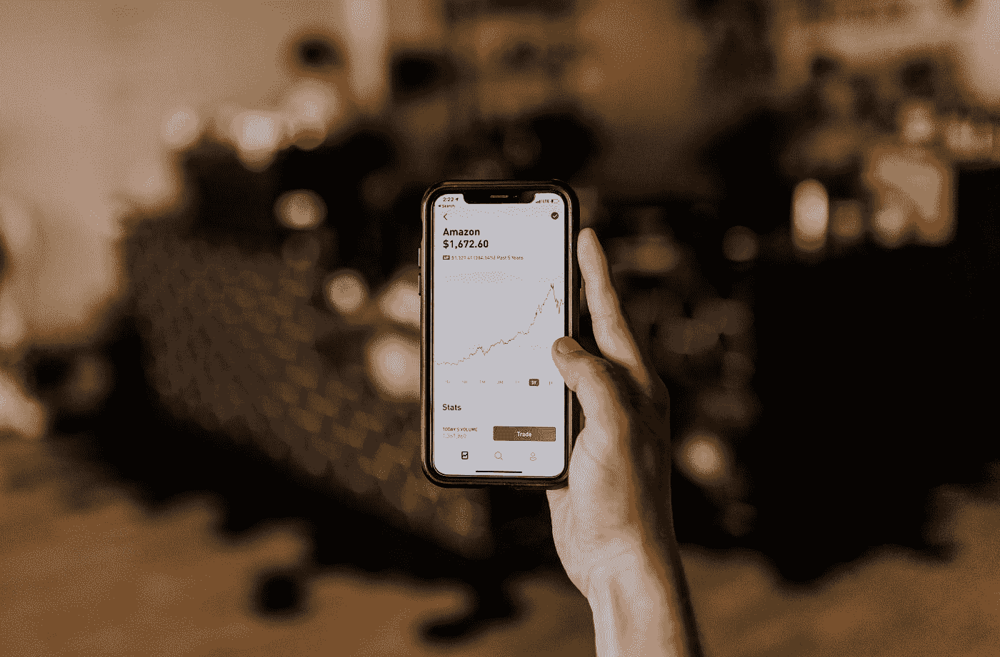

# 初学者指南:股票市场

> 原文：<https://medium.com/geekculture/a-beginners-guide-the-stock-market-fee5d6a48e4c?source=collection_archive---------14----------------------->

## 投资未来入门。

Photo by [Austin Distel](https://unsplash.com/@austindistel?utm_source=medium&utm_medium=referral) on [Unsplash](https://unsplash.com?utm_source=medium&utm_medium=referral)

股票市场可能是一个令人生畏的地方。大多数人听到“华尔街”就会想到 100 个电话同时打来的混乱场面，市场时段的交易大厅狂热，以及亿万富翁做亿万富翁的事情。