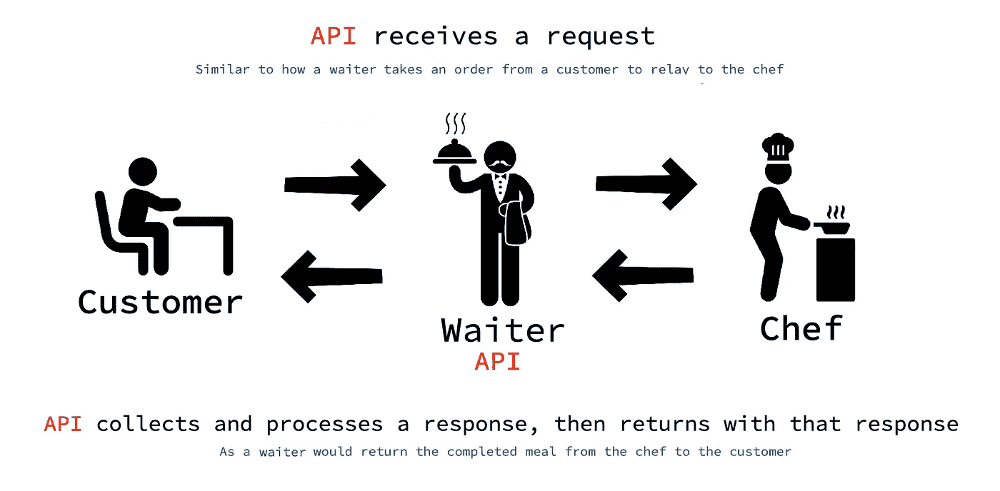
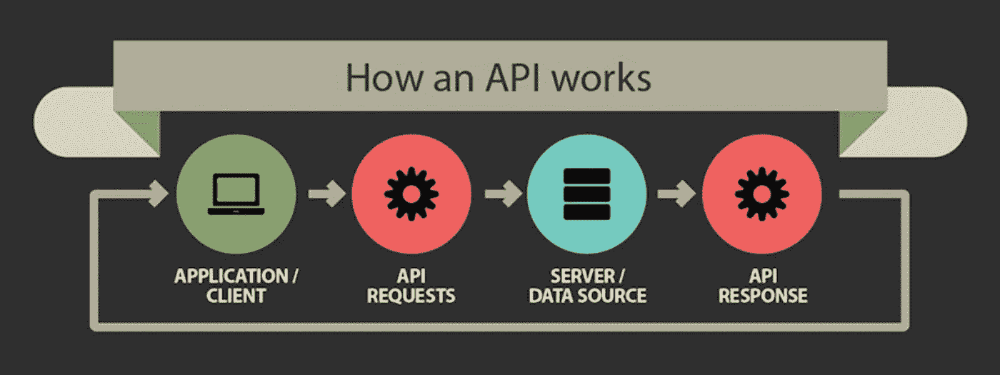
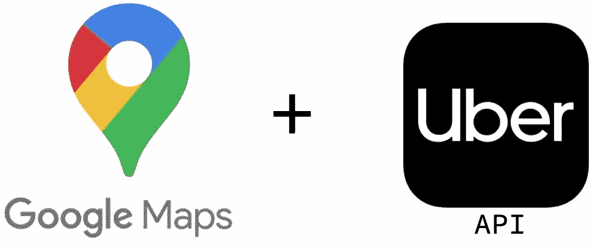
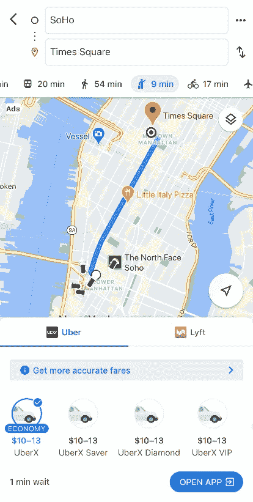

# API 初学者指南

> 原文：<https://medium.com/geekculture/a-beginners-guide-to-apis-9aa7b1b2e172?source=collection_archive---------0----------------------->

## 用真实世界的例子

Photo: [iStock](https://www.istockphoto.com/vector/website-app-design-development-technology-software-code-programming-ui-ux-concept-gm1248949754-363886748)

# API 到底是什么？

API 是应用编程接口的缩写。它被定义为操作系统中的工具和资源的系统，使开发者能够创建软件应用程序。通常，API 使用 JSON (Javascript Object Notation)作为主要语言，它提供了用于提取和操作 HTML 文档中存储的数据的方法。

API 在完全不同的系统上聚合数据和完成过程，允许它们相互交互。通俗地说，就把他们想象成餐厅的服务员。

服务员从顾客那里接受订单，然后将订单传达给厨师。一旦厨师做好饭菜，服务员就会把饭菜端给顾客。类似地，API 接收来自应用程序的请求。然后，它与外部服务器/数据源进行交互，收集并处理响应，然后将响应返回给应用程序。

Source: [What’s an API and Why Do You Need One?](https://www.govtech.com/archive/Whats-an-API-and-Why-Do-You-Need-One.html)

近年来，API 的普及和使用呈指数级增长。最近的一项研究发现，三分之二的开发者希望在 2020 年增加他们对 API 的使用。此外，各行各业的公司继续开发和使用 API 作为其战略的重要组成部分。通过将通常复杂的服务公开为简化的代码，API 易于集成，并且潜在的用例是无限的。

> 很有可能你已经使用了一个应用程序或者浏览了一个使用 API 的网站，所以让我们来看看它是如何运行的。

# 真实世界的例子

当你在谷歌地图上搜索方向时，你有没有注意到有一个从不同的乘车服务中预订乘车的选项？

在左边的例子中，Google Maps 使用优步的 API 通过发送一个 HTTP 请求函数来请求信息，这个请求函数包含了旅程的起点和终点。

然后，优步的 API 会发回信息，比如有多少辆车可用，它们目前在哪里，以及各种乘车选择的费用。

这些信息随后由谷歌地图处理，如果用户之前下载了优步应用程序，就可以直接链接到该应用程序。

类似的订票网站有 Travelocity、Kayak、Expedia、Booking.com 等。所有这些都使用由航空公司和酒店公司提供的 API 来获取关于可用性、价格和其他变量的信息，以允许用户直接通过在线旅游服务进行预订。

如今，许多应用程序和网站都提供了通过另一个应用程序(如谷歌或脸书)的现有帐户进行注册的选项。这方面的一个例子是约会应用，如 Tinder，用户只需点击一下就可以通过脸书创建一个账户。

Tinder 使用脸书 API 来验证用户的身份，并访问有价值的用户信息，如性别、年龄、共同的朋友和照片，以建立他们的档案。

最后，最常用的 API 之一是谷歌地图的地理编码 API。使用它的应用程序能够将地址转换成地图上的地理坐标。

Yelp 特别使用谷歌地图 API 来访问用户的当前位置，以及定位附近或远处的目的地，并将它们标记在直接集成到应用程序中的地图上。

# 最后

API 以前所未有的方式连接世界。只需轻点或点击几下，它们就可以消除以前的障碍，并且可以轻松集成。就把他们想象成往返于传递数据和创造互联性之间的服务员。

可能性确实是无穷无尽的。