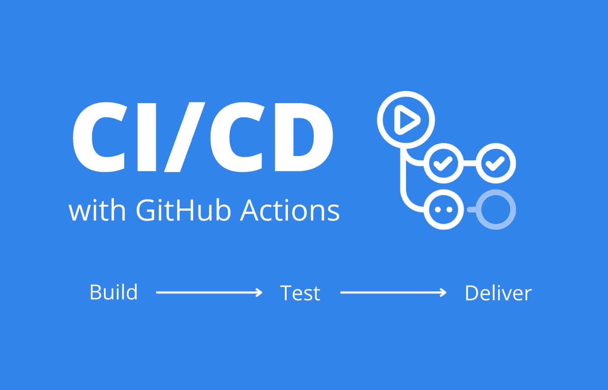

# 带有 GitHub 动作的 CI/CD 初学者指南

> 原文：<https://medium.com/geekculture/a-beginners-guide-to-ci-cd-with-github-actions-c5a427eec1ee?source=collection_archive---------7----------------------->

使用 GitHub 操作为 GitHub 库创建第一个 CI/CD 管道的简单易懂的指南。

CI/CD with GitHub Actions

# 介绍

在软件开发中，有一点我想大多数工程师都会同意，自动化很棒！我们应该尝试尽可能多地自动化我们的任务，以提高我们的生产力，同时也减少我们的…