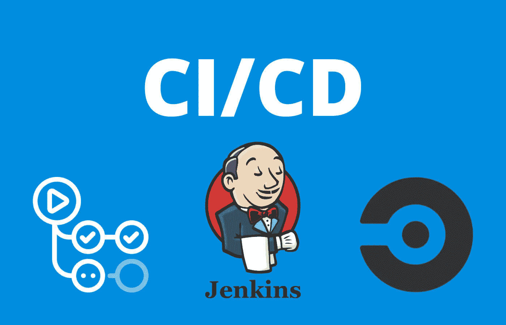

# 理解 CI/CD 的初学者指南

> 原文：<https://medium.com/geekculture/a-beginners-guide-to-cicd-6a6c0a32cb98?source=collection_archive---------2----------------------->

对持续集成和交付的高层次概述，以及用初学者可以理解的浅显语言说明它的含义。

CICD, Github Actions, Jenkins, CircleCI

# 介绍

在云原生软件开发的现代世界中，许多系统和应用程序每天都在被多次开发、测试和交付。一些知名公司已经完善了…