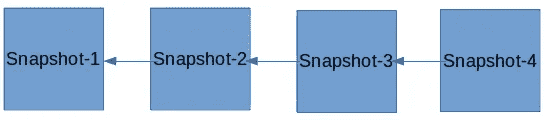
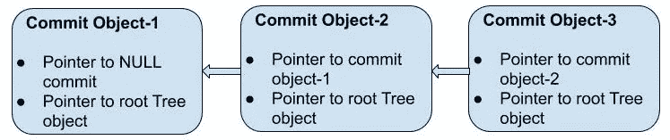
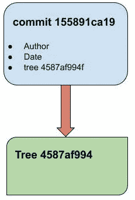
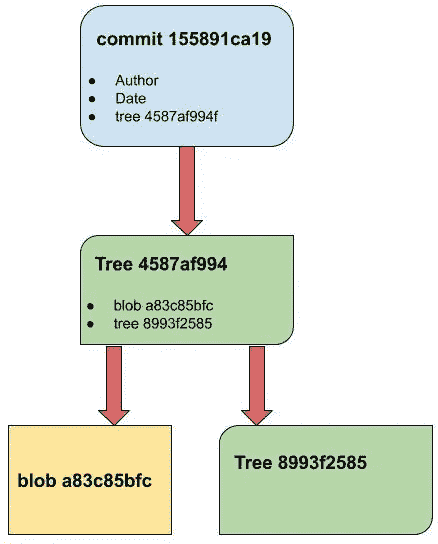
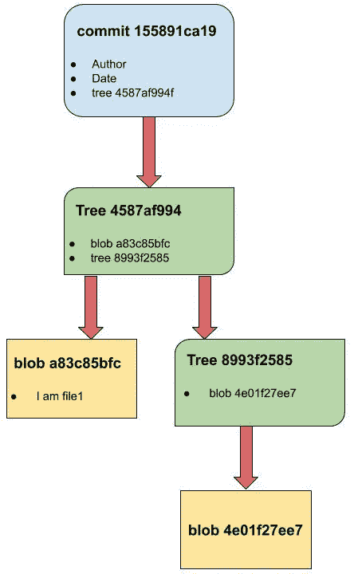
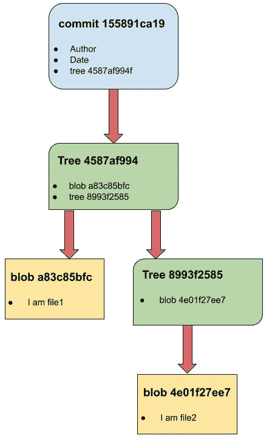
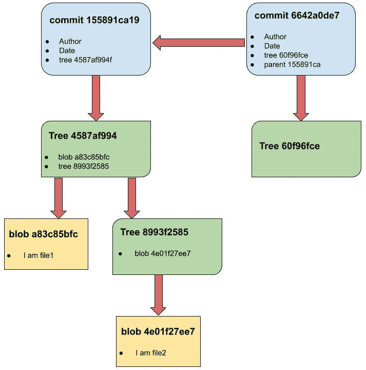
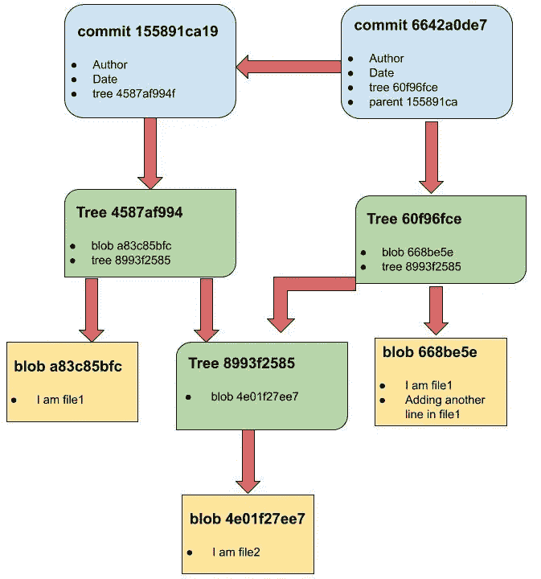
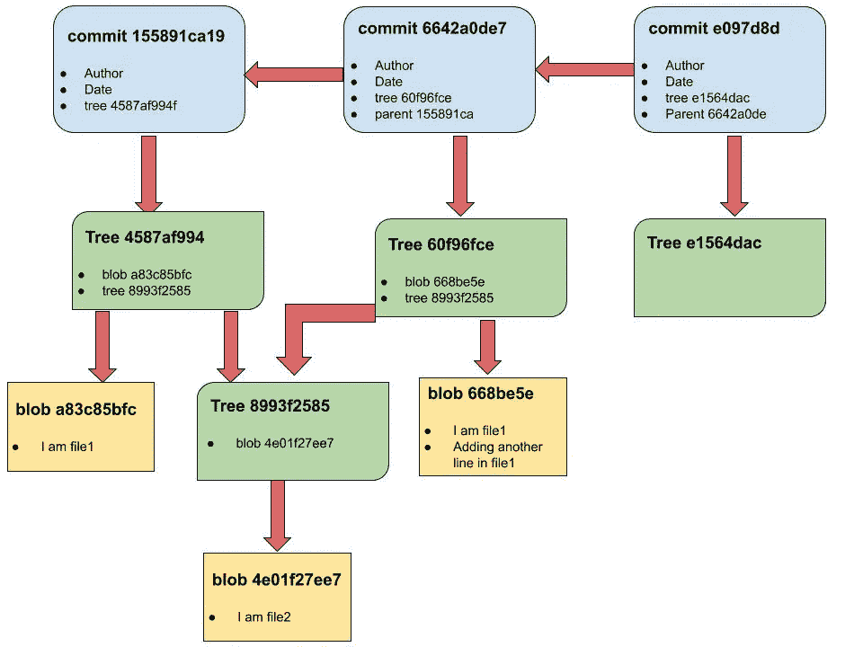
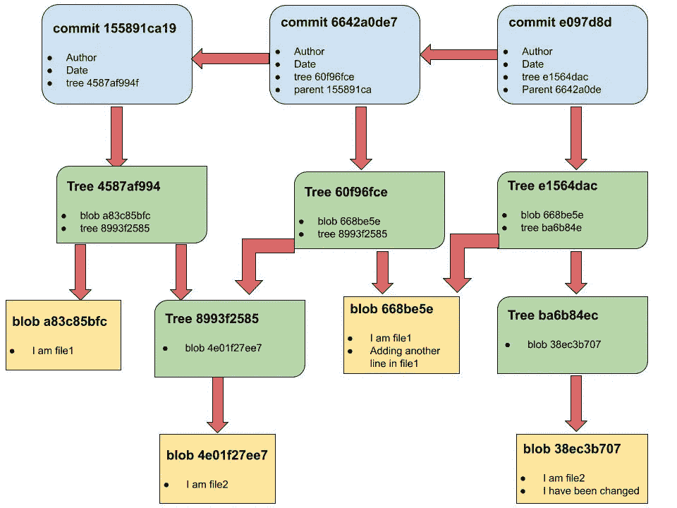

# Git 和 Git 内部的初学者指南

> 原文：<https://medium.com/geekculture/a-beginners-guide-to-git-and-git-internals-1e7dcd89d65e?source=collection_archive---------11----------------------->

我和 Git 纠结了很多！当我推进我的代码时，10 次中有 8 次项目会中断。然后，我会花一整晚的时间试图让我的代码再次工作，但无济于事。早上，在半睡半醒中，我终于向我的朋友寻求帮助，他是一个饭桶神。令我惊讶的是，他会在几分钟内搞定这个项目。他总是说 Git 很简单，只要你理解了它的内部原理。一个周末，我对与 Git 的斗争感到沮丧，于是我决定花整个周末来研究 Git 的内部机制。从那以后，Git 看起来从未如此简单而美丽。现在，Git 中的每一个问题，在早期都是一场解决起来的噩梦，看起来是如此的明显和琐碎。

坦率地说，对于初学者来说，Git 不是一个容易使用的工具。虽然它有一个漂亮的内部设计，但对于一个新手来说，即使是理解 Git 的基本功能也是一个难题。通过这篇文章，我想打开 Git 黑盒子，深入 Git 内部。在这一系列文章中，我们将了解 Git 的内部结构。*这是 4 篇系列文章中的第一篇。(关于 Git 分支的第二篇文章已经发表。你可以在这里找到*[](/geekculture/git-branching-made-easy-1cc894b9fd03)**)**

*这篇文章是为完全的初学者写的。然而，对于那些对 Git 有所了解但对自己的 Git 技能没有信心的人，或者那些想要揭开 Git 底层内部秘密的人来说，它也是有用的。唯一的先决条件是熟悉 cd、ls、cat 等命令。*

*在开始介绍 Git 之前，让我们先了解一下，什么是版本控制系统？*

## *什么是版本控制系统？*

*简单地说，版本控制系统(VCS)是一个帮助记录和管理项目变更的工具。*

*为了更好地理解，让我们考虑一个例子。*

*想象一个没有版本控制系统的世界。假设你正在做一个项目。您正在将项目文件保存在 google drive(或您的本地计算机)中。你在第一天开始你的项目，到第七天你已经完成了项目的一部分(比如说 50%)。两天后(第 9 天)，你意识到项目现在变得更复杂了，你想回到第 7 天的项目状态。可悲！您无法恢复到项目的早期版本，因为您所做的更改已经覆盖了您计算机上的所有项目文件。唯一的方法可能是，您在某个地方保存了项目的副本(如第 7 天)。但是每次完成项目的一部分时保存项目的副本是很麻烦的。*

*为了避免这样的问题，我们使用版本控制系统。版本控制系统会不时地在本地计算机上保存项目存储库(项目文件夹)的快照。每当您完成项目的一部分时，您向您的 VCS 发出一个命令，说— *拍摄我的当前项目存储库的快照(您的当前项目存储库或项目目录中的所有文件和文件夹的快照)并将其保存在您的历史记录中。*现在，如果您想要返回到项目的先前状态(您之前保存的快照)，您可以通过向您的 VCS 发出另一个命令来轻松地做到这一点，该命令说— *将我的项目的状态恢复到这个特定的快照*。*

**

*You can revert to any snapshot in your Project’s VCS’s history*

*这个名字叫做版本控制，因为它保存了项目的*版本*(快照)。随着项目规模和复杂性的增加，版本控制系统的重要性也在增加。正如我们将看到的，VCS 还提供了许多其他功能。他们帮助你以更好的方式管理你的项目。Git 是一个版本控制系统。它是免费和开源的，也是最受欢迎的 VCS 之一。其他一些版本控制系统有 Mercurial、SVN 等。*

## *Git —简介*

*所以现在我们明白 Git 是什么了。但是在开始 Git 的数据模型之前，我想解决完全初学者的另一个困惑点。除了 Git 和版本控制系统，很多人肯定也听说过 GitHub。所以，一个自然的问题是 GitHub 是什么？和 Git 有什么区别？(没听说过 GitHub 的，可以选择忽略文章的这一部分)你可以把 GitHub 看成是项目的 Google Drive。它将你的项目存储在云上。不仅是您的项目，还有 Git 一直保存的所有项目快照。如果您想在不同的机器上访问您的项目，或者您不小心丢失了计算机上的所有数据，这将很有帮助。而且，GitHub 不仅仅是作为你的项目的备份，它的 USP 还使项目的协作变得更加容易。一些刚刚开始学习 Git 的初学者有一个误解，认为 GitHub 和 Git 是混合在一起的，认为使用 Git 也需要使用 GitHub。这不是真的。如果你不想把你的项目保存在云上，并且你的项目不需要和其他人协作，那么 GitHub 是不需要的。Git 将在您的本地计算机上管理您的项目，而不需要 GitHub。还要注意，除了 GitHub，还有其他代码托管平台。
现在让我们从 Git 的数据模型开始。*

## *Git —数据模型*

*所以，是时候开始 Git 的内部设计了。在内部，git 将快照的内容存储在不同类型的对象中。让我们仔细看看这些物体。*

***提交对象** 我们谈到了我们项目存储库的快照。提交对象表示我们项目的快照。它帮助我们查看我们的项目存储库的特定快照(存在于我们的 VCS 保存的快照历史中)。提交对象包含指向其父提交对象(即之前保存的快照)的指针(引用)。这形成了提交对象的链表(链表是对象的列表，一个对象通过指针链接到下一个对象。下一个对象又指向另一个对象，依此类推)。唯一的例外是没有父级的初始提交。
*注意*:在关于分支的文章中，我们会发现一个提交对象也可以有两个或更多的父对象，一个父提交对象也可以有两个或更多的子提交对象。
提交对象还包含其他有用的信息，如提交的作者、提交消息等。我们将在本文后面讨论这些内容。*

**

*Commit Object-3 is the latest commit while Commit object-1 is the oldest commit ( which does not have a parent)*

*那么这个提交对象如何帮助我们查看项目的快照呢？
Ans —它包含一个对树对象的引用。*

***树对象
树对象用来表示目录(文件夹)。如果项目包含在名为— *MyProject* 的目录中，则提交对象包含对代表目录 *MyProject* 的树对象的引用。我们将这个项目目录称为根目录。我们的根项目目录也存储为一个树对象。提交对象包含对此树对象的引用。树对象包含关于它所代表的目录的信息，即目录中存在的所有文件和子目录。子目录也将表示为树对象。所以一个树对象可以包含对另一个树对象的引用。***

*树对象指向的文件在 git 中称为 blob 对象。*

***斑点物体***

*blob 对象代表 git 中的一个文件。如果文件没有从提交-1 变为提交-2，那么 blob 对象也不会改变。
一个 Blob 对象包含文件的内容。*

*现在让我们仔细看看这些物体。我们会弄脏我们的手，并开始执行一些命令。首先，在您的系统上安装 git。安装步骤可参考此[文章](https://git-scm.com/book/en/v2/Getting-Started-Installing-Git)。我建议您在系统中执行相同的命令。*

*注意:为了避免混淆，`>>>`是我的命令提示符。😅*

*首先，创建一个空目录`gitDemo`，这将是我们的根项目目录。*

```
*>>> mkdir gitDemo
>>> cd gitDemo*
```

*接下来，我们将这个存储库初始化为一个 *git 存储库。* `git init`将存储库初始化为一个 *git 存储库*，并在我们的根项目目录中创建一个`.git`文件夹。*

```
*>>> git init
Initialized empty Git repository in /home/prakarsh/MediumGitArticle1/gitDemo/.git/*
```

*列出我们的 *gitDemo* 目录的内容，我们会注意到一个*。git* 目录。*。git* 目录负责存储使用 git 管理我们项目的所有重要信息。*

```
*>>> ls -a
.  ..  .git*
```

*让我们来看看*的结构。使用`tree`命令获取*目录。*

```
*>>> tree .git
.git
├── branches
├── config
├── description
├── HEAD
├── hooks
│   ├── applypatch-msg.sample
│   ├── commit-msg.sample
│   ├── fsmonitor-watchman.sample
│   ├── post-update.sample
│   ├── pre-applypatch.sample
│   ├── pre-commit.sample
│   ├── prepare-commit-msg.sample
│   ├── pre-push.sample
│   ├── pre-rebase.sample
│   ├── pre-receive.sample
│   └── update.sample
├── info
│   └── exclude
├── objects
│   ├── info
│   └── pack
└── refs
    ├── heads
    └── tags*
```

*我们看到有许多子目录，如 branches、config、HEAD、info、refs、objects 等。在本文中，我们将关注于*对象*目录。*

```
*>>> tree .git/objects
.git/objects
├── info
└── pack*
```

*我们可以看到在 objects 目录中只有两项。这是因为到目前为止，我们还没有创建一个对象。首先，让我们创建一些对象。我们将在我们的 *gitDemo* 目录中创建一些文件和文件夹，并保存我们的第一个快照。*

```
*>>> echo "I am file1" > file1
>>> ls
file1
>>> mkdir subDir1
>>> cd subDir1
>>> echo "I am file2" > file2
>>> ls
file2
>>> cd ..*
```

*现在，在你的 *gitDemo* 目录中执行命令 *tree* 来查看你的库的结构。*

```
*>>> tree
.
├── file1
└── subDir1
    └── file21 directory, 2 files*
```

*我们已经在项目存储库中创建了一些文件和文件夹。是时候保存我们存储库的第一个快照了😎。执行以下命令保存存储库的第一个快照。*

```
*>>> git add file1 subDir1/
>>> git commit -m "created file1, created subDir1 and created file2 in it"
[master (root-commit) 155891c] created file1, created subDir1 and created file2 in it
 2 files changed, 2 insertions(+)
 create mode 100644 file1
 create mode 100644 subDir1/file2*
```

*万岁！我们已经保存了存储库的第一个快照。第一个提交对象已经创建。但是你一定想知道，这个 *git add* 和 *git commit* 命令是做什么的？*

***git add** `git add filename1 filename2 filename3`用于将变更暂存在您的存储库中以供提交(快照)。这就像快照前的预备步骤。请注意，如果您对某个文件进行了更改，但没有使用 *git add 暂存该文件，*当您运行 *git commit 时，不会考虑提交该文件。*即文件不会包含在快照中。我有意省略了一些关于暂存部分和暂存区域的细节，以便将重点放在 Git 数据模型上。我们将在另一篇文章中讨论这些细节。*

***git commit** `git commit -m “commit message”` 在提交历史中保存您的库的当前状态的快照。提交消息用于描述存储库快照中的特定变化。提供良好的提交消息很重要。如果您想要查看项目的先前状态，其中有数千个提交，当您有一个好的提交消息时，找到提交会容易得多。*

*让我们看看提交后创建的所有对象。*

*向我们显示项目历史中所有提交的信息。因为我们现在只有一个提交，所以它将只输出关于单个提交的信息。执行命令`git log`并观察输出。我们可以看到，第一行包含一个 40 个字符长的字母数字字符串。它是提交对象内容的 SHA-1 散列。如果您不熟悉 SHA-1 散列，不要担心，只需将这个字母数字字符串视为提交对象的惟一标识符。所有类型的对象(提交、树、blob)都由这个 SHA-1 散列唯一标识。
第二行提供了关于提交作者的信息(即在存储库中进行更改的作者)。当你和其他人在一个项目上合作时，有时知道提交的作者是有用的。第三行是提交的日期和时间。最后一行是作者在提交时添加的提交消息。*

```
*>>> git log
commit 155891ca19d94f67159a992c77923818b57d74a5 (HEAD -> master)
Author: pprakarsh <[prakarshparashar@gmail.com](mailto:prakarshparashar@gmail.com)>
Date:   Sun May 3 10:41:06 2020 +0530created file1, created subDir1 and created file2 in it*
```

*执行这个命令`git cat-file commit <commit-hash>`来查看提交对象的内容。您可以从`git log`命令的输出中复制提交散列。在命令参数中，您不需要编写整个提交散列，甚至几个字符就足以在几乎所有时间识别提交。执行命令并观察输出。注意，输出中的第一行包含一个树对象的 SHA-1 散列。这个树对象代表根项目目录。*

> *提交散列是提交对象内容的函数。在这种情况下，作者、时间、日期等是不同的。因此，即使存储库快照的内容相同，提交哈希也会有所不同。(您会注意到我的提交散列和您的提交散列是不同的，即使存储库的内容完全相同)*

```
*>>> git cat-file commit 155891c
tree 4587af994fe34fed465b64b6ce8b8adb07a17aaf
author pprakarsh <[prakarshparashar@gmail.com](mailto:prakarshparashar@gmail.com)> 1588482666 +0530
committer pprakarsh <[prakarshparashar@gmail.com](mailto:prakarshparashar@gmail.com)> 1588482666 +0530created file1, created subDir1 and created file2 in it*
```

**

*Commit object points to the Tree object corresponding to the root Project directory*

*执行命令`git ls-tree <tree object hash>`来查看这个树对象。再次从上面执行的`git cat-file commit <commit-hash>`命令的输出中复制树对象散列。我们观察到树对象包含对 blob 对象(文件 1)的引用和对另一个树对象(subDir1)的引用。*

```
*>>> git ls-tree 4587af994fe34fed465b64b6ce8b8adb07a17aaF
100644 blob a83c85bfc5f4f056b0932eb2e5cf767f167a67f2 file1
040000 tree 8993f258581e2772c7a4c27ad07498caed668c57 subDir1*
```

**

*现在，让我们看看 blob 对象(file1)和根树对象(subDir1)引用的树对象。执行命令`git cat-file blob <blob-hash>`为我们提供了 blob 对象的内容，即*文件 1* 的内容。
并且执行命令`git ls-tree <tree hash>`显示树对象(图中的散列 8993f2)包含对另一个 blob 对象(文件 2)的引用。*

```
*>>> git cat-file blob a83c85bfc5f4f056b0932eb2e5cf767f167a67f2
I am file1
>>> git ls-tree 8993f258581e2772c7a4c27ad07498caed668c57
100644 blob 4e01f27ee757413022834dcb1bbf4c66fb01f05c file2*
```

**

*最后，在进行第二次提交之前，我们将看一下树对象(表示子目录)引用的 blob 对象(图中的 hash 4e01f27)。执行命令`git cat-file blob <blob-hash>`。输出是*子目录/文件 2 的内容。**

```
*>>> git cat-file blob 4e01f27ee757413022834dcb1bbf4c66fb01f05c
I am file2*
```

**

*Pictorial representation of all objects after the first commit*

*让我们回过头来看看我们的*。git/objects* 目录。我们看到我们列出了一些新项目。这些表示已经创建的对象——提交对象、树对象、blob 对象。将上图中的对象散列与下面的输出进行匹配。所有对象的内容都存储在这里，在*中。git/对象。**

```
*>>> tree .git/objects
.git/objects
├── 15
│   └── 5891ca19d94f67159a992c77923818b57d74a5
├── 45
│   └── 87af994fe34fed465b64b6ce8b8adb07a17aaf
├── 4e
│   └── 01f27ee757413022834dcb1bbf4c66fb01f05c
├── 89
│   └── 93f258581e2772c7a4c27ad07498caed668c57
├── a8
│   └── 3c85bfc5f4f056b0932eb2e5cf767f167a67f2
├── info
└── pack*
```

*现在让我们在我们的存储库中做一些更改，然后再次提交。执行以下命令，在 file1 中进行一些更改，并提交这些更改。*

```
*>>> echo "Adding another line in file1" >> file1
>>> git add file1
>>> git commit -m "added another line in file1"
[master 6642a0d] added another line in file1
 1 file changed, 1 insertion(+)*
```

*执行`git log`查看日志中添加的新提交。最新的提交在顶部。*

```
*>>> git log
commit 6642a0de776b52bbe993555a4bf14aed060afea2 (HEAD -> master)
Author: pprakarsh <[prakarshparashar@gmail.com](mailto:prakarshparashar@gmail.com)>
Date:   Sun May 3 22:14:12 2020 +0530added another line in file1commit 155891ca19d94f67159a992c77923818b57d74a5
Author: pprakarsh <[prakarshparashar@gmail.com](mailto:prakarshparashar@gmail.com)>
Date:   Sun May 3 10:41:06 2020 +0530*
```

***忽略上面输出中的* `HEAD -> master` *。我们将在分支文章中讨论这一点。**

*执行`git cat-file commit <commit-hash>`来查看新创建的提交对象的内容。我们将观察到，在第一行中，由于*文件 1* 中的变化，它所指向的树对象具有与之前提交的散列不同的散列。从而提交-2 个点到不同的树对象。
还记得我们在文章开头谈到的提交对象的父对象[吗？我们可以看到一个*父*数据成员也被添加到新创建的提交对象中。对应于该父数据成员的散列等于前一提交对象的散列，因此它验证该*父*数据成员是对前一提交对象的引用。](#59f8)*

```
*>>> git cat-file commit 6642a0d
tree 60f96fcee961146cdcf8c4cfd0faf5a0e821cebf
parent 155891ca19d94f67159a992c77923818b57d74a5
author pprakarsh <[prakarshparashar@gmail.com](mailto:prakarshparashar@gmail.com)> 1588524252 +0530
committer pprakarsh <[prakarshparashar@gmail.com](mailto:prakarshparashar@gmail.com)> 1588524252 +0530added another line in file1*
```

**

*Commit-2 has been created. Notice the parent data member. It points to its parent (i.e. commit-1). Also, the new commit (i.e. commit-2) points to a different Tree object.*

*现在，我们将探索树对象(60f96fce)。新创建的提交对象包含指向该树对象的指针。执行命令`git ls-tree <tree hash>` 树对象(60f96fce)包含一个指向 blob 对象的指针和一个指向对应于*子目录*的另一个树对象(hash 8993f2585)的指针。由于*子目录*在两次提交之间没有改变，所以这个树对象(8993f2585)的内容也没有改变。由于*文件 1* 被更改，我们有一个新的 blob 对象对应于*文件 1。*我们可以使用这个命令`git cat-file blob <blob hash>`查看新的 blob 对象的内容。 *blob hash* 将从之前执行的`git ls-tree <tree hash>`命令的输出中获得。*

```
*>>> git ls-tree 60f96fcee961146cdcf8c4cfd0faf5a0e821cebf
100644 blob 668be5e5d8709844c9e14efb34565cdbc475b57f file1
040000 tree 8993f258581e2772c7a4c27ad07498caed668c57 subDir1>>> git cat-file blob 668be5e5d8709844c9e14efb34565cdbc475b57f
I am file1
Adding another line in file1*
```

**

*Tree object corresponding to subDir1 remains the same, blob object for file1 changes.*

*提交时间-3。我们将在*子目录/文件 2 中做一些更改。*执行以下命令，对*子目录/文件 2* 进行更改，并提交这些更改。*

```
*>>> echo "I have been changed" >> subDir1/file2
>>> git add subDir1/file2
>>> git commit -m "changed file2"
[master e097d8d] changed file2
 1 file changed, 1 insertion(+)*
```

*查看新的提交。执行`git log`。新的提交对象可以在顶部找到。*

```
*>>> git log
commit e097d8da357fe97c36c7178f0b770ae44b1f1f3c (HEAD -> master)
Author: pprakarsh <[prakarshparashar@gmail.com](mailto:prakarshparashar@gmail.com)>
Date:   Thu May 21 10:24:55 2020 +0530changed file2commit 6642a0de776b52bbe993555a4bf14aed060afea2
Author: pprakarsh <[prakarshparashar@gmail.com](mailto:prakarshparashar@gmail.com)>
Date:   Sun May 3 22:14:12 2020 +0530added another line in file1commit 155891ca19d94f67159a992c77923818b57d74a5
Author: pprakarsh <[prakarshparashar@gmail.com](mailto:prakarshparashar@gmail.com)>
Date:   Sun May 3 10:41:06 2020 +0530created file1, created subDir1 and created file2 in it*
```

*查看新创建的提交对象的内容。执行命令`git cat-file <commit-hash>`。*

```
*>>> git cat-file commit e097d8d
tree e1564dac72800b9ee123f05e882543c4b7db56d1
parent 6642a0de776b52bbe993555a4bf14aed060afea2
author pprakarsh <[prakarshparashar@gmail.com](mailto:prakarshparashar@gmail.com)> 1590036895 +0530
committer pprakarsh <[prakarshparashar@gmail.com](mailto:prakarshparashar@gmail.com)> 1590036895 +0530changed file2*
```

**

*We see that commit-3 points to a different tree object (e1564dac)*

*现在，我们将查看新创建的树对象(e1564dac)和该树对象(e1564dac)指向的其他对象。这个树对象指向 blob 对象(668be5e)和一个新的树对象(ba6b84ec)对应于 *subDir。*为什么一个新的树对象用于*子目录？*因为*子目录*的内容已经改变。对应于*文件 1* 的 blob 对象(668be5e)不变，因为*文件 1* 不变。*

*执行以下命令来查看这些新创建的对象的内容。*

```
*>>> git ls-tree e1564dac72800b9ee123f05e882543c4b7db56d1
100644 blob 668be5e5d8709844c9e14efb34565cdbc475b57f file1
040000 tree ba6b84ec235a7cc5eeefba17dd744d270e2b258d subDir1>>> git ls-tree ba6b84ec235a7cc5eeefba17dd744d270e2b258d
100644 blob 38ec3b70732a6b5e219fea0edbf48b26c7bd2234 file2>>> git cat-file blob 38ec3b70732a6b5e219fea0edbf48b26c7bd2234
I am file2
I have been changed*
```

**

*Flow chart representation of git objects after Commit-3*

*我希望现在我们对 Git 的数据模型有了清晰的理解。我们了解 Git 如何存储不同类型的对象。在下一篇文章中，我们将了解 Git 最强大的特性之一——分支。第二篇文章可以在这里找到[。](/geekculture/git-branching-made-easy-1cc894b9fd03)*