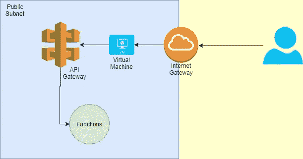
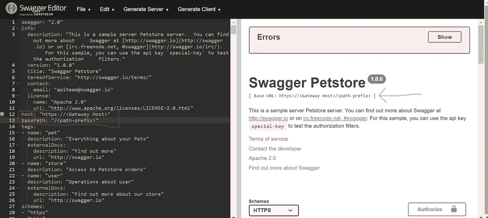

# 将 Swagger 与 Oracle API Gateway & Functions 集成的初学者指南

> 原文：<https://medium.com/geekculture/a-beginners-guide-to-integrate-swagger-with-oracle-api-gateway-functions-5bd0a5519ec7?source=collection_archive---------39----------------------->

Swagger API 文档生成以及与 Oracle API Gateway 的集成

# 概观

这篇博客将解释如何使用 Swagger 编辑器生成 Swagger API 文档，如何在计算实例上本地运行 Swagger UI，以及如何将 Swagger UI 与 Oracle API 网关集成。我会把 Oracle 博客链接的 API 网关和功能的创建。

注意:这里我已经在 Oracle 云基础设施中创建了架构，但是如果你使用 AWS 或 Azure，那么这个博客也会帮助你，因为要将 swagger 与 API Gateway 集成，我们需要在 swagger 文件中进行更改。

# 内容:

1.  架构设置
2.  Swagger 编辑器安装
3.  Swagger UI 和 API 网关集成

# 1.架构设置



OCI Architecture for Swagger by Vikas Gautam

## 1.虚拟云网络

首先，我们将创建一个带有互联网网关的 VCN，为此步骤是:

1.  打开导航菜单，选择网络，然后选择虚拟云网络(确保在隔离专区列表中选择了正确的隔离专区)。
2.  单击启动 VCN 向导。
3.  选择具有 Internet 连接的 VCN，然后单击启动 VCN 向导。
4.  填写 VCN 名称并选择区间，对于 CIDR 块，私有和公共子网范围选择默认值(CIDR=10.0.0.0/16，私有子网=10.0.0.0/24，公共子网=10.0.1.0/24)

在这里，向导将创建 VCN，并添加互联网和服务网关，我们也不需要做路由，因为向导会照顾它。

## 2.虚拟计算机

我们将在 VCN 的公共子网中创建一个计算实例，对于映像，我们将选择 **Centos7。**

创建计算实例的步骤如下:

1.  打开导航菜单，点击**计算**。在**计算**下，点击**实例**。
2.  点击**创建实例**。
3.  输入实例的名称。
4.  选择 **Centos7** 图像。
5.  外形 AMD 处理器 1 GB 和 1 个 OCPU。
6.  选择现有的 VCN 和公共子网，并分配公共 IP。
7.  为 ssh 生成或上传密钥。
8.  创建实例。

一旦创建了实例，您将看到附加到该实例的公共 IP，该公共 IP 将用于访问 swagger UI。

## 3.功能

我们将创建一个 Oracle 应用程序，然后在该应用程序中创建一个函数，并将其部署在 Oracle container registry 上。

完成后，您可以使用命令`fn invoke <application> <function>`并检查函数的响应。

要创建 Oracle 函数，请关注本博客[*https://docs . Oracle . com/en-us/iaas/Content/Functions/Tasks/Functions uploading . htm*](https://docs.oracle.com/en-us/iaas/Content/Functions/Tasks/functionsuploading.htm)

## 4.API 网关

我们将创建一个 public 类型的 Oracle 网关，并在该网关中创建一个部署。一旦完成，您将拥有类似于`https:asdafrgsvsgwg.../<path-prefix>/<path>`的部署端点

要创建 API 网关并添加 oracle 函数或 Rest APIs，请关注本博客[*https://blogs . Oracle . com/developers/creating-your-first-API-Gateway-in-the-Oracle-cloud*](https://blogs.oracle.com/developers/creating-your-first-api-gateway-in-the-oracle-cloud)

# 2.Swagger 编辑器安装

我们将在公共子网上创建的计算实例上安装 **swagger 编辑器**。在计算实例上安装 swagger 的步骤是

1.  通过用户`opc`使用 putty 和逻辑对实例进行 SSH。
2.  使用命令`sudo yum install git`安装 Git。
3.  安装码头工人[*https://docs.docker.com/engine/install/centos/*](https://docs.docker.com/engine/install/centos/)
4.  拉大摇大摆编辑器图像并运行它

```
sudo docker pull swaggerapi/swagger-editor
sudo docker run -d -p 80:8080 swaggerapi/swagger-editor
```

5.在公共子网安全列表中添加安全规则

```
0.0.0.0/0    TCP    ALL    443
0.0.0.0/0    TCP    ALL    80
0.0.0.0/0    TCP    ALL    3001
```

从 OCI 控制台获取这个实例的公共 Ip 并粘贴到浏览器上，你会看到带有宠物店项目的 swagger 编辑器页面。

更多关于 swagger 编辑器的信息，请点击 GitHub 链接[*https://github.com/swagger-api/swagger-editor*](https://github.com/swagger-api/swagger-editor)

## 3.Swagger UI 和 API 网关集成

首先，我们将使用 swagger 编辑器生成 swagger API 文档。

为此，我们只需要向 Swagger 编辑器 yaml 文件提供网关部署的主机和路径前缀。

网关主机将看起来像`[https://asdassdf....com](https://asdassdf...oracle.com)`

编辑 YAML 文件第 12 & 13 行，你的基本网址将变成`https://<Gateway Host>/<path-prefix>`

之后，您可以用您的路径和方法替换路径中的`/pet`和方法。

所以当你点击一个 API 时，完整的 URL 将变成`https://<Gateway Host>/<path-prefix>/pet`，你可以通过检查 swagger 编辑器点击的 curl 命令来验证这个 URL。



一旦你完成了修改，以 YAML 或 JSON 格式保存文件，提取 **swagger-ui** docker 镜像并运行 Swagger UI，请注意在下面的例子中我假设 swagger.yaml 文件存在于`./home/opc/swagger.yaml`中。

```
sudo docker pull swaggerapi/swagger-ui
sudo docker run -d -p 3001:8080 -v /home/opc/swagger.yaml:/swagger.yaml -e SWAGGER_JSON=/swagger.yaml  swaggerapi/swagger-ui
```

现在您可以使用`public ip:3001`访问 Swagger UI。

# 结论:

将 Swagger 与 API 网关集成非常容易，因为我们只需要提供网关的主机和部署的路径前缀。Swagger 也非常有用，因为它为我们提供了很好的用户界面，节省了我们使用 CURL 命令的时间。

如果你的目标只是为前端开发者或非技术用户公开 API，那么 Swagger 是值得推荐的。

# 接下来是什么:

我写关于 Web 应用和 CloudNative 方法的博客，你会在这里找到许多有趣的博客[【https://medium.com/@vgautam99】T2](/@vgautam99)

对于未来的博客，请在 Medium 上关注我，我会感谢这个博客上的掌声。