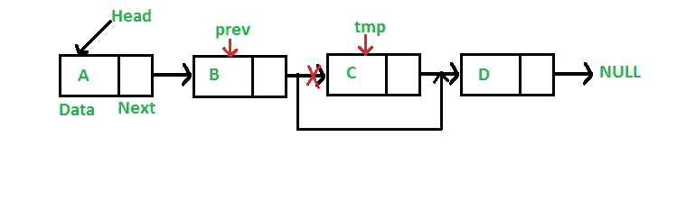
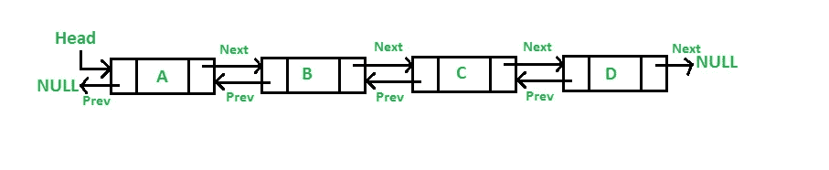

# 链表初学者指南

> 原文：<https://medium.com/geekculture/a-beginners-guide-to-linked-list-a6de7b78ddfb?source=collection_archive---------33----------------------->

数据结构是 web 开发人员组织和管理数据的有用工具。它们允许通过对数据进行操作的函数进行有效的访问和修改。您在编码过程中可能遇到过的数据结构的例子有数组、树和散列(或称为对象或字典)。

在这篇文章中，我希望对计算机科学中使用的一种熟悉的数据结构——链表提供一个小的介绍。更重要的是，重点关注单向链表(SLL)(其他链表类型将在下面详细讨论)。

# 什么是链表？

顾名思义，链表是一个链接在一起的列表。列表的每个部分被称为一个**节点**，每个节点将包含两个字段:一个字段用于存储数据，另一个是“链接”，一个指针引用列表下一部分的内存地址。根据这个定义，每个节点指向位于内存不同部分的其他节点。

一个 LL 有两个部分，头和尾。头指向链表的第一个节点，尾指向最后一个节点或头之后的链表的其余部分。


A typical pictorial representation of a SLL

关于最后一个节点的一个微妙的注意，它总是指向 NULL 作为下一个元素，表示链表的结束。

list 的另一个非常重要的方面是**长度**，它被定义为 LL 中节点的**数量。**上面的 LL 长度为 3。

就像我们可以有一个空数组一样，空 LL 被定义为只有 NULL，长度为 0。

总之，链表是相互指向的节点的集合，其中最后一个节点的“next”指针指向 NULL，即 LL 的结尾。

所以你可能会想‘与数组或散列相比，LL 会带来什么呢？我可以在以后的编码生涯中只使用这两种数据类型，而不必担心链表。

为了回答这个问题，想象使用一个数组，你需要在中间插入一个新元素。典型的算法是:

1.  查找要插入元素的索引
2.  从索引复制到数组的末尾
3.  在索引前插入新元素
4.  将复制的数组追加到新元素之后

这是可行的，但是如果数组很大，在步骤 2 中复制的数组部分会占用额外的内存空间，并且计算量很大。

使用 LL，只需创建一个节点，并找到您想要在其之前/之后插入的节点的位置，然后设置一个从旧节点指向新节点的指针。这意味着您可以在 LL 的开头、中间和结尾插入节点。


至于移除，算法是非常相似的，并且 LLs 使得它非常容易；让指针指向链接到要删除的节点的节点。



如您所见，与数组相比，在 LL 中插入和删除元素确实更有效(当然，除非您有特殊的函数)。

当然，并不是所有的东西都是有 ll 的彩虹。以下是一些缺点:

1.  您不能使用 LL 执行随机访问。
    这意味着，不像你可以用索引访问数组中的元素，你必须执行线性搜索，遍历每个节点来找到你需要的节点。
2.  指针占用空间
    因为指针“指向”内存中的一个地址，所以它仍然是数据(4 或 8 字节，取决于你的机器)并占用空间。

# 一个例子——LL 的长度

更具体地说，我们将实现一个方法来计算 ll 的长度。假设我们已经有了一个 ll 的实现，我们的函数将被传递到 LL 的头部，返回节点数。

```
// Finding the length of a LL, Node.js
const length = (head) => {
  let temp = head;
  let count = 0; while (temp) {
    count ++;
    temp = temp.next;
  }return count;
}
```

一步一步地经历这个过程:

1.  将变量`count`初始化为 0，以跟踪节点的数量，并将`temp`初始化为存储头指针，这样我们就不会改变 LL
2.  利用`null`表示 LL 结束的性质，我们基于这一事实进行循环；当指针`head`不在末端时，我们递增计数器
3.  在列表中，我们将`head`指针移动到下一个节点

通过分析，我们注意到两件事，我们已经处理了空 LL ( `head === null)`将返回 0 的情况，并且我们已经避免了命令`head = head.next`中的无限循环。

> 您可能会注意到每个节点都有相似的格式；LL 的结构非常适合**递归。**
> 
> **挑战:尝试使用递归重写上面的长度函数。**

# 另一个例子是删除一个节点

这是另一个显示节点删除的例子。将向该函数传递一个头指针和一个值，该值用于查找包含它的节点，并从 L1 和存储器中删除所有节点。

```
// When deleting nodes, we need to keep track of the previous once since
// we need to connect it back to the node after the deleted oneconst delete = (head, value) => {
  // variables to keep track of the previous and temporary one 
  let prev;
  let temp = head; // looping to look for the node that contains the value
  while(temp && temp.data !== value) {
    prev = temp;
    temp = temp.next
  } // here I set the prev node to the temp node next and then fix the     pointer 
  // and then re assign the found node 'next' value to null. prev.next = temp.next
  temp.next = null;
  return head;}
```

# 双向链表

单向链表之所以是单向的，只是因为每个节点都指向“向前的方向”。要“返回”，我们只需添加另一个指向前一个节点的链接。



这再次增加了插入和删除方法的复杂性，并且因为需要另一个指针而增加了内存。

# 结论

总的来说，ll 是非常值得学习的数据结构，因为它们对于学习指针算法以及数组和散列的替代工具非常有用。

如果我犯了错误，请随时与我联系，纠正我的错误。

# 参考资料和资源/实践

[https://www.geeksforgeeks.org/data-structures/linked-list/](https://www.geeksforgeeks.org/data-structures/linked-list/)

[http://cslibrary.stanford.edu/103/LinkedListBasics.pdf](http://cslibrary.stanford.edu/103/LinkedListBasics.pdf)