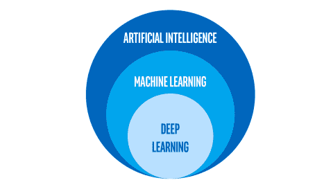
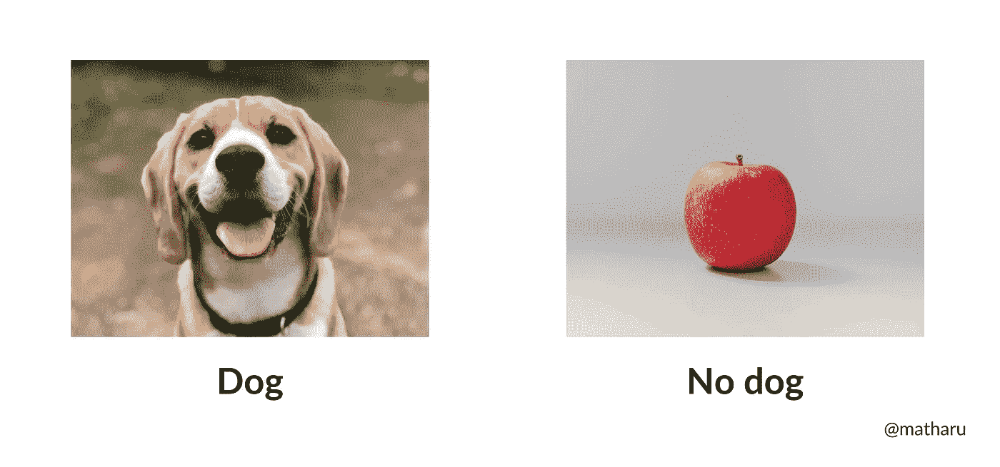
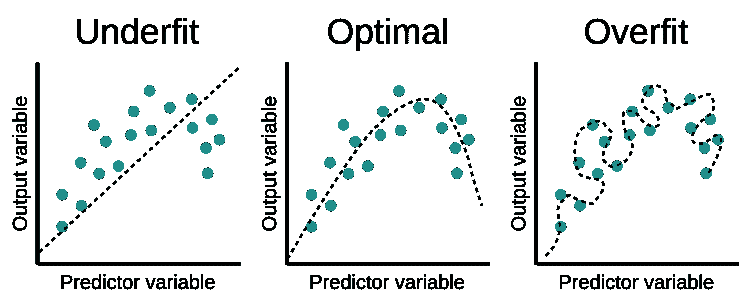
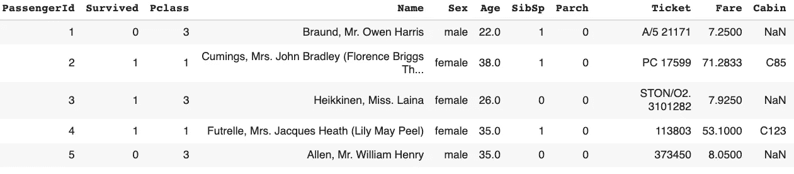
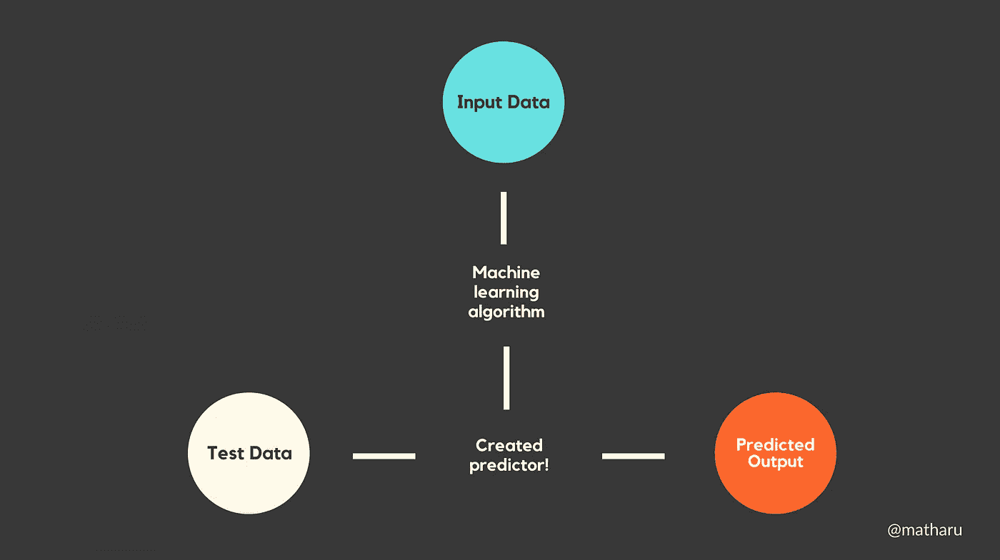
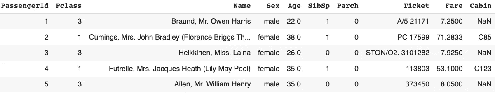
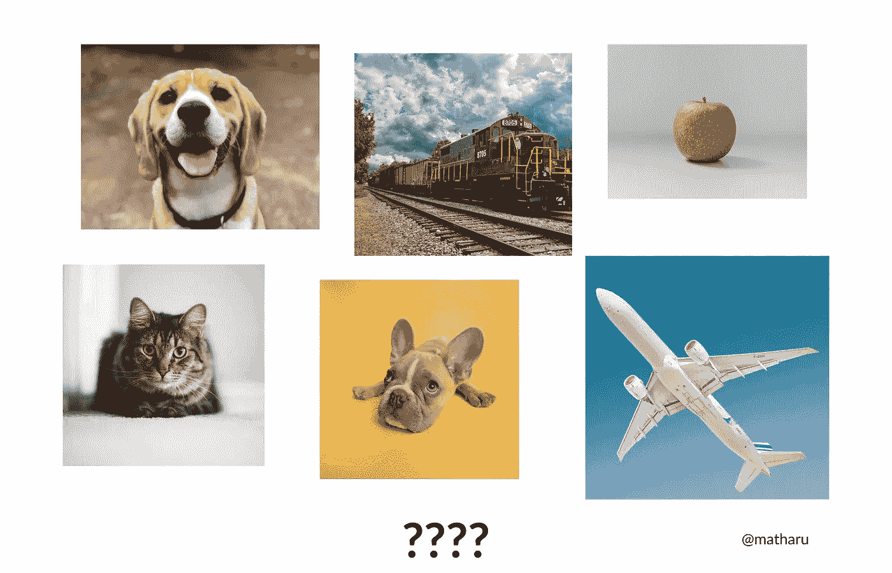
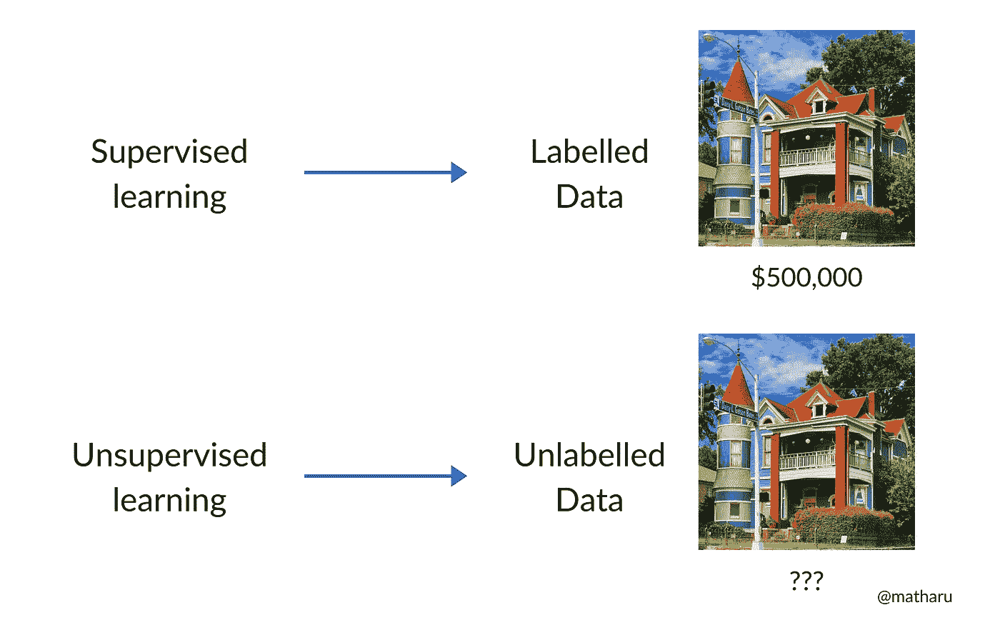

# 机器学习初学者指南

> 原文：<https://medium.com/geekculture/a-beginners-guide-to-machine-learning-8fa5d5f9350?source=collection_archive---------21----------------------->

人工智能、机器学习、神经网络——本世纪最热门的词汇。它们被如此频繁地使用，以至于它们的定义开始被扭曲，我们开始超越自己。

AI 会接管世界吗？如果 AI 这么聪明，AI 能创造 AI 吗🤯？！

在这篇文章中，我的目标是让你对这些领域有更好的理解，所以下次你使用这些花哨的词汇时，你就知道你在说什么了😊。

**目标受众级别:**无！单纯好奇，想多了解一下 AI！

# 什么是人工智能、机器学习、深度学习？

这三个术语经常混淆，所以首先要了解它们的区别。

Fields within fields. [Source](https://towardsdatascience.com/artificial-intelligence-vs-machine-learning-vs-deep-learning-2210ba8cc4ac)

**人工智能(AI):** 计算机所做的一切智能的总称！人工智能是关于创造能够为我们做很酷的任务的机器，比如计算机视觉和语音识别。

**机器学习(ML):** 可以使用算法从数据中学习的 AI 子集。基本上，ML 是让计算机为我们做任务，而不需要明确地编码指令。它会自己找出逻辑。

**深度学习(DL):** 类似于 ML，但试图模仿人类大脑的结构。它使用一种叫做“神经网络”的东西(neural - >来自人脑的神经元！)，我们会在以后的文章中讨论！你可能知道的大多数人工智能应用实际上都是深度学习，例如自动驾驶汽车或你房间里的 Alexa。

# 机器是如何学习的？

这是我刚开始学习 ML 时经常问自己的问题。重要的是要明白，机器不会自己“学习”，而是依赖于两个东西:**数据和算法**。

> 数据是新的石油。—克莱夫·亨比

数据只是真实世界的信息。一旦你有了足够的数据，它就会被传递到一个算法中。算法基本上是一些疯狂的数学，能够学习数据中的不同模式，以获得所需的结果。

假设你试图预测一幅图像中是否有一只狗。这些数据可能是一些狗的图像，也可能是一些随机的物体。这些图像将被传递到某种算法中。最初，该算法会做得非常差，因为它没有学习到导致正确分类的重要特征。

那么，人类如何识别某物是狗还是随机物体呢？我们看像耳朵、爪子和尾巴这样的东西，因为这些特征表明有一只狗。随着时间的推移，机器也开始理解这些相同的功能。而瞧，你已经创建了一个机器学习模型(一些数据+算法)！

## 过度拟合和欠拟合问题

ML 中一个极其重要的思想是过度拟合和欠拟合之间的权衡。

想象一下前一天晚上准备一场大型数学考试。你真的想在明天的考试中取得好成绩，所以你开始做一些去年考试中的练习题。

你继续做一个又一个问题，而不是学习实际的概念，你开始记忆练习题的答案。

第二天，你在做测试，你在流汗，因为问题和昨晚的略有不同。而且你既然没理解概念，就不能把你的知识概括成稍微修改的题。

在 ML 的世界里，同样的事情经常发生。该模型以这样一种方式学习，它不是从数据中学习重要的模式，而是几乎开始记忆它。正因为如此，它在现实世界中不能做太多事情，因为数据可能会有所不同！这叫做“**过拟合**”。

现在让我们假设前一天晚上，你没有学习太多，所以你没有真正学到概念，不会做一些练习题。做测试的时候，因为没学过，所以不会做试题！

在 ML 中，这被称为“**欠拟合**”，因为机器从未真正理解你传递给它的数据中的模式，因此，在现实世界中也不能做得很好！

Dotted line represents what the model predicts. Left graph does not match the data trend. Right graph matches it too well. The middle is the ideal case. [Source](https://www.educative.io/api/edpresso/shot/6668977167138816/image/5033807687188480)

所以在 ML 中，你经常想找到“最佳点”，在这个点上，机器能够学习足够多的知识来做得很好，但不会开始记忆数据。

在本文中，我想更多地关注 ML，并讨论 ML 的三种主要类型——监督学习、非监督学习和强化学习。

# 监督学习

假设你试图预测泰坦尼克号上的一名乘客是否幸存。是的，这有点随机，但对初学者来说最好的数据集之一是[泰坦尼克号数据集](https://www.kaggle.com/c/titanic)。

在这个问题中，您将获得数据集中每个乘客的不同特征。这是数据的快照。

Headings represent features in the dataset.

你可能还注意到有一个“幸存”栏。1 表示乘客幸存，0 表示没有。

这个监督学习问题的目标是创建一个 ML 模型，它可以接受随机乘客的这些细节，并预测他们是否幸存。

该机器接收乘客的不同特征以及输出变量——“幸存”。从这里开始，它开始学习数据集中的不同模式，并找出逻辑来匹配所需的输出。最终，它将能够接纳一名新乘客，并预测他们是否幸存！

Supervised learning workflow. Starts at the top and ends with predicted output.

这被称为**监督学习**——传入带有“答案”或与之相关的输出变量的数据。然后，它可以预测从未见过的数据的正确“答案”。

## 两种监督学习

**回归**:预测一个**连续**输出变量。让我们假设您正在创建一个预测房价的模型。这将是一个回归问题，因为房价可以取任何值，因此是连续的。

**分类**:预测一个**离散**输出变量。上面的泰坦尼克号问题是分类的一个例子，因为该模型预测一名乘客是幸存(1)还是死亡(0)。中间没有值；不是 1 就是 0。

## 监督学习算法

有这么多不同的监督学习算法，你可以用来解决你的问题。根据问题的不同，一些算法可能会比其他算法更好，所以你的工作就是四处试验，看看什么有效！

*   线性回归
*   逻辑回归
*   支持向量机(SVM)
*   朴素贝叶斯
*   决策图表
*   最近的邻居

# 无监督学习

监督学习和非监督学习之间有细微的区别。所以，我们来修改一下上面的数据集。

让我们删除整个“幸存”栏，而不是告诉机器每个乘客是否幸存。现在，你只剩下每个乘客的一些特征。你会用这些数据做什么？？

Titanic dataset **without** output variable column.

实际上你可以做很多事情，因为机器可以开始在不同的特征之间建立不同的联系。

您可以执行类似于客户细分的操作，机器会根据乘客的特征将他们分成不同的部分。

您可能还想检测数据集中的异常值，如泰坦尼克号上的超级富豪。

🤖 : What are these images?

为了进一步解释无监督学习，让我们回到狗分类器。在无监督学习中，数据只是一堆狗和其他物体的图像，但机器不知道这些图像是什么，因为没有提供输出。因此，它可能会尝试根据具有相似特征的对象找出并分解数据。

这些例子是**无监督学习**的类型——数据没有与之相关的“答案”，因此模型会自己发现模式。

The difference is simple.

## 无监督学习算法

以下是一些无监督学习算法:

*   k 均值聚类
*   异常检测
*   主成分分析

# 强化学习

强化学习和上面两个有点不同，我们再举一个例子。

假设你想做一个可以在跳棋游戏中击败某人的 ML 模型。现在，机器将如何学习？对于这种类型的问题，你不能像在上述问题中那样处理经典数据。

相反，有几个不同的部分:

**代理**:玩游戏的程序
**环境**:跳棋游戏
**动作**:代理可以做出的招式
**奖励**:游戏输赢

基本上，代理会玩一个跳棋游戏，最初它会做一些随机的移动。代理在开始时很有可能会失败，所以它会从中吸取教训，下次采取更好的行动。

最终，经过大量的学习，代理将能够与人类进行一场竞技游戏！

*注意:这些解释很多都是简化的，幕后还有很多。我让这篇文章简单易懂。*

# AI 会接管我们的世界吗？

这是一个今天被问到的如此普遍的问题，所以我不得不把它扔到这篇文章里。诚然，机器学习在识别哪些电子邮件是垃圾邮件，或者推荐在网飞上看什么电影等任务上令人难以置信。

但是，这些 ML 模型仍然是用精心的人工构造创造出来的。如果没有好的数据和算法，一台机器真的不能自己学习。

AI 不具备(暂时也不会具备)的一点是人类的情商。情商在日常决策和现场批判性思考中非常重要。没有这一点，人工智能就很难复制人类的行为。

我不想打击你，但是我们不会很快有一个终结者世界。

# TL；速度三角形定位法(dead reckoning)

*   深度学习是机器学习的一种特定形式。机器学习是机器如何使用数据和算法进行学习。人工智能是计算机所做的一切智能的总称。
*   机器学习的三种类型:有监督的、无监督的和强化学习
*   监督学习——对标记数据的训练
*   无监督学习——对未标记数据的训练
*   强化学习——与上述两种不同，它是关于一个试图通过试错来学习的主体

**如果你喜欢这篇文章:**

*   请随意鼓掌👏
*   在 [LinkedIn、](https://www.linkedin.com/in/yashmatharu/)上与我联系，或者查看我的[网站](http://www.yashmatharu.com/)以了解更多关于我的信息！