# . NET5 中使用 NET5 进行机器学习的初学者指南—第一部分

> 原文：<https://medium.com/geekculture/a-beginners-guide-to-machine-learning-using-ml-net-in-net5-part-i-ac8f8686470a?source=collection_archive---------2----------------------->

## 构建人工智能驱动的 API，在短短 10 分钟内分析客户反馈


Photo by [Kevin Ku](https://unsplash.com/@ikukevk?utm_source=unsplash&utm_medium=referral&utm_content=creditCopyText) on [Unsplash](https://unsplash.com/s/photos/machine-learning?utm_source=unsplash&utm_medium=referral&utm_content=creditCopyText)

无论你是刚刚开始学习机器的 a.NET 开发者，还是试图找出最适合你的用例的机器学习模型的专家，这篇文章都是为你准备的！

在这篇文章中，我们将讨论什么是 ML.NET。在. NET5 中使用 ML.NET 将机器学习添加到您的服务和应用程序有多容易

我们还将看到如何使用 AutoML 构建、训练、评估和使用机器学习模型。例如，我们将创建一个 API 来分析客户反馈并自动检测情绪。

因此，没有进一步的原因，让我们开始吧！

## 什么是 ML。网？

当谈到机器学习和数据科学时，Python 被认为是一种首选语言，因为它简单并且可以访问很棒的库和框架。

数据科学家喜欢使用各种 ML 框架(如 TensorFlow、Scikit Learn 等)用 Python 训练他们的模型；而应用程序开发人员通常会使用其他编程语言来集成和使用这些模型，如 C#、Java 等。

因此，以无缝的方式将 ML 模型交付到产品中已经成为许多组织的一个痛点(由于技术和框架之间的差异)。

【ML.NET[T4 是微软对这个问题的回答。这是一个开源的跨平台机器学习框架，allows.NET 开发者可以在。网络生态系统。](https://dotnet.microsoft.com/apps/machinelearning-ai/ml-dotnet)

> 有了 ML.NET，您可以立即将定制的 ML 模型投入生产。

## 你能用 ML 做什么？网

ML。NET 允许您基于各种用例构建世界级的人工智能模型和应用程序——没有限制。查看这个[库](https://github.com/dotnet/machinelearning-samples/blob/main/README.md)，它包含了各种各样的样本，例如:

*   情感分析
*   垃圾邮件检测
*   欺诈检测
*   产品/电影推荐
*   价格预测
*   销售预测
*   异常检测(信用卡欺诈)
*   图像分类训练
*   目标检测

## ML 有什么特别的。网？

ML。NET 打包了一个强大的工具机制，叫做模型构建器。它通过自动化 ML(或 AutoML)简化了模型构建过程，使得开发人员只需加载数据就可以非常容易地建立和运行他们的模型。AutoML 负责模型构建过程的其余部分，包括使用这些模型的代码生成。

它还允许您利用流行的 ML 库，如 TensorFlow、 [ONNX](https://github.com/onnx/onnx) ，并在中使用这些模型。NET 使用 ML.NET。

## **它与 ML 框架相比如何？**

ML.NET、 [scikit-learn](https://scikit-learn.org/) 和 [H20](https://github.com/h2oai) 之间有一个[有趣的评估](https://arxiv.org/pdf/1905.05715.pdf)，它使用了巨大的(9GB)亚马逊评论数据集。

以下是关键要点:

*   Scikit-learn 和 H20 无法完成完整数据集的处理过程，遇到了内存错误。
*   ML。对于一个较小的子集(900MB)，NET 在准确性和运行时间方面都优于这两种框架。

## 如何开始使用 ML？网？

ML。NET 模型生成器当前是一项预览功能，因此您需要在 Visual Studio 中启用它。

需要 [Visual Studio 2019 16.6.1](https://visualstudio.microsoft.com/thank-you-downloading-visual-studio) 或更高版本。

*   转到工具→选项→环境→预览功能
*   确保选中“启用 ML.NET 模型生成器”，如下所示

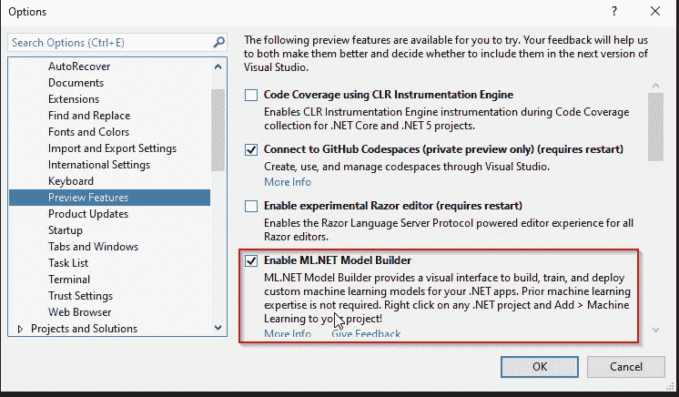

Visual Studio — Preview Features

如果在“预览功能”列表中没有看到 ML.NET 模型生成器，您需要运行 Visual Studio 安装程序并安装 ML.NET 模型生成器组件，该组件可以在。NET 核心跨平台开发工作量。

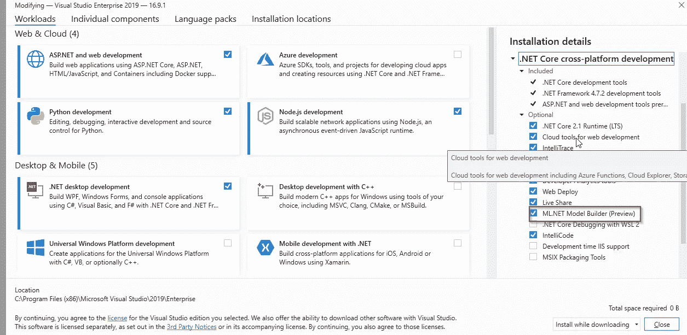

Visual Studio Installer —Install ML.NET Model Builder

我们现在可以使用 Visual Studio 创建一个新的**ASP.NET Web API 项目**。

让我们添加一个 API 控制器。API 将采用单个参数——customer feedback，并使用机器学习和基于正面和负面情绪的预测分数来执行情绪分析。它还会根据预测的意图返回消息。

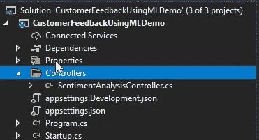

我们稍后将回到 API 部分。让我们在这个项目中加入机器学习支持。

**添加机器学习支持**

右键点击项目，选择添加→机器学习。

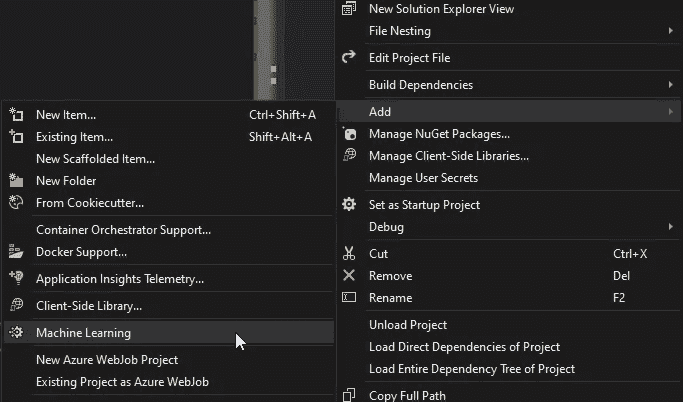

**2。选择一个场景**

这将在一个新窗口中打开模型构建器，如下所示:

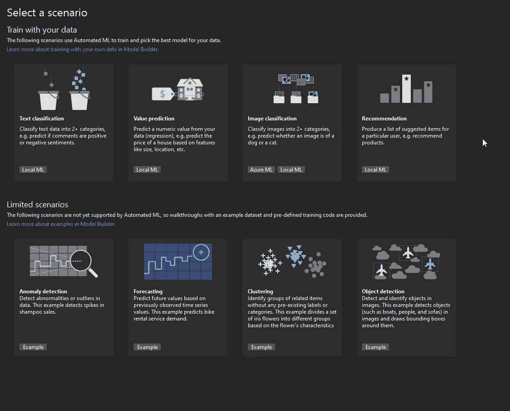

因为我们正在构建一个情感分析服务，所以我们将选择“文本分类”场景。

**3。选择培训环境**

训练环境是我们的模型将被训练的地方。在文本分类场景中，它是我们的本地机器。因此，我们只需点击“数据”进行下一步。

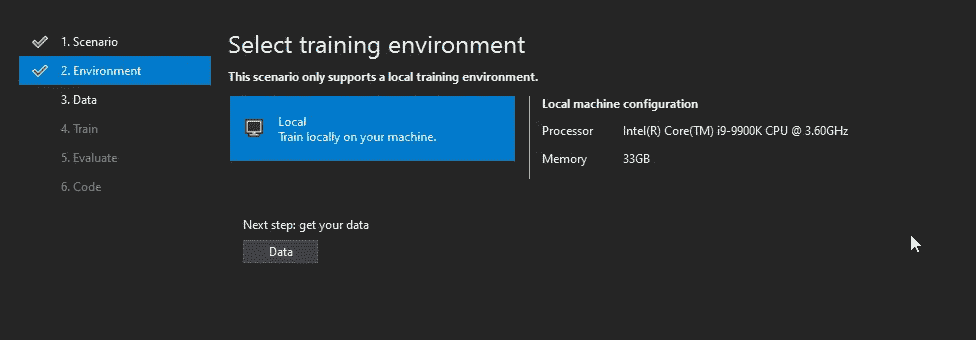

**4。添加数据**

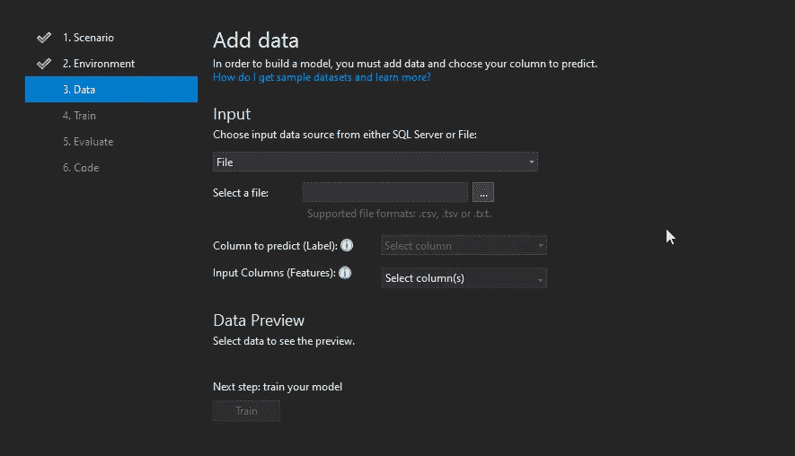

为了建立一个模型，我们需要一个数据集。我们将使用 [UC Irvine 机器学习库](http://archive.ics.uci.edu/ml/datasets.php)，它包含超过 588 个数据集，可用于各种目的。

对于情感分析，我们将使用 [UCI 情感标注句子数据集 ZIP 文件](http://archive.ics.uci.edu/ml/machine-learning-databases/00331/sentiment%20labelled%20sentences.zip)。

该数据集包含 TSV 文件，其中包含来自亚马逊、IMDB 和 Yelp 的客户评论。

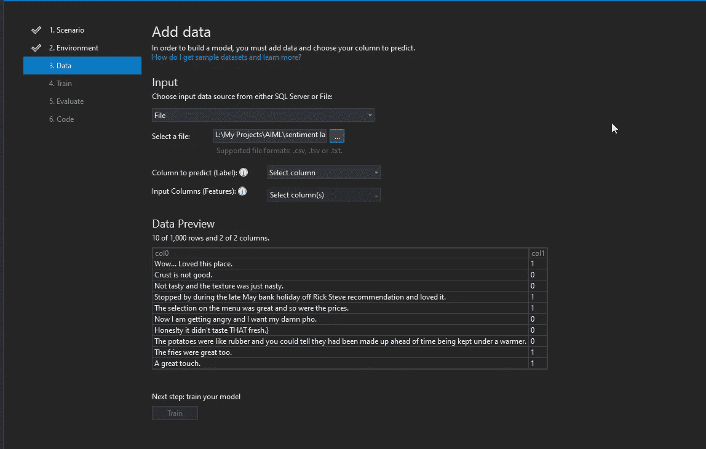

输入数据源

ML Builder 允许从文件和 SQL Server 数据库中选择输入源。

因为我们有 TSV 文件，所以我们将选择文件作为输入数据源。

我们的数据集中有三个文件，在本例中，我们将选择 yelp 数据集，即:yelp_labelled.txt

*   要预测的列→我们选择“col1 ”,它包含我们要预测的输出值，例如 0 或 1。
*   输入列→这些列包含用于预测的特性，在我们的例子中是 col0。

现在，我们准备好训练我们的模型→单击“训练”进入下一步

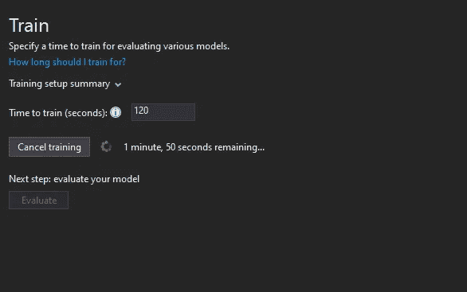

模型构建器使用 AutoML，该工具会探索多个模型，然后选择性能最佳的模型。默认值为 10 秒。但是，如果您允许它训练更长的时间，AutoML 将探索更多具有更广泛设置的模型。对于我们的例子，让我们训练模型 120 秒。

点击“开始培训”，培训开始后，您会在“输出窗口”中看到培训进度，如下所示:

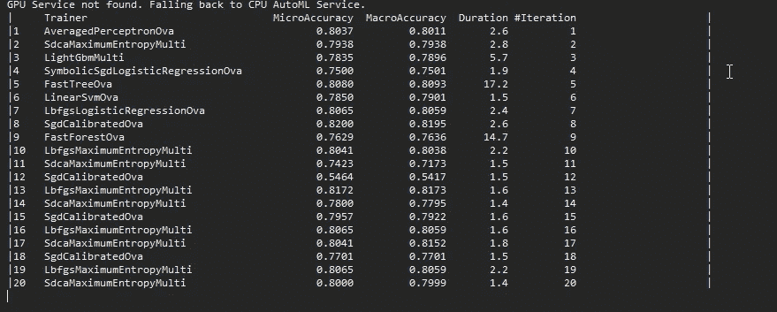

培训结束后，您将能够看到完整的总结。

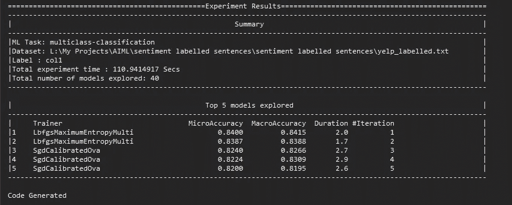

你可以看到，它探索了各种模型，并自动选择了最佳模型，准确率为 84%。

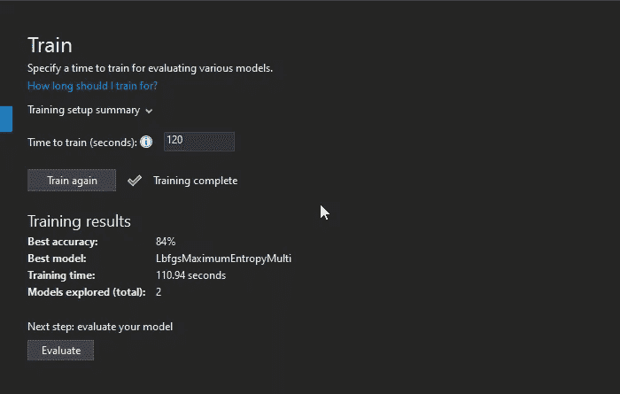

下一步是评估各种样本输入的模型。

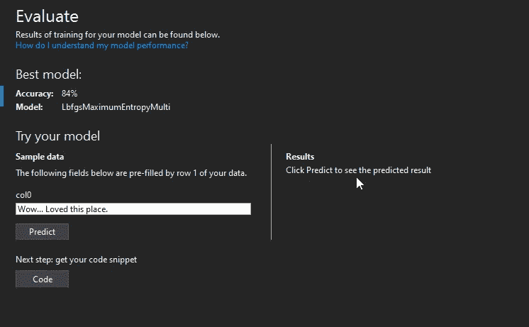

让我们提供一些负面反馈，看看模型是否能够检测到意图。


我们可以看到，结果包含 0(88%)的机会是消极的，并显示 12%的机会是积极的。

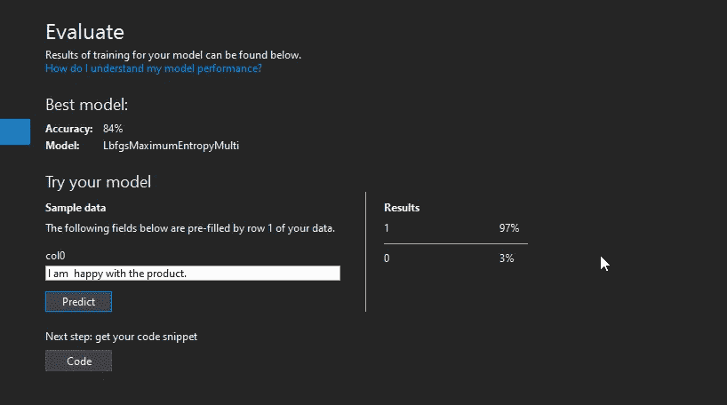

在上面的例子中，我们提供了积极的反馈，模型显示有 97%的机会是积极的。

该模型似乎运行良好，因此我们准备生成代码并将其与我们的 web API 集成——单击“代码”将创建消费 ML 模型所需的项目。

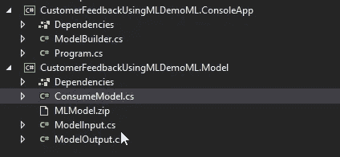

它还生成了可用于测试模型的控制台应用程序。

让我们研究一下 Program.cs 文件:

```
ModelInput sampleData = new ModelInput(){Col0 = @"This is horrible!",};// Make a single prediction on the sample data and print resultsvar predictionResult = ConsumeModel.Predict(sampleData);Console.WriteLine("Using model to make single prediction -- Comparing actual Col1 with predicted Col1 from sample data...\n\n");Console.WriteLine($"Col0: {sampleData.Col0}");Console.WriteLine($"\n\nPredicted Col1 value {predictionResult.Prediction} \nPredicted Col1 scores: [{String.Join(",", predictionResult.Score)}]\n\n");Console.WriteLine("=============== End of process, hit any key to finish ===============");Console.ReadKey();
```

我们可以看到通过简单地调用 ConsumeModel 的 Predict 方法来消费模型是多么容易。

## 引擎盖下是什么？

让我们探索一下自动生成的项目→ ML。模型

该项目包含以下文件:

1.  ModelInput.cs 和 ModelOutput.cs 是我们输入和输出数据的模型类。

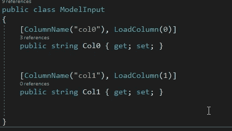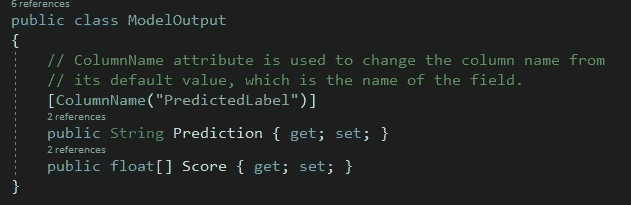

3.MLModel。活力

这个 Zip 文件包含了我们训练的 ML 模型所需的所有文件。

4.消费者模型

```
public class ConsumeModel{private static Lazy<PredictionEngine<ModelInput, ModelOutput>> PredictionEngine = new Lazy<PredictionEngine<ModelInput, ModelOutput>>(CreatePredictionEngine);// For more info on consuming ML.NET models, visit https://aka.ms/mlnet-consume// Method for consuming model in your apppublic static ModelOutput Predict(ModelInput input){ModelOutput result = PredictionEngine.Value.Predict(input);return result;}public static PredictionEngine<ModelInput, ModelOutput> CreatePredictionEngine(){// Create new MLContextMLContext mlContext = new MLContext();// Load model & create prediction enginestring modelPath = @"[Root_Path]\MLModel.zip";ITransformer mlModel = mlContext.Model.Load(modelPath, out var modelInputSchema);var predEngine = mlContext.Model.CreatePredictionEngine<ModelInput, ModelOutput>(mlModel);return predEngine;}
```

在这个文件中，AutoML 简单地创建了消费 ML 模型所需的方法。(您可能需要更改 MLModel.zip 文件所在的 modelPath 变量)。它使用 PredictionEngine 类，该类用于对预训练模型进行单次预测。

是时候将这个函数公开为 API 了，所以我们将修改我们的 SentimentAnalysis 服务如下:

```
[HttpGet]
public JsonResult  AnalyzeFeedback(string feedback)
{
      try
     { ModelInput _data = new(); _data.Col0 = feedback; var predictionResult = ConsumeModel.Predict(_data); return Json(new  { Prediction = predictionResult.Prediction, Score = predictionResult.Score  }); }catch (Exception ex) {return Json(new
{
    Error="Unable to Consume Model" });
}}
```

让我们构建项目并运行 API。我们将使用负面和正面的反馈来测试 API，看看我们的服务是否能够预测情绪。

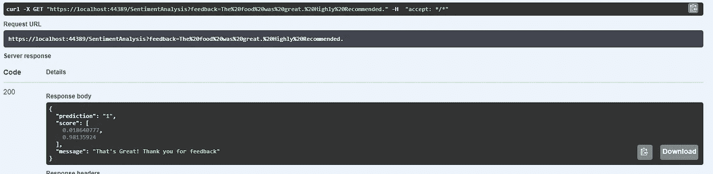

Sentiment Analysis API — Positive Feedback

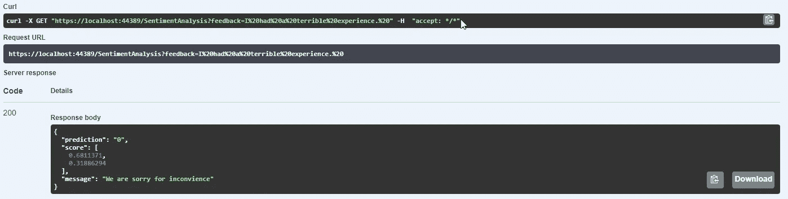

Sentiment Analysis API — Negative Feedback

就是这样！您已经成功创建了一个 API，它使用机器学习来执行情感分析，以预测客户的意图。

在许多商业案例中，情感分析可以增加巨大的价值。例如下面给出的:

*   客户反馈
*   客户支持
*   社交媒体监控
*   产品分析
*   市场调查

注意:你可以从这个 [Github repo 下载本文使用的完整源代码。](https://github.com/csehammad/SentimentAnalysisDemo/)

## 结论

这是对 ML.NET 的介绍。正如我们所见，使用 C#通过 ML.NET 构建机器学习应用程序非常容易。有了这个框架，微软使得。犹豫是否学习 python 来构建机器学习应用程序的. NET 开发人员——作为. NET 开发人员，您可以重用您现有的技能和库。

话虽如此，ML.NET 并没有试图让 python 爱好者和数据科学家远离它。事实上，它允许应用程序开发人员集成来自 Python 的预训练模型(例如，您可以使用 PyTorch 训练模型，并将其导出为 ONNX 格式，然后可以在中使用。NET 使用 ML。网)。

感谢您的阅读，请继续关注第二部分(其中将讨论更高级的场景和业务案例)。