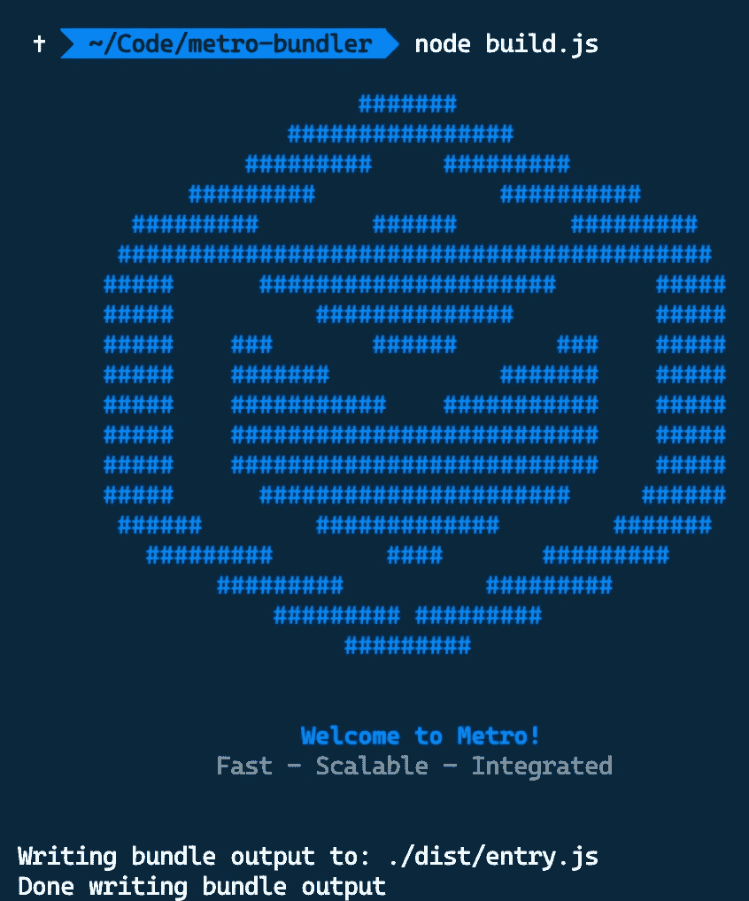

# 地铁捆绑器初学者指南

> 原文：<https://medium.com/geekculture/a-beginners-guide-to-metro-bundler-f639d641468b?source=collection_archive---------13----------------------->


Photo by [Markus Spiske](https://unsplash.com/@markusspiske?utm_source=medium&utm_medium=referral) on [Unsplash](https://unsplash.com?utm_source=medium&utm_medium=referral)

如果你有使用 [React Native](https://reactnative.dev/) 开发一些项目的经验，你可能已经接触过这个术语`metro bundler`，因为它实际上是捆绑 React 原生代码的捆绑器，允许你的代码与原生移动应用很好地工作。

一切开箱即用，无需任何配置*(向 RN 团队致敬)*但您是否想过我们是否可以将`metro`用于非 React 原生应用？

# 什么是捆扎机？

在我们试图理解`metro`如何工作之前，也许有必要先了解一下 bundler 的概念以及它的用处。

从 10，000 英尺的角度来看，`bundler`本质上是一个系统，它打包了您编写的所有不同的 JavaScript 文件，并生成一个 JS 文件，然后您可以用它来运行您的 JavaScript 应用程序。一般来说，`bundler`构建一个`dependency graph`来维护不同 JavaScript 文件的关系，最终会产生一个或多个 JS 包。

`Bundler`在现代 JavaScript 开发中特别有用，因为现代 JavaScript 在很大程度上依赖于[模块系统](https://developer.mozilla.org/en-US/docs/Web/JavaScript/Guide/Modules)，这简单地意味着我们不是编写一个巨大的 JS 文件，而是将它们分解成一个更小的、可管理的、模块化的 JS 文件。`module system`的一些例子是 *CommonJS、AMD、RequireJS 和 ES(ECMAScript)6 模块。*

现在我们知道了`bundler`的用途，那么市面上有哪些`bundler`呢？嗯，事实证明，其实有很多选择供你选择，比如 [rollup](https://rollupjs.org/guide/en/) 、 [webpack](https://webpack.js.org/) 、 [parcel](https://parceljs.org/) ，当然还有我们今天的重头戏 [metro](https://facebook.github.io/metro/) 。

# 地铁循序渐进教程

如前所述，我们将探索`metro`，看看我们如何在非`react-native`环境中使用它，以便更好地了解`metro`。在我们继续之前，我真的希望你对一些基本的 web 开发有一些先决知识。不要烦恼！我会尽量详细。

1.  让我们创建一个空的存储库，并将其初始化为 NPM 项目

```
mkdir my-app && cd my-app && npm init -y
```

一旦您执行了上面的命令，`package.json`已经生成，我们可以继续第二步了。

2.安装安装`metro`所需的依赖项

```
npm install --save-dev metro metro-core
```

这是设置`metro`所需的唯一两个依赖项。

3.用你想要的名字创建一个新文件，这里我将命名为`build.js`，并将下面的内容粘贴到文件中

```
const Metro = require('metro');Metro.loadConfig().then(*async* config => {
  Metro.runBuild(config, {
    entry: './src/entry.js',
    out: './dist/entry.js'
  });
});
```

本质上，我们是说当我们运行`build.js`时，我想加载`metro`来创建一个包。我们提供了两种选择

*   `entry` —我们将要编写的 JavaScript 源文件
*   `out`—`metro`应该生成到的文件名和位置

信不信由你，这就是你设置`metro`所需要做的一切！剩下的所有步骤只是编写一些 JavaScript 文件并查看结果。

请注意，尽管我们使用了`src`和`dist`，但它们只是普通的回购，我们这样命名只是出于行业标准

4.创建两个文件夹`src`和`dist`，因为我们在`build.js`中定义了它。如果您没有在`build.js`中指定`./src`和`./dist`，此步骤是可选的

```
mkdir src && mkdir dist
```

5.在`src`文件夹中创建`entry.js`,并简单地放入如下日志

```
console.log('It works!')
```

6.执行命令。执行以下命令时，请确保您位于根文件夹

```
node build.js
```



如果你看到上面的结果，我们可以继续看一下由`metro`创建的文件。继续打开`dist`文件夹中的文件`entry.js`，您应该会看到如下内容

```
var __BUNDLE_START_TIME__=this.nativePerformanceNow?nativePerformanceNow():Date.now(),__DEV__=false,process=this.process||{},__METRO_GLOBAL_PREFIX__='';process.env=process.env||{};process.env.NODE_ENV=process.env.NODE_ENV||"production";!(function(e){"use strict";e.__r=i,e[`${__METRO_GLOBAL_PREFIX__}__d`]=function(e,n,o){if(null!=t[n])return;const i={dependencyMap:o,factory:e,hasError:!1,importedAll:r,importedDefault:r,isInitialized:!1,publicModule:{exports:{}}};t[n]=i},e.__c=o,e.__registerSegment=function(e,r,n){p[e]=r,n&&n.forEach(r=>{t[r]||h.has(r)||h.set(r,e)})};var t=o();const r={},{hasOwnProperty:n}={};function o(){return t=Object.create(null)}function i(e){const r=e,n=t[r];return n&&n.isInitialized?n.publicModule.exports:d(r,n)}function l(e){const n=e;if(t[n]&&t[n].importedDefault!==r)return t[n].importedDefault;const o=i(n),l=o&&o.__esModule?o.default:o;return t[n].importedDefault=l}function u(e){const o=e;if(t[o]&&t[o].importedAll!==r)return t[o].importedAll;const l=i(o);let u;if(l&&l.__esModule)u=l;else{if(u={},l)for(const e in l)n.call(l,e)&&(u[e]=l[e]);u.default=l}return t[o].importedAll=u}i.importDefault=l,i.importAll=u;let c=!1;function d(t,r){if(!c&&e.ErrorUtils){let n;c=!0;try{n=_(t,r)}catch(t){e.ErrorUtils.reportFatalError(t)}return c=!1,n}return _(t,r)}const s=16,a=65535;function f(e){return{segmentId:e>>>s,localId:e&a}}i.unpackModuleId=f,i.packModuleId=function(e){return(e.segmentId<<s)+e.localId};const p=[],h=new Map;function _(r,n){if(!n&&p.length>0){var o;const e=null!==(o=h.get(r))&&void 0!==o?o:0,i=p[e];null!=i&&(i(r),n=t[r],h.delete(r))}const c=e.nativeRequire;if(!n&&c){const{segmentId:e,localId:o}=f(r);c(o,e),n=t[r]}if(!n)throw m(r);if(n.hasError)throw g(r,n.error);n.isInitialized=!0;const{factory:d,dependencyMap:s}=n;try{const t=n.publicModule;return t.id=r,d(e,i,l,u,t,t.exports,s),n.factory=void 0,n.dependencyMap=void 0,t.exports}catch(e){throw n.hasError=!0,n.error=e,n.isInitialized=!1,n.publicModule.exports=void 0,e}}function m(e){return Error('Requiring unknown module "'+e+'".')}function g(e,t){return Error('Requiring module "'+e+'", which threw an exception: '+t)}})('undefined'!=typeof globalThis?globalThis:'undefined'!=typeof global?global:'undefined'!=typeof window?window:this);__d(function(g,r,i,a,m,e,d){"use strict";console.log('It works!')},0,[]);__r(0);
```

就是这样！我们已经成功地使用`metro`成功地“捆绑”了我们 JavaScript 代码。但是，等等，你可能有一些问题，比如

*   我们只是将`entry.js`转换成`entry.js`，最糟糕的是，一行`console.log`变成了一堆乱码？这有什么用？
*   我应该如何验证上面的代码是否真的有效？

首先让我们验证生成的`entry.js`是否真的工作。为此，让我们创建一个新文件`index.html`并将`entry.js`加载到其中。

```
<!DOCTYPE *html*>
<html *lang*="en">
  <head>
    <script *src*="./dist/entry.js"></script>
  </head>
</html>
```

一旦我们有了这个`index.html`，我们就可以在任何浏览器中加载文件，如果你打开了`[developer console](https://balsamiq.com/support/faqs/browserconsole/)`，你应该可以看到**工作了！**打印在控制台中，这仅仅意味着`metro`生成的脚本被成功加载到浏览器并产生了预期的输出。

既然我们已经验证了`metro`生成`entry.js`确实有效，那么我们可以尝试探索更多关于拥有多个 JS 文件的内容。回到`src`文件夹，创建另一个文件`constant.js`，粘贴以下内容

```
module.exports = {
  name: 'Isaac'
}
```

一旦完成，返回`/src/entry.js`并粘贴以下内容

```
const { name } = require("./constant");console.log(name);
```

我们所做的实际上是非常直接的，而不是仅仅记录一个简单的`It works!`消息，我们想要记录一个`name`变量，其中这个`name`变量的值被保存在另一个文件`constant.js`中。

一旦完成，我们可以通过在命令提示符下运行命令`node build.js`再次生成包。一旦完成，返回浏览器并刷新页面，你应该能看到`developer console`中打印的 **Isaac** 。

通过这个例子，希望你能理解我提到的关于`bundler`的目的的观点，它允许开发者写多个文件，在我们的例子中是`entry.js`和`constant.js`，并打包成一个 JS 文件`entry.js`。

如果我们试着去理解`dist/entry.js`，看看这次发生了什么变化

```
var __BUNDLE_START_TIME__=this.nativePerformanceNow?nativePerformanceNow():Date.now(),__DEV__=false,process=this.process||{},__METRO_GLOBAL_PREFIX__='';process.env=process.env||{};process.env.NODE_ENV=process.env.NODE_ENV||"production";!(function(e){"use strict";e.__r=i,e[`${__METRO_GLOBAL_PREFIX__}__d`]=function(e,n,o){if(null!=t[n])return;const i={dependencyMap:o,factory:e,hasError:!1,importedAll:r,importedDefault:r,isInitialized:!1,publicModule:{exports:{}}};t[n]=i},e.__c=o,e.__registerSegment=function(e,r,n){p[e]=r,n&&n.forEach(r=>{t[r]||h.has(r)||h.set(r,e)})};var t=o();const r={},{hasOwnProperty:n}={};function o(){return t=Object.create(null)}function i(e){const r=e,n=t[r];return n&&n.isInitialized?n.publicModule.exports:d(r,n)}function l(e){const n=e;if(t[n]&&t[n].importedDefault!==r)return t[n].importedDefault;const o=i(n),l=o&&o.__esModule?o.default:o;return t[n].importedDefault=l}function u(e){const o=e;if(t[o]&&t[o].importedAll!==r)return t[o].importedAll;const l=i(o);let u;if(l&&l.__esModule)u=l;else{if(u={},l)for(const e in l)n.call(l,e)&&(u[e]=l[e]);u.default=l}return t[o].importedAll=u}i.importDefault=l,i.importAll=u;let c=!1;function d(t,r){if(!c&&e.ErrorUtils){let n;c=!0;try{n=_(t,r)}catch(t){e.ErrorUtils.reportFatalError(t)}return c=!1,n}return _(t,r)}const s=16,a=65535;function f(e){return{segmentId:e>>>s,localId:e&a}}i.unpackModuleId=f,i.packModuleId=function(e){return(e.segmentId<<s)+e.localId};const p=[],h=new Map;function _(r,n){if(!n&&p.length>0){var o;const e=null!==(o=h.get(r))&&void 0!==o?o:0,i=p[e];null!=i&&(i(r),n=t[r],h.delete(r))}const c=e.nativeRequire;if(!n&&c){const{segmentId:e,localId:o}=f(r);c(o,e),n=t[r]}if(!n)throw m(r);if(n.hasError)throw g(r,n.error);n.isInitialized=!0;const{factory:d,dependencyMap:s}=n;try{const t=n.publicModule;return t.id=r,d(e,i,l,u,t,t.exports,s),n.factory=void 0,n.dependencyMap=void 0,t.exports}catch(e){throw n.hasError=!0,n.error=e,n.isInitialized=!1,n.publicModule.exports=void 0,e}}function m(e){return Error('Requiring unknown module "'+e+'".')}function g(e,t){return Error('Requiring module "'+e+'", which threw an exception: '+t)}})('undefined'!=typeof globalThis?globalThis:'undefined'!=typeof global?global:'undefined'!=typeof window?window:this);__d(function(g,r,i,a,m,e,d){"use strict";const{name:n}=r(d[0]);console.log(n)},0,[1]);__d(function(g,r,i,a,m,e,d){"use strict";m.exports={name:'Isaac'}},1,[]);__r(0);
```

你会意识到`entry.js`的大部分内容仍然保持不变。对此的高度理解是，我们编写的每个文件都有一个对应的部分，如下所示

*   `entry.js`计算机

```
__d(function(g,r,i,a,m,e,d){"use strict";const{name:n}=r(d[0]);console.log(n)},0,[1]);
```

*   `constant.js`计算机

```
__d(function(g,r,i,a,m,e,d){"use strict";m.exports={name:'Isaac'}},1,[]);
```

这些是我之前提到的“依赖图”,这就是大多数`bundler`将所有 JS 文件捆绑成一个 JS 文件并且仍然工作的方式！

这就是我想在这个故事中分享的全部，谢谢你的阅读，希望它能以某种方式帮助你！为了获得反馈和合作机会，我邀请您与我联系，让我们继续对话！