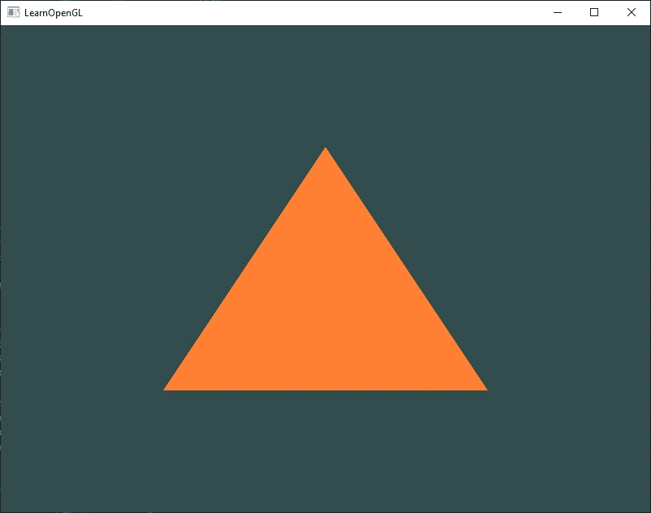

# 在 Linux 中设置 OpenGL 的初学者指南(Debian)

> 原文：<https://medium.com/geekculture/a-beginners-guide-to-setup-opengl-in-linux-debian-2bfe02ccd1e?source=collection_archive---------0----------------------->

## 在 Ubuntu 中设置 OpenGL 并安装所需库的分步指南:GLFW 和 GLAD。


所以你想在 Linux 中开始使用 OpenGL，但是在网上找不到足够的资源来设置它？**别担心**，我掩护你！
这篇文章将提供在 Ubuntu 和其他基于 Debian 的 Linux 发行版中设置 OpenGL 环境的简单说明，而不需要使用 VS 代码。我们还将安装所需的库 GLFW 和 GLAD。

关于如何使用 OpenGL 的教程，我推荐这个[网站](https://learnopengl.com/)，它用简单易懂的例子从最基础的开始教它。如果你喜欢视频教程，你可能想看看这个。

# 介绍

OpenGL 是一个*跨平台*，*跨语言* API，它为我们提供了一大套函数，我们可以用它们来渲染 2D 和 3D 矢量图形。API 通常用于与 GPU 交互，以实现硬件加速渲染。

然而，OpenGL 本身并不是一个 API，而仅仅是一个规范。它只是对每个功能的结果/输出应该是什么以及应该如何执行的*描述*。它是**已经** **由制造商按照规范在你的驱动程序中实现**。因此，没有所谓的“安装”OpenGL。但是，我们确实需要安装库，这将帮助我们与操作系统进行交互，以访问实现并设置窗口系统& OpenGL 上下文。

# OpenGL 设置:安装依赖关系

在安装所需的库之前，我们首先必须安装一些依赖项。因此，打开您的终端并运行以下命令:

```
sudo apt-get update
sudo apt-get install cmake pkg-config
sudo apt-get install mesa-utils libglu1-mesa-dev freeglut3-dev mesa-common-dev
sudo apt-get install libglew-dev libglfw3-dev libglm-dev
sudo apt-get install libao-dev libmpg123-dev
```

# OpenGL 设置:GLFW 库

在开始创建令人惊叹的图形之前，您需要初始化一个 OpenGL 上下文并创建一个应用程序窗口来绘制。我们将使用一个流行的 C 库来做这件事: **GLFW** (图形库框架)。这个库还帮助我们处理来自操纵杆、键盘和鼠标的输入。

运行以下命令会在您的系统中安装 GLFW:

```
cd /usr/local/lib/
git clone [https://github.com/glfw/glfw.git](https://github.com/glfw/glfw.git)
cd glfw
cmake .
make
sudo make install
```

# OpenGL 设置:GLAD 库

正如我们所知，OpenGL 实际上只是一个在显卡支持的*驱动*内部实现的规范。因为有许多不同版本的 OpenGL 驱动程序，所以它的大多数函数的位置在编译时是未知的，需要在运行时查询。现在，对于我们需要的每个函数来说，检索函数的位置并将其加载到函数指针中是一个很麻烦的过程。谢天谢地，有一个图书馆可以帮我们省去这个麻烦。

**GLAD** (多语言加载器生成器)是一个[开源](https://github.com/Dav1dde/glad)库，它使用了一个 [web 服务](http://glad.dav1d.de/)，在这里我们可以告诉 GLAD 我们想要为哪个版本的 OpenGL 定义并根据该版本加载所有相关的 OpenGL 函数。

因此，要安装这个库，请执行以下步骤:

1.  前往高兴的[网络服务](http://glad.dav1d.de/)。
2.  设置语言为 *C++* 选择规格为 *OpenGL。*
3.  在 API 部分，选择至少 *3.3* 的 *gl* 版本，确保配置文件设置为*核心、*并勾选*生成加载程序*选项。
4.  忽略扩展名，点击*生成*生成结果库文件。
5.  现在，GLAD 应该已经为您提供了一个 zip 文件:`glad.zip`，其中包含两个文件夹(`include`和`src`)。
6.  将`include` ( `glad`和`KHR`)内的文件夹复制到你的 include(s)目录:`cp -R include/* /usr/include/`
7.  现在将`src`文件夹中的文件`glad.c`复制到当前工作目录。

# 运行您的第一个 OpenGL 程序

您现在已经完成了所需库的安装。
测试*的时间到了*使用*“Hello Triangle”*:一个渲染三角形的简单程序，是否一切安装正确。你可以从[这里](https://learnopengl.com/code_viewer_gh.php?code=src/1.getting_started/2.1.hello_triangle/hello_triangle.cpp)复制代码并保存到一个名为`hello_triangle.cpp`的文件中

让我们编译代码并生成一个可执行文件`a.out`:

```
g++ hello_triangle.cpp glad.c -ldl -lglfw
```

运行`./a.out`查看程序运行情况。您应该得到如下输出:



A triangle rendered with OpenGL

这就完成了你的 OpenGL 设置。希望这很简单，而且你成功了。如果你想了解更多关于你刚刚复制的源代码，通读[这个](https://learnopengl.com/Getting-started/Hello-Window)！

*如果你有任何疑问或遇到困难，请随时发表评论。会尽力帮忙的！
如果你发现这很有帮助，请鼓掌并与你的朋友分享！*

到时候见。下次见！:))