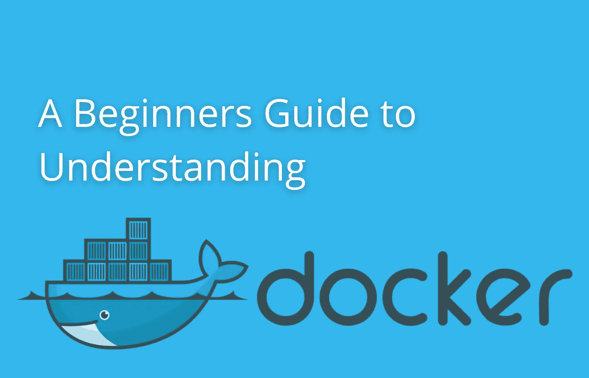

# 理解 Docker 的初学者指南

> 原文：<https://medium.com/geekculture/a-beginners-guide-to-understanding-docker-99f704436850?source=collection_archive---------12----------------------->

对 Docker 及其底层技术容器的高级概述。它们是什么，以及为什么你应该用人类可以理解的简单语言来关心它们。

A beginners guide to understanding Docker

# 介绍

2020 年，我在一家大型软件公司进行了软件工程实习，我很快意识到，作为我软件学位的一部分，我所学的大部分内容要么是…