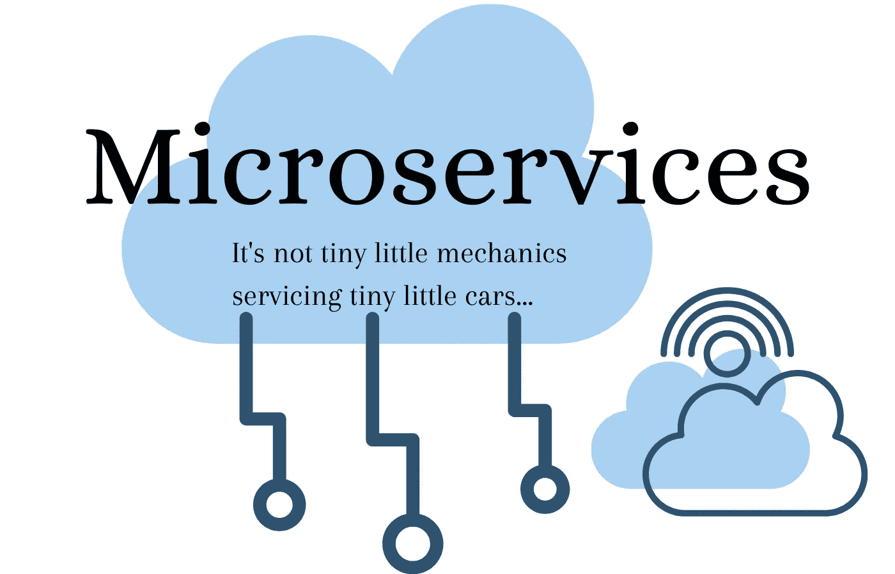

# 理解微服务的初学者指南

> 原文：<https://medium.com/geekculture/a-beginners-guide-to-understanding-microservices-d2a8bae871b7?source=collection_archive---------3----------------------->

对微服务架构的高层次概述，以及用初学者可以理解的浅显语言说明它的含义。

Microservices, cloud native application development

# 介绍

随着云服务和基础设施的大规模增长和适应，正在开发新一波云原生应用程序，这些应用程序需要高度可扩展、易于维护并且高效…