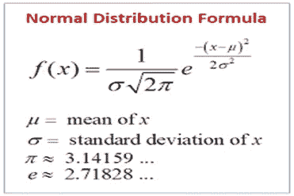
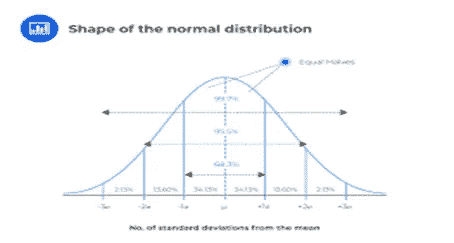

# 数据科学新手的统计和概率入门指南

> 原文：<https://medium.com/geekculture/a-beginners-level-guide-to-statistics-and-probability-for-newbies-in-data-science-3a1da2858431?source=collection_archive---------16----------------------->

作为一名高中生，你有没有想过为什么有些题目，如:统计，概率，微积分，代数，排列组合等。被教授或介绍到课程中。😘有的同学甚至会说！！嘿，为什么我们要强制学数学。大多数学生出于各种各样的原因逃避数学。对某些人来说，这可能会让人精疲力尽。

嗯，我在学校的时候喜欢数学，但从来不知道它在哪里以及有多少可以应用到我们周围的日常生活中。

对于将数据科学作为一个领域来研究的人来说，你不能不学习数据科学中的一些基本数学概念，因为数据科学家做的大多数事情都不仅仅是编写干净、高效和模块化的代码，而是统计学、概率等的实际应用。用于建模和预测。这篇文章将只向我们介绍统计和概率中的一些基本概念。

photo from dreamstime.com

**1。** **统计**

统计学主要是指“数据”或“信息”。人们经常听到这样的断言，如大学入学统计(可能指大学里各种形式的簿记，如名册上的数字、毕业记录、录取等。)、财务统计(支付记录、预算和支出)、健康统计(出生记录、死亡率记录、住院率、发病率)等。虽然这些不可否认地与统计相关，但它们本身不足以作为统计的例证。

**什么是统计？**

统计学是数学的一个分支，处理来自样本和/或总体的数字数据的分析和解释。你的样本必须能代表整个人口

因此，统计的三个主要目标是:

将大量数据减少到可行的大小，从而更容易理解并改进决策。

以不偏不倚和明确的方式总结数据，避免感情用事和含糊不清。

根据较小的样本对较大的人群做出不加区别的陈述。

**变量**

变量是以两种或多种形式或水平出现的代表或属性，即描述水平、形式或值的可变性(如身高、性别、体重、种族、温度、国籍、降雨量等)。)变量可以分为*定量*或*定性*。

## 有两种主要的统计方法用于分析数据:

描述统计学

推断统计学

在描述统计学中，样本数据是用平均值、中值、众数、方差等指标来概括的。而在推断统计学中，我们从数据集得出结论。

**集中趋势的度量**

样本最重要的特征之一是聚集在中心值周围的趋势或优势，即位于其观察值范围的中间或中心。这种集中、聚集或位于中心周围的倾向被称为平均值，位置的度量或中心倾向的度量。作为统计学中有用参数的集中趋势的各种度量包括一组数据的算术平均值(**表示**)、一组数据的中间点(**中值**)和最频繁出现的观察值或值(**模式**)。这些参数的特征和用于估计它们的样本统计将在下面使用我们的类数据进行讨论。

**分组数据的算术平均值**

算术平均值也可以从一组数据中计算出来，特别是当单个数据不可用时。这种情况在已发表的文章中最常见，在这些文章中，所有可用的数据都以表格和图表的形式呈现。在这种情况下，算术平均值计算如下

其中 X 是类别标记或类别间隔的平均值

## 中间值

“中位数”是一组数据中的中间或中心测量值，它将分布分成两个相等的部分，这样正好相等数量的观察值或测量值落在分界点的上方和下方。也就是说，中位数是“中间值”或分布中的分数，一半的频率位于该值之上或之下。注意重点是频率而不是数值。

因此，在一组数字(即按数量级排列的数字)中:

Median =中间值(如果计数为奇数)或两个中间值的算术平均值(如果计数为偶数)。这表示为:中位数 X(n+1) = (n+1)观察值如果 n 是奇数

## 模式

一组数字的模式是以最高频率出现的数字，即最频繁出现的测量或观察。如果一组数据中的两个相邻测量值或观察值具有相同的最高频率数，则该组数据的模式是两个观察值或测量值之和除以 2。但是当两个具有相同高频率的测量值或观测值不相邻时，每一个都被列为一个模式，并且该组数据被称为具有两个模式或者是双模式的。如果出现两个以上同样高的频率，该组数据称为多模态数据。

**平均值、中值和众数之间的关系**

对于对称或正态分布的数据集，均值、中值和众数相等。

对于倾斜数据集。在这里，均值、中值和众数会出现在不同的点上。

均值-众数= 3(均值-中位数)

**四分位数、十分位数和百分位数**

如果一组数据被分成四个相等的部分，那么每个部分被称为四分位数，第一、第二、第三和第四部分分别用 Q1、Q2、Q3 和 Q4 表示。类似地，将数据集分成十等份的值被称为十分位数，分别表示为 D1、D2、D3 ……..D10。此外，将数据集分成 100 等份的值称为百分位数，表示为 P1、P2、P3、P4..P100 或简单的百分点。因此，中位数= Q2=D5 = P50。类似地，第 25 和第 75 个百分位数分别等于第 1 和第 3 个四分位数。

**离差的度量**

数据集的另一个对理解其分布非常重要的特征是其可变性、变化性或分散性的度量。这是测量值围绕中心的分散程度。它也是集群的反义词，描述了度量偏离中心拉力的趋势。对于确定数值数据在平均值周围聚集的程度(集中趋势的度量)以及它们远离平均值扩散或分散的程度来说，分散度量的知识是重要的。使用几种方法确定，即范围、平均偏差、方差、标准偏差、标准误差等。

**射程**

这是分散、扩散或变化的最简单的度量，等于最大和最小观察值、测量量或值之间的差。但是，因为范围仅基于一系列值中的 2 个值，所以它不能给出任何实际分布的概念。

**平均偏差**

一组数据 X1 的平均偏差(MD)，X2，X3…..Xn 是对分布均值聚集程度的度量。也就是说，它很好地说明了数据的集中趋势和分散程度之间的关系。请注意，使用绝对值是因为所有平均值偏差的总和通常为 0。

**差异**

方差是对分布的度量。它告诉我们我们的数据是如何分布在平均值周围的。一组数据 X1，X2，X3，X4…Xn 的方差是该数据的均方差的均方和。

一般来说，个体观察值离均值越远，方差就越大，离均值越近，方差就越小。也就是说，围绕平均值聚集的单个观察值或测量值越多，方差就越小，但越分散，方差就越大。例如，如果所有观察值或测量值都相等，那么方差 s2=0，但是随着值的不同或变化，方差增加。

**标准偏差**

这是方差的平方根

## 平均数标准误差

平均值的标准误差是样本平均值与总体平均值的偏差。如果总体中样本均值的分布呈正态分布，且样本均值的大部分值聚集在真实总体均值周围，则每个样本均值具有

68%的可能性在 1 秒之内

95%的可能性在 2 秒之内

99.7%的可能性在 3 秒内

然而，为了最小化由于使用样本估计而导致的误差，置信度的校正被使用如下

**离群值**

在数据科学中，我们不能不在一些或大多数数据集中存在离群值。有各种方法可以在数据集中处理这个问题。集中趋势的最佳测量将是中间值而不是平均值，因为平均值将被您的异常值向右或向左倾斜。我们可以有低异常值和高异常值:

低异常值:Q1-1.5(IQR)

高异常值:Q3 + 1.5(IQR)

这可以用箱线图来很好地表示。

**高斯分布(正态分布)**

**正态分布**

正态分布是指事件发生的频率在平均值附近占优势，数值或观察值逐渐向极值方向减少。由这种频率定义的曲线通常给出为:

*fi* = e-1/2 (X- )2/ 2

其中=总体均值，=标准差，= 3.14159(常数)，e = 2.71828 =(称为自然对数)。该方程表明，由该方程定义的分布的均值和标准差为。因此，对于任何给定的，有无限多的曲线取决于的值。同样，对于任何给定的几条曲线都有可能随着数值的变化而变化。然而，对于这些情况中的每一种，曲线的形状可能会改变，变得更陡或更宽，定义了通常所知的峰度。峰度的简单意思是(形状),它是曲线或分布的峰化程度的度量。定义为四阶矩或均值偏差，其给出为:

к4 = = 4 自二阶矩起к4 = = 2(总体方差)。

已经表明，当к4/ 4 = 3 时，分布是正态分布。如果> 3，则称这种分布为中 kurtic；如果< 3\. Mesokurtic curves are symmetrical and bell shaped, leptokurtic curves are significantly peaked (i.e. higher than while) while platykurtic curves are broader than high.

Features of a Normal Distribution

photo from dreamstime.com

1\. For a normally distributed data:

i. 68% of samples lie within 1 (i.e. ***( -*** )和 ***(*** +)，则称这种分布为 platykurtic

二。95.45%的样本位于 2 以内(即 ***( -*** )和 ***(*** +))

三。99.73%的样本位于 3 以内(即 ***( -*** )和 ***(*** +))

2.正态曲线的均值、标准差、方差为 2，峰度矩系数为 3。

**2。概率**

概率将允许我们确定我们的统计结果实际上有多可靠

概率是什么？

概率是某事是否会发生的可能性。任何事件发生的概率可以用小数、分数或百分比来表示。您将获得的值将始终介于零和一[0，1]之间。

如果我们有 1%或 100%的概率，这意味着我们的事件肯定会发生。(即事件发生的概率为 100%)。如果我们说是 0，那就说明不可能。例如，如果我掷骰子。我得 9 分的概率是多少(为零)

0.50 的概率意味着一个事件很可能发生，因为它也不太可能发生(即当投掷硬币时，正面/反面的机会相等)。

**I 实验概率:**这包括:

我抛一次硬币叫做实验

ii 掷骰子一次是一个实验。

所以，每次你做一个动作，那就是一个实验。假设我有一枚硬币，抛了三次。我们正在对那枚硬币进行三(3)次实验。

如果我们一遍又一遍地做一个实验，我们会开发一个概率实验，它会根据我们的结果而改变。

**二理论概率:**

如果我们进行无数次实验，某件事情发生的可能性。这是一个真实的概率或真实的概率。我们做的实验越多，我们得到的实验就越接近理论概率，因此这经常导致我们所说的大数定律

**三独立和非独立事件**:

在独立事件中，一个试验不会影响另一个试验的结果，因此导致乘法规则，而在非独立事件中，一个试验会影响另一个试验，这导致了贝叶斯定理**。**

加法规则

如果 A 和 B 是事件，获得其中任何一个的概率等于它们单独发生的概率之和减去它们联合发生的概率。

Ii p(A 或 B) = p(A) + p(B) — p(A 和 B)

乘法法则

两个事件 A 和 B 同时或相继发生的概率是每个事件的独立概率的乘积。因此，对于独立事件:

p(A 和 B) = p(A)p(B)

在这篇文章中，我解释了基本但重要的数学概念，这些概念将有助于您了解数据科学。我希望您已经看到了学习概率如何有助于根据收集的数据模式做出明智的决策，以及统计推断如何经常用于分析和预测数据趋势。

请在下面的评论中告诉我你是否学到了一些东西。别忘了离开👏👏👏👏👏鼓掌。