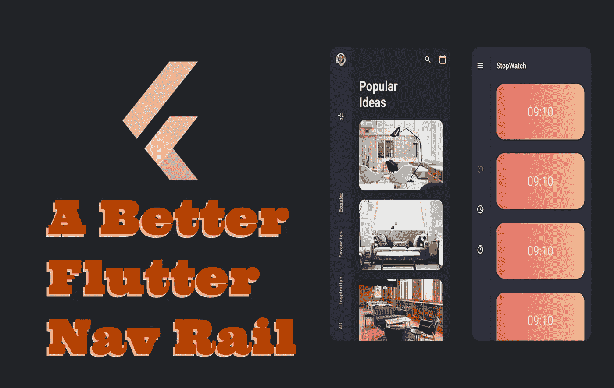

# 一个更好的颤动导航轨

> 原文：<https://medium.com/geekculture/a-better-flutter-nav-rail-2b149a14040c?source=collection_archive---------19----------------------->

Material.io 团队的自适应组件包的第二部分包括一些组件，用于创建更好的动态导航轨道 UI 流，可以根据屏幕大小的变化从一种导航方案变为另一种导航方案。

对于那些不知道的人来说，新的 UX 手机导航方案，当它也是一个部署到桌面的应用程序时，现在是一个底部标签和移动侧边栏的动态组合