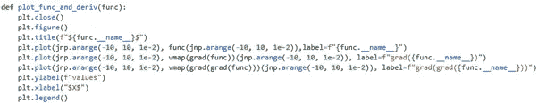
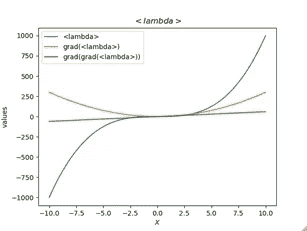
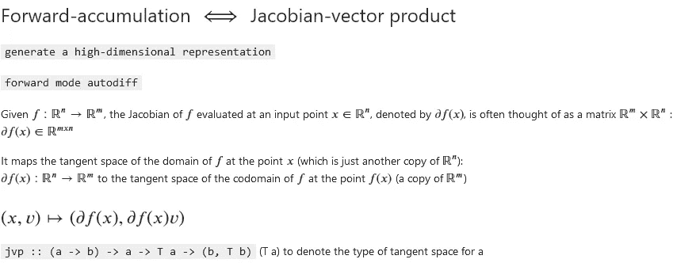
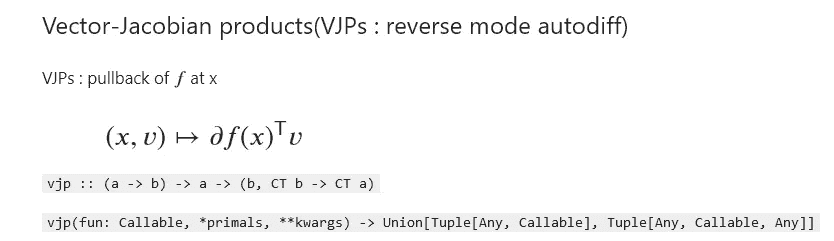

# 谷歌 JAX 鸟瞰图

> 原文：<https://medium.com/geekculture/a-birds-eye-view-of-google-jax-61f3d47926cc?source=collection_archive---------22----------------------->

如果要我总结 Google Jax 是什么，我会说它是函数式编程(FP)风格和可微分 NumPy 操作的异构混合体，运行在加速器上。

对 NumPy 和 FP 的熟悉使它很特别。可以说，它无副作用的做事方式使它变得安全。不允许你做突变，即原地修饰。有些人可能认为这可能会妨碍它的性能，但通常不是这样；编译器会处理它。它提供了一种异步调度机制，在这种机制下，不需要等待计算完成，就可以将控制权交还给用户。本质上，我们得到了一个与它被计算(promise)解耦的未来对象。这种模式促进了灵活性和分布式计算。另一个亮点是即时编译(jit)，它允许我们使用 XLA(一个优化的线性代数编译器)一起编译多个操作。除此之外，我们还可以通过 vmap API 获得矢量化地图。

我们来谈谈 jax 提供的 grad 函数。从 FP 的观点来看，

```
grad :: Differentiable f => f -> f’
```

也就是说，对于一个可微函数 f，我们得到它的梯度。grad(f)是计算梯度的函数，grad(f) (x)是 f 在 x 处计算的梯度。为了说明如何一起使用 grad 和 vmap，这里有一个简单的函数



plot_func_and_deriv(lambda x: x**3)

jax.grad(f) (x)是 f 在 x 处的梯度

无处不在的地图被定义为:

```
map :: (a -> b) -> [a] -> [b]
```

增强的 vmap 更进一步，我们获得了自动矢量化的好处。默认情况下，零数组轴用于映射所有参数。vmap 的一些使用案例包括:

```
mat = random.normal(key, (150,100))
batched_x = random.normal(key, (10, 100))def apply_matrix(v):
    return jnp.vdot(mat, v)vmap(lambda mat,v: jnp.dot(mat, v), (None,0) ) (mat, batched_x)
vmap(lambda v: jnp.dot(mat, v), 0) (batched_x)
(vmap(lambda v: jnp.dot(mat, v), 1, 0) (random.normal(key, (100, 10))))
(vmap(lambda v: jnp.dot(mat, v), 1, 1) (random.normal(key, (100, 10))))vv = lambda v1, v2: jnp.vdot(v1,v2)
mv = vmap(vv, (0,None), 0) #([b,a], [a]) -> [b]
mm = vmap(mv, (None, 1), 0) # Note: (None, 0), normally. Here, we have unusual (10, None) shapemm(mat, batched_x.T)
vmap(mv, (None, 0), 0) (mat, batched_x)
```

值得一提的一个特性是，我们可以通过实现 Pytree 接口来注册自己的自定义数据类型。Pytree 是一种树状结构，由类似容器的 Python 对象构建而成。通过这样做，JAX 函数转换可以应用于接受数组 pytrees 作为输入并产生数组 pytrees 作为输出的函数。

```
from jax.tree_util import register_pytree_node[@register_pytree_node](http://twitter.com/register_pytree_node)_class
class Point:
    def __init__(self, x, y, z):
        self.x = x
        self.y = y
        self.z = zdef __repr__(self):
        return f"Point({self.x}, {self.y}, {self.z})"def tree_flatten(self):
        return ((self.x, self.y, self.z), None)[@classmethod](http://twitter.com/classmethod)
    def tree_unflatten(cls, aux_data, children):
        return cls(*children)
```

现在，我们可以定义对我们的数据类型进行操作的任意函数，并使它们可微分:

```
@jit
def dist_orig(pt: Point):
    return jnp.sqrt(pt.x**2 + pt.y**2 + pt.z**2)grad(dist_orig)(Point(1., 2., 3.))
```

先说两个基本运算:雅可比矢量积和矢量-雅可比积。



JVP 是给定向量在算子的雅可比矩阵上的投影。它捕捉关于深度神经网络(DN)输入-输出映射的局部几何结构的关键信息，这是其流行背后的主要原因之一。不幸的是，对于真实世界的 DN 架构来说，jvp 的计算开销很大。

```
import jax.numpy as jnp
from jax import grad, jit, vmap
from jax import randomkey = random.PRNGKey(0)
# Linear logistic modeldef predict(W, b, inputs):
    return sigmoid(jnp.dot(inputs, W) + b)  # inputs is data matrixinputs = jnp.array([[0.52, 1.12, 0.77],
                    [0.88, -1.08, 0.15],
                    [0.52, 0.06, -1.39],
                    [0.74, -2.49, 1.39]])targets = jnp.array([True, True, False, True])# loss is a scalardef loss(W, b):
    preds = predict(W, b, inputs)
    label_probs = preds * targets + (1 - preds)*(1 - targets)
    return -jnp.sum(jnp.log(label_probs))key, W_key, b_key = random.split(key, 3)
W = random.normal(W_key, (3,))
b = random.normal(b_key, ())from jax import jvp
# Isolate the function from the weight matrix to the predictions
def f(W): return predict(W, b, inputs)key, subkey = random.split(key)
v = random.normal(subkey, W.shape)# Push forward the vector `v` along `f` evaluated at `W`
y, u = jvp(lambda W: predict(W, b, inputs), primals=(W,), tangents=(v,))
```

矢量雅可比乘积构成反向模式自动微分的基础。



`**vjpfun**`是从一个与`**primals_out**`形状相同的余切向量到一个与`**primals**`形状相同的余切向量元组的函数，代表在`**primals**`求值的`**fun**`的向量-雅可比乘积。

```
from jax import vjpy, vjp_fun = vjp(lambda W: predict(W, b, inputs), W)key, subkey = random.split(key)
u = random.normal(subkey, y.shape)
identity = jnp.eye(*y.shape, dtype=jnp.float32)
# Pull back the covector `u` along `f` evaluated at `W`
vjp_fun(u)
print("Recovering Jacobian elements row-wise!")
print(vjp_fun(identity[0]),
      vjp_fun(identity[1]),
      vjp_fun(identity[2]),
      vjp_fun(identity[3]), sep="\n")
```

从上面的例子中，我试图说明 JAX 的关键亮点，包括它的 FP 启发的方法，它鼓励可组合性并产生干净的代码。如果这篇文章引起了您的兴趣，请查阅官方文档。