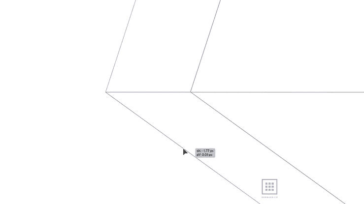

# 标志的蓝图。

> 原文：<https://medium.com/geekculture/a-blueprint-for-a-logo-835cf60b4f53?source=collection_archive---------10----------------------->

## 你能从头开始重新设计你的公司标志吗？

# 场景。

你正准备向客户展示一个标志设计，突然一股电磁脉冲(由公司间谍引爆)摧毁了你大楼里的所有电子设备。

你的会议 30 分钟后开始。如果你没有赢得这个客户，你的生意会失败，你的…