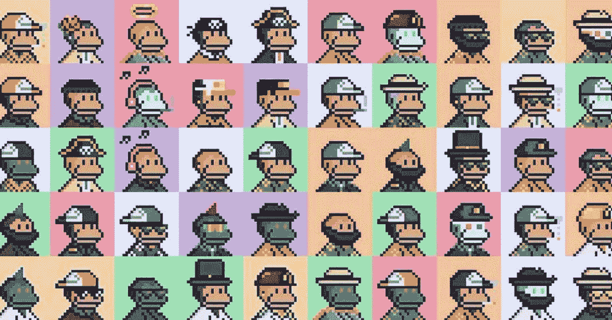

# NFT 市场简史

> 原文：<https://medium.com/geekculture/a-brief-history-of-nft-marketplaces-ed25252478e6?source=collection_archive---------4----------------------->

## STEPN 战队的 MOOAR 能不能反超魔法伊甸？

One of the OGs — Solana Monkey Business NFTs. Source: [Chain Debrief](https://chaindebrief.com/solana-nft-ecosystem/)

NFT 市场行业是一个竞争激烈的行业。

开始时只有几个参与者，现在已经发展成为一个繁荣的行业，每隔一个月就有新的参与者加入竞争，都在争夺同一个利润丰厚的蛋糕。