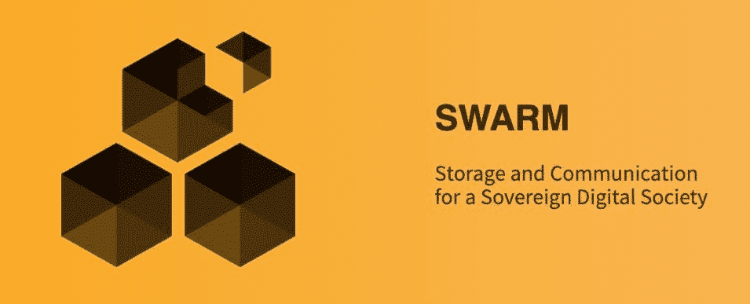

# 以太坊群简介

> 原文：<https://medium.com/geekculture/a-brief-introduction-to-ethereum-swarm-db6d79657e60?source=collection_archive---------7----------------------->

> 以太坊区块链作为世界计算机的 CPU，Swarm 最好被认为是它的“硬盘”。— Viktor Trón，SWARM 团队负责人

Swarm 的想法来自以太坊的创始人之一 Gavin Wood。当维克多·特伦和丹尼尔·纳吉在 2015 年加入以太坊基金会时，他们接管了基金会 Geth 团队的项目。那是 5 年多前的事了。现在，在 2022 年，Swarm 的功能或多或少已经完成，并作为一个自主项目开始了自己的漫长旅程。Swarm 拥有自己的基金会，并以超过 1500 万美元的投资完成了首次代币发行。

在本文中，我将向您展示为什么 [Swarm](https://www.ethswarm.org/) 是一个令人兴奋的项目，以及哪些独特的功能(如 feeds 和直接消息传递)使它不同于其他存储解决方案。

以太坊基本上就是一个巨型 [DHT](https://en.wikipedia.org/wiki/Distributed_hash_table) 。分布式哈希表在许多存储解决方案(如 BitTorrent 或 IPFS)中用作数据库，对等点可以在其中找到数据存储的位置。Swarm 以不同的方式使用 DHT，因为它将数据本身存储在 DHT 中。Swarm 称这个解决方案为 DISC，意思是块的分布式不可变存储。当你在 Swarm 中存储任何东西时，它会把它分成 4K 块。这些块可通过块散列来寻址，并存储在离块地址最近的节点上。每个区块都冗余地存储在最近的 4 个节点上。

Swarm 的网络结构是稳定的，并对 DHT 进行了高度优化。由于这种优化的网络结构，Swarm 中的内容检索非常高效。Swarm 称之为 Kademlia 连接。如果你需要更详细的网络结构的解释，你可以在蜂群的[书中读到。](https://docs.ethswarm.org/the-book-of-swarm.pdf)

Swarm 基于 [libp2p](https://hackernoon.com/writing-decentralized-applications-in-javascript-libp2p-basics) (底层网络)，但是节点的地址来自以太坊地址(上层网络)。签名方法也与以太坊使用的方法相同，智能合约可以轻松验证签名。这使得 Swarm 成为以太坊的理想存储解决方案。

匿名是 Swarm 的关键点之一。由于 Kademlia 连通性，每个节点只知道有限数量的邻居。如果在任何邻居上都没有找到块，则它们询问它们的邻居，等等。，并转发回内容。不可能找出谁是请求者，谁是给定块的来源。Swarm 称这种方法为转发 Kademlia。

在 Swarm 中，带宽是一种稀缺资源，因此当你检索一个块时，你必须为检索支付少量的 BZZ(Swarm 的本地令牌)。这有点像以太网上的燃气费。如果你的邻居有大块，它可以保留 BZZ。如果没有，它必须为此向它的一个邻居付钱。这种解决方案激励节点缓存经常询问的内容，并将其保存在客户附近。这使得 Swarm 成为一个真正高效的 CDN。(Swarm 将是分散式多媒体流的理想解决方案。)

Swarm 有一个非常有趣的会计解决方案。这有点像[闪电网络](https://en.wikipedia.org/wiki/Lightning_Network)，微交易发生在链外。在 Swarm 的情况下，节点保持带宽平衡。如果一个节点向另一个节点提供和检索相同数量的块，余额将接近 0。如果这个余额超过限额，节点必须用支票支付。

支票是数字签名的数据包，可由节点收集，并可用于在值得时从支票簿合同中提取 BZZ 令牌。这是 Swarm 自己的无气微支付解决方案，但理论上，它可以用于任何需要微支付的情况。

在 Swarm 上存储数据有两种方式。首先是全局锁定。在这种情况下，您将数据存储在驱动器上，DHT 只包含对它的引用。这与 [IPFS](https://hackernoon.com/a-beginners-guide-to-ipfs-20673fedd3f) 存储数据的方法非常相似。它是免费的，因为你存储自己的数据，但不是匿名的，你必须处理冗余等。另一种存储方式是使用邮票。邮票就像一张支票，存储节点可以用它来提取 BZZ，如果他们可以证明他们存储了您的内容。在这种情况下，内容存储在分布式哈希表中的正确位置，数据源不可追踪，冗余存储由群网络提供。

内容寻址组块只有一种类型的群组块。还有另一种类型的区块，称为单所有者区块(SOC)。在这种情况下，块密钥是所有者的以太坊地址和块标识符的散列。SOC 只有在拥有者签名的情况下才有效。这种类型的块使得在 Swarm 上创建一个被称为 feed 的复杂数据结构成为可能。

一个提要由一个 SOC 表示，其中标识符由一个主题和一个序列号散列而成。提要是不可变存储上的“虚拟可变”数据结构。当所有者想要改变其提要的内容时，她增加序列号并发布新的 SOC。Swarm 客户端可以启发式地找到最高的序列号，并获取最新的内容。这些可变内容可以有多种用途。例如，您可以将其分配到您的 ENS 地址，并且可以更新内容，而无需任何区块链交互。

另一种类型的块是特洛伊块。正如我在开始时所写的，块被存储在 DHT 上的节点上，这些节点通过节点地址(以太坊地址)靠近块密钥。Swarm 的这个功能可以用来直接向节点发送消息。在这种情况下，消息被打包成一个块(这是特洛伊木马程序块)并发送到网络。网络尝试将数据块存储在正确的位置，节点会将其转发到目标节点。消息被编码，因此只有目标节点能够读取它。如果目标节点离线，邻居会将其存储为一个普通的块(如果它有邮票的话)。Swarm 有一个高级 API 来管理这些木马程序块，他们称之为 PSS。PSS 有点像匿名邮件服务，是以太坊已死的消息服务 Whisper 的全功能替代品。

如你所见，Swarm 是一个真正令人兴奋的存储解决方案，还有更多。Feeds、PSS 消息和微支付系统等独特功能使其成为一个复杂的生态系统，可以在许多方面使用。

文章最后，我会说一句大大的“谢谢！”感谢维克多(Trón)耐心回答我的问题，并帮助我了解 Swarm 的基础知识。

*本文原载于*[*hacker noon*](https://hackernoon.com/a-brief-introduction-to-ethereum-swarm)*。*