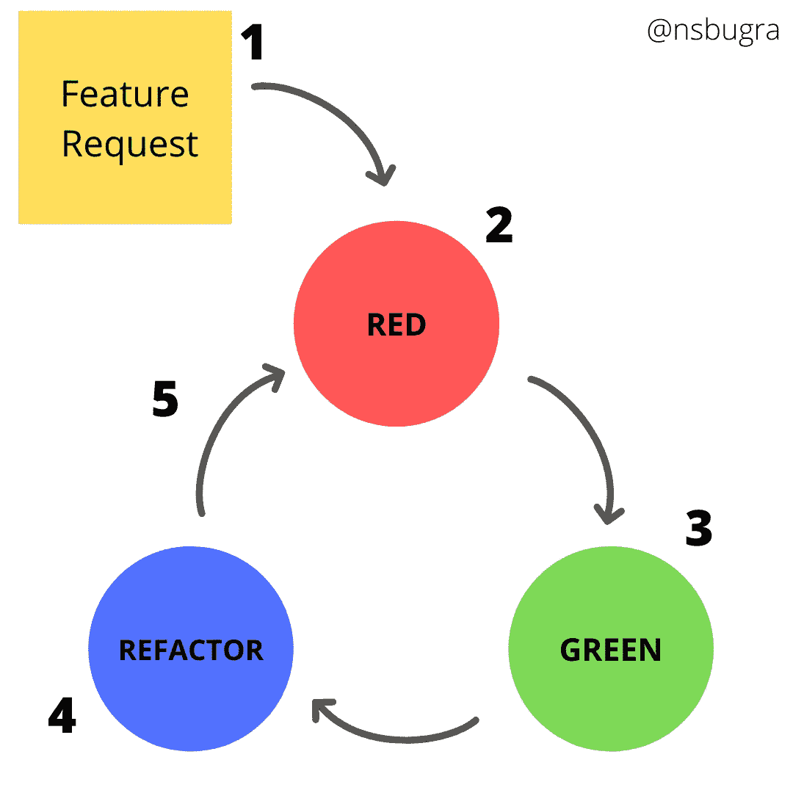
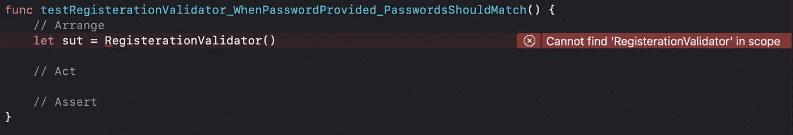
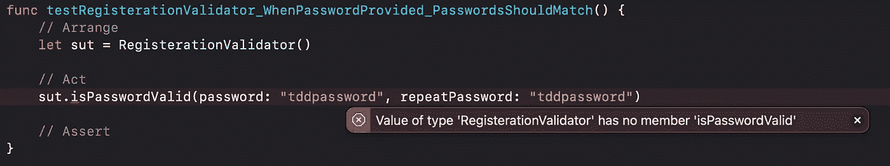
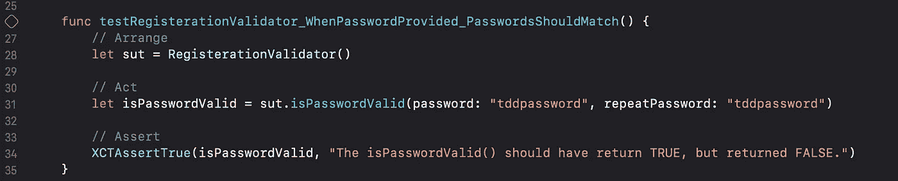
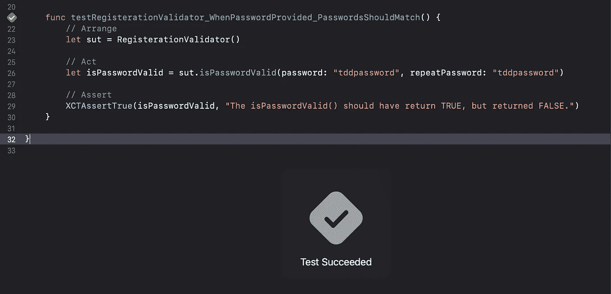

# Swift 和 iOS 中的测试驱动开发(TDD)简介

> 原文：<https://medium.com/geekculture/a-brief-introduction-to-test-driven-development-tdd-in-swift-ios-53fbe2a4d76d?source=collection_archive---------48----------------------->

# 什么是测试驱动开发(TDD)

**测试驱动开发** ( **TDD** )是一个[软件开发过程](https://en.wikipedia.org/wiki/Software_development_process)，依赖于在软件完全开发之前将软件需求转化为[测试用例](https://en.wikipedia.org/wiki/Test_case) **，并通过针对所有测试用例反复测试软件来跟踪所有软件开发。这与先开发软件，后创建测试用例相反。**

更多详情见[维基百科](https://en.wikipedia.org/wiki/Test-driven_development)。

# **测试驱动开发周期**

TDD 流程有 5 个步骤:

1.  阅读、理解和处理特性或 bug 请求。
2.  通过编写单元测试来翻译需求。如果设置了热重装，单元测试将会运行并失败，因为还没有实现任何代码。
3.  编写并实现满足需求的代码。运行所有测试，它们应该通过，如果没有，重复这个步骤。
4.  通过重构清理你的代码。
5.  冲洗，起泡，然后重复。

Test Driven Development Cycle

# **Xcode 中的测试驱动开发**

我们将用一个示例项目在 Xcode 上编写我们的第一个测试方法。此外，我将通过执行 5 个步骤来继续我上面提到的适合循环的场景。

## 1-)功能请求

假设我们的产品负责人向我们转发了一个特性请求。它的内容如下，用户输入的密码必须在注册前验证。这里是验证规则:
-用户输入的密码必须相等。

## 2-)红色

让我们跳到 Xcode 中，编写我们失败的测试方法。注意测试函数的名字和里面的注释行。

Failing Test Method

从上面的截图可以看出，函数的名字太长了。这是因为开发人员使用了一个不成文的测试方法命名约定。步骤如下:

测试 <systemundertest>_ >条件状态变化> _</systemundertest>

1.  方法的名称必须以单词“test”开头，否则 Xcode 不会检测到该方法。
2.  “被测系统”必须放在“测试”一词之后。
3.  下划线后的“条件或状态变化”。
4.  另一个下划线后的“预期结果”。

该方法中有 3 行注释。这叫做**AAA 模式。**

**整理**:又名“赐”。这是定义所有变量和模型的部分。

**行事**:又称“当”。这是触发要测试的方法并返回结果的部分。

**断言**:又称“然后”。这是评估预期结果的部分。

我们开始编写我们的测试方法，并得到了一个错误。我们出错的原因是我们没有指定名称的类。为此，我们现在将创建我们的验证器类。然后我们将跳转到**行为**部分，触发我们的*ispasswordvality()*方法。现在我们又出错了。

Failing Test Method

如你所见，我们遵循 TDD 循环步骤。因此，下一步是编写我们的*ispasswordvality()*方法。

Completed Test Method

在实现了*ispasswordavalid()*方法之后，错误消失了，我们实现了**断言**部分。有一个“xctassertttrue”**断言**。但是等等，什么是断言？

## 断言

测试断言的主要作用是将某个结果与控制值进行比较，如果这两个值不匹配，则当前测试失败。所有的单元测试方法都使用*断言*来验证**系统在测试**下产生的结果，并向用户呈现一个测试方法结果。断言将决定测试方法是通过还是失败。如果你想深入了解“**断言**”，在文章的末尾我会分享两篇不同的文章链接。

## 3-)绿色

最后一步，我们运行我们编写的测试方法，我们看到我们的*ispasswordvality()*方法成功通过了测试。

Passed Test Method

这意味着我们已经通过了测试驱动开发周期的第三步，绿色步骤。

## 4-)重构

假设我们重构了我们的*ispasswordvality()*方法和测试方法。

## 5-)重复

现在一切都很好，我们可以继续为新的特性需求或现有的特性编写单元测试方法。

# 利益

1.  促进优化代码的创建。
2.  帮助开发人员更好地分析和理解客户需求，并在它们没有被充分定义时请求澄清。
3.  在开发的后期，新功能的添加和测试变得更加容易。
4.  与传统的开发模型相比，TDD 下的测试覆盖率要高得多。这是因为 TDD 从一开始就关注于为每个功能创建测试。
5.  提高开发人员的生产力，并开发出灵活且易于维护的代码库

# 限制

1.  **大时间投资。对于简单的情况，您会损失大约 20%的实际实现，但是对于复杂的情况，您会损失更多。**
2.  **额外的复杂性。对于复杂的情况，你的测试用例更难计算，我建议在这种情况下尝试使用自动引用代码，它将在调试版本/测试运行中并行运行，而不是最简单情况的单元测试。**
3.  **设计影响。**有时设计在开始时并不清晰，随着你的进展而发展——这将迫使你重做测试，这将造成巨大的时间损失。在这种情况下，我建议推迟单元测试，直到你对设计有所了解。
4.  **不断扭捏。对于数据结构和黑盒算法来说，单元测试是完美的，但是对于那些倾向于改变、调整或微调的算法来说，这会导致大量的时间投入，人们可能会说这是不合理的。所以当你认为它实际上适合系统时就使用它，不要强迫设计去适应 TDD。**

# 结论

遵循测试驱动开发允许我们使我们的代码更干净和更容易理解，以确保我们所有的逻辑都经过测试并正常工作。这是肯定的。正如我上面提到的，有利有弊。做样板工程多学习多应用肯定会有用的。你可以在下面找到相关链接，获得更详细的信息。

我希望你现在对测试驱动开发有所了解。请不要忘记分享，这样其他人也可以受益。欢迎通过我的 [**邮箱**](http://bugrayenidunya@gmail.com) 或 Linkedin 与我联系。

在 [Twitter](https://twitter.com/bugrayndny) 、 [GitHub](https://github.com/Bugrayenidunya) 和 [Linkedin](https://www.linkedin.com/in/enes-bugra-yenidunya/) 上关注我。

 [## enes BURA yeni dünya-iOS 开发者- Loodos | LinkedIn

### 我从小就对电脑感兴趣。当他们问我将来想做什么时，我说我…

www.linkedin.com](https://www.linkedin.com/in/enes-bugra-yenidunya/) 

# 资源

 [## Sundell 在 Swift | Swift 中测试断言

### 大多数使用苹果内置 XCTest 框架编写的单元测试往往遵循由三个步骤组成的模式:首先…

www.swiftbysundell.com](https://www.swiftbysundell.com/articles/test-assertions-in-swift/)  [## XCTest 断言列表——应用开发者博客

### 所有的单元测试方法都使用断言来验证被测试系统产生的结果，并向用户展示…

www.appsdeveloperblog.com](https://www.appsdeveloperblog.com/a-list-of-xctest-assertions/)  [## 测试驱动开发(TDD):方法和好处|浏览器堆栈

### 敏捷开发的发展已经引入了许多实用的实践来交付高质量的软件。

www.browserstack.com](https://www.browserstack.com/guide/what-is-test-driven-development)  [## 测试驱动开发的缺点？

### 按照目前的提问方式，这个问题不太适合我们的问答形式。我们期待答案得到…的支持

stackoverflow.com](https://stackoverflow.com/questions/64333/disadvantages-of-test-driven-development)  [## 测试驱动开发的 5 个步骤

### 测试驱动开发的这 5 个基本步骤将帮助你创建更好的、更容错的代码。

developer.ibm.com](https://developer.ibm.com/devpractices/software-development/articles/5-steps-of-test-driven-development/)