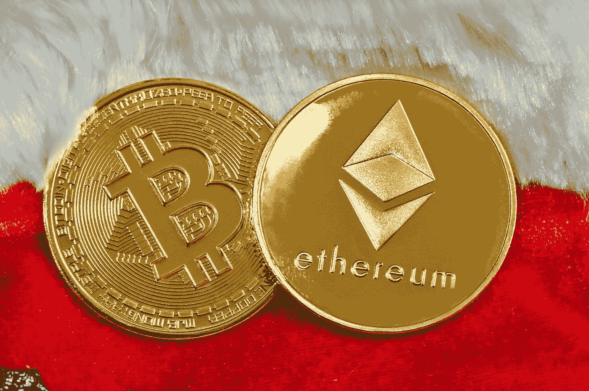
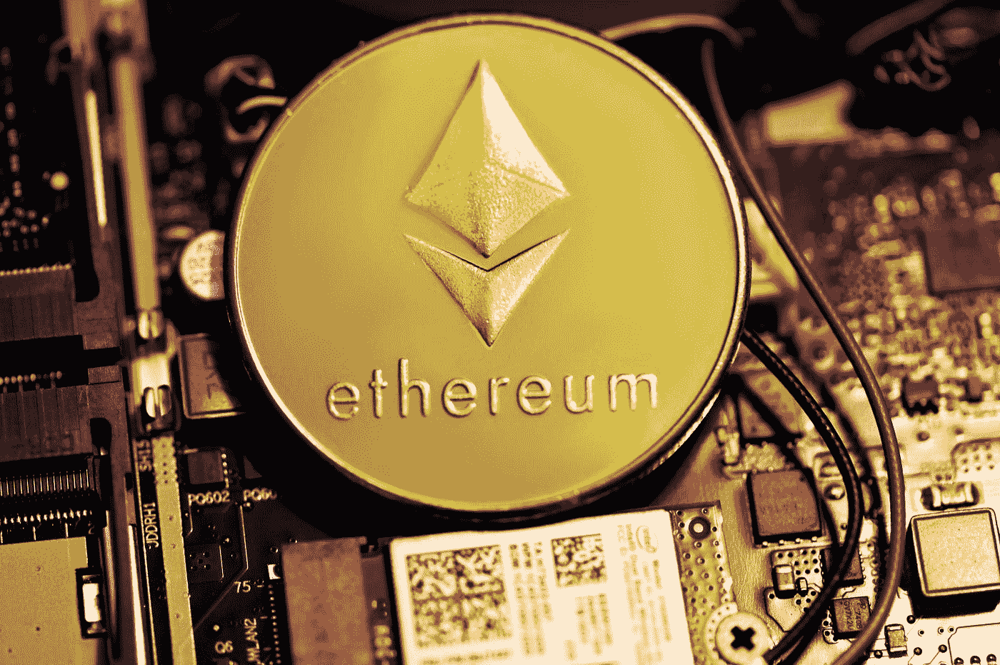

# 加密货币的历史概述

> 原文：<https://medium.com/geekculture/a-brief-overview-of-the-history-of-cryptocurrency-15bcf059aedd?source=collection_archive---------20----------------------->

## 比特币、以太坊和加密货币的崛起

Photo by [Quantitatives.io](https://unsplash.com/@quantitatives?utm_source=medium&utm_medium=referral) on [Unsplash](https://unsplash.com?utm_source=medium&utm_medium=referral)

# 简介:

本文介绍了加密货币的历史，从它的发明到将加密货币塑造成今天的发电站的过程。我将会报道这场运动的巅峰、低谷以及加密货币在 21 世纪的地位。

# 定义和关键概念列表:

Photo by [Markus Spiske](https://unsplash.com/@markusspiske?utm_source=medium&utm_medium=referral) on [Unsplash](https://unsplash.com?utm_source=medium&utm_medium=referral)

## 加密货币:

“加密货币是一种受加密技术保护的数字或虚拟货币，这使得伪造或重复消费几乎不可能。许多加密货币都是基于区块链技术的分散式网络——由不同的计算机网络执行的分布式账本。加密货币的一个定义特征是，它们通常不是由任何中央机构发行的，这使得它们在理论上不受政府干预或操纵。(弗兰肯菲尔德，2022)”

## 比特币:

“比特币被认为是一种加密货币，因为它使用加密技术来保持安全。没有实物比特币，只有公共账本上的余额，每个人都可以透明地访问(尽管每个记录都是加密的)。所有的比特币交易都是通过被称为“挖掘”的过程，由大量的计算能力来验证的。"(弗兰肯菲尔德，2022)"

## 以太坊:

“以太坊是一个由区块链技术支持的平台，该技术以其名为以太的本地加密货币而闻名……支持以太坊的区块链技术能够公开创建和维护安全的数字账簿。(弗兰肯菲尔德，2022)”

## 区块链:

区块链是在计算机网络的节点之间共享的分布式数据库。作为一个数据库，区块链以数字格式存储电子信息。区块链最为人所知的是其在比特币等加密货币系统中的关键作用，即维护安全和分散的交易记录。(海斯，2022)”

# 密码的诞生

David Chaum

您可能会感到惊讶，密码学的概念并不是一个新发现的现象；事实上，多亏了一个叫大卫·乔姆的人，它在 20 世纪 90 年代早期就可以使用了。Chaum 是数字现金的发明者，数字现金与今天的加密货币有许多共同点，特别是使用加密技术来保护和认证交易的概念。真正去中心化的数字货币的诞生是现代加密货币——比特币、以太坊和无数其他货币——的基础。

然而，加密货币真正的决定性时刻是在 2008 年 10 月。进入中本聪，一个今天被认为是创造比特币的人或组织的笔名。值得注意的是，关于中本聪的身份有很大的争论。《纽约客》的调查指向了迈克尔·克利尔和 Vili Lehdonvirta，而其他研究则指向了欧洲计算机集体的可能性。鉴于 2008 年的金融危机，中本聪希望让人们获得财务自由，并通过创建一个数字货币的点对点电子现金系统(不依赖任何第三方系统)启动了 crypt 革命。比特币后来在 2009 年诞生。

# 比特币的崛起

Photo by [Bermix Studio](https://unsplash.com/@bermixstudio?utm_source=medium&utm_medium=referral) on [Unsplash](https://unsplash.com?utm_source=medium&utm_medium=referral)

比特币于 2009 年推出，是世界上最大的加密货币，截至 2022 年 2 月 10 日，每枚比特币的价格约为 43272 美元。比特币作为价值储存手段(货币的核心功能)的历史一直受到质疑，经历了几次繁荣和萧条的商业周期。比特币起步相对缓慢，越来越多的公司接受加密货币作为一种支付形式。2014 年，重大安全问题出现，Mt. Gox(最大的比特币交易所之一)宣布 74.4 万个比特币被盗。同样在 2016 年，另一家主要的比特币交易所(Bitfinex)有 12 万 BTC 被盗，价值约 6000 万美元。尽管存在这些安全问题，但由于比特币的匿名性和分散性，比特币继续上涨。不受银行干扰的跨境汇款能力和低廉的交易费用使比特币成为一种有吸引力的投资和有用的工具。

# 以太坊:

Photo by [Kanchanara](https://unsplash.com/@kanchanara?utm_source=medium&utm_medium=referral) on [Unsplash](https://unsplash.com?utm_source=medium&utm_medium=referral)

除了比特币，以太坊不可否认是市场上最主要的加密货币。以太坊毫无疑问是受比特币的启发，于 2013 年由 Vitalik Buterin、Gavin Wood、Charles、Hoskinson、Anthony Di Iorio 和 Joseph Lubin 创立。2016 年被证明是以太坊的转折点，因为区块链经历了启动和分散自治组织(DAO)事件。以太坊随后遭到黑客攻击，他们窃取了价值 5000 万美元的道令牌。这一黑客行为在加密社区引发了争议，以太坊被拆分为两个区块链:以太坊和以太坊经典版(拆分版)。接下来的几年，在企业以太坊联盟*财富* 500 强公司的支持下，安全和重大投资将会有很大的改善。如今，以太坊已经超越了加密货币的范畴，从智能合约延伸到了不可伪造的代币(NFT ),是使用最多的区块链。以太坊 2022 年 2 月 11 日的成本在 3249.46 美元左右。

# 结论:

纵观加密货币的历史，不可否认的是，这项技术从开发到运行原理都非常复杂。这篇文章仅仅触及了加密货币的表面，强调了区块链、去中心化、匿名以及比特币和以太坊。加密货币继续是一个新兴领域，毫无疑问，加密货币将颠覆世界。

## 参考

j .戴维斯(2011 年 10 月 3 日)。加密货币。《纽约客》。检索于 2022 年 2 月 11 日，来自[https://www . new Yorker . com/magazine/2011/10/10/the-crypto-currency](https://www.newyorker.com/magazine/2011/10/10/the-crypto-currency)

*以太坊*。维基百科。(未注明)。检索于 2022 年 2 月 11 日，来自[https://en . Wikipedia . org/wiki/ether eum # Continued _ development _ and _ milestones _(2017% E2 % 80% 93 present)](https://en.wikipedia.org/wiki/Ethereum#Continued_development_and_milestones_(2017%E2%80%93present))

弗兰肯菲尔德，J. (2022 年 2 月 8 日)。*什么是加密货币？Investopedia。检索于 2022 年 2 月 11 日，来自[https://www.investopedia.com/terms/c/cryptocurrency.asp](https://www.investopedia.com/terms/c/cryptocurrency.asp)*

弗兰肯菲尔德，J. (2022 年 2 月 8 日)。*以太坊是什么？*投资媒体。检索于 2022 年 2 月 11 日，来自[https://www.investopedia.com/terms/e/ethereum.asp](https://www.investopedia.com/terms/e/ethereum.asp)

海耶斯，A. (2022 年 2 月 9 日)。*区块链讲解*。Investopedia。检索于 2022 年 2 月 11 日，来自[https://www.investopedia.com/terms/b/blockchain.asp](https://www.investopedia.com/terms/b/blockchain.asp)

*比特币的历史*。维基百科。(未注明)。于 2022 年 2 月 11 日从[https://en.wikipedia.org/wiki/History_of_bitcoin](https://en.wikipedia.org/wiki/History_of_bitcoin)检索

斯里达哈兰，V. (2014 年 7 月 1 日)。*比特币发明者中本聪是来自欧洲的匿名式细胞*。英国国际商业时报。2022 年 2 月 11 日检索，来自[https://www . ibtimes . co . uk/bit coin-creator-Satoshi-nakamoto-value-digital-currency-530480](https://www.ibtimes.co.uk/bitcoin-creator-satoshi-nakamoto-value-digital-currency-530480)