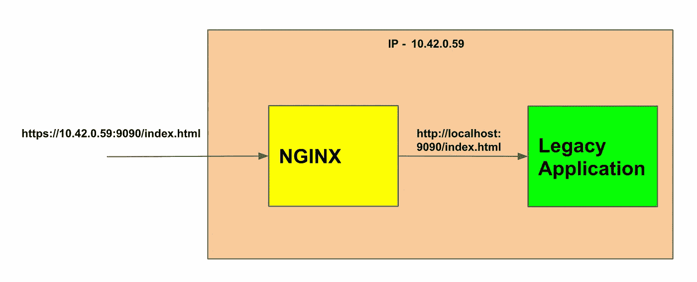
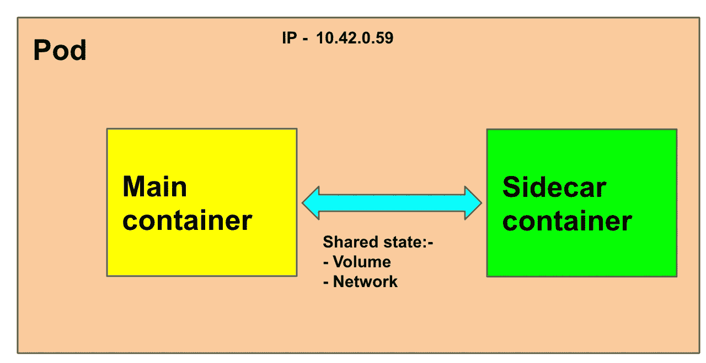
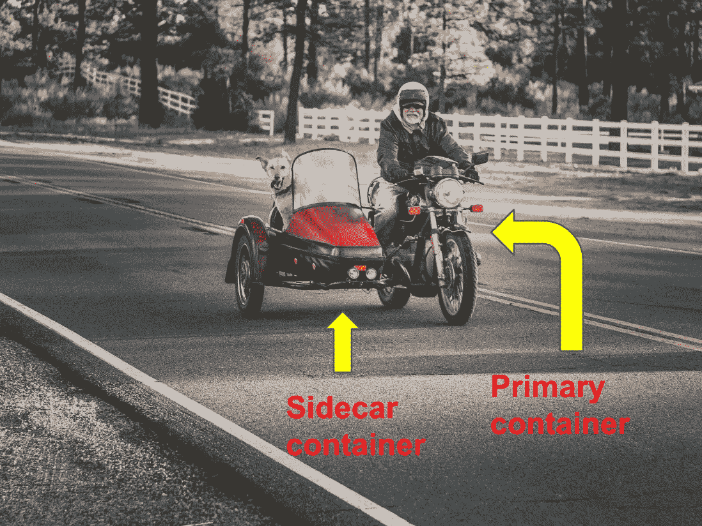
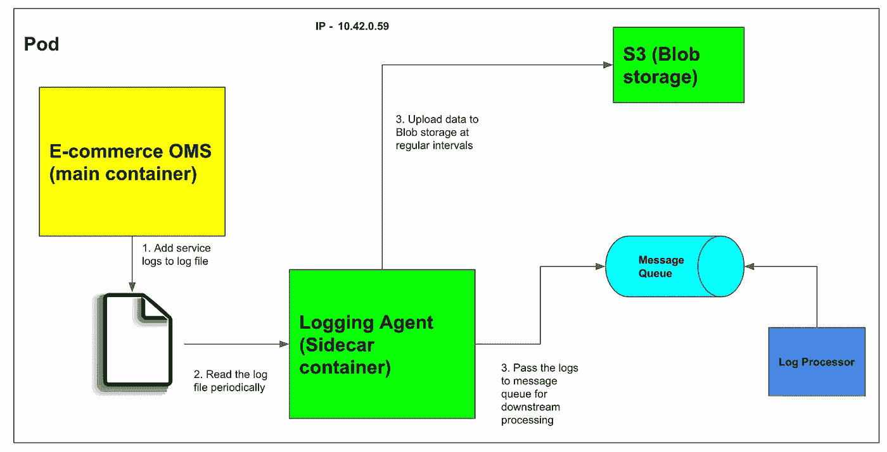
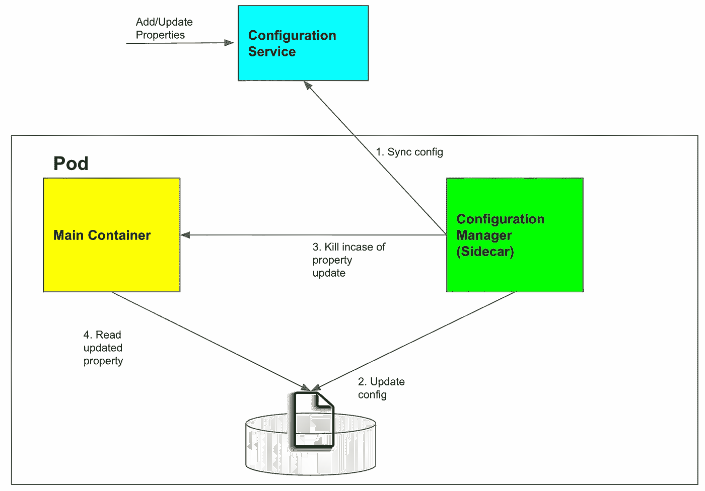

# 边车集装箱模式概述

> 原文：<https://medium.com/geekculture/a-brief-overview-of-the-sidecar-container-pattern-d6fbe49c5309?source=collection_archive---------3----------------------->

## 边车集装箱的工作原理、优缺点

Photo by [Drew Beamer](https://unsplash.com/@dbeamer_jpg?utm_source=medium&utm_medium=referral) on [Unsplash](https://unsplash.com?utm_source=medium&utm_medium=referral)

# 介绍

在过去的十年里，科技公司广泛采用了微服务架构。这种采用极大地提高了服务的可用性和可靠性。容器化进一步加快了开发过程，减轻了开发人员的操作负担。

构建分布式系统是一项具有挑战性的任务。开发人员已经确定了在构建这些系统时会重复出现的一系列标准问题。这导致了可重用和模块化架构模式的出现。这些模式类似于面向对象编程中的设计模式。

架构模式帮助我们避免在开发过程中重新发明轮子。这些实践作为抽象，可以被任何服务重用。

在本文中，我们将了解一种被称为 Sidecar 的架构模式。我们将理解这种模式试图解决的问题。稍后，我们将探索这种模式的工作和权衡。

# 问题

在我之前的一家公司，架构构成了一组使用`HTTP`进行通信的遗留服务。公司目睹了一次安全事故&公司发布了采用`HTTPS`的指令。

乍一看，我们觉得这个问题很简单。一个简单的解决方案是实现一个模块来执行 SSL 握手，然后将其集成到服务中。因此，在给相关的利益相关者时间表之前，我们从我们的初步分析开始。

在分析过程中，我们发现问题没那么简单。以下是增加问题复杂性的原因

1.  *遗留基础架构* —代码是使用旧的遗留基础架构构建的。遗留服务是两年前构建的，最近没有提交。
2.  *测试*——由于一个新的模块被引入，我们必须对服务进行彻底的测试。该项目也缺乏足够的测试覆盖率。
3.  编程语言——一个服务用 C++实现，另一个用 Ruby 实现。因此，我们必须用两种不同的语言实现同一个模块。

我们的结论是，在所有遗留服务中发布该特性的时间将超过一个月。我们希望快速发布该特性，而不是陷入处理遗留服务的复杂性。

因此，开发人员和架构师决定召开一次电话会议，集思广益，找出可能的解决方案。在探索不同的可能性时，一位建筑师想出了一个优雅而简单的解决方案。

# 解决办法

解决方案是利用现有的`nginx`反向代理进行`SSL`握手。`nginx`将被部署为一个容器，它将拦截所有的`https`请求。`nginx`容器将与 web 服务器运行在同一台机器上。

web 服务器将只侦听来自本地主机的请求。这将确保除了`nginx`之外，没有其他机器可以向这个 web 服务器发送请求。下图说明了设置:-

**NGINX handling SSL termination**

NGINX 将终止 SSL 流量。此外，它会将未加密的流量发送到遗留应用程序。

使用上述方法，我们不再需要修改遗留应用程序。因此，这将为我们节省大量的开发工作。

# 边车集装箱

上一节描述的解决方案是边车容器的一个用例。Sidecar 容器扩展了现有(主)容器的功能，而现有容器并不知道它。

Sidecar 容器和主容器运行在同一台机器上。因此，该模式也称为单节点模式。吊舱构成了主集装箱&边车集装箱。主容器处理实际的业务逻辑。边车在不影响主容器性能的情况下执行外围任务。

**Sidecar container pattern**

Sidecar 与主容器共享大部分资源，如容量、网络、CPU、内存等。这使得该模式能够解决大量常见问题，如日志记录、监控、安全性等。

## 类似

摩托车的边车装在车辆的侧面。边车只有一个轮子，它增加了一个额外的座位来运载乘客或货物。边车不携带引擎，主车去哪它就去哪。

您可以将主容器视为主要工具。主容器拥有业务逻辑(引擎)并做出适当的决策(控制速度和方向)。

Analogy with vehicle sidecar

Sidecar 容器只是添加了一个额外的功能，比如 SSL 终止或读取主容器的日志(类似于为乘客或货物添加座位)。就其本身而言，边车是没有用的。

# 边车集装箱的常见使用案例

## 记录

日志记录在云原生应用程序中的调试和故障排除问题中起着关键作用。大多数分布式应用程序都有单独的日志管道。管道负责收集日志、处理日志并将其存储在数据源中。这是借助消息队列或直接将日志上传到 blob 存储(S3)来实现的。

让我们考虑一个电子商务中的订单管理系统(OMS)。如果我们想要收集这个服务的日志，我们可以运行一个日志代理作为 sidecar。OMS 会将数据记录到文件系统中。日志代理将定期从文件系统读取数据，并将数据上传到 blob 存储。下图解释了日志代理的工作原理。

**Logging Agent as a sidecar container**

与日志记录相比，OMS 业务逻辑是一项关键任务。如果我们有几分钟收不到日志也没关系。但是我们不能容忍顾客无法在网站上购物。因此，记录功能可以卸载到边车容器。

Sidecar 容器只知道如何读取日志文件和管理数据上传。日志记录功能已经从主容器中分离出来。

## 结构管理

许多服务使用配置文件来读取属性。有时，我们需要改变某些属性，比如`connectionPoolSize`或`databaseUrl`。一个简单的方法是登录到服务器，更改属性并重新启动服务。

对于大量的服务器，上述任务变得非常耗时。因此，有一个集中的配置系统，它公开 API 来添加/修改属性。此外，为了自动重启服务，可以添加一个侧卡。

**Sidecar for configuration management**

这个 sidecar 的工作是同步来自集中式服务的属性，并将其与现有属性进行比较。如果有任何差异，它会停止服务并启动它。然后，该服务读取更新的属性并重新启动。

在上面的例子中，我们不需要在主容器中实现同步配置的逻辑。此外，我们也可以在其他微服务中使用**配置管理器 Sidecar** 。

## 其他使用案例

Sidecar 容器模式可用于其他用例，如身份验证、连续部署、监控等。外围逻辑可以作为独立模块封装在边车中。

# 优势

*   ***可重用性*** — Sidecars 可以一次实现，在任何地方重用。主容器可以用任何选择的语言编写。我们不必每次开发新的应用程序时都重写 sidecar 逻辑
*   ***解耦*** — Sidecar 实现了关注点的分离。主容器只需要关注业务逻辑。边车和主集装箱可以独立部署。主容器不会成为单点故障。
*   ***模块化*** —外围功能可以开发成独立的边车模块。这个模块只做一件事，而且做得很好。这类似于编写一个像`Gson`一样的可重用库，并在任何地方使用它。

# 不足之处

*   ***延迟*** —边车集装箱驻留在主集装箱的机器上。因此，延迟不会受到太大影响。然而，如果延迟是主要问题，抖动是不能容忍的，那么 Sidecar 不应该使用。例如:-在像高频交易这样的低延迟应用中使用 Sidecar 是没有意义的。
*   ***成本***——如果应用程序是轻量级的和简单的，那么 sidecar 可能是多余的。边车需要额外的费用。使用边车的好处应该大于成本。在这种情况下，最好使用库来获得额外的功能。

# 结论

在本文中，我们了解了边车集装箱模式的工作原理。该模式也称为分解模式。

它通常用于抽象常见的功能，如日志记录、监控、SSL 终止等。sidecar 实现了上述功能，并且经常在用多种语言和框架编写服务时使用。

可重用性、模块化和解耦是该模式提供的主要优势。它避免了代码重复并促进了代码重用。该模式不能应用于简单的轻量级服务。

# 参考

1.  [处理微服务中的交叉切角](https://blog.bitsrc.io/handling-cross-cutting-concerns-in-microservices-the-sidecar-pattern-59890fe3dc0f)
2.  [图像](https://unsplash.com/)
3.  [蔚蓝建筑中心——边车模式](https://learn.microsoft.com/en-us/azure/architecture/patterns/sidecar)
4.  [设计分布式系统——边车模式](https://learning.oreilly.com/library/view/designing-distributed-systems/9781491983638/ch02.html)