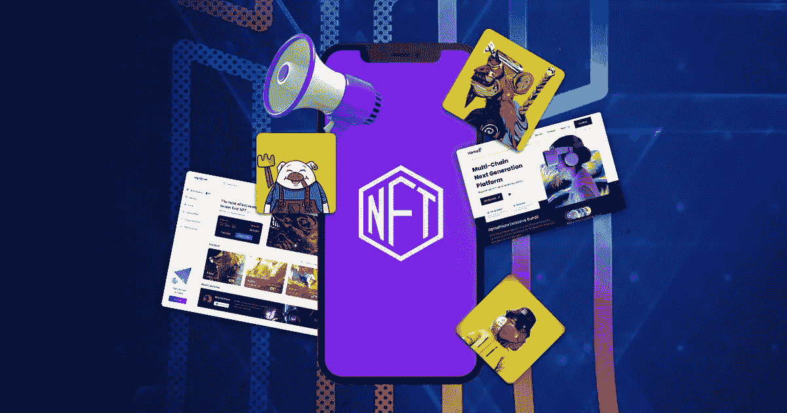

# NFT 公关营销服务概述

> 原文：<https://medium.com/geekculture/a-brief-run-through-on-nft-pr-marketing-services-e436d34f5067?source=collection_archive---------21----------------------->

> 你想知道公关营销人员如何帮助你和你的 NFT 项目在竞争对手中扩大数字市场的规模吗？查看博客！进来，探索 NFT 公关营销服务提供商促成的细微差别

从提供有效营销结果的过程中涉及的各个方面来看，有一些独特的策略可以专注于培育更好的结果。每种策略都有自己的解决方案。非功能性测试的发达市场带来了对专业市场需求的补充。鉴于 NFT 公关营销服务站在高许可法定为其抓住全球观众的能力，维护品牌声誉，吸引大众，等等。

让我们在这里收集一下 [***NFT 公关营销服务***](https://www.inoru.com/nft-pr-marketing-services) 的所有方面，并对它们进行剖析，以了解它们如何有效地帮助您利用其技术将您的业务提升到一个新的水平。

首先，

# **什么是 NFT 公关营销？**

NFT 公关营销的重点是通过名称和标签在项目和媒体之间架起一座桥梁。随着社交媒体的蓬勃发展，一切都在更快的阶段到达全球受众。同时，空间的真实性也是要检验和检查真实性的。同时，通过新闻稿、采访、新文章、新闻发布等适当的媒体互动和与群众分享正确的信息，群众参与并确保收集与组织相关的新闻。这有助于抓住更广泛受众的兴趣，并以更方便的方式接触目标。在这里，接收端的观众可以获得更好的收益，并以一种解释清楚的方式理解业务的细微差别。

> 通过 NFT 公关营销，目标受众了解的目的，用途和未来的价值，增加了企业的价值。让我们进一步检查 NFT 公关服务促进者如何采取的过程和捆绑的情况下正确的业务。

# **公关人员及其理解**

让我们在这里讨论一下公关公司如何处理你在 NFT 的项目的市场表现。我们有优势，他们在市场上的演变等等！在这篇文章中，让我们分享和讨论公关专业人士如何从促销、销售导航和业务的其他方面考虑这个空间。为了更好地帮助您的客户处理 NFT 艺术、音乐、游戏和其他事务，您需要了解以下几个方面。

## **了解区块链 PR**

不同于任何认真从事市场营销的企业，在特定领域的更新是非常重要的。同样，在处理分散化的区块链时，需要对市场知识及其运作有一个正确的理解才能完成这个过程。这有助于满足客户的要求。这是一位公关营销人员，特别是在区块链网络上工作的人，他讲述了这个故事，并通过数字营销活动跟踪业务的增长。

## 持续学习过程

营销人员需要关注业务的不同方面，并根据项目中的更新和市场中发生的变化保持更新。通过持续的学习过程，你可以在完全不确定的时间跨度内，在新客户、战略、项目方面表现出色。在这种情况下，NFT 公关营销人员应该是一个具有学习精神的人或团队，与市场和企业一起成长。

## **按时更新**

公关人员必须确保及时提供与业务和项目相关的新闻和更新。延迟或提前得到消息会成为一个缺点。他们必须维护和管理相同的时间表，并按时分配和获得方面的批准。公关营销人员同样有责任维护公司的市场声誉。

## **为项目创建数字活动**

公关专业人士是他们所参与的项目的战略规划者。他们有责任了解活动的运作，策划符合项目要求的数字内容，并根据市场要求采用新的更新和技术改进。此外，确保这与项目保持一致并且完整，因为非文本的促销是没有帮助的。

## **与 NFT 营销人员建立关系**

公关和营销需要得心应手。为了帮助客户和他们的 NFT 项目，他们与公关专业人士和 NFT 营销人员保持同步。通过有效的促销活动、活动和基于客户需求的其他活动，团队的协调带来了良好的结果，通过可在频谱中实施的 SEO 实践跟踪加密货币在市场中的增长。在通过有影响力的人、出版商、记者和其他人锁定整个受众群体的领域中，建立关系非常重要。

# **NFT 公关营销服务商提供哪些服务？**

*   NFT 的公关营销主要集中在提供品牌发展。他们为企业建立一个形象，并努力使一个形象过程，迷人，并高度创造性地抓住注意力。他们设法成为行业的代言人，向世界传达信息、更新和进展。确保创建一个诱人的身份，没有积压。
*   他们瞄准观众、投资者、记者、媒体和市场，轻松地将注意力拉向你的平台。
*   他们致力于创造品牌需求。通过专门的公关广告团队，他们帮助建立品牌认知度，并通过 SEO、社交媒体、付费广告和他们投资的其他策略在观众中创造需求，从而利用市场。
*   他们确保保持项目的声誉。他们是这一领域的专家，有管理能力，不让任何缺点在空间中排列，也照顾负面情绪泛滥。他们必须足够谨慎，以使他们积极地为公司服务。

# **最终判决**

有了一个有效的公关营销团队，你实际上可以为你的 NFT 项目获得良好的效果。从引进目标，管理声誉，并确保达到世界，[***【NFT】公关营销服务***](https://www.inoru.com/nft-marketing-services) 服务商提供了巨大的可访问性，以在加密空间培育您的业务。

寻求专业服务并向该领域的专业人士致敬，可以让你在市场中获得最大收益。别说了，去找城里最好的 NFT 公关营销专家，让你的项目获得所需的洞察力和市场。