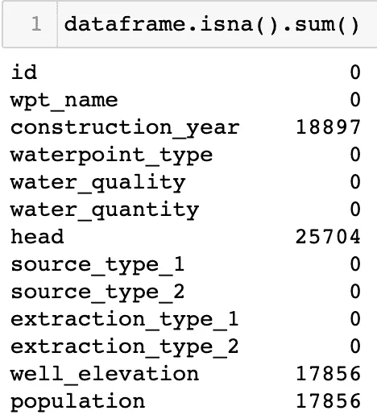
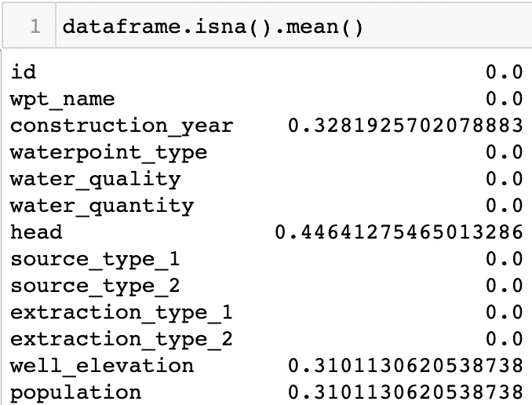
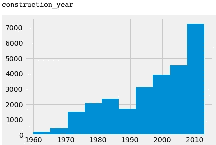
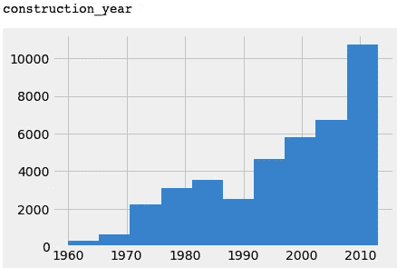
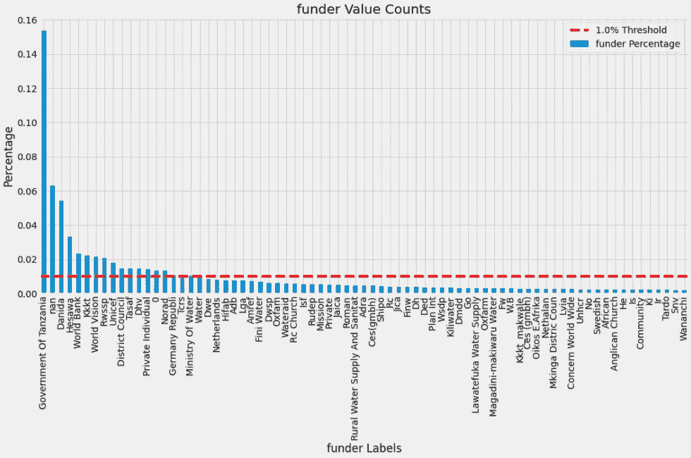
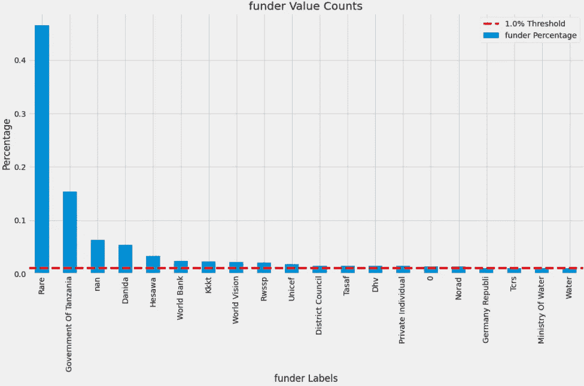
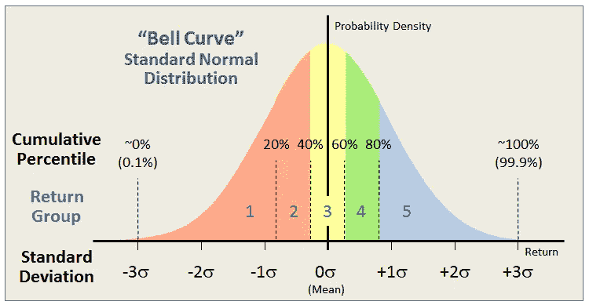
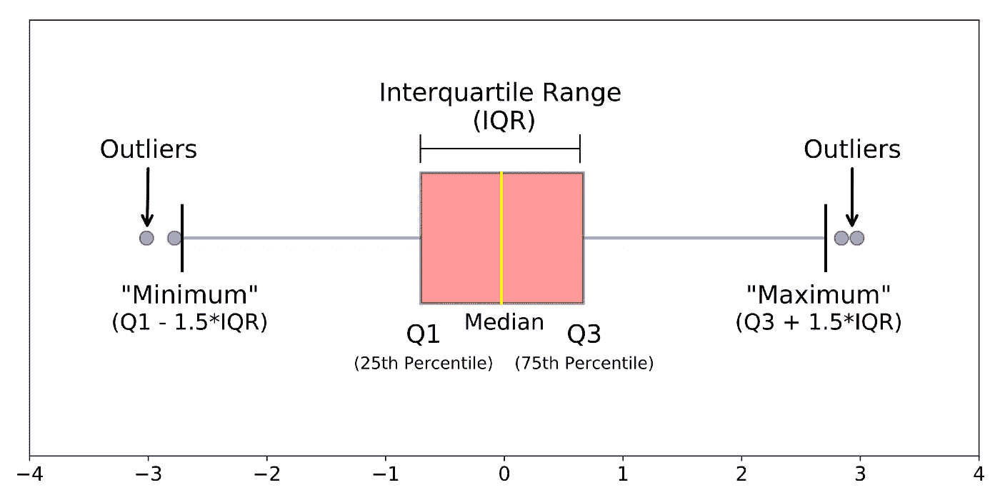
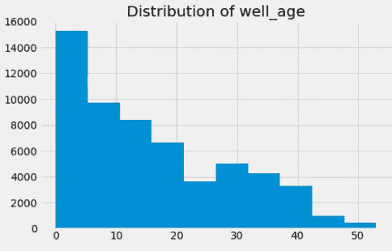
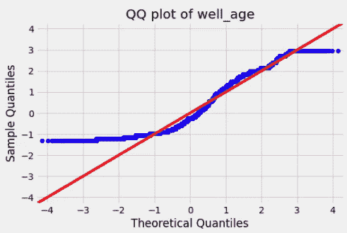

# 特征工程概述

> 原文：<https://medium.com/geekculture/a-broad-introduction-to-feature-engineering-ab27a9636f8a?source=collection_archive---------40----------------------->

特征工程为成功的洞察和建模奠定了基础。

要素工程通常描述从数据集的现有要素创建新要素(变量),以便获得新的见解或提高模型性能。然而，在本文的范围内，我将扩展定义，以包括建模前必需的主要预处理步骤。这些包括但不限于以下内容:

1.  **缺失数据插补**
2.  **高基数和稀有标签**
3.  **离群值**
4.  **变量变换(归一化、缩放和编码)**

特征工程的上述每个领域都可以用许多不同的方式来处理。因此，重要的是要强调你所做的选择高度依赖于你所拥有的领域专业知识。如果你没有自己的经验可以借鉴，你有几个选择:1)自己研究这个领域，或者 2)采访在这个领域有经验的人。更加熟悉这个领域将帮助您选择正确的特征工程技术，解释您为什么做出某些预处理决策，甚至将优化模型性能。为了演示各种特征工程技术，我将分析坦桑尼亚水井数据集中的数据，这些数据可以在[这里](https://www.drivendata.org/competitions/7/pump-it-up-data-mining-the-water-table/)找到。

# **缺失数据插补**

缺失数据是许多数据集的一个常见问题。在 Python 中确定数据集是否包含缺失值非常简单:

要获得每一列的空值总数，请使用:`dataframe.isna().sum()`

要获得每列空值的百分比，请使用:`dataframe.isna().mean()`

Finding Missing Values in Total or as a Percentage

但是，有时缺失值并不是以实际缺失值的形式出现的。有时，对于分类数据，数据调控器会选择用占位符替换缺失值，例如“未知”或“缺失”,对于数值数据，则选择-1、0 或 999。

一旦确定了缺失值，下一步就是处理它们，因为机器学习模型不允许缺失数据。您有两个选择:1)从数据集中删除行，或者用合理的猜测来估算(填充)缺失的值。当要删除的行数少于总行数的 5%时，最好删除这些行。但是，在许多情况下，填写空值更合理。有许多方法可以做到这一点，我将在下面重点介绍:

1.  均值、中位数插补:利用非零均值或中位数来填补缺失值
2.  任意值插补:选取任意占位符值，如分类数据的“未知”或“缺失”，或数值数据的 0、-1 或 999。
3.  模式或频繁类别插补:用特征中最常见的分类标签或数字特征的模式填充缺失值。
4.  随机值插补:用非空值的随机样本填充缺失值。

上面的策略 1-3 可以通过利用 Scikit-Learn 的`SimpleImputer()`类在[这里](https://scikit-learn.org/stable/modules/generated/sklearn.impute.SimpleImputer.html)实现。策略 4 可以使用另一个名为 Feature Engine 的开源包来实现，它是专门为特征工程预处理开发的。那个包可以在这里找到[。](https://feature-engine.readthedocs.io/en/1.0.x/)

对于坦桑尼亚水井数据集，`construction_year`有许多值需要估算(33%为空)。由于空值的数量很大，并且没有合理的方法使用其他特征进行有根据的猜测，所以我决定使用随机值插补进行插补。这将使分布保持一致，这在我的例子中是合理的。您可以在下面看到，插补前后的分布是相同的，但是每个箱的总计数比以前多(注意 y 轴刻度增加)。

Left: Before Random Variable Imputation, Right: After Random Variable Imputation

# 高基数和稀有标签

在某些情况下，您将拥有具有许多唯一标签的分类特征。独特标签的数量越多，您拥有稀有标签的可能性就越大。稀有标注是数据集中很少出现的标注，可能会导致比额外的要素粒度更大的问题。我在尝试对我的分类标签进行一次性编码时遇到了这个问题。这是因为在一次性编码之前，我已经将数据集分成了训练集和测试集。当尝试转换测试数据集时，基于训练集的适合度，测试集没有那个罕见的标签，因为它只是偶然进入了训练集。

在坦桑尼亚的数据集中，许多分类列具有很高的基数和罕见的标签。下面的照片在左侧显示了原始数据，其中有 1，857 个唯一值(图中仅显示了 75 个)用于资助者特征。右边是经过罕见的标签编码后的合并资助者功能，现在只有 19 个唯一值。这是通过将少于 1%行的任何标签分组到新的“稀有”标签中来实现的。由此产生的资助者特性现在有了“稀有”的标签，主导着现在的发行。

Left: Feature before rare-label encoding. Right: Feature after rare-label encoding

# 极端值

离群值是与数据中心相比时代表极值的数据点。根据您对数据中心(平均值或中值)和数据分布(标准差)的测量，异常值可以用不同的方式量化。有许多易受异常值影响的模型，如线性回归、逻辑回归、AdaBoost 和聚类。有两种主要方法来识别哪些数据点是异常值。第一种方法是，当数据呈正态分布时，找出任何偏离数据平均值 3 个或更多标准偏差的数据点。从下图可以看出，这是因为如果数据呈正态分布，3 个标准差表示该数据点属于其余数据的概率小于 0.2%。换句话说，99.8%的数据位于正态分布平均值的 3 个标准差以内。

Standard Normal Curve for Outlier Identification (source: [https://www.mutualfundobserver.com/2015/06/outliers/](https://www.mutualfundobserver.com/2015/06/outliers/))

第二种是当数据不是正态分布时，通过识别位于阈值之外的任何数据点，该阈值是四分位间距的 1.5 倍。这在创建数据的箱线图时最容易看到，因为箱线图的须代表 1.5 的四分位数范围阈值。

Boxplot for Outlier Identification (source: [https://naysan.ca/2020/06/28/interquartile-range-iqr-to-detect-outliers/](https://naysan.ca/2020/06/28/interquartile-range-iqr-to-detect-outliers/))

一旦识别出异常值，下一步就是使用各种技术来补救它们:

1.  修剪:通过删除包含异常值的行来删除异常值。如果异常值的数量非常少(在大型数据集中少于总行数的 5%)，这是首选的
2.  缺失数据:将异常值视为缺失数据，并使用上述技术对其进行估算。
3.  离散化(宁滨):使用箱将整个数值特征从连续变量转换为离散变量，并将异常值集中到最高和最低的箱中。
4.  删截(封顶):用一个任意值替换离群值，该值代表您想要的该特性的最小值和最大值。当使用四分位间距方法识别异常值时，通常用 1.5 *四分位间距的值来代替异常值(大于/小于 1.5 *四分位间距的任何值)。

# 变量变换

变量变换包括 3 种主要技术:1)某些建模技术所需的数字特征的缩放，2)将数字特征变换为具有更正态的分布，以及 3)每个模型所需的分类特征的一次性编码。

数字特征缩放非常重要，因为一些建模算法对特征量或数字大小非常敏感。例如，如果您使用平方英尺和卧室数量来预测房屋成本，平方英尺会使模型偏向于它，因为平方英尺的数量级是数千(1–3000 平方英尺),而卧室的数量级是 1–5。要素缩放有助于将这些要素归一化到相似的比例，以便对它们进行均匀加权。缩放特征有两种主要方法:第一种，标准化，将特征居中为零，并将方差设置为 1。此方法保留了带有异常值的要素的原始分布。它可以使用 Scikit-Learn 的`StandardScaler()`类实现，在这里可以找到。缩放数据的第二种方法是使用最小最大值缩放器，该缩放器在 0 和 1 之间缩放特征。这种方法会改变均值、方差和原始分布的形状。要实现这个方法，您可以利用 Scikit-Learn 的`MinMaxScaler()` found [HERE](https://scikit-learn.org/stable/modules/generated/sklearn.preprocessing.MinMaxScaler.html) 。

当利用需要独立变量正态性的线性模型来更好地预测目标时，转换数字特征以创建更正态的分布非常重要。正态性可以通过绘制直方图或 Q-Q 图来评估。可通过异常值移除来提高正态性，但如果这不起作用，则可能需要转换要素。

Left: Histogram, Right: QQ Plot for Assessing Normality

您可以在上面看到，well_age 要素的分布不是正态分布。为了补救，您可以使用对数、指数、精确、Box-Cox 或 Yeo-Johnson 方法转换数据。您选择的方法是基于这些技术在您的特性值限制内的反复试验。例如，如果您的要素具有负值，对数变换将不起作用。同样，如果要素中有任何零值，则倒数变换将不起作用。要实现这些转换，您可以利用 Scikit-Learn 的`FunctionTransformer`和`PowerTransformer`类，它们可以在[这里](https://scikit-learn.org/stable/modules/generated/sklearn.preprocessing.FunctionTransformer.html)和[这里](https://scikit-learn.org/stable/modules/generated/sklearn.preprocessing.PowerTransformer.html)找到。

最后，分类数据的变量转换极其重要，因为建模算法不允许非数字特征。将分类数据转换成数字数据的最常见方法之一是使用一键编码，这可以使用 Scikit-Learn 的`OneHotEncoder()`类来实现，该类可以在[这里](https://scikit-learn.org/stable/modules/generated/sklearn.preprocessing.OneHotEncoder.html)找到。该类将为分类特征中的每个唯一标签创建一个新列，并用 0 或 1 表示该标签的存在。

Example of One Hot Encoding. Source: [https://www.kaggle.com/dansbecker/using-categorical-data-with-one-hot-encoding](https://www.kaggle.com/dansbecker/using-categorical-data-with-one-hot-encoding)

需要注意的是，这种技术会增加要素的总数，并且直接取决于您要编码的要素中有多少唯一标注。这是为什么在一次性编码之前处理稀有标签很重要的另一个原因。一键编码与线性模型兼容，但是，为了最大限度地减少一键编码产生的多重共线性，还需要执行一个额外的步骤。这一步是删除一个新创建的列。这可以通过在`OneHotEncoder`类的`drop_first`参数中指示“真”来实现。还有许多编码分类变量的方法，我强烈建议您去探索，包括:

1.  计数/频率编码
2.  序数/标签编码
3.  二进制编码

# 结论

特征工程不是机器学习最有趣的方面，因为它属于数据清理/预处理范畴。然而，花费足够的时间学习各种特征工程技术并为数据集做出明智的选择将会产生优化的机器学习算法。如今，任何人只需一行代码就可以运行机器学习模型。一个优秀的数据科学家的真正能力是在数据不完美时，利用自己或他人的领域专业知识做出准确的估计。而且数据从来都不是完美的。

特别要感谢 Udemy 上的特征工程课程，它帮助我了解了特征工程的重要性和广阔性。这里可以找到。