# 案例研究:在 R 和 Stata 中使用逻辑回归评估混杂和修正

> 原文：<https://medium.com/geekculture/a-case-study-assessing-confounding-and-modification-using-logistic-regression-in-r-and-stata-2be659cbb813?source=collection_archive---------1----------------------->

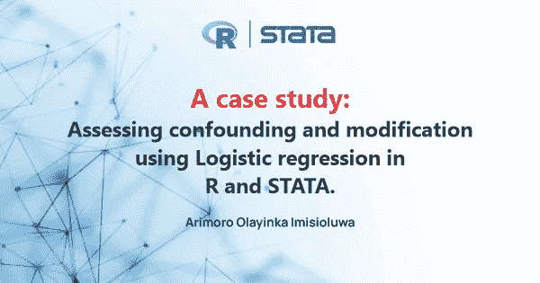

欢迎，谢谢你花时间来看这个。正如我提到的，这是 3 系列文章中的第二篇。如果你还没有读过第一篇文章，你可以在这里做那个[。这个 3 系列文章的目标是揭开混淆和修改的概念。但是，没有一个说明性的例子，什么是揭开一个概念的神秘面纱呢？因此，在本文中，我将向您介绍在建模中访问混杂和修改时要采取的步骤。](https://arimoroolayinka.medium.com/confounding-and-modification-in-modelling-explained-c37dbe7b40ff)

但是，在检查这些建模问题时，可以采用不同的建模范例。注意，这个例子并不是包罗万象的，但是它在很大程度上展示了我们在建模过程中需要注意的事情。

为了给我们的讨论定下基调，案例研究将对 HbA1c 水平作为暴露量与患者的糖尿病药物治疗是否有变化之间的关系进行建模，同时考虑入院来源和患者就诊次数作为潜在的混杂因素和/或影响修正因素。

在这个练习中，我们将考虑使用逻辑回归模型，特别是因为它的可解释性。尽管已经开发了一些大型程序来评估混杂和模型修改的影响，包括[分层分析](https://online.stat.psu.edu/stat507/lesson/3/3.5)。选择逻辑回归作为适当模型的另一个基本原理是因为结果变量(糖尿病药物治疗变化)有两类(变化和无变化)。通常，[逻辑回归](https://www.ibm.com/topics/logistic-regression)模拟一个二元结果，可以取两个值，比如真/假、是/否等等。你可以在这里阅读更多关于逻辑回归模型[的设置。](https://en.wikipedia.org/wiki/Logistic_regression)

我相信我们可以继续进行分析、结果、解释和讨论，但首先，让我们简要地谈谈我们将在分析中使用的数据。

## **关于数据**

我们将用于此分析的数据集是 2018 年视觉自动化疾病分析(VADA)暑期学校培训期间提供的数据集的摘录。VADA 暑期学校培训数据集来自健康事实数据库(Cerner Corporation，Kansas City，MO，USA)。该数据库包含美国 130 家参与医院十年(1999-2008)的临床记录。这些临床记录包含关于 69，984 次观察和 27 个变量的信息，包括患者遭遇数据、人口统计数据、HbA1c 水平、诊断测试和治疗以及患者结果。所用数据来自 1999-2008 年间的 130 家医院队列，经过去识别和删减，仅包括住院病人。数据集的作者在预处理数据时执行了几个步骤；如果你有兴趣，可以在这里阅读这些步骤[。](https://www.hindawi.com/journals/bmri/2014/781670/)

为了获得用于此分析的数据集，我的几个朋友讨论并实现了我将要向您展示的步骤。首先，我们对 VADA 数据集进行了修整，使其仅包含 HbA1c 检测的病例，并减少了协变量的数量，以包含最具医学相关性的特征。这将数据集减少到 17，018 个观察值和 9 个变量。此外，我们发现入院来源变量中约有 138 个(约 0.8%)缺失值，种族变量中有 422 个(约 2.5%)缺失值。由于这不是一个实质性的缺失水平，我们从下游分析中删除了这些缺失值。

因此，用于分析的最终数据集包含 16，458 个观察值和 9 个变量，分别代表种族、年龄、性别、入院来源、住院时间、HbA1c 结果、再入院状态、糖尿病药物治疗和既往住院次数。我们将每个人以前的住院病人、门诊病人和急诊病人的数量合并成一个变量，称为病人就诊次数。

为了降低模型的复杂性，将具有两个以上级别或类别的协变量重新编码为两个级别。例如，我们按照平均诊断年龄 60 岁对患者的年龄进行分类。对于种族，患者被分为高加索人或其他人(包括非洲裔美国人、亚洲人、西班牙人和其他明显的少数民族)。最后，对于入院来源，患者以分类方式进行分类(急诊和其他即时入院或其他转诊入院),以尝试对通过类似情况/急诊入院的住院患者进行分组。数据集有两个性别类别(男性和女性)。你可以在这里免费获取[的数据。](https://github.com/Predicare1/Confounding-and-Modification-iin-Modelling)

## **分析程序**

为了充分探讨我们的讨论，我们将定义我们的结果变量为糖尿病药物治疗的变化。糖尿病药物有两类(是和否),表示在住院患者就诊期间是否服用(更换)了糖尿病药物。暴露变量是 HbA1c 水平，如果水平在正常预期范围(< 7.0 %) or as “elevated” if HbA1c levels are higher than normal (> 7.0 %)内，则结果为“正常”。如前所述，在本次讨论中，协变量(和潜在效应修正因子/混杂因子)将是入院来源和既往患者住院次数。

将使用[逻辑回归](https://www.ibm.com/topics/logistic-regression)模型评估作为结果的糖尿病药物治疗变化(是/否)和作为暴露的 HbA1c 水平之间的关系，同时控制协变量、入院来源**、**和患者就诊次数。逻辑回归符合目标，因为结果变量(糖尿病药物治疗变化)是二元的。我们将评估协变量的影响修正和混杂。数据独立性的逻辑回归假设得到满足，因为每个观察都来自一个独特的住院病人。结果的 logit 和患者就诊次数之间的逻辑回归的线性假设用图形进行了验证。所有分析都将使用 R 编程语言[1]和 STATA 软件[2]进行。

**现在我们已经对数据和我们将在讨论中使用的模型有了很好的理解。重要的是强调我们将如何访问混杂和修改。**

> **免责声明:许多建模范例可用于访问混杂和修改，但这是我开始了解并发现有吸引力的一个范例(至少对于案例研究的上下文来说)。**

首先，我们将在暴露变量和协变量之间创建双向和三向交互项。(我将在本文的建模阶段向您展示如何做到这一点)。

Wald 显著性检验将通过将相互作用项的 p 值与预先确定的显著性水平(0.05)进行比较来评估效果改变。如果暴露(HbA1c)和协变量(入院来源和患者就诊)之间的三向相互作用项的 p 值显著(即，如果 p 值< 0.05), we will conclude that there is a joint modification by the covariates. Then, we will stop modelling and report the full model. However, if the three-way interaction term is not significant (i.e., if the p-value > 0.05)，我们将得出结论，不存在联合效应修正。然后，我们将去掉三向相互作用项，并继续使用类似的方法和随后的混淆来评估个体效应的改变。

为了评估混杂因素，我们将检查暴露系数(HbA1c ),以查看当我们从模型中移除协变量时是否有显著变化(> 10%)。请注意，如果我们发现一个协变量改变了 HbA1c-糖尿病药物治疗关系，我们将在模型中保留该相互作用项，并且不评估有问题的协变量的混杂性(尽管可以评估其他协变量)。然后，在这种情况下，我们将通过记录暴露系数和修正因子的任何明显变化(> 10%)来评估混杂因素。

**为了将我上面分享的想法付诸实践，我们现在将进入建模阶段。**

## **造型**

在本节中，我将向您介绍获得最佳描述 HbA1c 水平和糖尿病药物治疗变化之间关系的最终模型的步骤。

**回想一下:**

**结果**:糖尿病药物治疗变化(0 —无变化，1 —有变化)

**暴露** : Hba1c 水平(0 —正常水平，1 —升高水平)

**修正因子/混杂因子**:入院来源(0 —急诊，1 —非急诊)和患者就诊人数(实际)

我们将从导入所需的包开始，将数据导入 R，并探索这些数据。然后，我们将创建交互术语。你可以在 GitHub [这里](https://github.com/Predicare1/Confounding-and-Modification-iin-Modelling)获得完整的 R 代码。

## **导入所需的包**

上面的代码导入了这些包。注意，如果你以前没有使用 R 的经验，你可以参加我在 Coursera 平台上教的这个名为[R 入门](https://www.coursera.org/learn/getting-started-with-r/home/welcome)的指导项目。指导项目完全是动手操作，大约需要 2 个小时完成。引导式项目已经帮助许多学习者开始使用 r。

## **导入并浏览数据集。**

现在，让我们导入数据集并简单地研究一下。

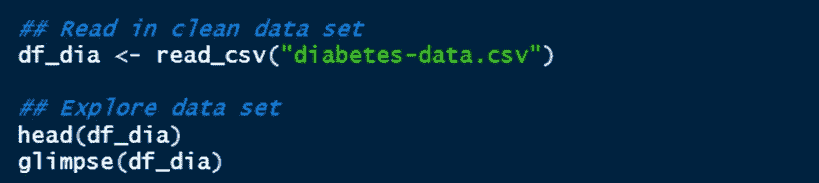

**让我们看看输出。**

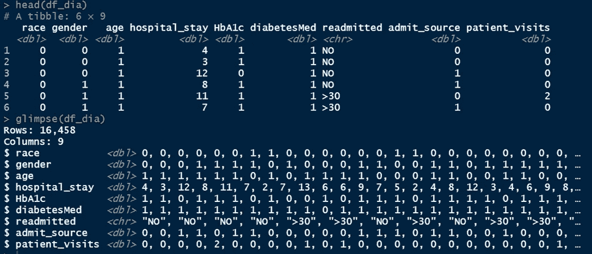

您将注意到的一件事是，数据集包含一些其他变量。然而，在本文中，我们将关注以下变量**糖尿病、糖化血红蛋白、入院来源和患者就诊。**你可以在这里下载数据集[。](https://github.com/Predicare1/Confounding-and-Modification-iin-Modelling)

**现在您已经大致了解了数据集包含的内容，我们可以继续创建交互术语。**

下面的 R 代码创建交互术语，并将分类变量转换为因子。

**现在，让我们看一下数据**

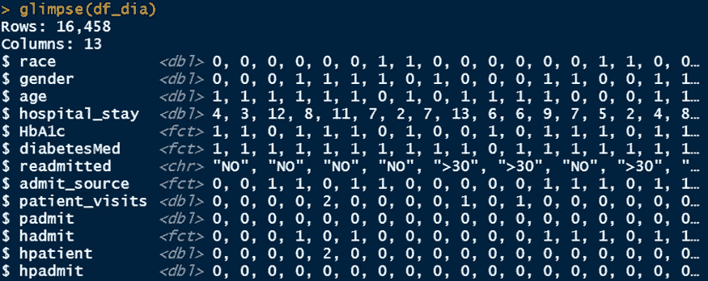

你会同意我的观点，双向交互术语 **(padmit，hadmit，hpatient)** 和三向交互术语 **(hpadmit)** 都是正确创建的。

在继续建模之前，让我们停下来为协变量创建基本的描述性统计数据。下面的代码将为分类变量**(糖尿病、糖化血红蛋白、入院来源)**和五个数字的摘要创建一个频率表，包括数字变量**(患者就诊)的平均值。**

我在下面用一种更好的格式展示了上面代码的结果。

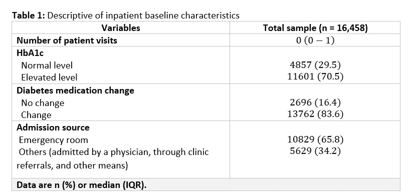

在上表中，我报告了分类变量的频率和百分比，以及数值变量的中位数和四分位间距。作为一个好奇的人，我决定根据 HbA1c 水平来检查糖尿病药物治疗变化的分布。下面的代码帮助我们实现了这一点:

结果如下表所示:

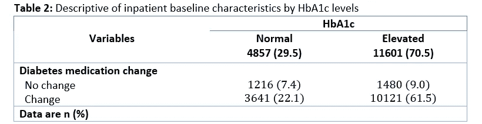

这里的一个快速见解是，我们有大多数改变糖尿病药物治疗的患者 HbA1c 水平升高 10121 (61.5%)。我猜这个结果应该不奇怪。

**接下来，我们可以定义将在此分析中使用的完整模型。**

完全/饱和模型 1 给出为:

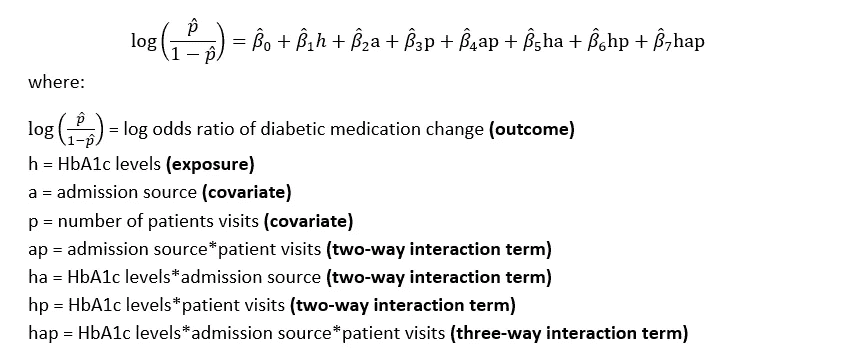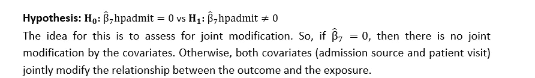

**现在，让我们看看如何在 r 中拟合这个完整的模型。**

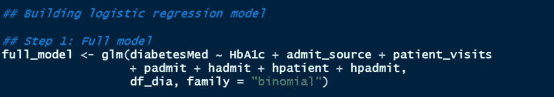

使用 **glm()** 函数正确指定逻辑回归模型。结果变量在等式的左边指定，所有在右边指定的协变量由加号(+)分隔。指定了数据 **df_dia** ，包括 family = "binomial "。

现在，让我们打印结果。

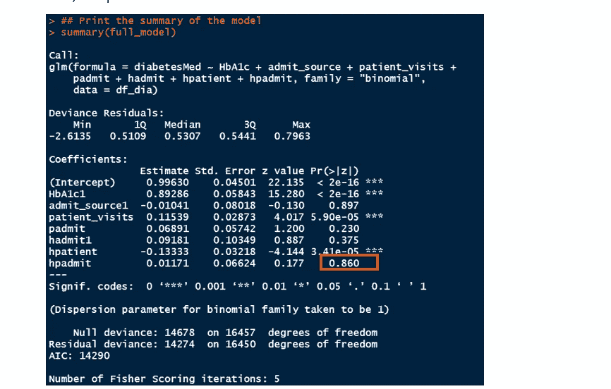

**Figure 1:** Fitted logistic regression model for assessing admission source and patient visits as potential joint modifiers of the relationship between diabetic medication change (outcome) and HbA1c levels (exposure)

咻！这里有很多结果。然而，现在，我们将重点放在红色突出显示的部分。注意 HbA1c，admit_source，hadmit 前面的 1 告诉我们 R 用 0 作为参照组。请记住，这些变量有两个类别(0 和 1)，因此其中一个类别需要用作参考类别。

> **挑逗者:如果我们改变参考类别，你认为会有什么变化？我会让你考虑的！**

**让我们继续，但是等一下！你还记得我是如何提到我们将评估效果修改的吗？**

上面的输出(图 1)显示了使用逻辑回归模型拟合糖尿病药物治疗变化(结果)和 HbA1c(暴露)之间的关系，同时评估入院来源和患者就诊作为该关系的潜在影响修正因子时获得的 R 输出。如果你注意到我之前提到过，为了评估效应修正，**我们将关注相互作用项**的 p 值。

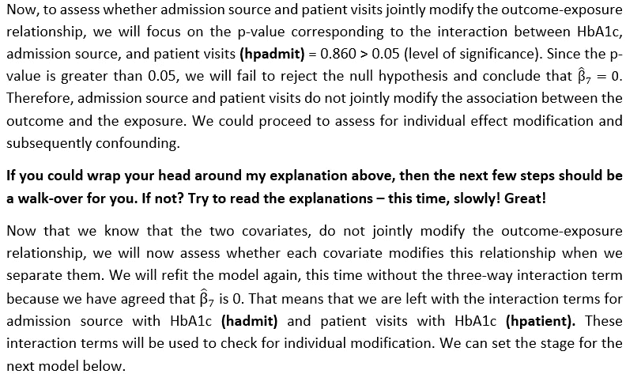

## **模型 1:分别评估入院来源和患者就诊作为潜在影响修正因素**

我们已经看到，没有联合修改。在这一步中，我将删除三向交互项 **(hpadmit)** 并检查**hpantient**和 **hadmit** 的 p 值是否显著。

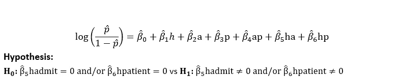

漂亮！就像我们看到的三向交互项一样，我们将检查 p 值，看它是否大于 0.05。如果它大于 0.05，那么我们将得出结论，该变量没有影响修改。否则，我们将得出结论，协变量修改暴露-结果的关系。我们将用下面的代码来拟合这个模型。注意我们没有添加 **hpadmit** (三方术语)。

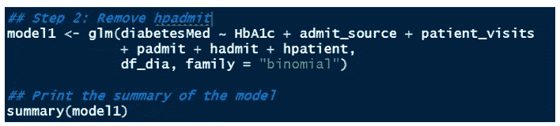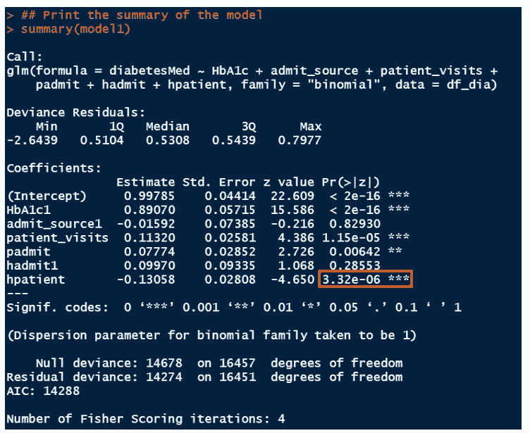

**Figure 2:** Fitted logistic regression model for assessing patient visits as a potential modifier of the relationship between diabetic medication change (outcome) and HbA1c levels (exposure)

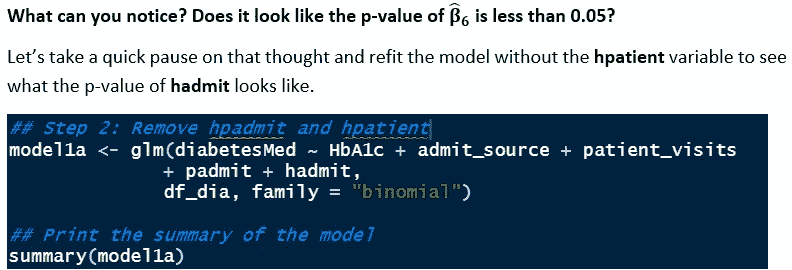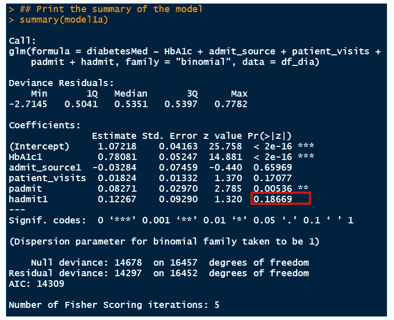

**Figure 3:** Fitted logistic regression model for assessing admission source as a potential modifier of the relationship between diabetic medication change (outcome) and HbA1c levels (exposure)

**现在我们已经看到了这两个模型的结果。我们可以得出一些结论，对吗？**

HbA1c、患者就诊和入院来源 **(hpatient，hadmit)** 之间双向相互作用的 p 值分别为 0.00000332 和 0.187。这表明患者访视改变了结果-暴露关系，而入院来源不改变 HbA1c 水平(暴露)和糖尿病药物治疗变化(结果)之间的关系。

你认为我为什么会做出这样的结论？在你继续阅读之前，想一想这个问题。

入院来源的 p 值没有统计学意义，因为 p 值(0.187)大于 0.05(显著性水平)。然而，对于患者就诊次数，我们看到一个不同的 p 值(0.00000332)，它远小于 0.05。我们将得出结论，患者就诊的数量是显著的。**这难道不有趣吗？**

虽然这两个协变量放在一起不会改变关系；然而，我们发现，虽然入院来源没有改变这种关系，但患者就诊次数改变了 HbA1c 水平和糖尿病药物治疗变化之间的关系。

因此，我们可以继续评估这些变量的混杂性。为了评估混杂因素，我们将通过一次一步地删除协变量项来重新调整模型，并检查暴露系数( **HbA1c** 和 **hpatient** 是否有实质性变化。通常，如果我们看到这些系数的变化大于 10%，那么我们将得出结论，协变量混淆了关系。

让我快速强调一下我之前提到的一个要点。

> **请注意，如果我们发现协变量改变了 HbA1c-糖尿病药物治疗关系，我们将在模型中保留该相互作用项。然后，在这种情况下，我们将通过记录暴露系数和修正因子的任何明显(> 10%)变化来评估混杂。**

这证明了为什么我们在评估混杂因素时仍然需要在模型中包括**病人**变量。此外，请注意，在这种情况下，我们不会评估患者访视是否会混淆关系**，因为协变量不能同时混淆和修改暴露-结果关系**。

> **快速提问:**假设患者就诊也没有改变这种关系，你认为我们将如何评估混杂因素？

在那种情况下很简单。我们将删除暴露和协变量之间的所有相互作用项(双向和三向相互作用项),并检查在我们重新调整模型时，暴露值(本例中为 HbA1c 水平)是否有任何显著差异(> 10%变化)。

最后，需要注意的是，为了评估混杂，**我们与 p 值**没有任何关系。我们对暴露系数感兴趣(在这种情况下，**病人**，因为**病人出诊**是一个修改量)。

有了这个解释，我们可以继续评估混杂因素。我将报告一个更全面的表 3，以清楚地看到系数是否有显著的变化。

**现在，让我们在没有交互术语 hadmit 和 hpadmit 的情况下拟合模型 2，但我们仍将包括 patient_visits 和 hpatient。**

## **模型 2:通过删除 HbA1c 水平和入院来源之间的所有相互作用项，保留 HbA1c 水平和患者就诊之间的相互作用项，重新调整模型。**

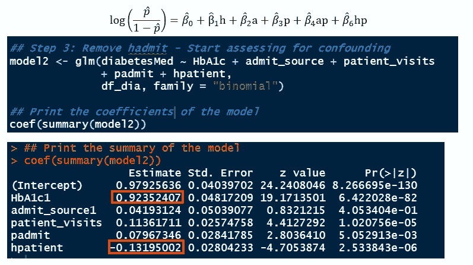

**Figure 4:** Fitted logistic regression model to start assessing whether admission source confounds the relationship between diabetic medication change (outcome) and HbA1c levels (exposure).

**你会注意到我没有打印模型的完整结果。我使用 coef()函数只返回系数。**

**关注红色突出显示的值。啊！我想随着我们的进步，我们可能会忘记那些价值观。不用担心；我会放一个表来总结这些结果来看看。**

## **模型 3:通过删除入院来源和患者就诊(padmit)之间的交互项来重新调整模型**

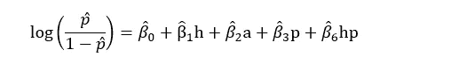

**在我们继续看结果之前，我感觉有人可能在想——但是我们放弃了所有的相互作用项？**

我认为再次强调这一点是当务之急。当我们评估影响修正时，我们关注的是**暴露(HbA1c)和协变量(hpadmit，hadmit，hpatient)** 之间的交互项，而不是协变量 **(padmit)之间的交互项。**

请注意，hpadmit、hadmit 和 HPA titan 前面的**‘h’**代表暴露量(HbA1c 水平)。我想你可以回顾一下我们创建交互项的部分，以便掌握变量名。

我想相信我的解释有助于澄清变量名可能引起的混淆。现在，我们将重新调整模型并删除 padmit，以查看入院来源和患者就诊是否共同混淆了暴露和结果之间的关系。

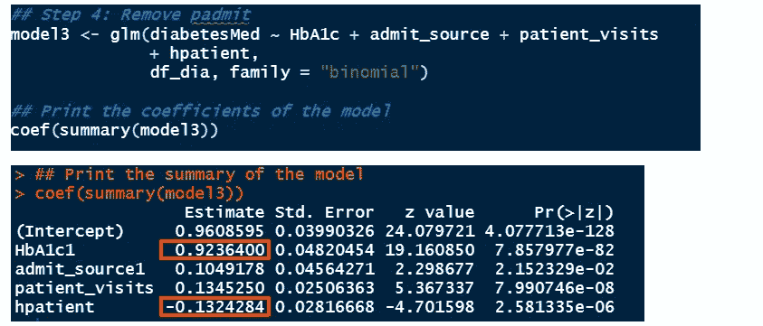

**Figure 5:** Fitted logistic regression model to assess whether admission source together with patient visits confounds the relationship between diabetic medication change (outcome) and HbA1c levels (exposure).

你能注意到那些系数的实质性变化吗？也许不是？

## **模型 4:通过删除准入源变量来重新调整模型。**

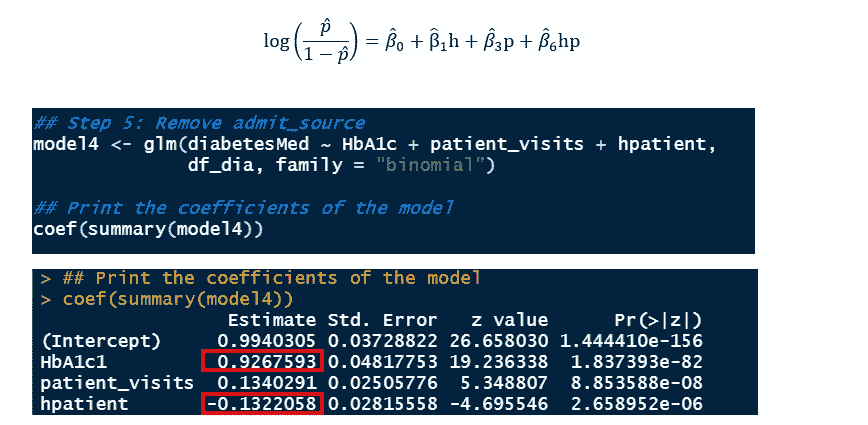

**Figure 6:** Fitted logistic regression model to assess whether admission source confounds the relationship between diabetic medication change (outcome) and HbA1c levels (exposure).

**太神奇了！我们已经到了建模过程的尾声。**由于显而易见的原因，我们无法通过删除患者就诊变量来继续建模。它是修改关系的修饰语和变量，不能同时混淆关系。这解释了为什么在评估入院来源是否为混杂因素时，patient_visitis 和 patient 仍留在模型中。当然，我们不能放弃暴露变量(HbA1c)。现在，让我们总结一下结果，以了解我们将选择哪个型号作为最终型号。

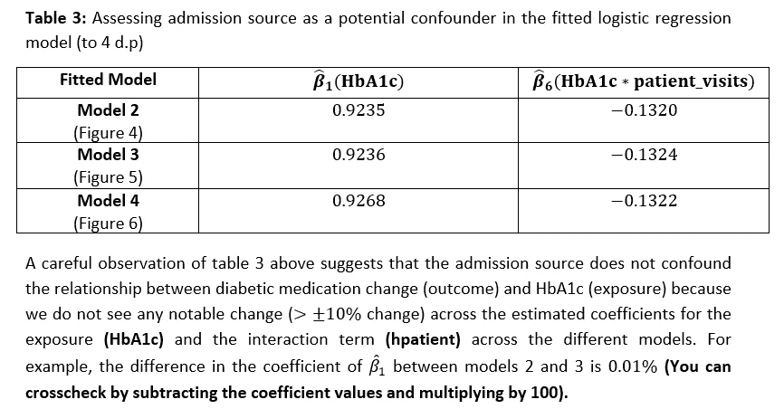

因此，我们应该将我们拟合的最后一个模型(模型 4)报告为最终模型。

**为什么？**

这就把我们带回了我在[第一篇文章](https://arimoroolayinka.medium.com/confounding-and-modification-in-modelling-explained-c37dbe7b40ff)中谈到的关于**调整**的讨论。模型 4 是最终选择的模型，因为它是在评估修改和混杂后调整更多的模型。

要报告的最终模型将是图 6 中给出的模型。同样，我们选择这一模型作为最终模型，是基于我们的建模结论，即入院来源既不会混淆也不会改变 HbA1c 水平(暴露)和糖尿病药物治疗变化(结果)之间的关系。然而，患者就诊的次数改变了这种关系；因此，它不能同时混淆这种关系。最终拟合的模型如下所示:

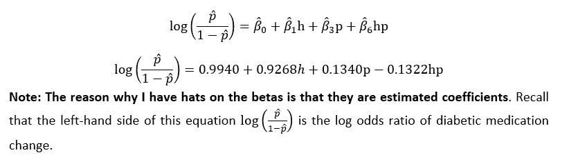

尽管有其他的相关性指标，包括比率和风险比，我在这里使用比值比，因为它最适合逻辑回归模型。你可以在这里阅读其他关于[的措施。](https://www.cdc.gov/csels/dsepd/ss1978/lesson3/section5.html)

相应的置信区间如下所示:

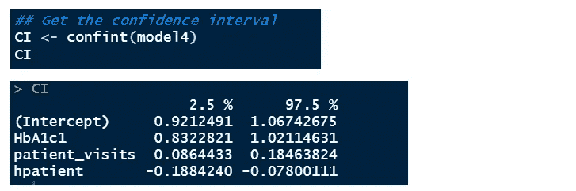

**Figure 7:** Confidence intervals for the final fitted logistic regression model assessing the relationship between HbA1c levels (exposure) and diabetic medication change (outcome) in the presence of admission source and patient visits as potential confounders.

在我们解释贝塔系数之前，让我们提供这个最终模型的**比值比**版本，因为我们目前拥有的是**对数比值比**。我们所需要做的就是对系数进行指数运算，从而得到比值比。产生比值比和比值比的代码如下所示:

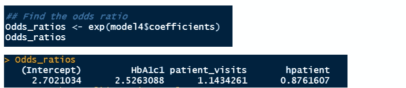

**Figure 8:** Odds ratio for the final fitted logistic regression model assessing the relationship between HbA1c levels (exposure) and diabetic medication change (outcome) in the presence of admission source and patient visits as potential confounders.

现在，我们可以将估计的β系数解释如下:

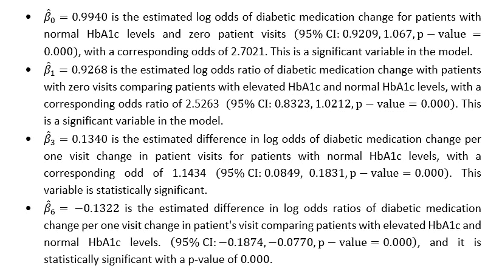

**结果讨论**
在拟合 logistic 回归模型后，我们发现患者就诊次数修改了 HbA1c 水平(暴露)和糖尿病药物治疗变化(结果)之间的关系，而入院来源没有修改也没有混淆这种关系。最终 logistic 回归模型的结果显示，所有变量都具有统计学意义。从图 6 中，我们发现 HbA1c 水平正常且无患者就诊的患者的糖尿病药物治疗变化的估计对数比值比为 0.994 (95% CI: 0.921，1.067；p 值< 0.000)，对应的奇比为 2.702。

此外，我们发现，与 HbA1c 水平升高的患者和 HbA1c 水平正常的患者相比，零就诊患者的糖尿病药物治疗变化的估计对数比值比为 0.927 (95% CI: 0.832，1.021；p 值<0.000), with a corresponding odds ratio of 2.526\. The estimated difference in log odds of diabetic medication change per one patient visit change in patient visits for patients with normal HbA1c levels is 0.134 (95% CI: 0.085,0.183; p-value<0.000). Finally, the estimated difference in log odds ratios of diabetic medication change per one visit change in patient’s visit comparing patients with elevated HbA1c and normal HbA1c levels is -0.132 (95% CI: -0.187,-0.077; p-value<0.000).

Since the final logistic regression model reported above shows unambiguous evidence of modification by patient visits, therefore we will report different odds for patients with elevated HbA1c levels and those with normal HbA1c levels. The estimated difference in odds of diabetic medication change per one visit change in patient visits for patients with normal HbA1c levels is 1.143 (95% CI:1.089,1.201; p-value<0.000), while the estimated difference in odds of diabetic medication change per one visit change in patient’s visits for patients with elevated HbA1c levels is 1.002 (95% CI:0.977,1.027;p-value=0.887).

We can see that the estimated difference in odds of diabetic medication change increases per change in patient visits for patients with normal HbA1c levels (Figure 9). Furthermore, this estimated difference in odds of diabetic medication change for every increase in patient visits for patients with normal HbA1c was slightly higher than for patients with elevated HbA1c levels.

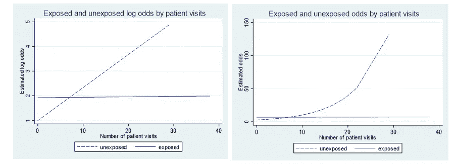

**Figure 9:** Estimated log-odds (left) and odds (right) for exposed (elevated HbA1c) and unexposed (normal HbA1c) patients by number of patients visits for the final logistic regression model

**注:**我使用 STATA 软件创建了上面的图。我已经提供了 STATA 代码来运行我用 r 做的同样的完整分析。你可以在这里访问这些 STATA 代码[。](https://github.com/Predicare1/Confounding-and-Modification-iin-Modelling)

**含义和结论**
我们发现 HbA1c 水平与我们调查的每一个糖尿病住院患者的结果显著相关(p 值< 0.05)。因此，随着普通人群中糖尿病患病率的持续增加，我们可以预计全球范围内将会有更多的糖尿病住院患者涌入。这一令人担忧的趋势使得有必要采取严肃的行动来发展、优化和实施有针对性的血糖管理策略。

HbA1c 升高显著相关(p 值<0.05) with increased odds of diabetic medication administration. However, odds of diabetic medication administration remained relatively constant for inpatients with elevated HbA1c regardless of how many previous visits these individuals made to the hospital before the study period. This may suggest that future glucose management protocols can improve upon existing strategies by evaluating which patients are at risk of recurring readmission and treating those accordingly.

**惊人！我向您的顽强和决心致敬，您坚持完成了这个冗长而深刻的案例研究。我相信花时间学习这些概念是值得的。**请在下面的评论区留下您的评论，并与他人分享这篇文章。如果你喜欢这篇文章，如果你能点击“鼓掌”图标(最多允许 50 次鼓掌)，这将对我意义重大。如果您想阅读本系列的[第三篇](https://arimoroolayinka.medium.com/the-dangers-of-extrapolation-in-modelling-dd3758b4ae44)，请点击[这里](https://arimoroolayinka.medium.com/the-dangers-of-extrapolation-in-modelling-dd3758b4ae44)。

作为 Coursera Guided Project Network 的一名基于项目的课程讲师，我教授了几门关于使用 r 的课程。你可以点击[这里](https://www.coursera.org/instructor/arimoro-olayinka)查看这些课程。谢谢大家！下次见！

## **致谢**

首先要感谢的是 VADA 数据集的作者，他们使数据集开源。此外，我非常感谢课程导师泰勒·威廉姆森博士和杰莎琳·霍洛丁斯基博士，他们指导和促进了不同的建模方法，这些方法对本文的成功起到了至关重要的作用。此外，他们还帮助编辑了这个系列的文章。我要感谢我的导师 Tolulope Sajobi 博士和 Colin Josephson 博士，他们让我有机会接受世界级的生物统计学培训。特别感谢 Ayoola Ademola、Joel Adekanye、Tate Hubkarao、Samuel Babatunde、Jason Black 和 Olawale Ayilara 分享他们在这一领域的知识。最后，我要感谢 Gabriel Afriyie 和 Ben Caddey，他们验证了我的一些想法，并在本文的部分内容中加入了他们的观点。

## **参考文献**

1.  r 核心团队。r:用于统计计算的语言和环境。奥地利维也纳。2021.网址[http://www.R-project.org/](http://www.R-project.org/)。
2.  斯达公司。2021.Stata 统计软件:第 17 版。德克萨斯州大学站:StataCorp 有限责任公司。