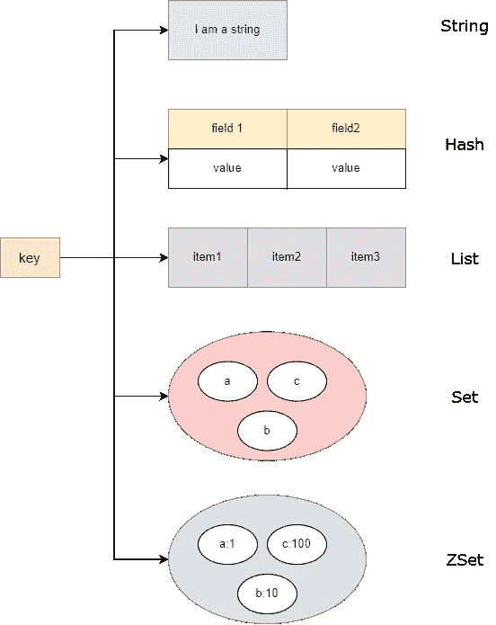

# 在电子商务应用中使用 Redis 数据结构的案例研究

> 原文：<https://medium.com/geekculture/a-case-study-into-usage-of-redis-data-structures-in-an-e-commerce-application-afdc5daaf1d9?source=collection_archive---------4----------------------->

Redis 中有 5 种基本数据结构: *string* 、 *hash* 、 *list* 、 *set* 和 *zset* 。每个数据结构都需要一个键对象来访问里面的值，有些是通过字段，有些可以直接访问值本身。在本文中，我们将深入一个案例研究，帮助您更好地理解这些数据结构如何实现一些现实生活中的…