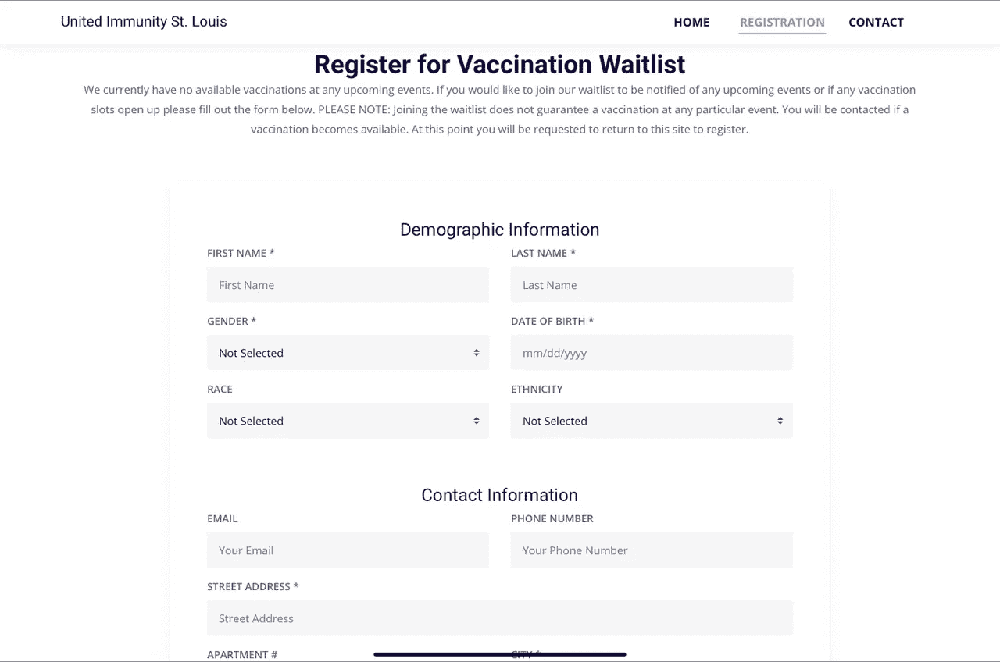
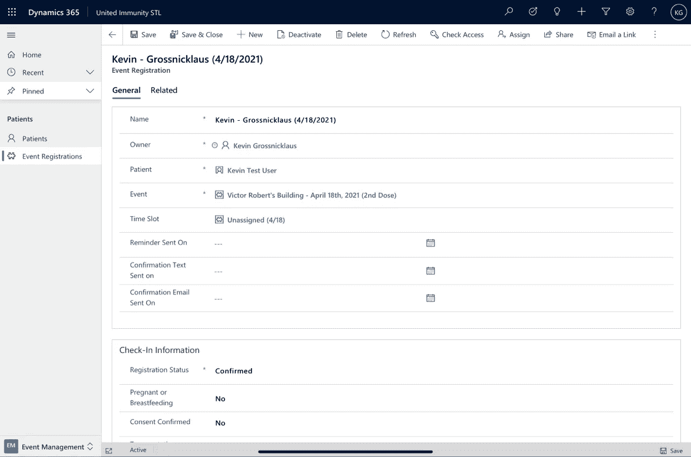
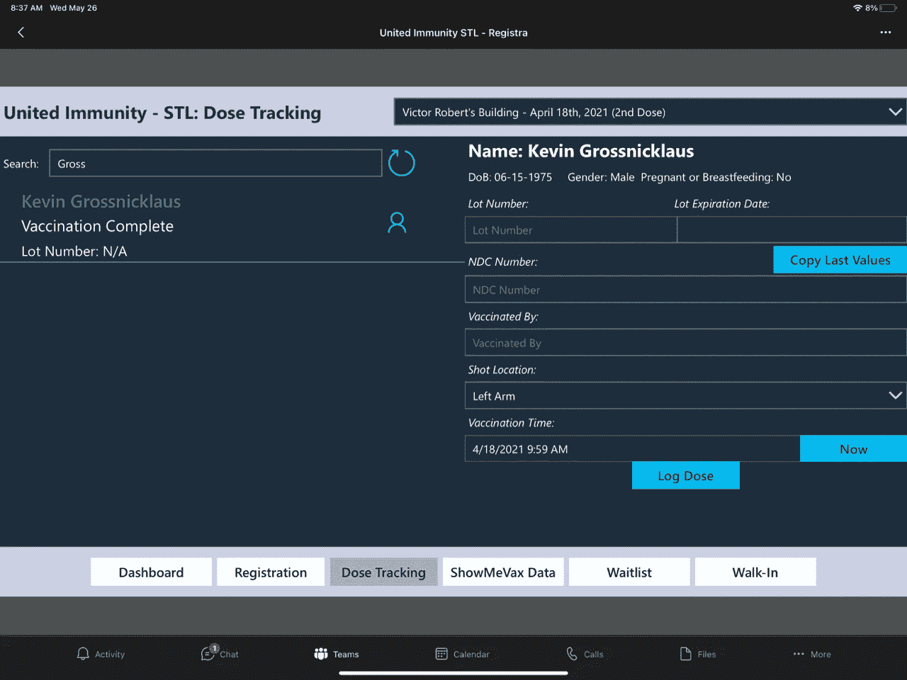

# 案例研究:使用快速建立 COVID 疫苗接种事件管理系统。NET、MS Dynamics 和 PowerApps

> 原文：<https://medium.com/geekculture/a-case-study-rapidly-building-a-covid-vaccination-event-management-system-with-net-c3a85434d7b?source=collection_archive---------47----------------------->

随着 COVID 疫苗在 2021 年的前几个月开始变得容易获得，许多医疗保健组织迅速动员起来举办活动，以有效地分发这些疫苗。不仅很难协调活动和登记人员，而且还存在一个挑战，即确保疫苗公平地分配给面临风险和服务不足的社区，以及那些有办法和时间表可以长途跋涉接种疫苗的社区。

在密苏里州圣路易斯地区，一些大型社区医疗服务提供者联合起来分配他们分配的一些疫苗，具体目的是确保这些疫苗免费提供，并针对我们城市的一些服务不足的社区。当这些事件的讨论开始时，我们的公司 ArchitectNow 参与进来，帮助快速有效地部署注册和数据管理解决方案，以确保患者可以有效地注册一个开放时间段，他们可以登记入住，必要的疫苗接种记录可以被跟踪并提交到我们的密苏里州疫苗接种数据库进行必要的报告。

这篇文章的目的是描述使用的技术和整个平台的实现。

## **技术选择**

从我们参与这个项目的那一刻起，我们有大约 3 周的时间来完全设计、实施和推出我们的解决方案。我们知道需要一个强大而稳定的解决方案，但也需要一个可以在如此紧迫的时间内交付的解决方案，我们很快就知道我们无法从头定制开发一个解决方案，而是需要严重依赖现有的平台和低代码解决方案。

## **活动前报名:棱角分明。网络核心**

患者注册流程旨在成为一个简单的“一劳永逸”的流程，社区成员点击一个小型的移动友好网站，该网站提供关于事件本身的信息。为了报名接种疫苗，他们将填写一份基本联系信息的表格，同时在我们的一个接种日期选择一个时间段。当这些时隙(和事件)填满时，它们将不可用于将来的注册。注册成功后，我们将向提供电子邮件的个人发送电子邮件通知和提醒，并向提供手机号码的个人发送 SMS/短信。

Custom Angular Web Form

为了构建这种移动友好的 web 体验，我们的团队依靠我们熟悉的技术堆栈，并利用一个简单的 Angular 应用程序(用 TypeScript 编写),该应用程序通过在微软的。NET 核心框架(用 C#写的)。整个解决方案是在几天内开发出来的，并且只利用了 Angular 中的两个“屏幕”:一个主页和一个注册页面。

## **数据库:微软数据世界**

当我们实施基于网络的注册流程时，我们必须选择一个数据存储平台来简化我们整体解决方案的其余组件。凭借的力量。NET 框架组件，我们知道我们可以从大多数数据库平台读写数据。我们还意识到实施的时间表是这样的，我们不想定制编写、测试和部署一堆定制的后端管理工具，我们的目标是使用 Microsoft Dynamics 365 和 PowerApps。通过倾向于 Dynamics 365 和 PowerApps，我们希望简化这些管理工具和必要的用户界面的开发，以便志愿者在这些活动期间在现场使用。

为了让我们自己处于最好(也是最容易)的场景中，我们决定我们的解决方案将 100%依赖微软 DataVerse 作为其数据存储平台。

在一个简短的设计会议之后，我们意识到我们只需要几个实体来有效地跟踪这些事件所需的数据。这些实体包括:

联系人(或患者):该实体代表注册疫苗接种的个人。这包括向密苏里州提交数据所需的基本联系信息和一些人口统计信息。

疫苗接种事件:这个实体代表了事件本身以及我们的系统对于特定事件的配置。

EventRegistration:该实体代表联系人对某个事件的特定注册。这包括他们登记参加的活动、他们选择的时间段，以及最终我们将存储他们接受的疫苗接种信息的实体。对于每一次疫苗接种，我们都需要跟踪疫苗的批号、接种的地点、由哪一位医疗专业人员提供的注射以及接种疫苗的时间。EventRegistration 实体是存储这些信息的理想场所。

当我们最初提供辉瑞疫苗剂量(需要两剂)时，每个联系实体也是两个事件注册实体的父实体:第一个事件注册针对患者的第一剂，第二个事件注册针对其第二剂。

鉴于实体设计的简单性(以及有限的实体数量)，我们能够在几个小时内完成 DataVerse 的设置。

## **数据管理:微软动态 365**

为了简化关键数据(和基本报告)的管理和监督，我们利用 Microsoft Dynamics 365 作为后端管理工具。此组件的安全性仅限于少数几个关键用户，我们为他们购买了适当的许可证。我们从一个新的 Dynamics 环境开始，该环境是用销售专业人员许可证和数据建立的。这给了我们一个核心 UI 和一组健壮的实体作为开始(也为我们需要的少量管理员许可证多花了一点钱)。

在 Dynamics 中，我们快速开发了一个模型驱动的 PowerApps 应用程序，以更好地代表我们认为适合我们用例的用户体验。在一个上午的时间里，我们调整了整体动态导航结构，并添加(或编辑)了一些模型驱动的屏幕，以便更好地管理我们的联系人(我们在 UI 中将其重命名为患者)以及疫苗接种事件和注册。我们将每个数据输入屏幕限制为仅显示我们业务的核心属性，并隐藏了所有选项卡和其他属性。

我们还为我们的实体更新了所有必要的网格/列表视图，以便只显示关键列。这不仅简化了 Dynamics 应用程序的使用，还为我们提供了快速报告功能，因为只需在 Dynamics 中过滤视图并将数据导出到 Microsoft Excel 即可满足大部分基本需求。

Dynamics 365 Administration View

不到一个上午，我们就有了以前在 DataVerse 中设计的所有关键数据的简化视图。这使得这些管理用户可以登录 Dynamics，并完全控制添加/编辑/删除我们系统中的任何实体。由于 Dynamics 365 利用 DataVerse 作为其核心数据源，我们能够快速拥有一个基于网络的注册系统(上面简要介绍了，并用 Angular/构建)。NET Core)和一个全功能的后端管理系统(Dynamics 365)，两者都与 DataVerse(作为我们的持久层)进行本地对话。

## **事件管理:微软 PowerApps**

整体解决方案的最后一项要求，也可以说是最复杂的一项要求，是让现场的志愿者能够在适当的时间为患者办理登记手续，然后在接种疫苗时，能够跟踪患者和他们所接种疫苗的具体数据。该系统必须简单高效，因为目标是每天生产 1500 支疫苗。

为了建立在已经使用的 DataVerse 数据集上并加快开发周期，我们决定利用微软的 PowerApps 作为这些功能的核心平台。我们在活动现场安排了 20 台 iPads，并且知道 PowerApps 的低代码功能和在所有设备上运行的能力使其成为这类目标业务线解决方案的绝佳解决方案。

将 PowerApps 连接到 DataVerse 中管理的实体相对简单，但我们需要考虑的一个问题是安全性。我们知道，我们支持的活动是由数百名医护人员和医学院学生组成和执行的，他们整天来来往往，我们意识到我们不能利用命名用户获得我们的 PowerApps 许可证。出于这个原因，我们选择为我们的 20 个物理 iPad 设备中的每一个购买“按应用程序”的 PowerApp 许可证。每台设备都使用这些不同的用户帐户登录，并被授予访问我们在 MS 团队中开发的 PowerApp 的权限。

Custom Power App Deployed to iPad

在为我们的疫苗接种活动开发 PowerApp 的过程中，我们做出的另一个设计决策是将所有功能添加到一个 PowerApp 中，而不是为特定用例开发一些小型的、有针对性的应用。这很容易做到，一个简单的导航系统被放置在适当的位置，以方便。用户很快就熟悉了他们在活动中的特定角色所必需的应用领域，并且可以很容易地对用户进行跨领域培训。

## **成果和平台灵活性**

上述整个平台仅在两周多一点的时间内就搭建完成，最初的疫苗接种活动为大约 1，500 名患者提供了辉瑞疫苗。在活动结束时，所有相关数据都可以快速方便地与密苏里州的 ShowMeVax 数据库共享，该数据库跟踪并报告所有疫苗接种情况。

Volunteers using PowerApp on iPad

随着活动的进行，发现了一些小问题，并确定了主要的新功能需求。由于我们假设所有患者都已经预先登记，因此最初没有计划允许“上门”接种。人们发现，我们会有一些多余的疫苗，所以打电话做广告说，我们将接受无预约。由于这一新要求是在我们第一次活动的第二天早些时候确定的，我们能够在 PowerApps 中在不到 20 分钟的时间内设计和实现 2 个新屏幕。在最初要求的 30 分钟内，我们调整了现场工作流程，并让 4 名带着 iPads 的志愿者安排在一个无预约服务台，为尚未使用这些新屏幕注册的人报名。在 30 分钟内从一个想法到产品中使用的功能似乎很疯狂，但我们可以使用 Microsoft PowerApps 轻松完成。

这个策略是一个非常可靠的解决方案，因为我们正在构建我们的解决方案，微软在相同的 Power 平台上发布了他们自己的解决方案来解决相同的机会。这篇[博文](https://cloudblogs.microsoft.com/industry-blog/health/2021/03/19/helping-communities-accelerate-covid-19-vaccinations-at-the-last-mile/)描述了用例，引用了他们创建的[解决方案](https://www.microsoft.com/en-us/industry/health/microsoft-vaccination-management)，并免费(只收取消费成本)提供给任何组织使用。

# **那又怎样？**

为什么这个案例研究很有趣？

这很有趣，因为我们完全颠倒了构建软件如何工作的叙述…我们*迅速*创建了一个*安全*、*可扩展*、*生产就绪*的解决方案，知道它很可能在不久之后**被放弃**。

这里最大的价值不是软件本身，而是工具和专业知识来快速创建这样一个可用的解决方案，以至于它可以是一次性的。这将运营支出模型发挥到了极致，但它是有效的。现在，我们不是说每个人都应该转向一次性软件，重新发明轮子。但是我们说的是，组织内部的小型用户群的小型工作流可以以低得多的复杂性和前期成本来处理。

通过把六位数的项目变成四位数的项目，你的组织能完成什么？额外的预算可以创造哪些新的机会？由于成本原因，您是否一直在避免使用传统系统？您处理的棘手问题中，是否有一些是因为它们在优先级列表中的位置足够高？您是否有在生命即将结束时需要重新创建的解决方案？

我们可以讨论如何驾驭这个新的解决方案框架，以及它对您意味着什么。