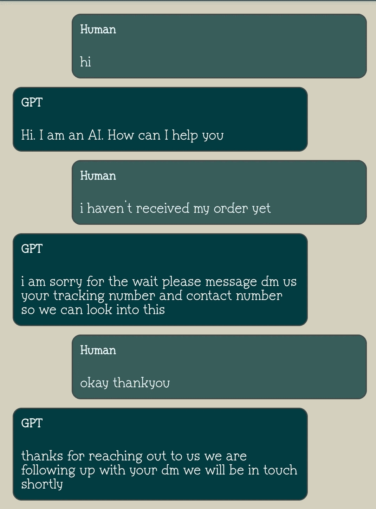
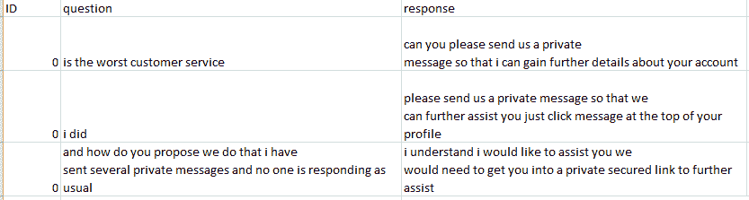

# 微调 GPT-3 的聊天机器人应用

> 原文：<https://medium.com/geekculture/a-chatbot-application-by-finetuning-gpt-3-2682aad25356?source=collection_archive---------1----------------------->

你可能在许多客户服务中见过聊天机器人。这里有一个类似的机器人。

这些机器人如何回应用户的查询？这个 bot 是如何理解用户意图并给出智能响应的？在这篇博客中，我们将通过利用机器学习和语言模型来构建上述智能聊天机器人。我们开始吧

# 介绍

聊天机器人是设计用来与用户进行交流的软件。聊天机器人的一个流行应用是客户支持。如今，我们几乎可以在每个网站上看到聊天机器人。通过使用聊天机器人，用户或顾客可以避免拨打客服电话并等待他们的回复的障碍。聊天机器人可以用不同的方式设计。它的复杂性可以从简单的基于规则、功能有限的聊天机器人，到利用人工智能等技术的智能聊天机器人。最近变得非常流行的一个智能聊天机器人是谷歌的λT1。聊天机器人的复杂性取决于它的用例。

智能聊天机器人是使用机器学习和自然语言处理构建的。这些聊天机器人被设计成用自然语言与用户互动。这些更聪明地理解用户的查询意图，并像人一样做出响应。大多数智能聊天机器人都建立在深度神经网络和变压器模型的基础上。变压器模型是一种深度神经网络，它使用一种称为自注意的技术将输入序列从一种形式转换为另一种形式。Transformer 的一个常见用例是语言转换，其中输入是一种语言的句子，输出是另一种语言的同一个句子。

如果你想了解更多关于变形金刚的内容，请参考我之前的博客。

 [## 变形金刚(电影名)

### Transformer 模型已经成为大多数 NLP 任务中的首选模型。许多基于变压器的模型，如伯特…

medium.com](/geekculture/transformers-231c4a430746) 

变压器是基于编码器-解码器的模型。编码器用于生成输入数据的有意义的表示。在上面的例子中，使用编码器将英语输入编码成向量。解码器将接收这些数据，并产生所需的输出。在这个例子中，期望的输出是日语翻译。目前有各种基于变压器的架构可供选择。你可以在这里看到[的车型列表。你也可以参考我在](https://huggingface.co/models)[之前的博客](/geekculture/different-transformer-models-f6f405999e4a)中讨论的内容。GPT 就是这样一个受欢迎的模式。在这篇博客中，我们将使用 GPT 模型来微调聊天机器人的客户支持。

# GPT 模型

如前所述，GPT(创成式预训练转换器)是 OpenAI 发布的一种转换器模型。它是一个只有解码器的转换器模型，主要用于文本生成。GPT 模型可用于许多自然语言生成任务，如文本补全、下一个单词建议、内容创建、聊天机器人等。有三种 GPT 型号可供选择——GPT 一号(2018 年)，GPT 二号(2019 年)和 GPT 三号(2020 年)。这些模型在架构、参数数量、训练数据集、批量大小等方面各不相同。我们将使用 GPT-3 模型来构建聊天机器人应用程序。

# OpenAI API

我们将使用 OpenAI API 来访问 GPT 模型。OpenAI 是一个基于人工智能的研究实验室，它创建了许多机器学习和语言模型。2022 年，Open AI 宣布能够通过他们的 API 为不同的用例微调和定制 GPT-3 模型。通过微调，GPT-3 可以用于定制用例，如文本摘要，分类，实体提取，客户支持聊天机器人等。

与 API 交互的第一步也是最重要的一步是生成用于身份验证的 API 密钥。用户可以通过登录这个[页面](https://beta.openai.com/account/api-keys)来创建 API 密钥。一旦您登录，您将获得一个秘密的 API 密钥，我们将在整个项目中使用它通过 API 进行多个请求。该 API 将提供价值 18 美元的免费积分，可在前三个月使用。

此外，要使用 OpenAI CLI 命令，我们需要在环境中安装 OpenAI。这可以通过在提示符下写入以下命令来完成。

# GPT 模型的推论

如前所述，我们将通过微调现有的 GPT-3 模型来构建一个聊天机器人。但在此之前，让我们看看预训练的 GPT-3 模型如何作为聊天机器人工作。下面的对话是一个人和预训练的 GPT-3 模型之间的对话。

> 人类:你好，你是谁？
> 
> 艾:我做得很好。今天我能为你做些什么？
> 
> 人类:你对人工智能了解多少？
> 
> 人工智能是指由机器展示的智能，与人类和动物展示的自然智能形成对比。我有三个博士学位，事实上，我现在正在攻读第四个。

我们如何从模型中生成这个输出呢？你只需要几行代码。

这里，提示只是我们给模型的输入文本。对于聊天机器人用例，我们以对话的形式给出输入。引擎代表模型。有不同的模式像达芬奇，阿达，居里，巴贝奇等。你可以在这里阅读更多关于每个型号[的信息。stop 参数用于标识 API 将停止生成未来令牌的点。例如，当“人类”这个词出现时，它就停止生成。温度参数表示答案的创造性程度。Top_p 是温度采样的替代方案，称为核采样，其中模型考虑具有 top_p 概率质量的表征的结果。Best_of 生成服务器端的 Best_of completions，并返回“best”(每个令牌具有最高日志概率的那个)。最后，max_tokens 表示可以生成的最大令牌数。](https://beta.openai.com/docs/models/gpt-3)

# 聊天机器人的微调 GPT 模型

既然我们知道了如何从预训练的 GPT 模型生成完成，让我们试着为客户支持聊天机器人微调我们自己的模型。我们一步一步来。

## 收集数据

收集数据是任何微调任务的第一步，也是最重要的一步。对于这个用例，数据是从 [Twitter 客户支持竞赛](https://www.kaggle.com/datasets/thoughtvector/customer-support-on-twitter)ka ggle 收集的。数据包含客户和客户支持团队之间的交互。

## **准备数据**

上述数据首先被分为用户评论和客服回复。数据看起来像这样

这里 id=0 表示 id=0 的用户和客户服务之间的对话链。现在，这些数据将被转换成 JSON 格式，然后用于训练模型。Open AI 对于每个用例都有一些标准的数据格式。例如，聊天机器人用例需要以下形式的数据。

类似地，无论是什么用例，训练数据集都有一个标准格式。你可以在这里看到数据准备的指导方针[。](https://beta.openai.com/docs/guides/fine-tuning/preparing-your-dataset)

上述数据集已被转换为微调所需的格式。

## 微调模型

一旦数据准备就绪，下一步就是对 GPT-3 模型进行微调。为此，我们使用 Open AI CLI 命令。第一步是添加您的秘密 OpenAI API 密钥。

下一步是将准备好的数据传递给模型进行训练。

您可以使用前面提到的任何模型。每个模型都适合特定的任务。微调的成本因型号而异。

## 使用微调后的模型执行推理

一旦模型被训练，你将得到一个训练模型的 id。您可以使用这个 id 从这个模型中进行推理。从模型中进行预测类似于我们在预训练的 GPT-3 模型中所做的。只需用新训练的模型替换模型名称。仅此而已！

# 创建聊天机器人应用程序

开发了一个简单的 android 应用程序，它通过 rest API 连接到微调后的模型。每次，当用户输入一个问题时，它会被发送到模型，模型的响应会显示在应用程序中。

 [## GPT 聊天机器人

### 使用 GPT 模型微调的客户服务聊天机器人

youtube.com](https://youtube.com/shorts/vmhTyUzQ_wA?feature=share) 

# 包扎

感谢你阅读这篇文章！如果你喜欢它，有问题，或者发现了错误，请告诉我。可以参考 [Github](https://github.com/Vinithavn/Finetune-GPT-3-for-customer-support-chatbot-) 上的代码库。请随时通过 [LinkedIn](https://www.linkedin.com/in/vinitha-v-n-5a0560179/) 、 [Twitter](https://twitter.com/Vinitha_vn) 或 [Medium](/@vinithavn) 联系或关注我。要阅读更多我的博客，请参考[https://neuralnetwork.guru/author/vinitha/](https://neuralnetwork.guru/author/vinitha/)