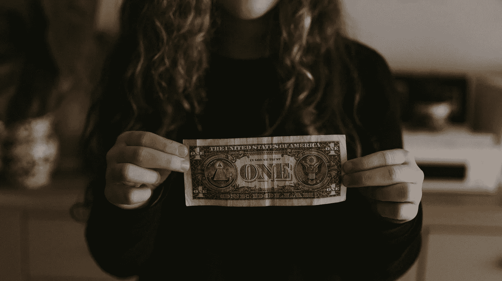

# 在区块链上出售任何东西的廉价而安全的方式

> 原文：<https://medium.com/geekculture/a-cheap-and-safe-way-to-sell-anything-on-the-blockchain-a-guide-to-zero-risk-nft-experimentation-52876eaf132d?source=collection_archive---------0----------------------->

## 零风险 NFT 实验指南

Photo by [Annie Spratt](https://unsplash.com/@anniespratt?utm_source=unsplash&utm_medium=referral&utm_content=creditCopyText) on [Unsplash](https://unsplash.com/?utm_source=unsplash&utm_medium=referral&utm_content=creditCopyText)

您现在可能已经听说过 NFTs 了。它们非常庞大，人们可以通过虚拟资产赚取数千美元，比如一张推文的截图(2915835.47 美元)或著名的 T2 猫(50 万美元)。有很多文章解释了什么是 NFT，如何进入 [NFT 销售](https://levelup.gitconnected.com/the-exact-process-i-used-to-create-and-sell-my-own-nft-art-on-the-ethereum-blockchain-698d9c59a2fe)行业…