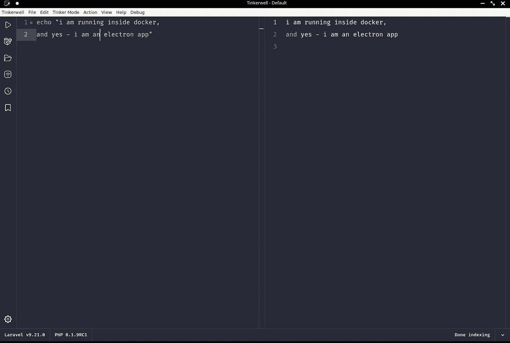
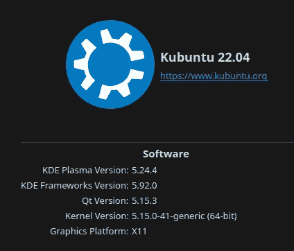
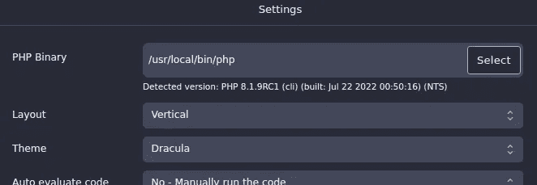
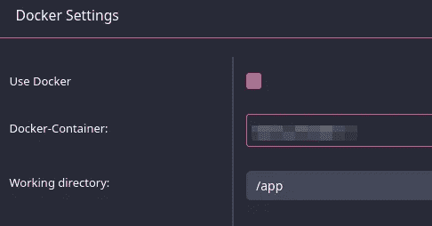
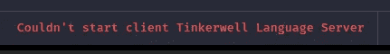
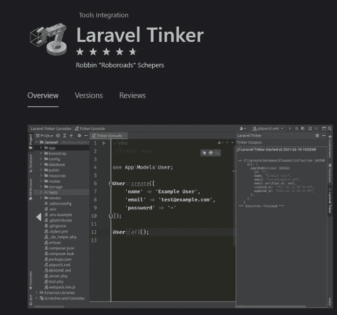
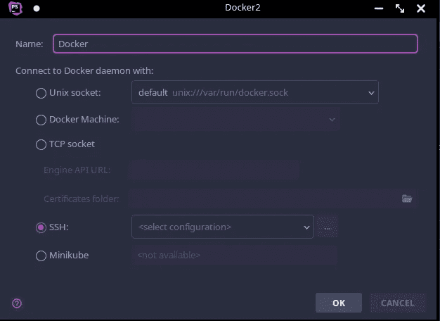

# 一家公司禁止了我，因为我让他们的电子应用程序在 Docker 中运行

> 原文：<https://medium.com/geekculture/a-company-banned-me-because-i-made-their-electron-app-running-inside-docker-3f45a713904f?source=collection_archive---------0----------------------->

好吧，说实话，因为:我也很无礼地问问题；)


这个故事的原标题应该是:

> 在 Docker 中运行 Tinkerwell(电子)

但因为我收到了一些邮件，我忍不住取笑它，并创建了一些人正在使用的这些愚蠢的戏剧性 clickbait 标题之一，对不起！；-))



Tinkerwell (electron) running inside Docker

实际上，技术部分应该从这里开始，但是我从某人那里收到一些邮件，并且…你应该知道…..


Photo by [Bank Phrom](https://unsplash.com/@bank_phrom?utm_source=medium&utm_medium=referral) on [Unsplash](https://unsplash.com?utm_source=medium&utm_medium=referral)

**周日下午的突发新闻(2022 年 7 月 31 日 17:00，CEST):**

在我能够完成这个故事之前，BeyondCode 的首席执行官 Sebastian Schlein 在一个周日写信给我(记住这一点)，向我解释说，他无法支持我——一个付费客户——因为我不使用他们的软件，因为他们打算使用他们的软件，如果他们愿意回答我的问题——我问了 3 件事——他们将无法支付租金。这可能听起来像一个有趣的坏笑话，但它不是。这是关于(一些)公司的真实情况，这些公司在 PHP(和 Laravel)世界非常活跃，为软件拿钱，但是当人们开始问问题时，你不是一个有价值的客户，提供了一个让事情变得更好的机会，提供了一个想法的机会，不，如果你写了两封以上的电子邮件，你就是一个“麻烦制造者”——什么是最好的
摆脱麻烦制造者？告诉他们:我不会支持你的！你已经付钱了，但我不在乎。为什么我不在乎？很简单:我只需要找到一个原因，我已经找到了一个:你没有按照我们想要的那样使用软件。是的，当然，我不得不在一个星期天告诉你这些；-))LOL。

我告诉他:如果我像他一样工作，我将会有比房租更多的东西付不起。

在这样一个世界里，你要感谢每一个付费的客户，他们花了很多精力测试和使用你的软件，这并不重要——它应该被使用还是不被使用——我会感谢每一个客户。我会虚心接受每一个想法，会倾听，会把每一个反馈和问题作为一个机会，让我的软件参与进来，让事情变得更好。

但 BeyondCode 的 CEO 可悲地给我上了更好的一课。

我告诉他，如果他道歉并把支持留给更懂技术的人，比如他的合作伙伴 Marcel(首席技术官),这没关系。相反，他给了我全额退款，并告诉我再也不要写信或使用他们的任何软件。你能相信吗？顺便说一下，为了让这个故事更完整，作为一个付费客户，我问了以下问题:

1.  Tinkerwell 是否必须在每次启动时创建索引，或者索引是否已经可用(从上次运行开始)。
2.  当编写“配置(…..)”(这来自 Laravel)，我希望 Tinkerwell 能为我提供自动补全功能，但它没有——所以我问它是否不存在，或者是否有问题
3.  在编写“User::”(这来自 Laravel)时，我会期望 Tinkerwell 为我提供自动补全，例如:“User::first()”，但它没有。所以我问是只是缺少了还是我应该看到。

没有任何文档可以回答这些问题。我总是在写作前先阅读，但当我没有找到任何东西并为之付费时，我真的相信，如果我问，我不是一个坏人；-))

这和我在 Docker 里面经营 Tinkerwell 有关系吗？也许是，也许不是。但是支付 49€并不足以得到答案。相反，首席执行官向你解释——在一个星期天——他无法回答这些问题，否则，他将无法支付租金(如果他的公司像我一样，在以不恰当的方式使用他们的软件的人身上浪费时间)。

说实话，我很震惊。我花了几个小时来交付在 Docker 中运行他们的软件的解决方案，这对像我一样工作的每个人来说都是一件好事——相反，我被踢了一脚，并被告知，像罪犯一样离开。疯狂的事实:我和那家伙没有任何过去。

如果你不知道代码之外的[，这里是他们的“哲学”:](https://beyondco.de/about-us)

*   我们有所作为
*   由开发人员为开发人员制作
*   回馈未来
*   你在一个好公司里

[https://media.giphy.com/media/xUA7b2ZsWYo4QiScg0/giphy.gif](https://media.giphy.com/media/xUA7b2ZsWYo4QiScg0/giphy.gif)

更妙的是:首席执行官先生的最后一封邮件:

> 我已经退款了，但是你的执照仍然有效。用不用 Tinkerwell 由你决定。

我猜隐藏的部分说:你不会得到任何更新，我们仍然不会在未来以任何方式支持你；-)这让这个手势更奇怪了。哦，天啊，德国今天是非常热的一天，也许在某些地区太热了；-)))

最后但同样重要的是:

几天前，我写信给支持者(另一个人):

> 我只是想让你知道:我会再买你的补锅匠，因为我看到了让它为我工作的机会。我只是想让你知道，所以你不认为我的第二次付款是某种骗局。

“她”回答(关于我的信息，应该可以在 docker 内部运行电子):

> 这是一个非常有趣的想法。(总有一天)我们会调查那件事。

你看，这一切都是纯粹的喜剧；——)
但如果首席执行官本身就是问题所在，那你就输了，在各个层面上都是如此；)

很抱歉这部分跑题了，但是在这个故事激励你给那些付不起房租的穷人钱之前——你……让我们说……应该知道:-)

**现在回到我要发布的原始故事:**

**重要提示:**

这是关于 Linux，Docker，和 PHP 的。我在这里提供的解决方案仅适用于 Linux。
如果你使用的是 Mac，你必须根据自己的需求进行调整，[这个](https://jaked.org/blog/2021-02-18-How-to-run-Electron-on-Linux-on-Docker-on-Mac)可能会有所帮助。
如果你是一个 Windows 用户，你已经选择了这个星球上你能使用的最差的操作系统(作为一个 PHP 开发者)，对你没有任何怜悯；-)

> btw…一个 Windows 用户在这里说话，但是感谢 VMWare，
> 我感觉 100% Linux:)

我的主机系统:



所以马塞尔做了一件伟大的工作，创造了这个叫做 Tinkerwell 的小助手，一个帮助 PHP 开发者的电子应用。

但遗憾的是，许多应用程序开发人员认为你的主机上总有一个“php”二进制文件。

老实说，从我认识 Docker 的那一天起，我作为开发人员的日常生活发生了巨大的变化。这真的改变了我的一切。不再有包冲突，运行所有东西的多个版本(甚至并行)。只有 1 个开发主机，而不是每个项目/客户一个，哦，男孩，这种方式改变了游戏规则:)

没有更多的黑客，没有额外的变通办法，没有更多的一切！一切都变得清晰、可配置、可互换。

所以今天，我无法理解没有 Docker 如何开发，为什么人们仍然坚持这些陈旧的原则，即一切都必须安装在他们的主机上(本地)。很明显，因为他们不认识 Docker，这超级可悲。如果你是其中之一，现在就开始吧！；-)

因此 [Electron](https://www.electronjs.org) 对于全栈开发者来说是一个很好的选择，提供每个人都能使用的工具，不管你用的是什么操作系统。

但是当涉及到这些类型的应用程序时，创建者总是认为，你的工作就像在石器时代，你的主机上有“php”二进制文件。

但是在现代码头工人的世界里，你没有！是的，你仍然可以在你的本地主机上安装 PHP(没有 docker ),但是你为什么要这样做呢？就因为有些工具逼你做？哪里有问题，哪里就有解决方案，这个故事只是解决这个问题的一种方式，尽管它可能会让你觉得有点矫枉过正，我亲爱的读者:)



with docker there is no binary php

所以要理解，为什么我不得不试着在 Docker 内部运行 Electron，你必须理解，Docker 是如何工作的。通常，一切都变得超级容易，但如果有人创造了不是为 Docker 世界制造的工具，就会发生相反的情况。

因为没有“php”二进制文件，所以当您使用 docker 时，有不同的选项来运行您的代码。你可以使用“[docker-compose exec](https://docs.docker.com/engine/reference/commandline/compose_exec/)”
或者简单的“ [docker run](https://docs.docker.com/engine/reference/run/) …”或者“ [docker exec](https://docs.docker.com/engine/reference/commandline/exec/) ”，如果您已经为您当前正在处理的项目运行了容器。

为了使事情变得更简单，您可以创建一个全局别名，如下所示(简化):

所以对你个人来说，使用 php 并没有什么真正的改变，
你仍然可以在任何地方使用你的“PHP”命令。如果你的项目有其他规格或需求，你修改你的别名，无论如何，有无数的可能性。

回到 Tinkerwell:这个应用程序想知道我的 php-binary 在哪里，
我的第一次尝试是为我的 php 别名创建一个包装器:


looks bad, does not work

别名很简单:

#!/bin/bash
source $ HOME/docker/。aliases # ←加载我所有的别名
php "$@ "

但是这不起作用。我尝试了一些其他的事情——我不记得今天了，所以放弃了。退款，好吧，让我们等等，也许 Marcel 意识到，与 PHP 对话也必须在不直接访问 PHP 二进制文件的情况下进行。
我建议创建一个 PHP 独立服务器，Tinkerwell 应该通过 Socket 与 PHP 对话，这将提供巨大的可能性。

然后，我偶然在网上发现了一些信息，在 Docker 中运行 electron“应该是可能的”。好吧，我想，这可以解决我所有的问题，Tinkerwell 最终会得到它如此受欢迎的 PHP 二进制文件:)
除此之外，“语言服务器”也应该可以工作，这在我的包装器中是不可能的。


Photo by [bill wegener](https://unsplash.com/@wegenerb?utm_source=medium&utm_medium=referral) on [Unsplash](https://unsplash.com?utm_source=medium&utm_medium=referral)

有趣的事情开始了。我从未与电子打交道，我完全不知道这是如何工作的，但是[我发现的第一个提示](https://trigodev.com/blog/develop-electron-in-docker)是在使用“docker run”时:

`-e DISPLAY=$DISPLAY`

而[这个](https://stackoverflow.com/a/60164852/1092858):

`-v /tmp/.X11-unix:/tmp/.X11-unix`

在那个网站上，我也得到了一个线索，关于你需要在正确的方向上得到什么。我相信我已经找到了一些评论，说“你不能使用电子与 docker 阿尔卑斯山”，但我找不到它，我不确定，抱歉。如果知道，请留言评论。

所以为了让事情不那么复杂，我拿了一张普通的 Debian 图片，拼命地在网上搜索，一张张拼图变成了一张图片。


Photo by [Jake Ingle](https://unsplash.com/@ingle_jake?utm_source=medium&utm_medium=referral) on [Unsplash](https://unsplash.com?utm_source=medium&utm_medium=referral)

长话短说:我做到了。我不知道是否有些事情不工作，但应该，但对我来说，一切都感觉“工作”。好了，神奇的事情来了:

Dockerfile 文件，图像:

是的，这是一个非常糟糕的，没有优化的 docker 文件，你不必告诉我。
我懒得在这里为这篇文章美化它，它只是我尝试和错误的结果——相信我，我有很多这样的经历。

里面有些东西，我不知道为什么，也不知道它们有什么用；-)))
不过哎，最后还是管用的:)

所以有些事情要提一下(第 35 到 40 行):

*   该映像以用户“docker”的身份运行，其 UID 与我的本地 Linux 用户相同，因此我没有任何权限冲突
*   用户“docker”也是组“docker”的一部分，但是该组还有一个非常具体的 GID: 134。只是因为我所在的本地组织“码头工人”也有同样的问题

你可能会问，为什么 docker 本身被安装在 docker 镜像中，是的，这看起来很奇怪，但是 Tinkerwall 实际上给了你从现有的运行容器中使用 PHP 的选项:



但主要问题依然存在:



这就是 Tinkerwell 需要“php”二进制文件的地方。

所以安装 docker 本身就赋予了 Tinkerwell 与 docker 对话并使用现有功能的能力。

回到 docker 文件:

*   第 6 行到第 10 行，不要问我，这是复制&粘贴；-)
*   第 3 行:轨迹和错误，当试图启动电子，总是有图书馆失踪，这只是我不得不安装的结果
*   第 12 行到第 14 行:“pcntl”是必需的，我不记得是用来做什么的，但是我们需要它；)

最后，这是我的“docker run”命令:

run_tinkerwell.sh

当然，一切都是高度适应我的个人设置，但它不应该很难调整到你自己的设置。例如:

`-e DISPLAY="unix:0.0"`

可以替换为

`-e DISPLAY="unix$DISPLAY"`

如果你的 UID 不是 1000，你知道该怎么做。


Photo by [Vlad Bagacian](https://unsplash.com/@vladbagacian?utm_source=medium&utm_medium=referral) on [Unsplash](https://unsplash.com?utm_source=medium&utm_medium=referral)

这是一次不寻常的旅程，一如既往，我学到了很多东西(关于 Linux，当然还有一家德国公司及其“真正的”哲学)。
Tinkerwell 在工作，语言服务器在运行，Docker 在工作。
我可以浏览我的项目，并使用现有的运行容器，任务完成；-)

**而最搞笑的是:**

我现在就删除小叮当，因为…你懂的；-)


在你投资时间在别人的软件上之前，确保他们和你一样感兴趣；-))


Photo by [Nathan Dumlao](https://unsplash.com/@nate_dumlao?utm_source=medium&utm_medium=referral) on [Unsplash](https://unsplash.com?utm_source=medium&utm_medium=referral)

**如果你是 Jetbrains-IDE 用户:**

在你花钱然后寻求支持之前，先看看这个插件，它工作得非常好，因为 Jetbrain 已经支持在 Docker 中运行的 PHP 解释器，你不必在这里处理所有这些垃圾:



[https://plugins.jetbrains.com/plugin/14957-laravel-tinker](https://plugins.jetbrains.com/plugin/14957-laravel-tinker)

最棒的是:您拥有自动完成和错误报告的全部能力，因为您仍然在 ide 中。tinker well——当然，不能提供这个，因为它是一个独立的编辑器。

有人可能会说:但是 Tinkerwell 能够通过 SSH 连接到任何主机。
别担心，聪明人也可以:



JetBrains offers a lot of ways to connect to your Docker

我还没有测试它，但这应该是可行的。

是的，我不想隐瞒 Jetbrains 也有 Tinkerwell 插件的事实，但是第一次尝试，我只看到:

```
Could not open input file: /opt/tinkerwell2/tinker_prepared.phar
```

当然，我(不再)在乎，因为这需要请求支持——因为——根据“首席执行官先生”的说法，我属于以错误方式使用软件的 20%的人，我不会得到任何支持；-))

**是啊，管他呢，吃我的短裤吧！；——)**


Photo by [Evan Bollag](https://unsplash.com/@evanbollag?utm_source=medium&utm_medium=referral) on [Unsplash](https://unsplash.com?utm_source=medium&utm_medium=referral)

和往常一样，正如每个 Youtuber 用户在头 10 分钟所说的:如果这在任何方面对你来说是有趣或有用的，或者只是娱乐，请考虑一些“掌声”和/或“关注”；-)

谢谢大家！
米莎