# 各种机器学习模型的比较分析

> 原文：<https://medium.com/geekculture/a-comparative-analysis-of-various-machine-learning-models-3d8e08aa4df4?source=collection_archive---------22----------------------->

# 利用压力、焦虑的感知水平预测印度学校教师的性别&新冠肺炎疫情中他们的人口统计学特征


Photo by [Giovanni Gagliardi](https://unsplash.com/@gagliardiphotography?utm_source=medium&utm_medium=referral) on [Unsplash](https://unsplash.com?utm_source=medium&utm_medium=referral)

1.  **简介**

由于这种疾病的未知性质，COVID 19 疫情引发了所有年龄段的人的恐惧。当局已经采取了各种预防措施，包括社交距离、封锁、旅行限制以及关闭学校和大学。印度也采取了这些预防措施。它影响了几乎所有的经济体，即使在小规模的部门也有直接的影响。在社会不同部门工作的人面临着精神压抑和恐惧的感觉，这是由于突然的封锁场景和由于同样原因死亡人数的增加。技术工人阶级在通过网络方式改变他们的大部分工作时遇到了极大的麻烦，这可能会导致他们的压力和焦虑感。在新的正常情况下引入新的在线教学模式显然导致了心理偏差，关键是他们中的大多数人无法有效地利用工作时间，因为他们缺乏以正常方式轻松工作的机会。

这种劳动中最重要的阶层是教师。由于在线教学模式的突然转变，他们往往会有额外的精神压力。学校和大学被关闭，教育被转移到互联网上。印度学校的老师习惯于传统的教学方法，在线教育的转变对他们来说是一个新的领域。在 COVID 19 疫情，进行了一项在线研究，以评估学校教师的压力和焦虑水平。数据取自印度。

现在，来看这里的分析，主要意图是对各种机器学习模型进行比较分析，以使用他们在新冠肺炎时间获得的焦虑水平、他们感知的压力水平、年龄、他们有孩子的数量以及他们每天教学的最小小时数来预测教师的性别。做这样的分析是很有可能的，因为有几项研究讨论了一个人将如何对待或处理与他们的性别有关的情况。因此，这可以成为利用这些因素预测一个人性别的另一种方法。有几种机器学习模型可用于预测机器学习问题中的特定类别。确定适用于特定情况的最佳模型是一项具有挑战性的任务，因为每个数据都是唯一的，并且在不同的模型中可能表现不同。从逻辑上讲，选择一个特定的机器学习问题进行分析可能会得出某些结论，但在每种情况下都建议进行试错，以找出有关问题的最佳模型。

**2。数据**

**2.1。用于分析的数据和变量的来源**

用于分析的数据取自 https://data.mendeley.com/datasets/yhmb6psmpm/1 的[。研究人员在印度进行了数据收集，数据集包含有关教师的年龄、性别、他们的教学类别、他们参与教学的小时数、他们的婚姻状况、他们有多少个孩子、在 covid19 疫情情景中感知的压力水平以及感知的焦虑水平的信息。分析中采用的变量有年龄、压力水平、焦虑水平、他们授课的小时数以及他们有多少个孩子。关于用于分析的变量类型的信息如下，以及相同的深入细节。(如果你想对不同的机器学习模型进行比较分析，你可以使用任何数据集！)](https://data.mendeley.com/datasets/yhmb6psmpm/1)

让我们导入必要的库并为分析设置数据框。我已将数据直接保存在工作中，文件名指定为 Data_Covid.csv。

```
import pandas as pdimport numpy as npfrom sklearn.preprocessing import LabelEncoder, MinMaxScaler, StandardScalerimport matplotlib.pyplot as plt#visualising the datadf=pd.read_csv('/content/Data_covid.csv')df
```

**2.2。选择特定变量进行分析的原因**

如引言中所述，我们必须预测学校教师的性别。使用基本的人口统计特征，如年龄、婚姻状况和孩子数量来预测性别是很有挑战性的。但是一些与心理学和经济学相关的文献表明，他们的性别也与他们的行为模式有关。我们知道在疫情新冠肺炎，由于不确定性的发生，每个人都变得高度紧张和焦虑。同样，对于学校教师来说，由于在线上课和在线处理学术活动的额外压力，也发生了同样的事情。因此，对他们来说，感知到的压力水平和焦虑水平也可能因性别而异。因此，在这里，感知压力水平和感知焦虑水平这两个变量被用来预测性别，此外，一些人口统计学特征，如他们在 covid19 疫情情景中的教学时数、他们的年龄和孩子数量，也被考虑在内，以预测相关印度学校教师的性别。

现在绘制如下相关图，以了解是否有任何变量彼此之间的相关性更高。

```
#BUILDING PEARSON CORRELATION PLOTimport seaborn as snsdef correlation_map(df):_ , ax = plt.subplots(figsize =(14, 12))colormap = sns.diverging_palette(220, 10, as_cmap = True)_ = sns.heatmap(df.corr(),cmap = colormap,square=True,cbar_kws={'shrink':.9 },ax=ax,annot=True,linewidths=0.1,vmax=1.0, linecolor='white',annot_kws={'fontsize':12 })plt.title('Pearson Correlation of Features', y=1.05, size=15)correlation_map(DATA)
```

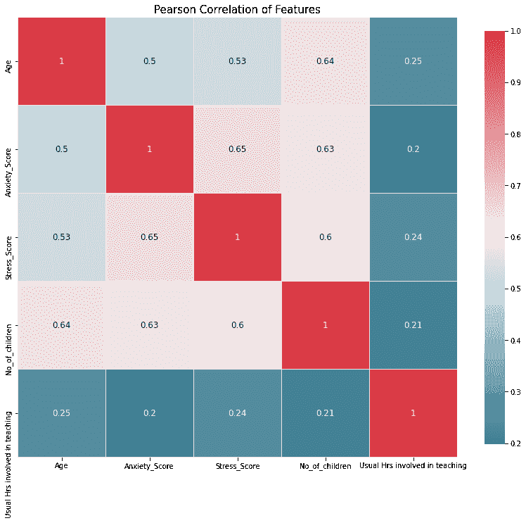

Image by Author(Data Analysis)

从图中可以明显看出，没有任何自变量彼此之间有太多的相关性。所以，变量的选择是有希望的。

**2.3。数据清洗和数据预处理(特征缩放)**

```
DATA.info()
```

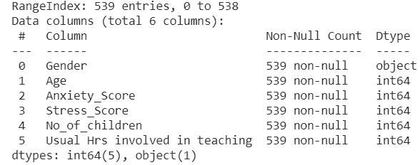

Image by Author(Data Analysis)

已经发现，用于分析的所有变量都不为空。因此，不需要进一步的数据清理，因为我们在将要用于分析的变量中没有任何“NaN”、“None”或空格。变量 Gender 是一个对象类型，所有其他变量都是 int64 类型。因此，为了支持使用变量进行分析，我使用了一个标签编码器将“性别”变量从 object 类型转换为 int64 类型。

```
#assigning the independent variables,X and the dependent variable Y.X=DATA.iloc[:,1:6]Y=DATA.iloc[:,0:1]Y
```

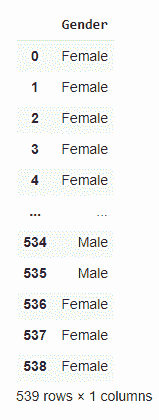

```
labelencoder=LabelEncoder()Y=labelencoder.fit_transform(Y)pd.DataFrame(Y,columns= ['Gender_labelled'])
```

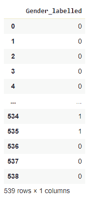

Image by Author(Data Analysis)

因此，现在所有的变量都是 int64 类型。

```
DATA.describe()
```

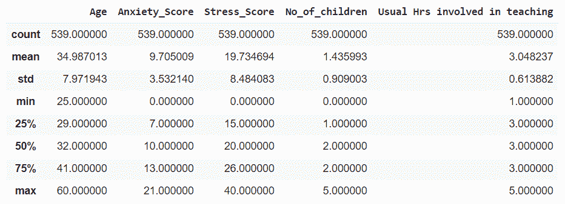

Image by Author(Data Analysis)

图 3 给出了用于分析的变量的统计描述，它给出了关于数据的深刻见解。大部分变量都不是那么正态分布的，所以作为直觉的一面，逻辑回归可能是合适的，但是我们要检查所有的机器学习方法，确认。因此，我们有了干净的数据，变量也作为预处理进行了最小最大缩放。在最小最大值缩放中，数据以这样的方式缩放，其值通常在 0 和 1 之间。在标准缩放中，数据以均值为 0、标准差为 1 的方式进行缩放。关于我们的数据集，MinMax 是一个很好的选择，因为我们希望保留我们的零，因为它显示了一个类别。所以，我更喜欢在整体模型中使用它。然而，当我们转向机器学习模型时，我们使用 MinMaxScaler 和标准 Scaler 通过反复试验来检查模型。

**2.4。首先通过直觉寻找最佳拟合的数据可视化**

这是通过使用 X 轴上的每个自变量和 Y 轴上的因变量来完成的。这基本上是为了了解什么可能是最合适的。

```
plt.scatter(x=DATA["Stress_Score"],y=DATA["Gender"])plt.xlabel("Stress_Score")plt.ylabel("Gender")plt.title('scatter plot between Stress Score  and their Gender')plt.show
```

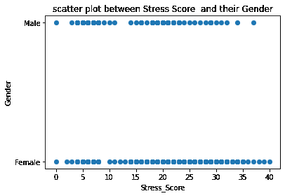

Image by Author(Data Analysis)

```
plt.scatter(x=DATA["Anxiety_Score"],y=DATA["Gender"])plt.xlabel("Anxiety_Score")plt.ylabel("Gender")plt.title('scatter plot between Anxiety Score  and their Gender')plt.show
```

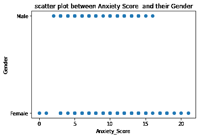

Image by Author(Data Analysis)

```
plt.scatter(x=DATA["No_of_children"],y=DATA["Gender"])plt.xlabel("No_of_children")plt.ylabel("Gender")plt.title('scatter plot between No_of_children they have and their Gender')plt.show
```

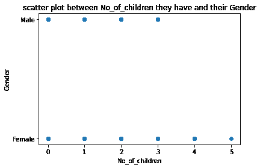

Image by Author(Data Analysis)

```
plt.scatter(x=DATA["Age"],y=DATA["Gender"])plt.xlabel("Age")plt.ylabel("Gender")plt.title('scatter plot between Age and Gender')plt.show
```

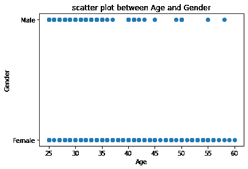

Image by Author(Data Analysis)

```
plt.scatter(x=DATA["Usual Hrs involved in teaching"],y=DATA["Gender"])plt.xlabel("Usual Hrs involved in teaching")plt.ylabel("Gender")plt.title('scatter plot between Usual Hrs involved in teaching and their Gender')plt.show
```


Image by Author(Data Analysis)

毫无疑问，因为我们的因变量“性别”是一个二元变量，所以所有的图都以这样一种方式显示，它们都促进了一条 sigmoid 曲线来拟合它们。此外，我们知道，对于分类问题，拟合一条类似 s 形曲线的非线性曲线应该很好。我们将会看到这个思考过程是对还是错。

**2.5。将用于分析的变量存储到相关数据帧**

数据已经被清理和预处理。因此我们有-

**因变量** 🡪学校教师的性别

**自变量** 🡪 x1。感知压力水平

x2。感知焦虑水平

x3。学校老师的年龄

x4。他们授课的小时数

x5。他们有几个孩子(几个孩子的母亲/父亲)

因变量和自变量都是非空的，类型为 int64。现在，因变量被存入变量 a 的数据框，而自变量 Y 被存入 x。

**2.6。将数据集分成训练集和测试集。**

数据被分成训练和测试，以执行数据的测试和训练。X 被分成 X_train 和 X_test，Y 被分成 Y_train 和 Y_test，因为测试大小为整个数据的 20%,而训练大小是数据的剩余 80%。下面，我们可以看到分割 X 和 Y 后得到的 X_train，Y_train，X_test，Y_test 的大小。

```
from sklearn.model_selection import train_test_split#I'm giving a 20% for testingX_scale=MinMaxScaler().fit_transform(X)X_train, X_test, Y_train, Y_test =train_test_split(X_scale,Y,test_size=0.2,random_state=0)n=X_train.shapeprint("shape of X_train is:-",n)r=X_test.shapeprint("shape of X_test is:-",r)k=Y_train.shapeprint("shape of Y_train is:-",k)f=Y_test.shapeprint("shape of Y_test is:-",f)
```

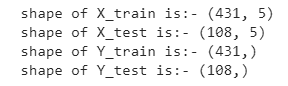

By Author(Data Analysis)

**3。方法学&机器学习模型的分析(注:最后完成所有模型的误差分析)**

**3.1。线性回归分析**

***3.1.1 .方法论***

为了进行线性回归，使用 scikit-learn/sklearn 库的线性模型中的 linear regression 包。基本上，线性回归分别为 x1、x2、x3、x4、x5 拟合具有诸如β1、β2、β3、β4、β5 的系数的线性模型，以最小化误差的残差平方和。(误差是数据集中观察到的目标与线性近似预测的目标之间的差异。).因此，将线性回归模型定义为线性回归函数。然后将 X_train 和 Y_train 值拟合到线性回归模型上。然后使用定义的模型预测相应的 X 测试值的 Y 值，之后确定其准确性。

***3.1.2 .代码***

```
from sklearn.linear_model import LinearRegressionfrom sklearn.metrics import mean_squared_error, r2_scorefrom sklearn import preprocessing#now linear regressionreg=LinearRegression()reg.fit(X_train,Y_train)#for getting our predicted Y value from X_test value,the following codeY_pred=reg.predict(X_test)#the cofficient of x or the slope of the lineprint("Linear Regression Analysis results")print("----------------------------------")coefficient=reg.coef_print("The coefficients for x1,x2,x3,x4 & x4 are",coefficient)#then we need to find the R squared score and mean squared error for checking how good the model isr2_value=r2_score(Y_test,Y_pred)MeanSquareError=mean_squared_error(Y_test,Y_pred)print("R squared Value of the model is",r2_value)print('Accuracy on the Test set in (%) is ', round(reg.score(X_test, Y_test)*100, 2))print("Mean Squared Error of the model is",MeanSquareError)
```

***3.1.3 .结果&线性回归分析***

**图 6**

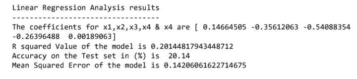

Image by Author(Data Analysis)

精确度很差(精确度=20.14)，这是意料之中的，因为在我们的例子中，Y 变量是一个二元变量，因此拟合一条线是一个坏主意。所以，在这个数据中由于二元因变量，线性回归表现不好。因此，线性回归不适用于这个数据，这也是我们在看到自变量对因变量的曲线图时的第一个观察结果。因为 y 是二进制的，所以所有的图看起来肯定像是 sigmoid 曲线可以是最佳拟合的图，但是为了清楚每个变量，以不同的方式显示也是很重要的。因此，我们可以离开线性回归，看看有什么进一步的 ML 方法来完美地拟合数据。

**3.2。逻辑回归分析**

**3.2.1。*方法论***

使用 scikit-learn 库的线性模型中的 Logistic regression 包进行逻辑回归。基本上，逻辑回归拟合具有某些系数的 s 形曲线。因此，将逻辑回归模型定义为逻辑回归函数。注意，在使用这个 LogisticRegression 函数**时，默认情况下应用正则化。**此外，默认情况下会应用“l2”惩罚。然后将 X_train 和 Y_train 值拟合到逻辑回归模型中，其中“lbfgs”解算器用作默认值。然后使用定义的模型预测相应的 X 测试值的 Y 值，之后确定其准确性。

**3.2.2 代码**

```
from sklearn.linear_model import LogisticRegressionfrom sklearn.metrics import classification_report, confusion_matrix, accuracy_score# we can also add penaltyLR = LogisticRegression(random_state=0, solver = 'lbfgs')LR.fit(X_train, Y_train)Y_pred = LR.predict(X_test)print("Logistic Regression Analysis results")print("----------------------------------")print('The Coefficients for the model are \n', LR.coef_)print('Accuracy in(%) on Test set is', round(LR.score(X_test, Y_test)*100, 2))result = confusion_matrix(Y_test, Y_pred)print("Confusion Matrix:")print(result)result1 = classification_report(Y_test, Y_pred)print("\nClassification Report:")print (result1)result2 = accuracy_score(Y_test, Y_pred)print("\nAccuracy:",result2)#confusion matrixlabels = sorted(DATA['Gender'].unique())sns.heatmap(confusion_matrix(Y_test, Y_pred),annot=True,xticklabels=labels,yticklabels=labels)
```

**3 . 2 . 3*。结果&Logistic 回归分析***

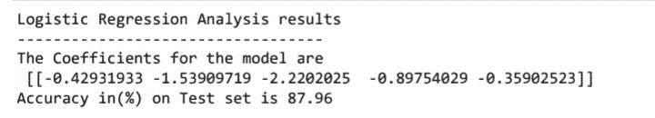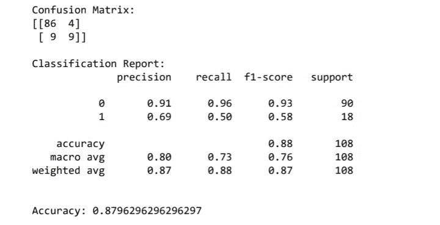

Images by Author(Data Analysis)

很明显，逻辑回归是一个很好的预测模型，可以使用感受到的压力水平、焦虑水平、年龄、孩子数量、他们在教学中花费的时间来预测学校教师的性别，因为测试准确度为 83.33，远远好于线性回归。其中 86 名女性被预测为女性，9 名男性被预测为男性。所以，这个模型非常好，非常准确。

**3.3。支持向量机分析**

**3.3.1。*方法论*方法论**

SVM 算法通常使用将输入数据空间转换为适当格式的内核来实现。SVM 采用了一种被称为内核技巧的方法，在这种方法中，内核将低维输入空间转换为高维空间。内核，用基本的术语来说，通过给不可分离的问题增加更多的维度，使它们变得可分离。我使用的 SVC 函数就是支持向量分类。我试验了四种内核，如“线性”、“多边形”、“rbf”和“sigmoid”。然后将 X_train 和 Y_train 值拟合到支持向量分类器模型上。然后使用定义的模型预测相应的 X 测试值的 Y 值，之后确定其准确性。

**3.3.2。代码**

```
from sklearn.svm import SVCsvm = SVC(kernel = 'linear',gamma = 'scale')svm.fit(X_train, Y_train)Y_pred = svm.predict(X_test)print('Results of Support Vector Classification')print('----------------------------------------')print('Accuracy on Test with linear kernal: ', round(svm.score(X_test, Y_test)*100, 2))svm = SVC(kernel = 'poly',gamma = 'scale')svm.fit(X_train, Y_train)Y_pred = svm.predict(X_test)print('Accuracy on Test with polynomial kernal: ', round(svm.score(X_test, Y_test)*100, 2))svm = SVC(kernel = 'rbf',gamma = 'scale')svm.fit(X_train, Y_train)Y_pred = svm.predict(X_test)print('Accuracy on Test with rbf kernal: ', round(svm.score(X_test, Y_test)*100, 2))svm = SVC(kernel = 'sigmoid',gamma = 'scale')svm.fit(X_train, Y_train)Y_pred = svm.predict(X_test)print('Accuracy on Test with sigmoid kernal: ', round(svm.score(X_test, Y_test)*100, 2))
```

**3 . 3 . 3*。结果&支持向量机*分析**

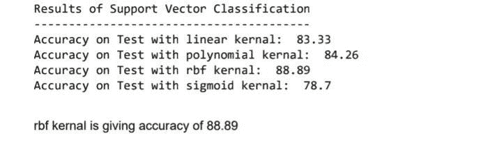

Image by Author( Data Analysis)

以上是支持向量分类的结果。我尝试了四种不同的内核，上面给出了每个内核的精度。因此，支持向量分类模型在“rbf”(径向基函数)核中工作得最好，测试准确率为 82.41 %。因此，rbf 核在模型中表现良好。因此，以下是具有 rbf 核的支持向量分类模型的混淆矩阵和分类报告，其显示了相当好的迹象，因为 85 个雌性被正确预测，11 个雄性被正确预测。

```
# Confusion Matrixresult = confusion_matrix(Y_test, Y_pred)print("Confusion Matrix of the model with rbf kernal:")print(result)# Classification reportresult1 = classification_report(Y_test, Y_pred)print("\nClassification Report of the model with rbf kernal:")print (result1)# Accuracy scoreresult2 = accuracy_score(Y_test, Y_pred)print("\nAccuracy:",result2)#confusion matrix# Transform to df for easier plottingoutcome_labels = sorted(DATA['Gender'].unique())sns.heatmap(confusion_matrix(Y_test, Y_pred),annot=True,xticklabels=outcome_labels,yticklabels=outcome_labels)
```

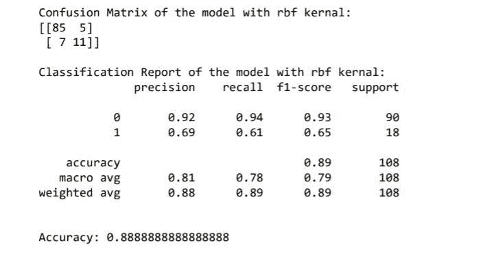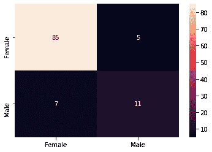

Images by Author(Data Analysis)

核函数用于将原始数据集(线性/非线性)映射到更高维的空间，以便将其转换成线性数据集。使用 rbf 核的 SVM 工作良好，因为它允许 SVM 变得非线性而不是线性。85 名女性被预测为女性，11 名男性被预测为男性。准确率和召回率也不错。

**3.4。随机森林分类器**

**3.4.1。*方法论***

使用随机森林分类器，因为我们的上下文是一个分类问题。从 sklearn 库中，使用具有 RandomForestClassifier 的集成包。随机森林是一种元估计器，它使用平均来提高预测准确性，并通过在给定数据集的各个子样本上拟合多个决策树分类器来控制过拟合。RandomForestClassifier 函数被定义为具有“n_estimators”的模型，森林中的树的数量被定义为 50。然后将 X_train 和 Y_train 值拟合到模型中，并预测相应 X 测试值的 Y 值。

3.4.2。代码

```
from sklearn.ensemble import RandomForestClassifierRandomForest = RandomForestClassifier(n_estimators = 50)RandomForest.fit(X_train, Y_train)Y_pred = RandomForest.predict(X_test)print("Result of Random Forest classifier model")print("----------------------------------")result2 = accuracy_score(Y_test, Y_pred)print("\nAccuracy of the Random Forest Classifier:",result2)result = confusion_matrix(Y_test, Y_pred)print("Confusion Matrix:")print(result)# Classification reportresult1 = classification_report(Y_test, Y_pred)print("\nClassification Report:")print (result1)#confusion matrix# Transform to df for easier plottingprint("Confusion matrix_random forest classifier")labels = sorted(DATA['Gender'].unique()sns.heatmap(confusion_matrix(Y_test, Y_pred),annot=True,xticklabels=labels,yticklabels=labels)
```

**3.4.3。*结果&随机森林分类器*分析**

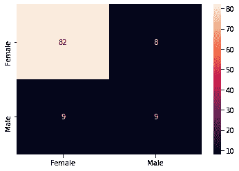

Images by Author

随机森林分类器也表现良好，准确率达 80%。因此，具有 50 个决策树的随机森林分类器在相关数据集中表现良好。我们知道随机森林算法是一个集合算法，它基本上是几个决策树算法的组合。从训练集的随机选择的子集，随机森林分类器生成一组决策树。这就是为什么它给出了更准确的结果，这是分类问题中最受欢迎的技术。(我还尝试对数据进行随机森林回归，它给出了非常差的测试精度，甚至低于线性回归给出的精度。)

**3.5。安**

**3.5.1 .人工神经网络方法**

人工神经网络也称为 ann，是基于相互连接的神经元/节点工作的网络。输入通过权重和偏差与节点进行转换。这里，Keras 用于构建神经网络。

在 Keras 的模型包中，“顺序”用于构建模型。已经进行了几次试验和错误，但是最终的模型正在报告中展示。X_train 和 Y_train 值使用最小最大缩放器进行缩放。对于“顺序”最终模型，有四层，其中一层是输入层，两层是隐藏层，一层是输出层。对于输入层，对权重的初始化进行了统一的内核初始化。那么输入维度是 5，因为我们有 5 个独立变量/特征。使用“relu”激活函数将输入层中的节点数设置为 32，以避免 sigmoid(如果存在)的消失梯度问题。两个隐含层的节点数分别为 16 个和 8 个，都具有“relu”激活功能。最后一层用 1 作为节点数和“tanh”激活函数。神经网络模型然后以“adam”作为优化器(它被发现工作良好)，以“二进制交叉熵”作为损失函数(因为我们的输出变量具有值 1 和 0。然后，通过以 0.2 的验证分割运行 40 个时期，用 X_train 和 Y_train 值来拟合模型(我们放入模型进行测试的一部分数据)。因此，整个数据的 20%用于测试我们放入模型的数据。通过用 X_test 预测 Y 值，用 X_test 和 Y_test 检验准确性。

***3.5.1.1 在做安时的一些观察包括:-***

*   已经进行了大量的反复试验，并且还发现标准缩放对于人工神经网络没有给出好的结果，但是最小-最大缩放给出了好的结果。所以，这基本上是有利于数据集的。
*   此外，还发现，与在所有层中放置相同数量的节点的正常过程相比，以降序方式给出节点的数量，在输入层中开始最高，在最后层中最低，给出了良好的准确性。这可能是因为将节点数量按降序排列起到了一种退出正则化机制的作用。因此，为此，我尝试使用 Keras 中的 dropout 函数在一些层中进行 Dropout。但是，人们发现这两种特性结合在一起的效果并不好。因此，我只是将各层的节点按降序排列，作为提高模型准确性的策略。
*   此外，发现 tanh 比 sigmoid 激活功能工作得更好。这是可能的，因为双曲正切函数关于原点是对称的(我们知道双曲正切的范围是从-1 到+1，而 sigmoid 的范围是从 0 到 1)，其中输入是归一化的，并且更可能产生基本上是下一层输入的输出，并且平均接近于零。因此，tanh 被用于神经网络。

**3.5.2。代码**

```
from keras.models import Sequentialfrom keras.layers import Densefrom keras.utils import to_categoricalimport tensorflow as tffrom keras.layers import Dropoutdef plot_training_history(history, model):figure = plt.figure()plt.subplot(1, 2, 1)plt.plot(history.history['accuracy'])plt.plot(history.history['val_accuracy'])plt.title('model accuracy')plt.ylabel('accuracy')plt.xlabel('epoch')plt.legend(['training', 'validation'], loc='best')plt.tight_layout()plt.subplot(1, 2, 2)plt.plot(history.history['loss'])plt.plot(history.history['val_loss'])plt.title('model loss')plt.ylabel('loss')plt.xlabel('epoch')plt.legend(['training', 'validation'], loc='best')plt.tight_layout()figure.tight_layout()plt.show()loss, accuracy  = model.evaluate(X_test, Y_test, verbose=False)print(f'Test loss: {loss:.3}')print(f'Test accuracy: {accuracy:.3}')
```

模型结构

```
model_first_part1 = Sequential()#if needed change kernalmodel_first_part1.add(Dense(units=32,kernel_initializer='uniform', activation='relu', input_dim=5))model_first_part1.add(Dense(units=16, activation='relu'))model_first_part1.add(Dense(units=8, activation='relu'))model_first_part1.add(Dense(units=1, activation='tanh'))#compiling the modelmodel_first_part1.compile(optimizer="adam", loss='binary_crossentropy', metrics=['accuracy'])#lets see how much time epochs take and the model accuracy and everthing, for that lets do fittinghistory_first_part1 = model_first_part1.fit(X_scale, Y, epochs=40, verbose=True,shuffle=True,validation_split=.2)plot_training_history(history_first_part1,model_first_part1)
```

追求结果

```
# Transform to df for easier plottingpred=model_first_part1.predict_classes(X_test)print("Confusion matrix_ANN")labels = sorted(DATA['Gender'].unique())sns.heatmap(confusion_matrix(Y_test, pred),annot=True,xticklabels=labels,yticklabels=labels)
print("Result of ANN")print("-------------------------------------------------")result2 = accuracy_score(Y_test, pred)print("\nAccuracy of the ANN:",result2)print("")result = confusion_matrix(Y_test, pred)print("Confusion Matrix:")print(result)print("")print("Classification report of ANN")print(classification_report(Y_test,pred))
```

***3.5.3。结果&安*分析**

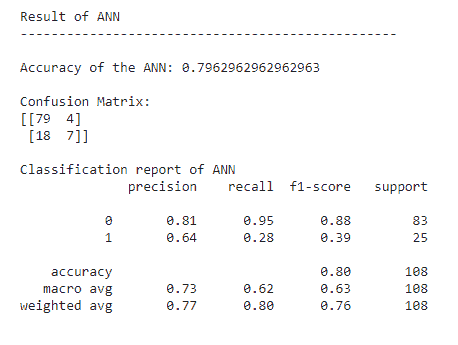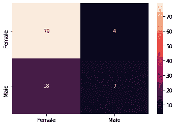

Images by Author

在人工神经网络中，它也给出了 76.9%的良好测试精度。所以，这是一个很好的预测模型。这是多次试验和错误的结果，在混淆矩阵中，我们可以看到在测试集中有 79 只雌性和 7 只雄性被正确预测，这是一个好现象。最小-最大缩放的使用也产生了良好的准确性。

3.6。无监督学习(K 均值聚类)

**3.6.1。*方法论***

对于无监督学习分析，我在这里使用了 KMeans 聚类。同样的，来自 sklearn。集群，则使用 KMeans 函数。对于聚类，聚类的数目被定义为 2，因为我们需要用给定的五个特征将其聚类为男性或女性。然后用特征拟合模型，并打印标签或预测标签。通过检查原始的 Y 标签，已经找出了准确性。然而，正如通常所说的那样，预期 Kmeans 聚类给出的准确度较低。

3.6.2。代码

```
from sklearn.cluster import KMeansmodel = KMeans(n_clusters=2,random_state=1)model.fit(X_train,Y_train)model.cluster_centers_K=model.labels_pred=model.predict(X_test)print("Result of KMeans Clustering Model with 2 clusters")print("-------------------------------------------------")result2 = accuracy_score(Y_test, pred)print("\nAccuracy of the KMeans Clutering Model:",result2)print("")result = confusion_matrix(Y_test, pred)print("Confusion Matrix:")print(result)print("")print("Classification report of KMeans Clutering Model")print(classification_report(Y_test,pred))print("Confusion matrix_unsupervised learning")import seaborn as snslabels = sorted(DATA['Gender'].unique())sns.heatmap(confusion_matrix(Y_test, pred),annot=True,xticklabels=labels,yticklabels=labels)
```

**3.6.3。*结果&无监督学习的分析(KMeans 聚类)***

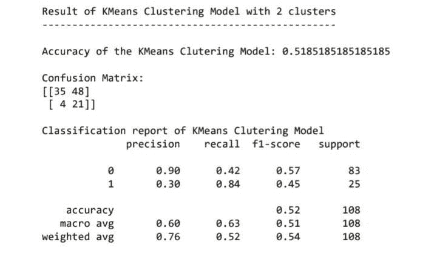

Images by Author(Data Analysis)

在聚类方面，与 SVM、逻辑回归和人工神经网络相比，准确率为 52。这就是为什么，因为我们所拥有的数据并没有给出准确的关系或对应关系来将它们分成两个类别 0 和 1。

**4。所有方法的总体对比分析**

比较数据集**上执行的模型的准确性。位置**是根据各位置精度手动给定的等级。

**型号**———**测试精度/F1 分数**——**位置**

SVM(带 rbf 核)———88.89————**I**

物流学——87.96——87.96——87.97**II**

随机森林分类—84.25————**ⅲ**

安—————79.69———**四**

无监督学习———-51.85—————**V**

线性回归———20.14————**VI**

上面的插图清楚地描述了用于预测学校教师性别的所有机器学习方法的排名。因此，很明显，支持向量分类是最好的，因为我们拥有的数据肯定适合分类问题，而像“rbf”这样的核最适合处理这样的非线性问题。所有适用于非线性数据的方法，主要是分类问题，在这个数据集中工作良好。此外，SVM 是唯一可以分离不可线性分离的数据的线性模型。

这就是为什么除了线性回归至少有 50%的准确率。无监督学习预计不会给出很好的精度，这基本上取决于聚类，但由于我们有标签，精度发现帮助我们理解它并不总是最好的解决方案。但是，在大多数真实的情况下，我们被迫使用相同的。ANN 可以用不同的方式即兴创作，这个结果相当不错。因此，它是最大似然法中一个值得推荐的方法。

**5。机器学习模型的误差分析**

误差计算为预测 Y 值(使用 X 测试值)和原始 Y 测试值之间的差值。误差= Y _ 预测—Y _ 测试

代码:下面的代码将适用于每个模型中的绘图错误。但是请确保您为模型使用了相应的 Y_test 和 Y_pred 值。我刚刚给了 SVM。您可以用类似的方式简单地完成剩下的工作。

```
err=Y_pred-Y_testplt.plot(Y_pred-Y_test,color="green",label='ERROR')plt.title('Error in Support Vector classification with rbf kernal' )plt.legend()plt.show()
```

**I *—精度= 88.8***

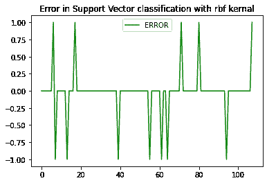

Image by Author( Data Analysis)

***II —精度=87.96***

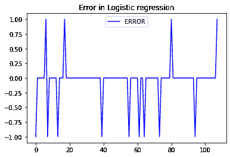

Image by Author( Data Analysis)

所以，如上所述，误差水平并不高。从零到 1 或-1 的偏差很大。但是，无论如何，这个误差相对来说比图中显示的要小。

***三—精度=84.25***

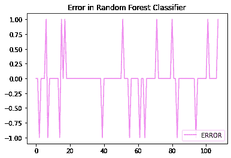

Image by Author( Data Analysis)

***四—精度=80.55***

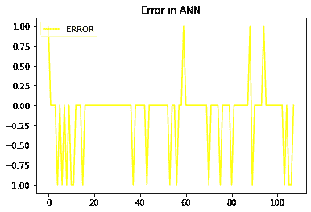

Image by Author( Data Analysis)

与前两个图相比，第三和第四个图从零开始变得非常糟糕。我们的精度高于 80，我们还可以看到图中的变化，因为它几次偏离零。

***V —精度=51.85***

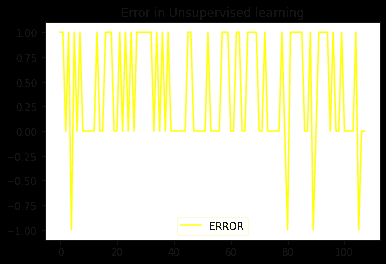

Image by Author( Data Analysis)

***VI —精度=20.14***

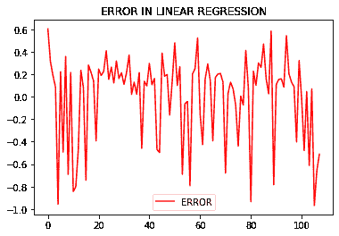

Image by Author( Data Analysis)

现在，来看第 5 和第 6 张图表，很明显，我们有一个高偏差图，正如我们在线性回归中所知道的，因此这种方式下的值不会正确地线性拟合。(即使预测值也在连续的范围内，所以在类似这样的问题中，最好避免使用线性回归。因此，每当我们有这类数据时，使用支持向量机(带 rbf 核)或逻辑回归总是好的。

6。结论

*使用感知压力水平、感知焦虑水平和人口统计学特征预测学校教师性别的最佳预测模型是*支持向量回归(具有 rbf 核)。

*使用感知压力水平、感知焦虑水平和人口统计学特征预测学校教师性别的最差预测模型是*线性回归。

**7。最后备注**

**H** ope 本文可以帮助您深入了解如何处理数据集，在其中执行各种机器学习方法，并得出有趣的结论，尤其是在预测分析领域。

完成代码和细节:

我的 Github 页面:

[](https://github.com/gopikasr/Machine-Learning/blob/main/ANALYSIS.ipynb) [## Machine-Learning/analysis . ipynb at main gopikasr/Machine-Learning

### 各种机器学习模型的比较分析-Machine-Learning/Analysis . ipynb at main…

github.com](https://github.com/gopikasr/Machine-Learning/blob/main/ANALYSIS.ipynb) 

我的 Colab 笔记本

[](https://colab.research.google.com/drive/1xrXU6wbmOE30U_t9hKMrP4E6di8CuK_v?usp=sharing) [## 谷歌联合实验室

### 编辑描述

colab.research.google.com](https://colab.research.google.com/drive/1xrXU6wbmOE30U_t9hKMrP4E6di8CuK_v?usp=sharing) 

8.参考

马赫什瓦里，普拉奇；萨哈，ShilpasreeVaish，Hina (2020 年)，“COVID 19 疫情学校教师的压力和焦虑水平”，V1 门德利数据，doi: 10.17632/yhmb6psmpm.1